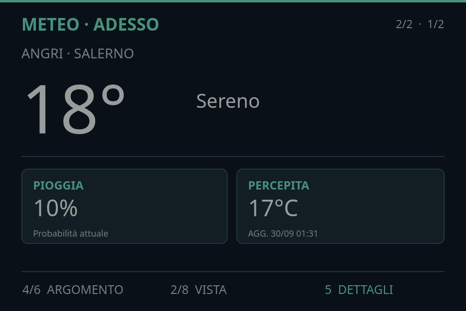
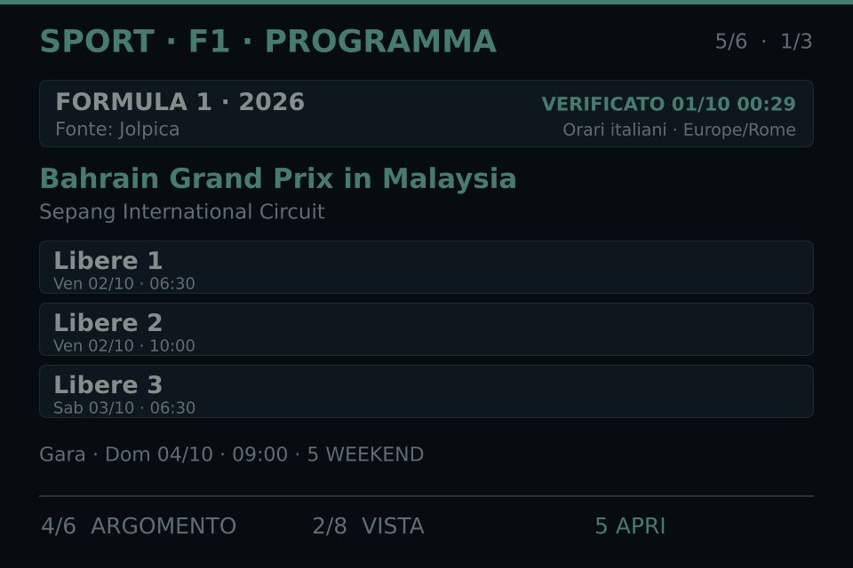
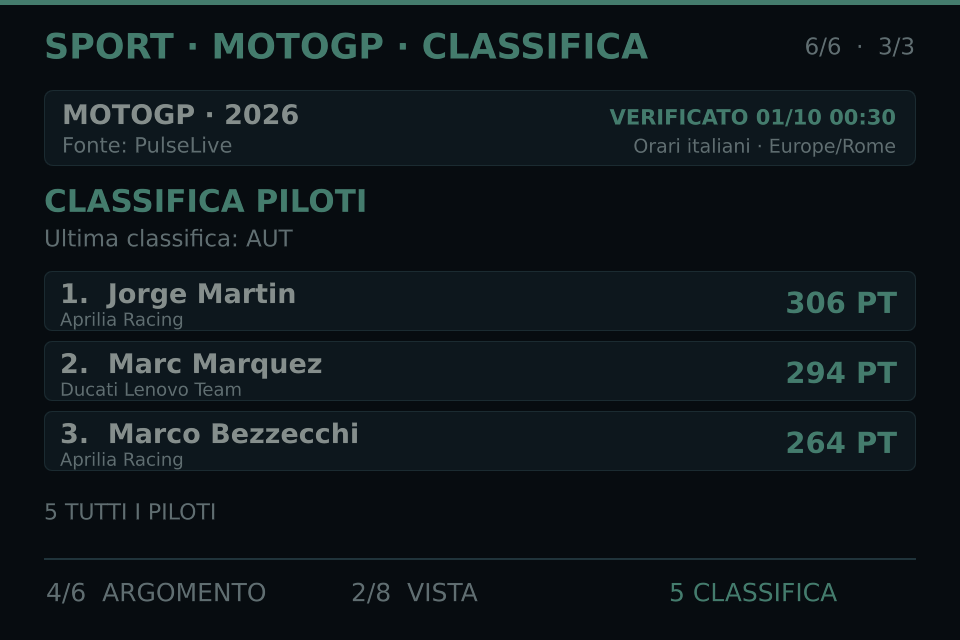
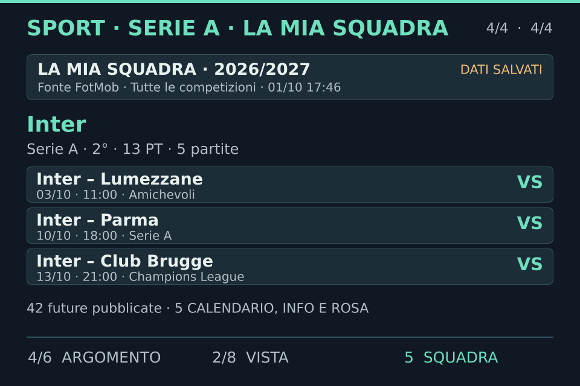
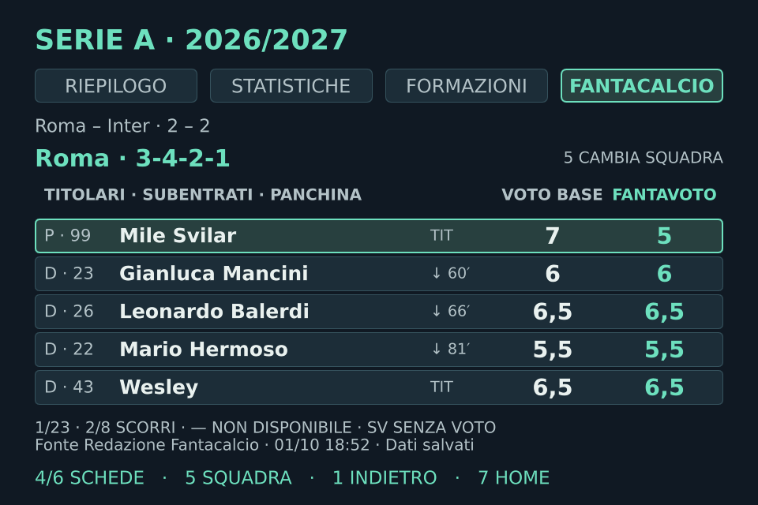
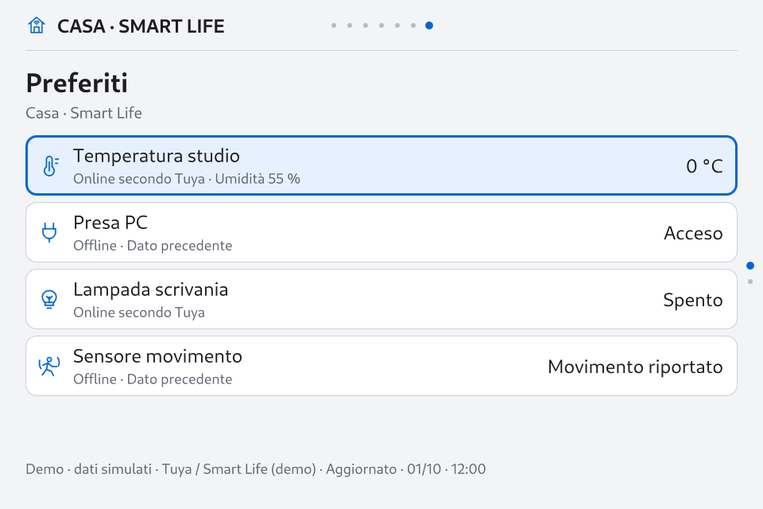
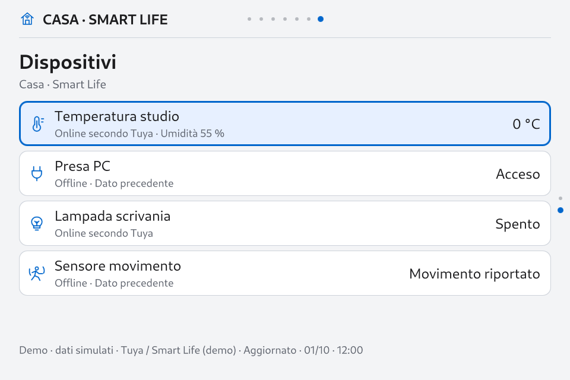

# DeskPulse OS ⚡ (Italiano)

<p align="center">
  <b>Il Sistema Operativo Ambientale Open-Source per Display da Scrivania e Single Board Computer.</b>
  <br>
  <i>Accelerato su GPU a 60 FPS stabili direttamente su DRM/KMS tramite Qt 6 Quick / EGLFS. Zero overhead X11. Zero lag Electron. Solo <90 MB di RAM.</i>
</p>

---

## 🏡 Novità della Versione v0.7.0: Smart Home & Theme Engine 2.2

Il rilascio **v0.7.0** introduce l'integrazione nativa **Smart Home (Casa / Smart Life)**, ottimizzazioni prestazionali radicali del **Theme Engine 2.2** (riduzione del 90.7% nella latenza di cambio vista) e il tema di riferimento **Apple Calm 1.2.0**:

- 🏡 **Integrazione Nativа Smart Home & Cloud Tuya:**
  - **Nessun Server Aggiuntivo**: Client asincrono diretto integrato nel processo Qt, senza necessità di Home Assistant, broker MQTT o container Docker esterni.
  - **4 Tessere Hero Intelligenti & Lista Funzionale**: Tessere informative rapide nel tema Base e vista densa funzionale in Functional, con visualizzazione in tempo reale di consumi, sensori ambientali e connettività.
  - **Inventario Completo & Dettaglio Telemetrico**: Paginazione completa dei dispositivi, stato del segnale, orari di aggiornamento e gestione dei preferiti nelle Impostazioni.
  - **Ledger di Quota & Budget Persistente**: Contatore su disco delle richieste prima dell'invio, riuso automatico dei token e backoff esponenziale per garantire sostenibilità e rispetto delle quote Tuya.
  - **Verità di Stato & Resilienza Offline**: Separazione netta tra disponibilità cloud e ultimo stato noto (un dispositivo disconnesso mostra esplicitamente lo stato offline e l'ultimo dato registrato, senza falsi zeri).
- ⚡ **Theme & Motion Engine 2.2 — Abbattimento del 90.7% dei Tempi di Risposta:**
  - **Sottoscrizioni DTO Pigre**: Latenza p95 nei cambi pagina ridotta da **~1138 ms a ~105 ms** aggiornando soltanto le viste e le pagine attualmente visibili.
  - **Schermata Orologio Gigante (`home-clock.qml`)**: Cifre digitali da 238px, meteo compatto e tessere per allerte imminenti.
  - **Cache Multi-Renderer della Shell**: `PageHost` e `OverlayHost` riutilizzano fino a 6 istanze di renderer per famiglia di superficie con rilascio automatico delle risorse.
  - **49 Superfici di Presentazione Disaccoppiate**: Copertura estesa del contratto grafico per tutti i moduli (orologio, meteo, account, sport, motorsport, casa, impostazioni).
  - **50 Glifi Vettoriali Semantici**: Generatore offline di atlanti PNG senza overhead di parsing SVG a runtime su hardware embedded.
- 🍏 **Pacchetto Tema di Riferimento Apple Calm 1.2.0:**
  - Estetica minimalista con palette Giorno/Notte, orologio dedicato e ottimizzazione nativa per 48 superfici (`theme-projects/apple-calm`).
- 📡 **Anteprima Architettura v0.8 (Rete Locale & Router):**
  - Studio completo di discovery LAN non invasiva e analisi delle API per router Freebox/Iliadbox (`dashboard/design/v08-*`).
- 🛡️ **Stabilità Hardware & Appliance Verificata:**
  - Persistenza al reboot collaudata, servizio systemd `NRestarts=0` e accelerazione hardware EGLFS/KMS su Orange Pi Zero 3W.

---

## 📸 Gli Spazi di Lavoro

Un carosello a 7 spazi di lavoro fluidi, navigabili in orizzontale e verticale:

| **Orologio Ambient & Shell di Sistema** | **Meteo Live & Previsioni a 3 Giorni** |
|:---:|:---:|
|  |  |
| **Command Center Formula 1** | **Monitor Campionato MotoGP** |
|  |  |
| **Arena Serie A & Squadra del Cuore** | **Assistente Fantacalcio con Voti Live** |
|  |  |
| **Dashboard Casa (Base)** | **Dispositivi & Telemetria Casa (Functional)** |
|  |  |

---

## ⚡ Perché un OS Dedicato da Scrivania?

| Parametro | ⚡ **DeskPulse OS (Nativo EGLFS/KMS)** | 🐢 **Kiosk Web / Electron** |
| :--- | :--- | :--- |
| **Avvio a Freddo** | **~18 secondi** (da systemd al display) | 60–90+ secondi (desktop + browser) |
| **Consumo RAM** | **< 90 MB** (98% della RAM libera!) | 650 MB – 1.2 GB+ |
| **Fluidità / Framerate** | **60 FPS stabili** (vsync GPU PowerVR) | 15–30 FPS con scatti visibili |
| **Latenza di Input** | **Istantanea (polling kernel Linux evdev)** | Dipendente dall'event loop di JS |
| **Protezione MicroSD** | **Commit a 30s, tmpfs, zram, zero scritture inutili** | Scritture disco elevate che usurano la SD |
| **Affidabilità 24/7** | **Soak Test 24h Verificato (0 crash, ~43°C)** | Rischio elevato di freeze del browser |
| **Resilienza Offline** | **100% resiliente** (cache atomica persistente) | Schermate bianche o tentativi a vuoto |
| **Costi API** | **€0 / Zero API key** (Open-Meteo, Jolpica, PulseLive) | API a pagamento o quote restrittive |

---

## 🏗️ Architettura di Sistema

```text
┌─────────────────────────────────────────────────────────────────────────────────────────────┐
│                                     DeskPulse OS Shell                                      │
│  [Orologio]  •  [Meteo]  •  [AI/Codex]  •  [Serie A]  •  [F1]  •  [MotoGP]  •  [Casa / IoT]  │
├─────────────────────────────────────────────────────────────────────────────────────────────┤
│                       Compositore Accelerato su GPU Qt 6 Quick / QML                        │
│                        60 FPS Hardware VSync via GPU PowerVR BXM-4-64                       │
├─────────────────────────────────────────────────────────────────────────────────────────────┤
│                             Piano Grafico Diretto DRM/KMS (EGLFS)                           │
│                    (Bypassa X11 e Wayland • Gestione diretta input evdev)                   │
├─────────────────────────────────────────────────────────────────────────────────────────────┤
│                     Kernel Linux 6.6 con Patch Hardware DP-AltMode PLL                      │
│               Protezione MicroSD (swap zram, tmpfs in /tmp, commit fs a 30s)                │
└─────────────────────────────────────────────────────────────────────────────────────────────┘
```

---

## 🛒 Hardware Necessario (~35–45 €)

1. **SBC:** Orange Pi Zero 3W (Allwinner A733 sulla scheda collaudata, GPU PowerVR BXM-4-64). Compatibile con altre board Linux ARM64.
2. **Display:** Monitor USB-C Hagibis 3.5" IPS (960×640 a 60 Hz con DisplayPort Alt Mode).
3. **Controller:** Mini tastierino USB 9 tasti (ID `413d:553a`) o normale tastiera.
4. **Memoria:** Scheda MicroSD da 16GB–32GB Classe 10 / A1.
5. **Cavi:** Cavo USB-C con supporto video DP + alimentazione per lo schermo, alimentatore 5V/2A per la scheda.

---

## ⚡ Installazione Chiavi in Mano

```bash
# Accedi via SSH alla tua board
git clone https://github.com/GiDanis/desk-pulse.git
cd desk-pulse
sudo ./scripts/setup-board.sh
```

Lo script configura automaticamente pacchetti Qt6, permessi utente `smartpc`, file di configurazione EGLFS e servizio systemd con avvio immediato a 60 FPS.

---

## 🎮 Comandi & Navigazione Tastierino

```text
┌──────────────┬──────────────┬──────────────┐
│   1 Home    │     2 Su     │   3 Avvisi   │
├──────────────┼──────────────┼──────────────┤
│  4 Sinistra  │  5 Seleziona │   6 Destra   │
├──────────────┼──────────────┼──────────────┤
│ 7 Indietro  │    8 Giù     │    9 Menu    │
└──────────────┴──────────────┴──────────────┘
```

- **Carosello Orizzontale (Tasti 4 / 6):** Oggi ↔ Meteo ↔ AI/Codex ↔ Serie A ↔ F1 ↔ MotoGP ↔ Casa (Smart Life).
- **Navigazione Verticale (Tasti 2 / 8):** Viste di dettaglio (es. Calendario ↕ Classifica ↕ Risultati o Dispositivi ↕ Dettaglio).
- **Azione / Aggiorna (Tasto 5):** Apre i dettagli dell'incontro/GP o forza un aggiornamento dati.
- **Tasto Rapido Home (Tasto 7):** Torna istantaneamente all'orologio principale da qualsiasi profondità.
- **Menu di Sistema (Tasto 9):** Regolazione aspetto (temi, luminosità), notifiche (fascia silenzio), gestione preferiti Casa e telemetria hardware in tempo reale.

---

## 🌿 Strategia di Branching e Versioning

DeskPulse OS segue una struttura rigorosa di rami Git e tag semantici:

| Branch / Tag | Ruolo & Livello di Stabilità |
| :--- | :--- |
| `main` | Ramo principale di sviluppo pronto per la produzione; collaudato su hardware prima del push. |
| `release/v0.7` | **Ramo di manutenzione stabile corrente (serie v0.7.x)**; accoglie fix critici. |
| `release/v0.6` | Ramo di manutenzione per la precedente serie v0.6.x. |
| `v0.7.0`, `v0.6.6`, ... | Tag annotati immutabili coincidenti con le release ufficiali su GitHub. |

---

## 🗺️ Roadmap

- [x] **v0.4:** Compositore diretto EGLFS/KMS, Home dinamica, Meteo Open-Meteo.
- [x] **v0.5:** Motore eventi persistente, allerte Protezione Civile, badge notifiche.
- [x] **v0.6:** Hub Serie A, Squadra del Cuore, Fantacalcio, F1 & MotoGP con telemetria live SignalR.
- [x] **v0.6.1:** Architettura Impostazioni Modulare, Wi-Fi Live, Fantacalcio Live & Verifica 24h.
- [x] **v0.6.6:** **Theme Engine** — Base/Functional, layout e animazioni sostituibili, editor, pacchetti personali e scene persistenti.
- [x] **v0.7.0:** **Casa / Smart Life & Theme Engine 2.2** — Integrazione Tuya diretta, 4 tessere preferite, inventario, telemetria di dettaglio, ledger delle quote, resilienza offline e riduzione del 90.7% della latenza.
- [ ] **v0.8:** **Rete locale** — Panoramica dei dispositivi e informazioni osservabili dalla board, con eventuali dati router (Iliadbox/Freebox); nessun agent sui computer.
- [ ] **v0.8.1 (facoltativa):** Metadati router verificati e profili Hardware/Cyberdeck aggiuntivi.
- [ ] **v0.9:** Compagno animato e profilo Cozy.
- [ ] **v0.10:** Memoria del compagno e scene AI validate.
- [ ] **v1.0:** Stabilità integrata, installazione, aggiornamento e recupero.

---

## 📄 Licenza

Distribuito sotto Licenza MIT. Consulta il file [LICENSE](LICENSE) per ulteriori dettagli.
