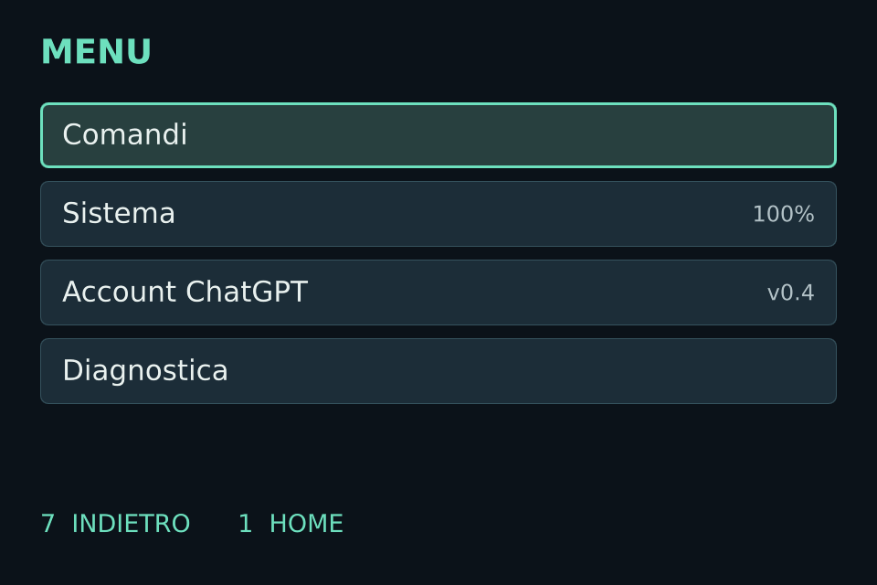
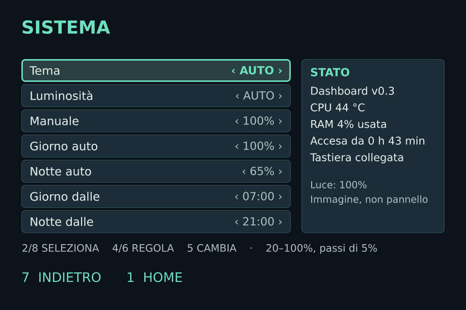

# DeskPulse ⚡ (Italiano)

<p align="center">
  <b>Appliance da scrivania sempre attivo e dashboard smart per Orange Pi Zero 3W e display Hagibis 960×640 USB-C.</b>
  <br>
  <i>Interfaccia nativa Qt 6 Quick / QML con rendering diretto su DRM/KMS tramite EGLFS a 60 FPS stabili. Senza overhead X11. Senza lentezze Electron.</i>
</p>

---

## 📸 Schermate & Design

| **Home Dinamica (Ora & Prossimo Evento)** | **Meteo Live & Previsioni a 3 Giorni** |
|:---:|:---:|
|  |  |
| **Menu Rapido di Sistema** | **Impostazioni Schermo & Luminosità** |
|  |  |

---

## ⚡ Perché DeskPulse?

Molti progetti di smart display fai-da-te utilizzano browser pesanti (Chromium/Electron) o ROM Android sovradimensionate. Su piccoli computer a scheda singola (SBC) questo causa surriscaldamento, rallentamenti, avvii lenti ed eccessiva usura della scheda microSD.

DeskPulse è progettato da zero per la **massima affidabilità come appliance embedded**:

| Parametro | ⚡ **DeskPulse (EGLFS/KMS nativo)** | 🐢 **Kiosk Web / Electron** |
| :--- | :--- | :--- |
| **Tempo di Boot** | **~18 secondi** (da bootloader alla UI) | 60–90+ secondi (desktop + browser) |
| **Consumo RAM** | **< 90 MB** | 650 MB – 1.2 GB+ |
| **Fluidità / Frame Rate** | **60 FPS stabili** (accelerazione hardware PowerVR) | 15–30 FPS con scatti visibili |
| **Latenza Input** | **Istantanea (polling kernel evdev)** | Dipendente dall'event loop JS |
| **Usura MicroSD** | **Minima** (commit fs personalizzati, tmpfs, zram, log limitati) | Elevata per cache continua del browser |
| **Resilienza Offline** | **Totale** (cache atomica, fallback, zero blocchi) | Errori di caricamento / reload infiniti |

---

## 🛒 Hardware Necessario

Puoi realizzare l'intero sistema con una spesa di circa **35–45 €**:

1. **SBC:** Orange Pi Zero 3W (Allwinner H618 / sun60iw2, 1GB–4GB RAM, GPU PowerVR BXM-4-64).
2. **Display:** Hagibis 3.5" IPS USB-C Monitor (risoluzione nativa 960×640, 60 Hz, DisplayPort Alt Mode via USB-C).
3. **Controller:** Mini tastierino macro USB a 9 tasti (ID USB `413d:553a`) o qualsiasi tastiera standard.
4. **Memoria:** MicroSD da 16GB–32GB Classe 10 / A1.
5. **Cavi:** Cavo USB-C con supporto video DP Alt Mode + alimentatore 5V/2A per la scheda.

---

## 🚀 Installazione Chiavi in Mano

### 1. Sistema Operativo di Base
DeskPulse gira su Debian 13 (Trixie) o Armbian Minimal.
- Puoi scrivere la scheda SD dal PC con il tool sicuro:
  ```bash
  sudo ./scripts/flash-sd.sh /percorso/a/immagine.img /dev/sdX
  ```
- Oppure configurare Wi-Fi headless e chiavi SSH prima del primo avvio:
  ```bash
  sudo ./scripts/configure-wifi-local.py
  ```

### 2. Installazione Automatica sulla Scheda
Una volta effettuato l'accesso SSH sulla tua Orange Pi:
```bash
# Clona il repository
git clone https://github.com/GiDanis/desk-pulse.git
cd desk-pulse

# Esegui l'installer automatico
sudo ./scripts/setup-board.sh
```

Lo script `setup-board.sh`:
- Installa Qt 6 Quick, PySide6, driver DRM/KMS e tutte le dipendenze.
- Crea l'utente di sistema dedicato `smartpc` con i permessi per `/dev/dri/card0` e `/dev/input`.
- Configura `/etc/smartpc/eglfs-kms.json` per il rendering diretto su GPU.
- Installa e abilita il servizio systemd `smartpc-dashboard.service`.
- Disabilita display manager non necessari (LightDM) per liberare memoria.

---

## 💻 Test in Locale su PC

Puoi avviare la dashboard direttamente sul tuo computer Linux per provarla o sviluppare nuovi moduli:

```bash
# Installa dipendenze
pip install PySide6 requests

# Avvia finestra desktop (960x640)
./dashboard/run.sh --desktop

# Oppure avvia in modalità demo con eventi simulati
./dashboard/run.sh --demo
```

---

## 🎮 Controlli & Navigazione

La navigazione a due assi è studiata sia per il tastierino 3×3 fisico sia per le frecce della tastiera:

```text
┌──────────────┬──────────────┬──────────────┐
│    1 Home    │     2 Su     │   3 Avvisi   │
├──────────────┼──────────────┼──────────────┤
│  4 Sinistra  │   5 OK/Invio │   6 Destra   │
├──────────────┼──────────────┼──────────────┤
│  7 Indietro  │    8 Giù     │    9 Menu    │
└──────────────┴──────────────┴──────────────┘
```

- **Carosello Orizzontale (Tasti 4 / 6):** Oggi (Home) ↔ Meteo Live ↔ Monitor AI / ChatGPT.
- **Navigazione Verticale (Tasti 2 / 8):** Approfondimento nelle viste dei moduli:
  - *Oggi:* Orologio grande ↕ Panoramica giornata.
  - *Meteo:* Condizioni attuali ↕ Previsioni a 3 giorni.
- **Menu (Tasto 9):**
  - **Aspetto:** Temi (Auto / Giorno / Notte), Luminosità (manuale e fasce orarie automatiche).
  - **Moduli Visibili:** Mostra o nascondi i singoli moduli (scelta salvata tra i riavvii).
  - **Diagnostica:** FPS effettivi della GPU, temperature e carico di sistema.

---

## 🛰️ Sincronizzazione PC & Monitor ChatGPT / Codex

DeskPulse include un monitor delle quote di utilizzo AI & Codex. Interroga il server locale Codex App sul tuo PC e invia le statistiche alla board via SSH **senza trasmettere token privati, chiavi API o identificativi personali**:

Installa il timer systemd sul tuo PC di lavoro per sincronizzare i dati ogni 10 minuti:
```bash
cp dashboard/systemd/smartpc-account-sync.* ~/.config/systemd/user/
systemctl --user daemon-reload
systemctl --user enable --now smartpc-account-sync.timer
```

---

## 🔧 Patch Kernel: USB-C DisplayPort Alt Mode

Il monitor Hagibis 3.5" richiede il DisplayPort Alt Mode via USB-C. Su Allwinner H618 (sun60iw2), il kernel vendor originale presenta un clock CMN PLL1 non abilitato che provoca timeout nel link training DP.

DeskPulse include la patch funzionante e verificata in [`os/kernel-patches/`](os/kernel-patches/):
- `0001-sun60iw2-enable-cmn-pll-for-dp-altmode.patch`: Abilita il clock del PHY in `combo0_configure_usb_dp()`.
- Consente al link DP di agganciare stabilmente i 5.4 Gbit/s a 960×640 @ 60 Hz.

---

## 📄 Licenza

Distribuito sotto Licenza MIT. Consulta [LICENSE](LICENSE) per tutti i dettagli.
