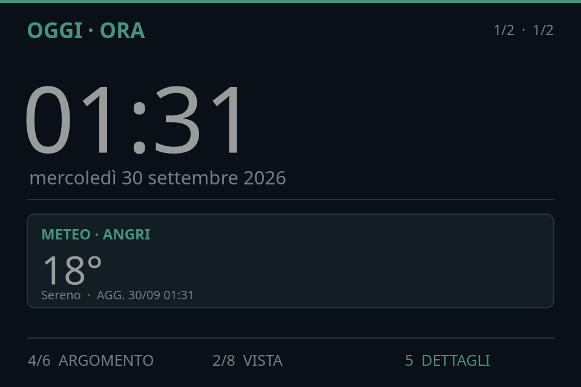

# DeskPulse ⚡

> Always-on ambient desk companion and smart dashboard for Orange Pi Zero 3W and Hagibis 960×640 USB-C display.



DeskPulse trasforma una scheda **Orange Pi Zero 3W** abbinata a un mini display **Hagibis (960×640 @ 60 Hz)** e a un tastierino USB a 9 tasti in un appliance da scrivania sempre attivo. Offre un'interfaccia ad alta fluidità (60 FPS) con rendering diretto EGLFS/KMS senza desktop X11 tradizionale.

---

## 🌟 Caratteristiche Principali

- **Home Dinamica:** Orologio ad alta leggibilità, data e card contestuale per il prossimo evento (nessun dato fittizio).
- **Meteo in Tempo Reale:** Condizioni attuali e previsioni a 3 giorni alimentate da Open-Meteo, con cache locale atomica e gestione offline resiliente.
- **Monitor AI / ChatGPT & Codex:** Visualizzazione delle finestre di utilizzo, percentuale consumata, countdown al ripristino, crediti e reset disponibili. I dati vengono sincronizzati dal PC via SSH in modo sicuro (senza esporre token o credenziali).
- **Navigazione a Griglia 3×3:** Controllo completo tramite mini tastierino hardware USB (`413d:553a`) o tastiera standard.
- **Gestione Schermo & Luminosità:** Transizioni fluide (160 ms), attenuazione software giorno/notte programmabile (default 100% giorno / 65% notte) e temi chiaro/scuro/auto.
- **Affidabilità & Zero-Wear:** Stack OS Debian 13 ottimizzato per minimizzare le scritture su microSD (commit journaling ridotto, zram swap, ramlog, tmpfs).

---

## 🛠️ Hardware Supportato

| Componente | Specifiche |
| :--- | :--- |
| **SBC** | Orange Pi Zero 3W (Allwinner H618 / sun60iw2, 4GB/6GB RAM, GPU PowerVR BXM-4-64) |
| **Display** | Hagibis 3.5" USB-C IPS (960×640, 60 Hz, DisplayPort Alt Mode) |
| **Keypad** | Mini tastiera USB 9 tasti (`413d:553a`) disposta in matrice 3×3 |
| **Alimentazione / Connessione** | Cavo USB-C con supporto DP Alt Mode + Wi-Fi integrato |

---

## 🎮 Controlli & Navigazione

La navigazione è progettata sia per il mini keypad hardware 9 tasti sia per tastiera standard PC:

```text
┌──────────────┬──────────────┬──────────────┐
│    1 Home    │     2 Su     │   3 Avvisi   │
├──────────────┼──────────────┼──────────────┤
│  4 Sinistra  │   5 OK/Invio │   6 Destra   │
├──────────────┼──────────────┼──────────────┤
│  7 Indietro  │    8 Giù     │    9 Menu    │
└──────────────┴──────────────┴──────────────┘
```

- **Orizzontale (4 / 6):** Oggi ↔ Meteo ↔ Account ChatGPT
- **Verticale (2 / 8):** Viste di dettaglio per ciascuna sezione (es. Meteo: Attuale / Previsioni)
- **Menu (9):** Impostazioni aspetto, moduli visibili e diagnostica di sistema

---

## 📁 Struttura del Repository

```text
desk-pulse/
├── dashboard/               # Applicazione Qt 6 Quick / QML e logica Python
│   ├── app.py               # Entrypoint applicazione GUI
│   ├── Main.qml             # Root scene e gestore viste
│   ├── state.py             # Macchina a stati ed esportazione proprietà QML
│   ├── weather.py           # Provider meteo (Open-Meteo) con cache atomica
│   ├── account.py           # Provider stato account AI / ChatGPT
│   ├── account_sync.py      # Script di sincronizzazione PC -> Board via SSH
│   ├── keypad.py            # Driver per il keypad USB 9 tasti
│   ├── design/              # Mockup UX, studi di navigazione e preview
│   └── systemd/             # Servizi e timer systemd per la sincronizzazione
├── os/                      # Configurazioni di sistema e patch kernel
│   ├── kernel-patches/      # Patch DP Altmode PLL per kernel 6.6.98-sun60iw2
│   ├── system/              # Drop-in systemd, display-level service ed EGLFS KMS config
│   ├── diagnostics/         # Script e report di audit prestazioni GPU / APT
│   └── board-audit-*.md     # Log di ottimizzazione e hardening del sistema
└── scripts/                 # Utility di provisioning e manutenzione
    ├── prepare-headless.py  # Preparazione immagine headless con utente e SSH
    ├── flash-sd.sh          # Tool di scrittura sicura su microSD
    ├── check-sd.sh          # Controllo integrità e verifica filesystem SD
    └── smartpc-firstboot.sh # Script di inizializzazione al primo boot
```

---

## 🚀 Avvio Rapido (PC / Sviluppo Locale)

È possibile testare e visualizzare l'interfaccia direttamente sul proprio PC Linux:

### Prerequisiti

- Python 3.10+
- Qt 6 / PySide6

```bash
# Installa le dipendenze Python
pip install PySide6 requests

# Avvia la dashboard
python3 dashboard/app.py
```

Oppure utilizzando lo script helper:

```bash
chmod +x dashboard/run.sh
./dashboard/run.sh
```

---

## 🛰️ Sincronizzazione Dati ChatGPT / Codex

Il modulo **Account ChatGPT** legge le statistiche da `/var/cache/smartpc-dashboard/account-chatgpt.json`. Dal PC host, eseguire periodicamente lo script di sincronizzazione:

```bash
python3 dashboard/account_sync.py
```

È possibile installare il timer systemd utente per la sincronizzazione automatica ogni 10 minuti:

```bash
cp dashboard/systemd/smartpc-account-sync.* ~/.config/systemd/user/
systemctl --user daemon-reload
systemctl --user enable --now smartpc-account-sync.timer
```

---

## 📄 Licenza

Distribuito sotto licenza MIT. Consulta il file [LICENSE](LICENSE) per ulteriori dettagli.
