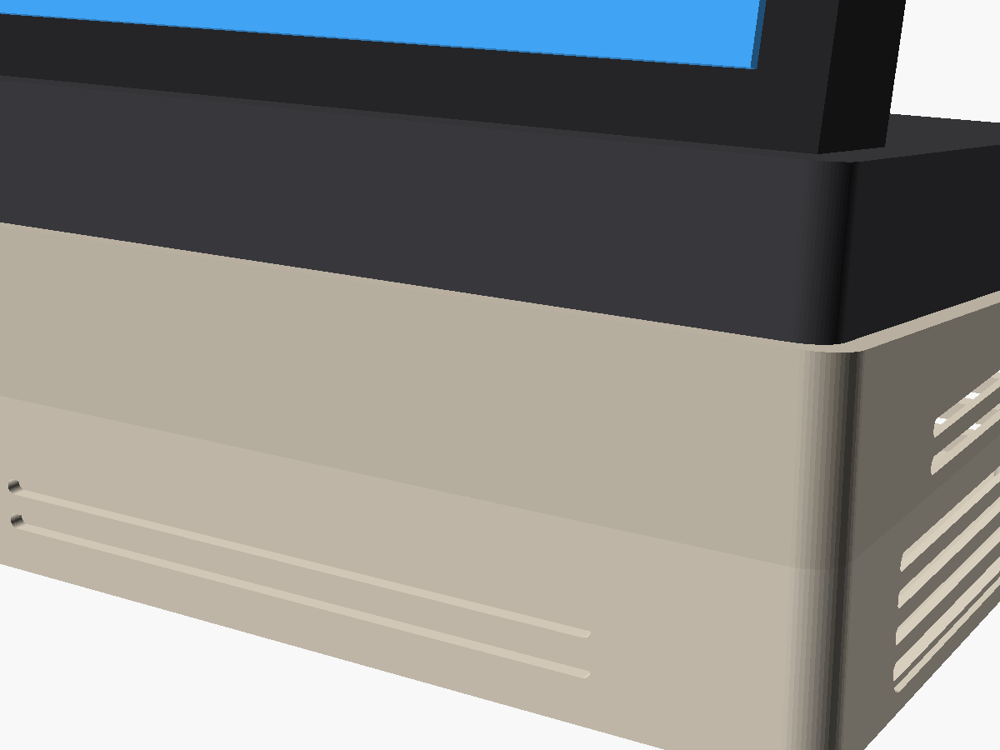
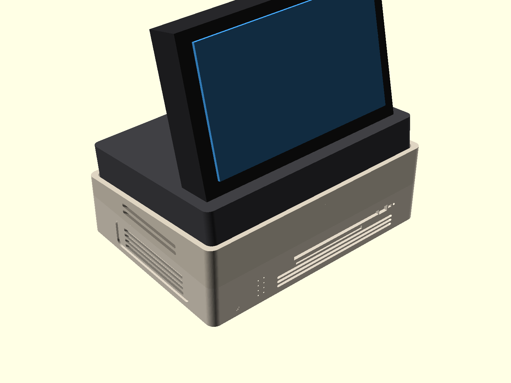
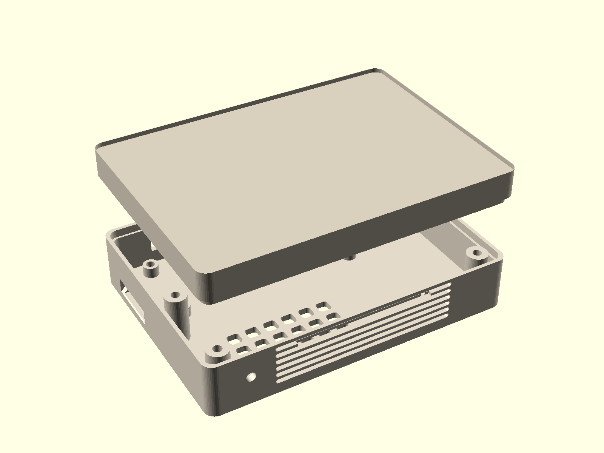

# DeskPulse OS ⚡

<p align="center">
  <b>The Open-Source Ambient Operating System for Desk Displays & Single Board Computers.</b>
  <br>
  <i>Hardware-accelerated at a rock-solid 60 FPS directly on DRM/KMS via Qt 6 Quick / EGLFS. Zero X11 bloat. Zero Electron lag. <90 MB RAM footprint.</i>
</p>

<p align="center">
  <a href="https://github.com/GiDanis/desk-pulse/releases"></a>
  <a href="https://www.orangepi.org/"></a>
  <a href="https://www.qt.io/"></a>
  
  
  
  
  <a href="https://github.com/GiDanis/desk-pulse/blob/main/LICENSE"></a>
</p>

<p align="center">
  <a href="#-whats-new-in-v080-local-network-monitor--3d-printable-enclosure">What's New in v0.8.0</a> •
  <a href="#-os-workspaces">Workspaces</a> •
  <a href="#-3d-printable-retro-desk-enclosure">3D Enclosure</a> •
  <a href="#-why-a-dedicated-desk-os">Why Desk OS?</a> •
  <a href="#-architecture">Architecture</a> •
  <a href="#-hardware-bom">Hardware BOM</a> •
  <a href="#-turnkey-installation">Turnkey Installation</a> •
  <a href="#-navigation--controls">Controls</a> •
  <a href="#-branching--release-strategy">Branching & Tags</a> •
  <a href="#-roadmap">Roadmap</a> •
  <a href="README.it.md">🇮🇹 Italiano</a>
</p>

---

## 🌟 What is DeskPulse OS?

**DeskPulse OS** turns an inexpensive single-board computer ($15–$25 Orange Pi Zero 3W, Raspberry Pi, or Radxa) and a mini desktop monitor (like the 3.5" Hagibis 960×640 IPS screen) into an **appliance-grade ambient desk operating system**.

Instead of treating the board as a desktop computer running a slow browser kiosk, DeskPulse OS boots directly into a native GPU-accelerated QML compositor. It operates 24/7 as your dedicated desk command center for time, weather, smart home automation, local network monitoring, AI quota monitoring, live sports, and motorsport telemetry—with near-zero latency and instant tactile controls.

> ⭐ **Star this repository** if you love ambient computing, single-board computers, 3D printing, and distraction-free desk appliances!

---

**v0.8.3 is released and verified on hardware:** Unified Sport Hub (Serie A, F1, MotoGP), 6-category task-oriented settings, Theme Engine 2.5 (60 surfaces), Apple Calm 1.3.1 space optimization for 3.5" displays, worker persistence with fsync, and cold reboot verified. [Delivery report](dashboard/design/v083-implementation-report.md) · [Space optimization](dashboard/design/v083-space-optimization-report.md) · [Usage](dashboard/design/v083-ux-operations.md).

## 🚀 What's New in v0.8.3: Unified Sport Hub, Task-Oriented Settings & Theme Engine 2.5

DeskPulse OS **v0.8.3** delivers a major UX and stability consolidation for desk displays:

- 🏎️ **Unified Sport Hub & 6-Workspace Carousel:**
  - Consolidated horizontal navigation down from 8 to **6 streamlined workspaces**: *Today ↔ Weather ↔ AI/Codex ↔ Sport ↔ Casa ↔ Rete*.
  - Serie A Football, Formula 1, and MotoGP are unified in the dedicated **Sport Hub** (`sport-hub.qml`). Navigate disciplines with **2/8**, enter with **OK (5)**, and ascend with **7**.
  - Independent state preservation: returning to any sport discipline restores your previous view and selection.
- ⚙️ **Task-Oriented 6-Category Settings Menu:**
  - Redesigned from the ground up: *Display (Schermo)*, *Appearance (Aspetto)*, *Modules & Home*, *Alerts (Avvisi)*, *Connected Services*, and *Data & Updates*.
  - Text scale preview with Save/Cancel, theme management submenus, and unified manual refresh dispatch with verified feedback.
- 🎨 **Theme Engine 2.5 & Apple Calm 1.3.1 Space Optimization:**
  - Contract expanded to **60 presentation surfaces** across 22 contexts (`sport.hub`, `settings.services`, `settings.sports`, `settings.appearance.management`).
  - **Apple Calm 1.3.1**: Tailored for 3.5" 960×640 IPS screens—compact 56px top bar, 912×552 content area, smooth scrolling lists, 59 native surfaces, and 57 vector glyphs.
  - High-contrast Canvas dash patterns (`setLineDash`) for historical graphs.
- 🛡️ **Under-the-Hood Reliability & Speed:**
  - Weather worker atomic persistence with `fsync`: Qt timer callback latency during save dropped from **155.3 ms down to 5.8 ms**!
  - Account JSON 32 KB safety bounds and atomic watcher.
  - Verified on physical Orange Pi Zero 3W Debian 13 with EGLFS/KMS DRM, 0 crashes, and `NRestarts=0` systemd persistence.

---

## 🌐 Recap of v0.8.1: Router Metrics, RRD History & Refined 3D Enclosure

DeskPulse OS **v0.8.1** expanded network capabilities and physical enclosure ergonomics:

- 📊 **Network Metrics & RRD History Hub:**
  - **3 Dedicated Views**: Iliadbox/Internet WAN status, Wi-Fi radio/stations breakdown, and Ethernet switch port metrics.
  - **1h & 24h RRD History**: Real-time canvas history charts for bandwidth throughput, optical SFP power, router temperature, and fan RPM without external dependencies.
  - **Granular Wi-Fi Station Metrics**: Signal levels, Rx/Tx traffic counters, negotiated bitrates, and active band frequencies.
  - **Isolated SQLite Metrics Cache**: Dedicated transactional storage keeping metrics independent from device inventory.
- 🎨 **Theme Engine 2.4 (56 Surfaces & 21 Contexts):**
  - Expanded surface contract to 56 surfaces (`network.router`, `network.wifi`, `network.ports`).
  - Native Base & Functional presentations, with automatic styled fallback for Apple Calm 1.2.0.
  - Bundled Theme AI Kit 2.4 (`smartpc-theme-ai-kit-v081.zip`).
- 🖨️ **Refined 3D Printable Enclosure (Ergonomic 6° Lid):**
  - Upgraded rear snap-fit lid with a 6-degree ergonomic incline for optimal desktop glanceability.
  - Deluxe chassis variant featuring convective air louvers and internal thermal chimney.
  - Interactive 3D Web Viewer (`cad_model/view_3d.html`) with drag-and-drop STL loading and studio lighting.

---

## 🌐 Recap of v0.8.0: Local Network Monitor & 3D Printable Enclosure

DeskPulse OS **v0.8.0** introduced the core **Local Network & Router Command Deck (LAN Hub)** and initial 3D enclosure models:

- 🌐 **Native Local Network & Router Command Deck (LAN Hub):**
  - **Zero PC Agents Required**: Direct in-process asynchronous client for Freebox / Iliadbox router OS without installing agents or software on computers across the network.
  - **Comprehensive Device Discovery**: Discovers all active and past network hosts with IPv4/IPv6 addresses, MAC vendors, Wi-Fi bands, Ethernet ports, and connection timestamps.
  - **4 Customizable Favorite Device Tiles**: Fast glanceable status for your desktop workstation, NAS, printer, or server in Base (tile) or Functional (row) presentations.
  - **Multi-Category Filtering**: Instant filtering by *All*, *Reachable*, *Favorites*, and *Previous/Stale* hosts.
  - **Transactional SQLite Storage**: Private on-disk database with 30-day retention and 256-device safe bounds; offline cache preserves data during network resets.
  - **Non-Invasive Read-Only Operation**: Never alters router firewall, DNS, or DHCP configuration.
- 🎨 **Theme Engine 2.3 (53 Surfaces & 18 Contexts):**
  - 4 new presentation surfaces (`network.overview`, `network.devices`, `network.detail`, `settings.network`).
  - Seamless additive fallback to Base styling for third-party bundles (Apple Calm 1.2.0 fully compatible).
  - First-time theme loading tolerance expanded to 8s for cold starts.
- 🖨️ **Turnkey 3D Printable Retro-Futuristic Desk Enclosure:**
  - Complete 3D CAD design package included (`SmartPC_3D_Print_Package/`, `cad_model/`) with OpenSCAD source and precision STL models.
  - **3 Distinct Styles**:
    - **Classic**: Retro-computing silhouette reminiscent of classic 80s/90s desktop displays.
    - **Quadra**: Clean, minimalist architectural housing.
    - **Cyber**: Angled cyberpunk tactical styling with side carry scoops and cooling slats.
  - Tailored precisely for Orange Pi Zero 3W + Hagibis 3.5" USB-C screen, featuring internal port routing and snap-fit rear lid.
- 🛡️ **Verified Hardware Stability & Clean Reboot:**
  - Validated on physical Orange Pi Zero 3W with real LAN discovery, 0 crashes, and `NRestarts=0` systemd persistence.

---

## 📸 OS Workspaces

DeskPulse OS features a seamless 8-workspace horizontal carousel, with deep 2-axis vertical navigation for each workspace:

| **Ambient Clock & Desk Shell** | **Live Weather & 3-Day Forecast** |
|:---:|:---:|
|  |  |
| **Formula 1 Grand Prix Command Center** | **MotoGP World Championship Monitor** |
|  |  |
| **Football Hub & Favourite Team** | **Fantacalcio Lineups & Ratings** |
|  |  |
| **Smart Home Command Deck (Base)** | **Smart Home Devices & Telemetry (Functional)** |
|  |  |

---

## 🖨️ 3D Printable Retro Desk Enclosure

DeskPulse is not just software—it's a complete hardware appliance! The repository includes turnkey 3D print models (`SmartPC_3D_Print_Package/` and [`cad_model/`](cad_model/)) designed in OpenSCAD:

| **Classic Retro Dock** | **Deluxe Dock (Cooling Louvers)** | **Exploded Assembly & Ergonomic 6° Lid** |
|:---:|:---:|:---:|
|  |  |  |

- **Precision Fit**: Custom-modeled for Orange Pi Zero 3W + Hagibis 3.5" USB-C display with exact board mounting posts and internal cable routing channels.
- **Cooling Optimized**: Designed to accommodate 38×38mm / 40×40mm aluminum heatsinks with thermal chimney airflow vents.
- **Ready to Print**: STL files sliced and verified for standard 0.4mm nozzle FDM printers in PLA, PETG, or ABS with zero supports needed on the main shell. See [`SmartPC_3D_Print_Package/ISTRUZIONI_DI_STAMPA.txt`](SmartPC_3D_Print_Package/ISTRUZIONI_DI_STAMPA.txt).

---

## ⚡ Why a Dedicated Desk OS?

Most DIY desk displays fail because they run bloated operating systems and Electron or Chromium web kiosks. This leads to slow frame rates, 90-second boot times, overheating, and fried microSD cards.

DeskPulse OS was engineered from the kernel up as an **always-on appliance**:

| Metric | ⚡ **DeskPulse OS (Native EGLFS/KMS)** | 🐢 **Web / Electron Kiosk** |
| :--- | :--- | :--- |
| **Cold Boot to Interactive UI** | **~18 seconds** (systemd straight to GPU) | 60–90+ seconds (X11/Wayland + Chrome) |
| **RAM Consumption** | **< 90 MB** (98% of RAM left free!) | 650 MB – 1.2 GB+ |
| **Frame Rate & Fluidity** | **Locked 60 FPS** (PowerVR hardware vsync) | 15–30 FPS with visible stutter |
| **Input Latency** | **Instant (direct Linux evdev kernel polling)** | Laggy JavaScript DOM event loop |
| **MicroSD Card Protection** | **Tuned 30s journal, tmpfs, zram, atomic cache** | Constant disk writes destroy SD cards |
| **24/7 Reliability** | **Verified 24h Soak Test (0 crashes, ~43°C)** | High risk of browser tab crashes |
| **Offline Resilience** | **100% resilient** (cached state, graceful fallbacks) | Error screens, infinite reload loops |
| **API Costs** | **$0 / Zero API Keys** (Open-Meteo, Jolpica, PulseLive) | Expensive subscription APIs |

---

## 🏗️ Architecture

```text
┌─────────────────────────────────────────────────────────────────────────────────────────────────────────────┐
│                                             DeskPulse OS Shell                                              │
│  [Clock] • [Weather] • [AI/Codex] • [Serie A] • [F1] • [MotoGP] • [Smart Home] • [Local Network / LAN Hub]  │
├─────────────────────────────────────────────────────────────────────────────────────────────────────────────┤
│                              Qt 6 Quick / QML Hardware-Accelerated Compositor                               │
│                               60 FPS Hardware VSync via PowerVR BXM-4-64 GPU                                │
├─────────────────────────────────────────────────────────────────────────────────────────────────────────────┤
│                                    Direct DRM/KMS Display Plane (EGLFS)                                     │
│                            (Bypasses X11 and Wayland • Instant Linux evdev input)                           │
├─────────────────────────────────────────────────────────────────────────────────────────────────────────────┤
│                                Hardened Linux 6.6 Kernel with DP-AltMode PLL                                │
│                         MicroSD Wear Protection (zram swap, tmpfs /tmp, 30s commit)                         │
└─────────────────────────────────────────────────────────────────────────────────────────────────────────────┘
```

---

## 🚀 Native Workspaces Overview

### 1. 🕒 Ambient Home & Desk Clock
High-contrast typography designed for glanceable reading from desk distance. Includes the **Big Clock view** with 238px digits, weather indicator, and dynamic upcoming event cards.

### 2. ⛅ Hyper-Local Weather Station
Live atmospheric conditions, hourly trends, and a 3-day forecast powered by Open-Meteo. Uses an atomic local SQLite/JSON cache with offline-first resilience: if Wi-Fi disconnects, previous valid data remains visible with an explicit offline indicator.

### 3. 🤖 AI & Codex Quota Monitor
Tracks ChatGPT & OpenAI Codex plan limits, usage percentages, reset countdowns, and available credits. Syncs securely over your local network via SSH from your PC workstation **without ever exposing private tokens, passwords, or API keys**.

### 4. 🏎️ Unified Sport Hub (Serie A, Formula 1 & MotoGP)
All your sports in one fluid command center. Navigate with **2/8** between **Serie A Football**, **Formula 1**, and **MotoGP**, press **OK (5)** to dive into match schedules, live timings, and standings, and press **7** to return.
- **Serie A & Favourite Team**: Season fixtures, live league table, team squad, and Fantacalcio starting XI with editorial ratings.
- **Formula 1**: Local weekend session times, circuit telemetry, and driver/constructor standings.
- **MotoGP**: Grand Prix calendar, Sprint & GP results, and rider championship standings.

### 5. 🏡 Smart Home (Casa / Smart Life) Command Deck
Direct in-process integration with Tuya Cloud without extra servers. Displays 4 customizable favorite devices as glanceable hero tiles, full paginated device inventory, signal quality, and telemetry details. Protected by a persistent request budget ledger to prevent cloud rate-limiting.

### 6. 🌐 Local Network & Router Command Deck (LAN Hub)
Direct in-process integration with Freebox / Iliadbox router OS without requiring agents on computers. Discovers all network hosts with IPv4/IPv6 addresses, MAC vendors, Wi-Fi bands, and Ethernet port mappings. Supports 4 quick-glance favorite devices, multi-category filters, and private transactional SQLite persistence.

---

## 🛒 Hardware BOM

Build your own DeskPulse OS station for **~$40–$50**:

1. **SBC:** [Orange Pi Zero 3W](http://www.orangepi.org/html/hardWare/computerAndCar/details/Orange-Pi-Zero-3W.html) (Allwinner A733 on the tested board, PowerVR BXM-4-64 GPU). Compatible with other ARM64 SBCs.
2. **Display:** [Hagibis 3.5" IPS USB-C Monitor](https://www.hagibis.com/) (960×640 native resolution, 60 Hz, USB-C DisplayPort Alt Mode).
3. **Controller:** 9-Key USB Macro Keypad (USB ID `413d:553a`) or standard keyboard.
4. **Storage:** 16GB–32GB Class 10 / A1 MicroSD card.
5. **Cables:** Single USB-C cable for DisplayPort video + power to monitor, 5V/2A power supply for board.

---

## ⚡ Turnkey Installation

### Step 1: Flash Base OS
Install Debian 13 (Trixie) or Armbian Minimal on your microSD card.
- Use our safe interactive flasher:
  ```bash
  sudo ./scripts/flash-sd.sh /path/to/armbian.img /dev/sdX
  ```
- Or provision headless Wi-Fi & SSH keys before first boot:
  ```bash
  sudo ./scripts/configure-wifi-local.py
  ```

### Step 2: 1-Step Board Setup
Log into your Orange Pi via SSH and run:
```bash
# Clone DeskPulse OS
git clone https://github.com/GiDanis/desk-pulse.git
cd desk-pulse

# Run automated turnkey installer
sudo ./scripts/setup-board.sh
```

**`setup-board.sh` automatically:**
- Installs Qt 6 Quick, PySide6, QtWebSockets, and DRM/KMS drivers.
- Sets up system user `smartpc` with `/dev/dri/card0` and `/dev/input` permissions.
- Deploys the EGLFS KMS configuration (`/etc/smartpc/eglfs-kms.json`).
- Disables LightDM/X11 to dedicate 100% of GPU resources to the compositor.
- Enables and starts `smartpc-dashboard.service` at boot.

---

## 💻 Local Desktop / Development Mode

Preview and develop DeskPulse OS directly on your Linux workstation without hardware:

```bash
# Install dependencies
pip install PySide6 requests

# Run desktop window (960x640)
./dashboard/run.sh --desktop

# Or launch demo mode with simulated events
./dashboard/run.sh --demo
```

---

## 🎮 Navigation & Controls

DeskPulse OS is built for physical tactile feedback using a 3×3 matrix macro keypad or keyboard arrows:

```text
┌──────────────┬──────────────┬──────────────┐
│    1 Home    │     2 Up     │   3 Alerts   │
├──────────────┼──────────────┼──────────────┤
│    4 Left    │ 5 Select/Ref │   6 Right    │
├──────────────┼──────────────┼──────────────┤
│   7 Back    │    8 Down    │    9 Menu    │
└──────────────┴──────────────┴──────────────┘
```

- **Horizontal Carousel (Keys 4 / 6):** Today ↔ Weather ↔ AI/Codex ↔ Sport (Serie A, F1, MotoGP) ↔ Smart Home (Casa) ↔ Local Network (Rete).
- **Vertical Navigation (Keys 2 / 8):** Navigate deeper into views (e.g. Schedule ↕ Standings ↕ Results or Devices ↕ Details).
- **Action / Enter (Key 5):** Open match/GP details, expand standings, enter sport disciplines, or trigger an immediate data refresh.
- **Quick Jump (Key 7):** Return to the previous view context or instant return to the primary Home Clock.
- **System Menu (Key 9):**
  - **Screen (Schermo):** Text scale preview, display sleep timeout.
  - **Appearance (Aspetto):** Themes, brightness schedules, and Theme Management (import/export).
  - **Modules & Home:** Toggle workspace visibility, sport disciplines, and dynamic home cards.
  - **Alerts (Avvisi):** Quiet hours, alert thresholds.
  - **Connected Services:** Tuya Cloud and Iliadbox router connection status.
  - **Data & Updates:** Centrally trigger manual data refresh with live feedback.

---

## 🌿 Branching & Release Strategy

DeskPulse OS follows a structured, enterprise-grade Git branching and tagging workflow:

| Branch / Tag | Purpose & Stability Level |
| :--- | :--- |
| `main` | Production-ready development tip; tested on physical hardware before push. |
| `release/v0.8` | **Current stable release line (v0.8.x)**; updated with v0.8.3. |
| `release/v0.7` | Maintenance branch for previous v0.7.x series. |
| `release/v0.6` | Maintenance branch for legacy v0.6.x series. |
| `v0.8.3`, `v0.8.1`, `v0.8.0`, ... | Immutable annotated Git release tags matching GitHub releases. |

---

## 🔧 Kernel Patch: USB-C DP Alt Mode

The Hagibis 3.5" monitor requires USB-C DisplayPort Alternate Mode. On the tested Allwinner A733 (sun60iw2), the stock vendor kernel has an unasserted CMN PLL1 clock issue that causes DP link training timeouts.

DeskPulse OS includes the verified kernel fix in [`os/kernel-patches/`](os/kernel-patches/):
- `0001-sun60iw2-enable-cmn-pll-for-dp-altmode.patch`: Corrects PHY initialization in `combo0_configure_usb_dp()`.
- Trains the DisplayPort link at 5.4 Gbit/s for clean 960×640 @ 60 Hz video over a single USB-C cable.

---

## 🗺️ Roadmap

- [x] **v0.4:** Direct EGLFS/KMS compositor, dynamic Home, and Open-Meteo weather.
- [x] **v0.5:** Persistent event engine, Civil Protection alerts, and unread notification badges.
- [x] **v0.6:** Serie A Football Hub, Favourite Team HUD, Fantacalcio, F1 & MotoGP with SignalR live timing.
- [x] **v0.6.1:** Modular Settings Engine, Live Wi-Fi Monitoring, Fantacalcio Live & 24h Soak Verification.
- [x] **v0.6.6:** **Theme & Motion Engine** — Base/Functional packs, replaceable layouts and motion, editor, personal packs, and persistent scene host.
- [x] **v0.7.0:** **Smart Home (Casa / Smart Life) & Theme Engine 2.2** — Direct Tuya cloud integration, 4 hero tiles, full device inventory, detail view, quota ledger, offline resilience, and 90.7% faster view transitions.
- [x] **v0.8.0:** **Local Network (LAN Hub) & 3D Print Enclosure** — Freebox/Iliadbox router discovery, 39+ host inventory, 4 favorite tiles, IPv4/IPv6 telemetry, Theme API 2.3 (53 surfaces), and turnkey 3D printable desk enclosure CAD package.
- [x] **v0.8.1:** **Network Metrics, RRD History & Refined 3D Enclosure** — Iliadbox/Internet, Wi-Fi and Ethernet views with qualified metrics and 1h/24h RRD history graphs; Theme API 2.4 (56 surfaces); 6° inclined ergonomic lid and convective cooling louvers. [Delivery report](dashboard/design/v081-implementation-report.md).
- [x] **v0.8.3:** **Unified Sport Hub, Task-Based Settings & Theme Engine 2.5** — Consolidated 6-workspace carousel, task-oriented settings, 60 presentation surfaces, Apple Calm 1.3.1 space optimization, and worker persistence. [Delivery report](dashboard/design/v083-implementation-report.md).
- [ ] **v0.9:** Animated companion and Cozy profile.
- [ ] **v0.10:** Companion memory and validated AI scene planning.
- [ ] **v1.0:** Integrated reliability, installation, upgrades and recovery.

---

## 🤝 Contributing

We welcome contributions! Whether you want to add new sports, integrate home automation protocols, or port DeskPulse OS to other SBC platforms:
1. Fork the Project.
2. Create your Feature Branch (`git checkout -b feature/CoolWorkspace`).
3. Commit your Changes (`git commit -m 'Add CoolWorkspace'`).
4. Push to the Branch (`git push origin feature/CoolWorkspace`).
5. Open a Pull Request.

---

## 📄 License

Distributed under the MIT License. See [LICENSE](LICENSE) for more details.

---

<p align="center">
  Crafted with ❤️ by <a href="https://github.com/GiDanis">GiDanis</a> for makers and ambient computing enthusiasts.
</p>
