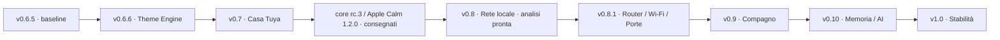

# DeskPulse / SmartPC — MasterPlan dei rilasci

**Revisione 2.18 · 7 ottobre 2026 · Europe/Rome**
**Baseline funzionale: v0.6.6 Theme Engine. Ultima consegna installata documentata: core 0.7.0-rc.3, Theme API 2.2, Apple Calm 1.2.0. Prossima implementazione pianificata: v0.8 Rete locale.**

Questo documento aggiorna il piano della chat **Dashboard Orange Pi MasterPlan** dopo la lettura delle chat di versione, comprese **Dashboard Orange Pi v0.6.6**, **Dashboard Orange Pi v0.7**, **Dashboard Orange Pi 0.7.0-rc.2**, **Dashboard Orange Pi Theme** e **Dashboard Orange Pi v0.8**, dei sorgenti e dei resoconti locali. È il riferimento per sequenza, perimetro e criteri di uscita delle prossime versioni. I resoconti dei rilasci conservano le evidenze delle singole prove.

La v0.6.6 è implementata e distribuita sulla board; [resoconto di migrazione e prove](v066-migration-report.md). Casa è stata consegnata come rc.1 e revisionata in rc.2: [implementazione](v07-implementation-report.md), [manutenzione](v07-maintenance-report.md). La successiva [consegna Apple Calm del 6 ottobre](../../theme-projects/apple-calm/CONSEGNA.md) documenta core **0.7.0-rc.3** e contratto **2.2** installati, con vero reboot verificato. Versione core, versione del contratto e versione del tema hanno identità distinte. Casa conserva i propri gate: rc.3 non equivale alla v0.7 finale.

**Stato dello studio:** analisi v0.8 e v0.8.1 completate il 7 ottobre, con API iliadbox provate dal PC; provider/UI Rete non implementati. Questa revisione consulta chat, sorgenti ed evidenze salvate: non esegue un nuovo accesso alla board, interrogazioni al router o deployment. N0 riconcilierà manifest e stato effettivo prima della prossima modifica. Le etichette future non assegnano tag Git; le modifiche di lavoro preesistenti vengono preservate.

La lacuna rilevata dal [check del 3 ottobre sulle notifiche](theme-engine-notification-spec.md) è stata chiusa: sei composizioni indipendenti, ruoli locali, editor/preview, animazioni e testi lunghi scorrevoli. Implementazione e installazione sono nel [resoconto dedicato](theme-engine-notification-migration-report.md), con prove di stato/rollback e limiti prestazionali misurati. Il contratto è disponibile per i moduli successivi.

**Temi profondi tramite AI: infrastruttura consegnata e primo tema completo installato.** A1–A6 hanno introdotto `SmartPC.ThemeApi 2.0`, 44 superfici, renderer/asset nei bundle, revisioni immutabili, journal/rollback, supervisore e kit autonomo. Casa ha esteso il contratto a 2.1; Orologio e gli aggiornamenti successivi a 2.2, mantenendo gli import precedenti. Apple Calm 1.2.0 dimostra il percorso su un tema reale; non certifica tutti i concept o qualunque bundle futuro. [Engine ed evidenze](theme-engine-a1-a6-implementation-report.md), [piano AI](theme-engine-ai-execution-plan.md), [consegna Apple Calm](../../theme-projects/apple-calm/CONSEGNA.md).

Il cambio completo del tema può mostrare una schermata di caricamento: è un'azione occasionale. La navigazione ordinaria deve restare pronta e fluida. RAM/CPU sono misure diagnostiche sul dispositivo dedicato, senza ripristinare i vecchi limiti come blocchi alla consegna; mantenere comunque controlli di crescita, risposta dei comandi e recovery. Evitare stress storici ripetuti senza un rischio nuovo. Le prove fisiche/prolungate ancora aperte restano distinte dalla consegna software.

## 1. Decisioni aggiornate

- **v0.6.5 è la baseline precedente alla migrazione**, comprendente Sport e le successive revisioni di codice, impostazioni e Informazioni documentate nelle chat.
- **v0.7 è una candidata implementata**: provider e schermate Casa presenti, API lette dalla board, polling continuativo subordinato alla quota effettiva; collaudi fisici ancora aperti.
- **v0.8 diventa Rete locale**: panoramica dei dispositivi e delle informazioni osservabili dalla Orange Pi o ottenibili dal router. Acquisizione eseguita sulla board; nessun agent da installare sui computer della rete.
- **Theme Engine prima di Casa e Rete**, come v0.6.6 implementata. Primo rilascio con Base e Functional completi; gli altri profili arrivano dopo la verifica delle schermate.
- **Apple Calm 1.2.0 è un tema consegnato**, con vista Orologio, navigazione a pallini e ottimizzazioni del core. Il suo numero non sostituisce quello della dashboard.
- **v0.8 poi v0.8.1, una alla volta:** inventario e dettagli prima; viste iliadbox/Internet, Wi-Fi, Porte e grafici dopo la base verificata. Le analisi sono pronte, le prove dalla board restano parte dell'implementazione.
- **Rete fa parte del contratto Theme:** provider unico, superfici tipizzate, Base/Functional completi, compatibilità Apple Calm e bundle precedenti tramite fallback. Aggiornare SDK/kit AI insieme alla release.
- Il modulo Account ChatGPT già rilasciato conserva il suo processo di sincronizzazione sul PC: la nuova v0.8 non introduce agent per telemetria hardware.
- **Spotify/Media non ha una versione assegnata** nel piano attivo: le vecchie righe dei README vengono sostituite dalla sequenza corrente.
- Cane e Memoria/AI restano v0.9 e v0.10; NPU e modelli locali appartengono alle esplorazioni successive.

## 2. Baseline: cosa esiste davvero

| Versione / area | Stato attuale | Comportamento acquisito |
| --- | --- | --- |
| v0.1 · Kiosk | Rilasciata | Avvio fullscreen, orologio/data, tastierino, ripartenza systemd e diagnostica passiva. |
| v0.2 · Meteo | Rilasciata | Open-Meteo Angri, tre giorni, worker e cache; prova di avvio della board senza Wi-Fi documentata. |
| v0.3 · UI e stato | Rilasciata | Home dinamica, navigazione a due assi, componenti separati, preferenze di luminosità e modalità demo. |
| v0.4 · Account ChatGPT | Rilasciata | Piano, finestre d'uso, crediti quando disponibili, reset e stato della sincronizzazione; modulo nel carosello. |
| v0.5 · Eventi | Rilasciata | Priorità, scadenza, deduplicazione, SQLite, banner piccoli/grandi, urgenti, cache bollettino e badge non letti. |
| v0.6 → v0.6.1 · Sport | Rilasciata, con collaudi live aperti | Serie A, squadra preferita, calendario/coppe/rosa, dettaglio partita, Fantacalcio pubblicato e adapter live; F1/MotoGP con programma, classifiche, sessioni e dettagli. |
| Impostazioni / Informazioni | Revisione installata | Aspetto, Luminosità, Moduli, Notifiche, Account, Sport, Dati e aggiornamenti; Info autonoma con dispositivo, risorse, rete e dati. |
| v0.7 · Casa | Candidata; ultimo core consegnato 0.7.0-rc.3 | Provider, preferiti, inventario e dettagli integrati; letture board reali, polling implementato ma disattivato senza quota effettiva. Collaudo fisico aperto. |
| v0.6.6 · Theme Engine | Implementato e distribuito | Base/Functional, facade tipizzata, registry visuali, motion/scene, editor e pacchetti personali; sei visuali Avvisi sostituibili con ruoli locali. |
| Apple Calm 1.2.0 / Theme API 2.2 | Installazione e reboot documentati il 6 ottobre | Tema profondo, Oggi → Orologio, pallini, icone distinte, correzione nomi classifica e ottimizzazione dei contesti/rendering. |
| v0.8 · Rete locale | Analisi pronta, nessun runtime Rete | Token e letture iliadbox verificati dal PC; copertura e accesso dalla Orange Pi da provare. |
| v0.8.1 · Approfondimenti rete | Analisi pronta, implementazione successiva | Viste router/Internet, Wi-Fi, Porte e storico definite; semantica di alcune metriche da qualificare. |

### Consegne recenti e attribuzione

| Consegna | Risultato documentato | Ciò che non conclude |
| --- | --- | --- |
| Theme Engine A1–A6 | Runtime, kit AI e vero reboot; preferenze/eventi preservati. | Tastierino fisico, power-cut e uso prolungato. |
| Casa 0.7.0-rc.1 · 6 ottobre | 16 dispositivi, quattro preferiti, letture cloud dalla board, cache e reboot. | Quota reale, cambi fisici e avvio con rete fisicamente assente. |
| Manutenzione 0.7.0-rc.2 · 6 ottobre | Salvataggi fuori dalla GUI, fix scheduler/cache/lifecycle; 64 controlli PC e 21 board, nessuna nuova lettura Tuya. | Nuova misura GPU/FPS o collaudo fisico Casa. |
| Core 0.7.0-rc.3 + Apple Calm 1.2.0 · 6 ottobre | Distribuzione di 457 file verificati, 38 preferenze personali conservate, 183 scenari Main sul display senza warning QML, reboot reale. | Certificazione ottica/input fisico, 60 fps garantiti o chiusura dei gate Casa. |

**Limiti da mantenere visibili:** calcio, F1, MotoGP e voti Fantacalcio devono ancora essere osservati durante eventi realmente attivi. I gate Live e gol non si abilitano in base al solo parsing di campioni. Storico, cache e navigazione già rilasciati non attendono quei collaudi.

Le notifiche hanno ora due sottomenu: **Fascia silenzio** sospende i banner negli orari scelti, lasciando passare gli urgenti delle categorie abilitate; **Avvisi sullo schermo** controlla le interruzioni delle categorie a qualsiasi ora. Gli eventi restano nella casella. **Dati e aggiornamenti** è il punto unico per l'aggiornamento manuale delle fonti. Queste regole devono essere riusate dai moduli nuovi.

Git e il repository pubblico esistono: la vecchia attività «creare Git» è superata. La v0.6.6 usa una versione comune e un manifest ricorsivo dei sorgenti; la ricostruzione storica conserva le differenze precedenti: la baseline v0.6.5 comunicata dall'utente e le etichette v0.6/v0.6.1 presenti nei documenti/sorgenti non identificano ancora un unico manifest. Le modifiche di lavoro vanno preservate e attribuite, non incluse implicitamente in una release successiva.

Fonti: [README dashboard](../README.md), [rilascio Serie A](v06-sport-release.md), [Motorsport](v06-motorsport-release.md), [squadra preferita](v06-favourite-team-release.md), [Fantacalcio](v06-fantacalcio-release.md), [dettagli racing](v06-racing-details-release.md), [revisione codice](v06-sport-code-review.md), [adapter voti live](v06-fantacalcio-live.md), [menu](settings-menu-2026-10-01.md), [sottomenu Notifiche](settings-clarity-2026-10-02.md).

## 3. Sequenza dei prossimi rilasci

| Versione | Risultato per l'utente | Dipendenza principale | Stato |
| --- | --- | --- | --- |
| **v0.6.6 · Theme Engine** | Due temi completi, visualizzazioni e animazioni personalizzabili, cambio a caldo e scene estensibili. | Baseline v0.6.5 fissata e inventario delle schermate. | Implementata e distribuita; evidenze nel resoconto v0.6.6. |
| **v0.7 · Casa / Smart Life** | Stati dei dispositivi scelti, provenienza e disponibilità chiare. | Theme Engine; prova fisica e sostenibilità Tuya. | Candidata installata; gate quota e prove fisiche aperti. |
| **Apple Calm 1.2.0 / core rc.3** | Tema completo, Orologio, pallini e navigazione ottimizzata. | Theme API 2.2, renderer e recovery. | Installata e verificata; versione tema distinta dal core. |
| **v0.8 · Rete locale** | Inventario, preferiti, dettaglio e collegamenti Wi-Fi/porta qualificati. | N0 sulla board; adapter iliadbox e compatibilità Theme. | Analisi pronta; prossima implementazione N0–N5. |
| **v0.8.1 · Rete estesa** | iliadbox/Internet, Wi-Fi, Porte, storico e grafici. | v0.8 verificata; unità, direzioni, freschezza e reset dei contatori. | Analisi pronta; si implementa dopo la base. |
| **v0.9 · Compagno** | Cane animato con scene preparate e reazioni ai moduli. | Temi, eventi e asset misurati sulla board. | Pianificata. |
| **v0.10 · Memoria e scene AI** | Preferenze e storia del compagno; scene proposte tramite comandi validati. | Compagno deterministico funzionante. | Pianificata. |
| **v1.0 · Versione stabile** | Configurazione, aggiornamento, recupero e uso continuativo documentati. | Moduli scelti e verifiche integrate. | Obiettivo. |

I collaudi live Sport seguono le occasioni reali di partita/sessione in un percorso separato. Un provider passa il proprio gate quando ha evidenze sufficienti; gli altri mantengono lo stato da collaudare. Non si crea una dipendenza artificiale fra una gara futura e il Theme Engine.

La sequenza è di lavoro, non richiede di dichiarare v0.7 finale prima di iniziare N0 Rete. Le prove Casa procedono quando quota/dispositivi sono disponibili. I profili Hardware/Cyberdeck hanno un percorso autonomo: non sono una condizione per v0.8.1 o per il cane. Un eventuale cambio di priorità non riduce i criteri di uscita delle singole versioni.

## 4. v0.6.6 — Theme Engine

**Stato al 7 ottobre:** consegnata e distribuita. Le fasi seguenti conservano il percorso storico; non sono una nuova lista di lavoro da ricominciare. Il contratto corrente è 2.2 e la qualifica di ogni nuovo bundle segue la sua matrice di verifica.

### Motivazione originaria

Le schermate Sport sono ormai numerose e le impostazioni sono state separate in componenti. Casa e Rete aggiungeranno tessere, elenchi, dettagli e stati. Centralizzare ora la presentazione evita di migrare una seconda volta quei componenti. Il cane potrà poi usare il medesimo ambiente grafico.

### Risultato e perimetro

**Aspetto → Stile grafico** seleziona **Neo-Retro Base** o **Functional**. Una voce distinta controlla **Palette giorno/notte**; Luminosità, animazioni ridotte e fascia silenzio restano preferenze indipendenti. Cambiare stile conserva pagina, pannello, selezione, tab, scorrimento e acquisizioni in corso.

Il motore deve controllare colori, superfici, focus, bordi, raggi, spaziature, font, dimensioni e pesi tipografici. Le viste mantengono dati e comandi. I pacchetti e le estensioni condividono contratti versionati attraverso facade e host; per un nuovo profilo entro quel contratto si aggiunge la sua definizione e la registrazione nel catalogo. Una nuova impaginazione o decorazione richiede anche un componente condiviso: non basta promettere «un file di 40 righe» per ogni modifica profonda.

La prima release migra tutte le superfici già rilasciate, comprese Account, Avvisi, entrambi i banner, urgenze, menu, Informazioni, impostazioni, Serie A, squadra, Fantacalcio, F1 e MotoGP. Base deve conservare la gerarchia esistente; Functional prova un'alternativa completa e leggibile. Hardware e Cyberdeck seguono quando la copertura è verificata; Cozy si completa con il cane nella v0.9.

### Approfondimento dell'engine — 2 ottobre

La [specifica aggiornata](theme-engine-construction-spec.md) confronta gli stack e raccomanda **QML/Qt Quick per rendering e animazioni, Python per configurazione/validazione, JSON per i pacchetti**, con C++ per eventuali primitive dimostrate necessarie dal profiling.

Il sistema comprende **token, presentazioni delle viste, motion, scene e asset**. Palette, composizione e animazioni sono combinabili indipendentemente. Pacchetti di dati coprono la personalizzazione semplice; un registry aperto di estensioni QML permette nuove visualizzazioni e renderer senza riscrivere ThemeService o navigazione.

La v0.6.6 deve dimostrare due Home realmente diverse, ricette animate distinte, Normal/Reduced/Off e un host di scena persistente con attore di prova fra Home/Meteo. Il compagno reale resta v0.9; lifecycle, ancoraggi e preemption vengono progettati e provati ora. [Presentazioni e compagno](theme-engine-presentation-spec.md), [Motion Engine](theme-engine-motion-spec.md).

La [review bridge/Loader/font](theme-engine-risk-review.md) rende obbligatori già in T1: alias tipizzati anche in preview, snapshot senza aggiornamenti per frame, host/readiness e harness compatibili col caricamento pigro, owner di input persistente e prove tastierino/tastiera Qt. I font si preparano su necessità; il budget include picco di staging e plateau delle cache, con scene del compagno. Il candidato generico di 8 font attivi è ritirato: il consumo si misura sulle risorse usate, non sul numero di file.

La [strategia icone](theme-engine-icon-spec.md) aggiunge AppIcon e ID semantici con renderer sostituibili. Geometrie QML e icon-font sono candidati per i simboli semplici; immagini/atlanti restano possibili per identità e compagno. Concordato di conservare inizialmente aspetto/font attuali: varianti definitive si decidono nel prototipo, senza bloccare T0.

L'[inventario in sola lettura](evidence/v066-theme-analysis/README.md) ha confrontato 64 file installati: 44 runtime corrispondono al locale, quattro harness differiscono. Qt board 6.8.2; 21 QML da migrare. Non è un nuovo collaudo funzionale o prestazionale.

### Fasi eseguibili

| Fase | Lavoro | Evidenza che permette il passo seguente |
| --- | --- | --- |
| T0 · Fissare la baseline | Manifest dei sorgenti installati, versione, screenshot rappresentativi, preferenze e misure iniziali. Chiarire mappa fisica 1/7 e guide. | Baseline riproducibile; routing, decoder, etichette e Comandi descrivono la stessa azione. |
| T1 · Contratto | Schema/catalogo, facade, ViewHost/registry, motion e SceneHost di prova; font/fallback. | Qt board carica due Home e un attore persistente, senza cambiare input/provider. |
| T2 · Migrazione Base | Componenti comuni, poi schermate e pannelli estesi. Separare colori dei dati da quelli dello stile. | Copertura completa; niente hardcode di presentazione residui nei consumatori. |
| T3 · Secondo profilo | Functional: colori, geometria, tipografia, composizione e ricette; personalizzazione guidata. | Due profili completi e distinguibili in layout/motion, giorno/notte e Normal/Reduced/Off. |
| T4 · Cambio e persistenza | Editor bozza/anteprima, pacchetti, estensioni, import/export, apply/recovery. | Dati/focus conservati anche sostituendo il visuale; persistenza e reboot provati; un terzo tema si aggiunge senza switch. |
| T5 · Rilascio | Confronto prestazioni, regressioni dei moduli, catture EGLFS, manifest e backup. | Perimetro verificato e procedura di ritorno alla baseline documentata. |

**Comandi correnti:** il routing Main e la guida dashboard riportano **1 Home / 7 Indietro**. Le vecchie etichette opposte sono storiche e vanno corrette nei riepiloghi. La verifica del tastierino fisico resta distinta dalle sequenze simulate e non viene dichiarata completata da questa revisione.

### Correzioni alla prima specifica tecnica

- **Memoria:** il vecchio `<90 MB` appartiene al prototipo iniziale. Il campione del 1 ottobre riporta circa **175 MiB RSS / 162 MiB PSS** per un processo v0.6; non è un nuovo campione v0.6.5. Si confrontano prima/dopo sullo stesso carico, distinguendo RSS, PSS e cgroup, e si cerca crescita persistente. Non imporre retroattivamente quel vecchio limite come condizione di successo.
- **Prestazioni:** «zero overhead» e «cambio in un solo frame» diventano obiettivi da misurare. Font, geometrie e binding possono produrre lavoro. Font preparati prima del cambio; nessuna duplicazione di intere schermate per ogni profilo; niente animazioni continue a riposo.
- **Tipografia:** la prima specifica fissava dimensioni e font nella facade. La costruzione deve inoltrare i token del profilo anche per dimensioni/pesi/famiglie, altrimenti i temi profondi restano soltanto dichiarati.
- **Stati:** un tema non deve falsare la gravità di un'allerta ufficiale, il significato di un dato salvato o la provenienza. Colori sportivi, bandiere e mappe delle allerte non vengono sostituiti indiscriminatamente con l'accento del tema.
- **Funzioni:** un profilo Cozy può definire lo spazio visivo del compagno, ma non crea il cane né lo abilita prima della v0.9. Cyberdeck non attiva da solo polling o telemetria.
- **Esempi:** gli snippet dei documenti sono proposte non ancora eseguite. Verificare caricamento e compatibilità sulla versione Qt della board prima di usarli come codice di produzione.

**Uscita v0.6.6:** Base/Functional coprono tutte le schermate, con presentazioni e motion distinti e infrastruttura per scene persistenti; cambio a caldo e persistenza verificati; nessuna regressione nei comandi e nelle notifiche; zero warning QML inattesi nel percorso provato; lettura fisica controllata; confronto del frame pacing e delle risorse con la baseline, con limiti dichiarati. Le 60 Hz del pannello restano distinte dai 60 fps misurati durante un'animazione.

Riferimenti: [specifica di costruzione](theme-engine-construction-spec.md), [migrazione UX/temi](ux-theme-adaptation-plan.md), [analisi visiva](themes-and-ux-analysis.md), [singleton Qt](https://doc.qt.io/qt-6/qml-singleton.html), [prestazioni Qt Quick](https://doc.qt.io/qt-6/qtquick-performance.html).

### Apple Calm 1.2.0 — risultato acquisito

- Palette bianco/grafite con accento blu, 48 renderer propri e fallback Base solo per `scene.main`.
- Legende permanenti inferiori rimosse in questo tema; guida nel menu Comandi. Argomenti a pallini in alto, viste/schede sul margine destro, overlay ordinari inclusi; gli urgenti mantengono priorità.
- Oggi ora comprende **Ora / Orologio / Giornata**. Orologio dà maggiore spazio alle cifre, con meteo compatto ed evento solo quando esiste.
- Classifica con nomi/ID corretti, 50 glifi semantici e icone distinte per Casa/F1/MotoGP. Contesti pubblici limitati ai dati necessari, cache dei renderer e readiness coerente.
- Una sola revisione Apple Calm distribuita (`retention: latest`), recupero permanente Base e backup corrente. Non applicare questa policy retroattivamente agli altri temi.

Nel confronto EGLFS con cache/percorsi uguali, il p95 software dei cambi a caldo passa da **1138,5 a 105,6 ms**; massimo a caldo 141,9 ms, primo ingresso massimo 325,2 ms. Il target 100 ms è mancato di circa 6 ms: mantenere quel limite. Le misure sono azione software → frame coerente, non latenza ottica, tempo GPU o promessa di 60 fps. Le nuove schermate Rete devono evitare ricostruzioni inutili e invalidazioni dei contesti nascosti; verificare la navigazione con un carico rappresentativo senza ripetere tutta la storia degli stress. [Rapporto e prove](../../theme-projects/apple-calm/CONSEGNA.md).

## 5. v0.7 — Casa / Smart Life tramite Tuya

**Stato al 7 ottobre:** provider e UI consegnati in rc.1, manutenzione rc.2, core aggiornato a rc.3 dalla consegna Apple Calm. L'[analisi C0–C5](v07-implementation-readiness.md) è la preparazione storica; i risultati effettivi sono nel [report di implementazione](v07-implementation-report.md) e nel [report di manutenzione](v07-maintenance-report.md). Il prossimo lavoro Casa è la chiusura dei gate, non riscrivere provider e schermate.

### Risultato

Casa entra nel carosello quando esiste una configurazione utile. La panoramica mostra al massimo quattro dispositivi scelti; elenco e dettaglio permettono di consultarne altri. Per ogni elemento si distinguono **stato riportato**, **disponibilità dichiarata dal cloud**, **ora della lettura** e **dato salvato**. Una lampada offline con stato `on` mostra l'ultimo stato riportato, non una conferma di accensione attuale.

Il collegamento scelto è OpenAPI Tuya diretto. Home Assistant resta un'alternativa da riesaminare se questo percorso non risulta sostenibile. L'inventario già letto comprende Wi-Fi e dispositivi dietro hub; l'assenza di IP di un sensore Zigbee non lo esclude dal modulo Casa.

### Consegnato e attività per uscire dalla candidata

| Area | Consegnato | Passo ancora necessario |
| --- | --- | --- |
| Provider | Worker, inventario cumulativo/paginazione, token riutilizzato, specifiche e cache private. | Confronto app/dispositivo/display e misura dei ritardi reali. |
| Economia chiamate | Ledger persistente, lock, margine 20%, scheduler 5 minuti / 1 minuto con accelerazione fino a 2 ore/giorno. | Quota, consumo condiviso e scadenza reali; attivazione controllata. Polling automatico ancora disattivato senza policy effettiva. |
| UI | Quattro preferiti modificabili/ordinabili, inventario, dettagli, impostazioni, Base/Functional e Apple Calm. | Casi fisici dei preferiti, aggiunta/rinomina/rimozione reali. |
| Recovery | Errori, cache/worker e budget provati con trasporti simulati; reboot reale con rete disponibile. | Spegnimento dispositivo/hub, perdita/ripristino rete, avvio fisicamente senza rete, revoca/rinnovo autorizzazione. |

Consultazione manuale disponibile da **Dati e aggiornamenti → Casa**. Il refresh è confermato dopo acquisizione completa e salvataggio riuscito; la rc.2 ha spostato flush/fsync nel worker. La presenza di scheduler/test non attesta che i gate fisici siano superati.

Il contatore locale delle chiamate è una stima del nostro consumo, non il saldo globale del progetto Tuya. La policy 1/5 minuti produce una schermata informativa: non si promettono eventi di movimento istantanei. Quote e prezzi riportati nei vecchi studi richiedono conferma della console al momento dell'integrazione.

**Uscita v0.7:** prove fisiche per i dispositivi selezionati, latenza documentata, quota sostenibile, acquisizioni asincrone, schermate con entrambi i profili, riconnessione/cache/reboot verificati. Primo rilascio in consultazione; eventuali comandi nominati richiedono un'iterazione distinta con prove dell'esito e nessun replay di azioni incerte.

Riferimenti: [piano Tuya diretto](v07-tuya-direct-plan.md), [prove reali](v07-tuya-live-analysis.md), [budget e polling](v07-tuya-polling-budget.md). Il [piano Home Assistant](v07-home-assistant-plan.md) conserva una strada alternativa, non il percorso attivo.

## 6. v0.8 — Rete locale, senza agent sui dispositivi

**Analisi pronta per l'implementazione, 7 ottobre:** [architettura dashboard](v08-local-network-analysis.md), [token/contratto LAN](v08-iliadbox-api-study.md), [capacità/viste/permessi](v08-router-capabilities-and-views.md). Catalogati 44 moduli e 339 definizioni HTTP, non 339 capacità operative garantite. Verificati dal PC token/sessioni, inventario, Wi-Fi, porte, WAN/fibra, sensori, RRD e sottoscrizione eventi LAN con `settings=false`. Il token attuale basta alle letture provate; uno nuovo separa autorizzazioni, non concede automaticamente privilegi. Fonte iliadbox primaria se confermata dalla board; discovery locale soltanto per lacune misurate. N0–N5 restano lavoro da eseguire; nessun provider/UI Rete installato.

### Risultato

Una famiglia **Rete** mostra la LAN osservata dalla Orange Pi: dispositivi rilevati di recente, preferiti e dettagli disponibili. La pagina Informazioni → Rete continua a descrivere la board; la nuova famiglia offre la panoramica della rete domestica.

La configurazione è **iliadbox Wi-Fi 7, gateway 192.168.1.254, rete unica**. Il 7 ottobre, dal PC, sono stati verificati documentazione locale e API **15.0**, token autorizzato fisicamente dall'utente e due sessioni successive con la stessa credenziale. Il provider futuro usa app_token/sessioni, senza password amministrativa per il polling. Preferire un'autorizzazione riconoscibile per il kiosk e ridurre i permessi non utilizzati; il riuso della stessa app resta una scelta da provare dalla board. Credenziali fuori dal repository e dai contesti pubblici, trust TLS circoscritto e identità router verificata.

Lo snapshot contiene **39 record host**, 13 raggiungibili nella prima lettura e 14 in quella ampliata; il contatore dell'interfaccia indica **54**. Nessuno di questi valori diventa automaticamente «tutti i dispositivi accesi». Guest con `result=null` è fonte indisponibile. La configurazione DHCP dichiara maschera 255.255.255.0: prefisso/interfacce/IPv6 della board e copertura restano da verificare in N0. [Token/API](evidence/v08-iliadbox-study-2026-10-07/token-verification.json), [capacità reali](v08-router-capabilities-and-views.md). Nessuna scansione dei client è stata eseguita nello studio.

### Quali informazioni possiamo mostrare

| Informazione | Sorgente prevista | Come viene presentata |
| --- | --- | --- |
| IPv4 e IPv6 riportati/osservati | Inventario iliadbox e fonti locali | Qualità e tempi per indirizzo; un indirizzo raggiungibile non rende correnti tutti gli altri. |
| Nome / alias | DNS, mDNS, router, nome assegnato dall'utente | Nome ottenuto e alias persistente distinti. |
| MAC | ARP/ND locale o router | Se disponibile; non è un'identità permanente garantita. |
| Produttore probabile | Prefisso MAC e database locale | Indicazione stimata; un indirizzo privato può renderla assente o errata. |
| Tipo/modello e servizi | Annunci mDNS/DNS-SD o metadati router | Indizio/provenienza dichiarati; nessun modello inventato dal solo nome. |
| Presenza e ultimo riscontro | Stato/tempi iliadbox o risposta diretta qualificata | «Raggiungibile secondo router», «osservato dalla board», «ultimo riscontro» distinti. Nessuna risposta non equivale a spento. |
| Primo/ultimo rilevamento | Registro locale | Storia delle osservazioni, non ore certe di accensione. |
| Risposta/latency LAN | Sonda puntuale, dove accettata | Ritardo della risposta alla board; non velocità Internet. |
| Wi-Fi/porta e associazione AP/banda | Join inventario, stazioni e MAC switch iliadbox | Collegamenti verificati dal PC; conferma sulla board e tempo del join. Un host può essere dietro uno switch della stessa porta. |
| Segnale, link e traffico | Stazioni Wi-Fi, porte e WAN | Approfondimenti v0.8.1. Wi-Fi per stazione, Ethernet aggregato per porta, WAN totale; livelli non sommabili né attribuibili a ogni host. |
| CPU, GPU, RAM, app aperte | Non ricavabili dalla normale discovery | Fuori dal perimetro Rete; nessun agent da installare. |

ARP/Neighbor Discovery operano sulla rete locale; firewall, isolamento e proxy ARP possono influenzare il risultato. Il discovery `-sn` di Nmap evita la successiva scansione porte e richiede di scegliere tecnica/privilegi appropriati alla LAN. [Documentazione Nmap](https://nmap.org/book/man-host-discovery.html).

Avahi consente di utilizzare gli annunci mDNS/DNS-SD per host e servizi che li pubblicano; non costituisce un inventario universale dei client. [Avahi](https://avahi.org/). I dispositivi Apple possono usare MAC privati o ruotarli: nomi, alias e osservazioni non vanno fusi automaticamente in base a un solo indizio. [Indirizzi Wi-Fi privati Apple](https://support.apple.com/en-us/102509).

### Schermate e comandi

- **Panoramica — `network.overview`:** LAN/fonte/ora, record e raggiungibilità qualificati, fino a quattro preferiti; breve stato Internet secondo box se disponibile. Copertura spiega conteggi discordanti.
- **Dispositivi — `network.devices`:** elenco con poche righe leggibili, nome/alias, collegamento e riscontro; filtri tutti/preferiti/raggiungibili secondo box/precedenti. Numero di righe da confrontare sul display con ciascun tema.
- **Dettaglio — `network.detail`:** Identità, Indirizzi, Collegamento e Riscontri; sorgenti e tempi, AP/banda o porta solo con join valido. Ritorno alla stessa riga/filtro/offset.
- **Impostazioni — `settings.network`:** fonte, stato autorizzazione, sospensione acquisizione, preferiti/alias e storia. Refresh nel punto comune Dati e aggiornamenti. Preferiti nella panoramica e nel filtro, senza una vista vuota obbligatoria.

Sul focus pagina, 4/6 cambia famiglia; nelle righe 2/8 seleziona e 5 apre. Dalla prima riga, Su entra nella selezione delle viste e 4/6 cambia scheda; nel dettaglio 4/6 cambia sezione. **1 Home / 7 Indietro**; il ritorno conserva ID/filtro/offset anche dopo un aggiornamento. Footer e pallini seguono il tema e il contesto attivo, senza imporre le legende permanenti ad Apple Calm. Moduli visibili, Dati e aggiornamenti e Notifiche riusano i punti comuni. Nessun widget Rete permanente sulla Home nella prima uscita.

### Temi e kit AI: parte della consegna

Il provider è unico per tutti i temi. Esporre `NetworkContext`, dominio `network`, modelli/azioni tipizzati e quattro superfici attraverso Theme API; assegnare la nuova minor durante l'implementazione effettiva, senza cambiare ora la versione del contratto. Nessun renderer fa I/O, gestisce token o avvia sonde.

- **Base e Functional:** copertura completa giorno/notte e Normal/Reduced/Off.
- **Apple Calm 1.2.0 e bundle precedenti:** fallback Base esplicito per le nuove superfici, con layout/focus/stile compatibili; un renderer Rete dedicato può arrivare in una revisione del tema.
- **Compatibilità:** estendere il fallback additivo oltre il delta Casa attuale. Non alterare zip/hash/manifest immutabili; provare bundle 2.0, 2.1 e 2.2 e mantenere errori per omissioni non riconosciute.
- **SDK/kit AI:** contratti sorgente e generatori, reference/qmltypes, registry, fixture, esempi e pacchetto autonomo aggiornati nella stessa consegna.

Ogni tema supportato deve poter usare Rete; non richiede un nuovo backend o quattro renderer personalizzati per ciascuno. La grafica personalizzata è una possibilità del contratto, mentre la copertura funzionale è un criterio di uscita.

### Fasi eseguibili

| Fase | Lavoro | Criterio per proseguire |
| --- | --- | --- |
| N0a · Baseline | Riconciliare core rc.3/Theme API 2.2/tema installati con manifest e modifiche locali; interfacce/prefissi/IPv6 e unità effettiva. | Baseline riproducibile e differenze attribuite. |
| N0b · Sorgenti reali | Sessione/TLS iliadbox dalla board, permessi, inventario e join; confronto con dispositivi acceso/sonno/scollegato e discrepanza 54/39. Discovery aggiuntiva solo per lacune. | Copertura e fonti utili misurate; scelta motivata su necessità del helper. |
| N1 · Provider | Adapter iliadbox con sessione/permessi, inventario e join Wi-Fi/porta; informazioni locali e fallback ARP/ND/mDNS per lacune misurate. Lavoro in background, timeout e un ciclo per volta. | Funziona sulla board senza agent sui client; non blocca navigazione o uscita. |
| N2 · Identità e storia | Alias, preferiti, fonti e timestamp persistenti. IP variabile, MAC privato, risposte parziali e cambio LAN gestiti. | Nessuna fusione certa di dispositivi da dati ambigui; cache mai presentata come presenza attuale. |
| N3 · Schermate e Theme | Quattro superfici, NetworkContext, impostazioni/fonti, fallback versionato e kit AI. | Base/Functional completi, Apple Calm/bundle precedenti compatibili; focus stabile, nomi lunghi/IPv6, zero warning inattesi. |
| N4 · Eventi | Nuovo dispositivo osservato e preferito non rilevato, solo se abilitati. Baseline iniziale silenziosa e conferme su più cicli. | Nessuna raffica al primo avvio, al ritorno della rete o per un solo timeout. |
| N5 · Rilascio | Cicli e risorse misurati, recovery, copertura dichiarata e guida configurazione. | Distinzione verificata fra dispositivo assente, discovery guasta e rete board scollegata. |

Prima policy candidata: riconciliazione completa ogni cinque minuti, refresh manuale con cooldown di 30 secondi e un solo ciclo alla volta. WebSocket come accelerazione soltanto dopo prova di eventi/reconnect, sempre con riconciliazione HTTP; l'handshake accettato non dimostra una transizione reale di presenza. Fonti AP/porte/config più lente; nessuna scansione completa ogni minuto per aprire una vista. Proposta di 30 giorni per osservazioni aggregate, con durata distinta di alias/preferiti. Valori da confermare in N0/N1, non polling già implementato.

Se servono pacchetti raw, limitare i privilegi al helper necessario; il kiosk mantiene il suo utente di servizio. Subnet e massimo numero di indirizzi sono espliciti; timeout, concorrenza e durata totale hanno limiti. IPv6 usa osservazioni ND, multicast e fonti router: non si enumera un intero prefisso /64. Nessun ciclo di analisi globale delle porte necessario alla prima panoramica.

Un lease DHCP conservato prova un'assegnazione, non una connessione attuale. La scomparsa dalla discovery non dimostra lo spegnimento: può essere sonno, firewall o isolamento. Un dispositivo Zigbee della v0.7 può comparire solo attraverso l'hub sulla LAN; l'elenco Casa e quello Rete restano distinti e si collegano per identità verificata o associazione esplicita.

**Uscita v0.8:** confronto con un inventario reale, prove di dispositivi accesi/in sospensione/scollegati, MAC/IP variabili, perdita e ritorno della LAN, reboot e aggiornamento fallito; focus e dati precedenti coerenti; ripresa senza falsi nuovi dispositivi. Campi e copertura realmente ottenuti sono documentati; le prove non certificano la visibilità di reti isolate.

## 7. v0.8.1 — iliadbox / Internet, Wi-Fi e Porte

**Analisi pronta; implementazione dopo v0.8 verificata.** Lo [studio del 7 ottobre](v08-router-capabilities-and-views.md) conferma dal PC sorgenti WAN/fibra, radio/stazioni, porte, sensori/ventola e GET RRD con il token attuale. Queste capacità diventano approfondimenti nella stessa famiglia Rete, senza aggiungere una famiglia per ogni API.

| Superficie proposta | Contenuto e grafica | Limiti da mantenere |
| --- | --- | --- |
| `network.router` · iliadbox / Internet | Firmware/uptime, WAN/fibra, traffico down/up, potenza ottica, sensori/ventola; Stato/Storico con un grafico alla volta. | Capacità di banda riportata ≠ speed test. Sensori router distinti da Orange Pi e dai PC. |
| `network.wifi` · Wi-Fi | Radio, canale/larghezza, associazioni, stazione/link/segnale; occupazione canale solo con freschezza qualificata. | Due radio 2,4/5 GHz osservate, nessuna 6 GHz dimostrata. MLO configurato non prova un client su più link. Nessuna scansione attiva/restart/WPS automatici. |
| `network.ports` · Porte | Link/velocità, host visti dalla porta, contatori e serie; selezione porta → host → dettaglio. | Tre porte osservate, una a 2,5 Gbit/s. Traffico condiviso per porta, non consumo individuale di ciascun host. |

### Fasi e criteri di uscita

1. **E0 · Verificare le metriche:** unità/direzioni RX/TX, segnale radio, sentinel, timestamp, join MLO/roaming, velocità reali e campi sensori sul modello effettivo. Segnale raw in dB senza percentuali/dBm inventati fino a qualifica.
2. **E1 · Adapter e storico:** GET RRD con finestre limitate, risoluzione effettiva e punti ridotti prima di QML. Null resta buco; reboot/reset/scope nuovo produce baseline, non delta negativo. Traffico WAN, Wi-Fi per stazione e porta sono livelli distinti; niente consumo mensile per host senza dati raccolti.
3. **E2 · Acquisizione visibile:** config lenta, campioni rapidi soltanto nel dettaglio attivo, frequenza candidata 5–10 secondi da misurare. Pausa delle richieste aggiuntive quando la vista è nascosta; niente callback o invalidazioni inutili.
4. **E3 · UI e Theme:** tre superfici additive, DTO filtrati, Base/Functional, compatibilità Apple Calm e bundle precedenti, fixture e kit AI aggiornati. Le viste mostrano un approfondimento/grafico per volta a 960×640.
5. **E4 · Consegna:** direzioni/assenze/reset provati, recovery e carico misurati, navigazione ordinaria verificata e manifest/backup. Campi non disponibili non diventano zeri o tessere vuote.

**Uscita v0.8.1:** sorgenti dalla board confermate, semantica delle metriche documentata, storico valido con buchi/reset, temi compatibili, nessuna regressione dell'inventario v0.8. Le 44 famiglie API catalogate non entrano tutte nel polling: storage, media, telefonia, VPN/comandi e domotica box restano opportunità separate senza versione assegnata. Hardware/Cyberdeck possono essere sviluppati indipendentemente, con una propria qualifica visiva; non sono una condizione di questa release.

## 8. v0.9 — Compagno animato

**Risultato:** cane con riposo, attenzione, gioco e reazioni preparate agli eventi. Prima una macchina a stati deterministica: asset locali precaricati, sequenze ripetibili e controlli leggibili. Compagno come vista di Oggi, con presenza e spostamenti fra schermate secondo preferenze e zone dichiarate dalle presentazioni. Il SceneHost persistente della v0.6.6 conserva attore e azione; le scene non coprono dati, focus o avvisi.

Fasi: fissare stile e dimensioni; produrre un set piccolo di sprite/scenari; integrare animazione e comandi; collegare meteo ed eventi verificati; sviluppare il profilo Cozy; misurare carico e frame pacing. Palette notte, riduzione del movimento, silenzio notifiche e riposo del cane rimangono controlli diversi.

**Uscita:** scene diurne/notturne con entrambi i profili iniziali e Cozy, nessun asset caricato durante una sequenza, priorità agli urgenti, stop/ripresa e dati mancanti gestiti. Il cane funziona senza AI/cloud e senza creare presenza o reazioni a partire da dati rete ambigui.

## 9. v0.10 — Memoria e scene AI

**Risultato:** preferenze e storia del compagno; AI opzionale che propone scene tramite JSON validato e un catalogo di azioni/asset consentiti. Le memorie operative di cache/eventi già esistenti non vengono riscritte come «nuova memoria AI».

Fasi: definire dati da conservare e cancellazione; schema/versioni SQLite; contesto minimo per il planner; schema scene, validazione e limiti; costo e timeout dell'eventuale servizio; percorso locale con scene preparate in caso di assenza rete o quota. La fonte e il budget dell'AI esecutiva sono definiti esplicitamente e non dedotti dal piano monitorato nella v0.4.

**Uscita:** scene invalide respinte senza crash, nessun codice generato eseguito, preferenze recuperate dopo reboot, AI indisponibile senza effetto sulla dashboard, consumo tracciabile e cancellazione verificata.

## 10. v1.0 — Stabilità e uso continuativo

La 1.0 consegna i moduli selezionati con configurazione iniziale, release identificabile e recupero riproducibile. La checklist finale comprende: manifest sorgenti/tag/versione, installazione e aggiornamento, backup/ripristino effettivamente provato, configurazioni preservate, cache/dati mai acquisiti riconoscibili, dati credenziali fuori dal progetto, UI fisica leggibile e matrice dei temi supportati.

Una versione fissa viene lasciata in uso normale almeno 24 ore con campioni passivi di RAM/CPU/temperature, rete, provider e log. Si distingue uptime della board da quello dello stesso processo e build. Non si blocca la chat in attesa: il controllo viene raccolto dopo la finestra d'uso; eventuali prove più lunghe sono concordate in base a un rischio concreto. La misura di animazioni e input è separata dall'osservazione a riposo.

Da approfondire secondo le evidenze esistenti: timeout microSD/SDIO, rumore audio/Bluetooth e strategia per gli aggiornamenti Xorg vendor. Il binding QML è stato corretto nelle revisioni successive al rapporto del 1 ottobre; i due scollegamenti del tastierino sono stati chiariti come manuali. Non ripresentarli come nuovi guasti.

Riferimenti: [rapporto operativo del 1 ottobre](../../os/diagnostics/2026-10-01-24h/report.md), [correzioni successive](settings-clarity-2026-10-02.md), [audit OS](../../os/board-audit-2026-09-29.md).

## 11. Scheda da usare in ogni chat di versione

1. **Partenza:** versione realmente installata, manifest e modifiche già presenti.
2. **Obiettivo:** cosa diventa possibile per l'utente; schermate e dati inclusi.
3. **Prova della sorgente:** dati reali ottenuti, limiti, costi/quote quando presenti.
4. **Implementazione:** provider asincrono, stato normalizzato, UI Theme e impostazioni nei punti comuni.
5. **Verifica:** casi di errore/offline, navigazione e focus, catture e misure sulla board appropriate alla modifica.
6. **Rilascio:** backup, file installati verificati, preferenze mantenute, versione/tag e README coerenti.
7. **Residui:** ciò che è ancora da osservare dal vivo o dipende da una decisione dell'utente.

Nessuna nuova funzione entra come pagina vuota. Un modulo configurato continua a essere consultabile offline; nasconderlo dal carosello non equivale a disattivare il suo provider. Eventuali controlli di acquisizione, visibilità e notifiche hanno significati espliciti.

## 12. Ordine operativo da seguire adesso

1. **Partenza v0.8 — N0a/N0b:** partire dall'ultima consegna documentata core rc.3 / Theme API 2.2 / Apple Calm 1.2.0; riconciliare runtime/manifest e provare dalla Orange Pi token/TLS, inventario e collegamenti iliadbox. Nessuna ripartenza da una presunta rc.2 perché un README è rimasto indietro.
2. **v0.8 — N1/N2:** provider, persistenza, identità, freschezza/copertura e preferiti. Eventi WebSocket facoltativi dopo prova reale; discovery/helper solo se necessari alle lacune.
3. **v0.8 — N3/N5:** quattro superfici, compatibilità dei temi e SDK, prove mirate, candidata e distribuzione. N4 notifiche dopo copertura/identità affidabili; non deve bloccare la prima consultazione utile.
4. **v0.8.1 — E0/E4:** metriche qualificate, storico e tre approfondimenti; una release alla volta.
5. **In parallelo alle occasioni reali:** chiudere quota/collaudi Casa e gate live Sport. Per Theme conservare i residui fisici/prolungati documentati; non ricominciare A1–A6 o stress storici già conclusi.
6. **Poi v0.9/v0.10:** compagno e memoria/AI, sulla base grafica già consegnata. Nessun nuovo tag o versione runtime viene assegnato da questo aggiornamento del piano.

### Gate aperti e loro effetto

| Gate | Stato / evidenza mancante | Cosa condiziona |
| --- | --- | --- |
| Casa: quota/consumo/scadenza | Valori effettivi e polling controllato. | Uso continuativo e accettazione v0.7 finale; non l'analisi o N0 Rete. |
| Casa: dispositivi/rete | Cambi reali, latenza, hub/rete assenti, cold start offline e gestione account. | Accettazione finale Casa; non cancellare la candidata manuale già consegnata. |
| Rete: accesso/copertura | N0 dalla Orange Pi, discrepanza 54/39, stati di presenza e permessi/trust. | Scelta delle sorgenti e promessa dei campi v0.8. |
| Rete: temi | Fallback additivo, bundle precedenti, quattro superfici e kit AI. | Consegna v0.8, insieme al provider/UI. |
| Metriche v0.8.1 | Direzioni, segnale, MLO, storico e reset sulla board. | Etichette/grafici della release estesa. |
| Sport live | Partite/sessioni effettivamente attive e feed voti. | Singolo badge/gate live e notifiche gol. |
| Theme fisico/prolungato | Tastierino reale, power-cut e uso continuativo; verifiche ottiche dove necessarie. | Qualifica fisica e stabilità finale; evitare nuovi risultati PASS senza prove. |

Fonti recenti: [Casa iniziale](v07-implementation-report.md), [manutenzione](v07-maintenance-report.md), [Apple Calm e rc.3](../../theme-projects/apple-calm/CONSEGNA.md), [architettura Rete](v08-local-network-analysis.md), [token](v08-iliadbox-api-study.md), [capacità/viste](v08-router-capabilities-and-views.md). I resoconti storici mantengono versione, esiti e limiti del momento in cui furono prodotti.
