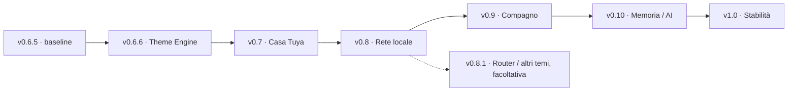

# DeskPulse / SmartPC — MasterPlan dei rilasci

**Revisione 2.10 · 4 ottobre 2026 · Europe/Rome**
**Baseline corrente: v0.6.6 Theme Engine. Prossima milestone: v0.7 Casa/Smart Life.**

Questo documento aggiorna il piano della chat **Dashboard Orange Pi MasterPlan** dopo la lettura delle chat **Dashboard Orange Pi v0.1**, **v0.2**, **v0.3**, **v0.4**, **v0.5**, **v0.6**, **v0.6.5**, **v0.7** e **Dashboard Orange Pi Theme**, dei sorgenti e dei resoconti locali. È il riferimento per sequenza, perimetro e criteri di uscita delle prossime versioni. I resoconti dei rilasci conservano le evidenze delle singole prove.

La v0.6.6 è implementata e distribuita sulla board; [resoconto di migrazione e prove](v066-migration-report.md). Le milestone successive restano pianificate. Le etichette future indicano milestone di prodotto; non assegnano tag Git e non dichiarano funzioni implementate. Non vengono attribuiti retroattivamente numeri v0.6.x a interventi che i resoconti chiamano soltanto v0.6.

La lacuna rilevata dal [check del 3 ottobre sulle notifiche](theme-engine-notification-spec.md) è stata chiusa: sei composizioni indipendenti, ruoli locali, editor/preview, animazioni e testi lunghi scorrevoli. Implementazione e installazione sono nel [resoconto dedicato](theme-engine-notification-migration-report.md), con prove di stato/rollback e limiti prestazionali misurati. Il contratto è disponibile per i moduli successivi.

**Obiettivo finale chiarito il 3 ottobre:** creazione profonda dei temi tramite AI, pacchetto completo importabile e scelta dalle impostazioni con pochi adattamenti. La baseline consente pacchetti dati e visuali registrati, ma non importa ancora il codice dei nuovi visuali. Il completamento di authoring/distribuzione, comprese notifiche, shell e dettagli, è nell'[analisi dedicata](theme-engine-ai-authoring-spec.md): gap G01–G21, fasi A0–A6 e gate T01–T21. Il [piano esecutivo](theme-engine-ai-execution-plan.md) definisce il primo blocco B0, con tooling/diagnostica schema 1 e trasferimento nell'inbox, prima dei bundle completi. B0 è implementato e verificato; [resoconto](theme-engine-authoring-b0-report.md). Il completamento dei bundle resta futuro; la numerazione del rilascio resta da stabilire.

**Preparazione A0/A1 del 4 ottobre:** [analisi operativa](theme-engine-a0-a1-implementation-analysis.md) con 44 superfici logiche e 30 route, proposta di modulo pubblico/contesti/azioni, migrazione degli adattatori, numeri meteo preservati, ruoli semantici e tracing del cambio tema. Il profilo Qt del destinatario è stato riletto con probe offscreen; l'implementazione e il collaudo dei nuovi host restano da fare. Nessuna nuova versione/tag o modifica del runtime da questa analisi.

## 1. Decisioni aggiornate

- **v0.6.5 è la baseline precedente alla migrazione**, comprendente Sport e le successive revisioni di codice, impostazioni e Informazioni documentate nelle chat.
- **v0.7 resta analisi e prova tecnica della sorgente**: esistono client/probe Tuya e verifiche API reali; non sono ancora un modulo Casa attivo, con provider periodico e schermata.
- **v0.8 diventa Rete locale**: panoramica dei dispositivi e delle informazioni osservabili dalla Orange Pi o ottenibili dal router. Acquisizione eseguita sulla board; nessun agent da installare sui computer della rete.
- **Theme Engine prima di Casa e Rete**, come v0.6.6 implementata. Primo rilascio con Base e Functional completi; gli altri profili arrivano dopo la verifica delle schermate.
- Il modulo Account ChatGPT già rilasciato conserva il suo processo di sincronizzazione sul PC: la nuova v0.8 non introduce agent per telemetria hardware.
- **Spotify/Media non ha una versione assegnata** nel piano attivo: le vecchie righe dei README vengono sostituite dalla sequenza corrente.
- Cane e Memoria/AI restano v0.9 e v0.10; NPU e modelli locali appartengono alle esplorazioni successive.

## 2. Baseline: cosa esiste davvero

| Versione / area | Stato attuale | Comportamento acquisito |
| --- | --- | --- |
| v0.1 · Kiosk | Rilasciata | Avvio fullscreen, orologio/data, tastierino, ripartenza systemd e diagnostica passiva. |
| v0.2 · Meteo | Rilasciata | Open-Meteo Angri, tre giorni, worker e cache; prova di avvio della board senza Wi-Fi documentata. |
| v0.3 · UI e stato | Rilasciata | Home dinamica, navigazione a due assi, componenti separati, preferenze di luminosità e modalità demo. |
| v0.4 · Account ChatGPT | Rilasciata | Piano, finestre d'uso, crediti quando disponibili, reset e stato della sincronizzazione; modulo nel carosello. |
| v0.5 · Eventi | Rilasciata | Priorità, scadenza, deduplicazione, SQLite, banner piccoli/grandi, urgenti, cache bollettino e badge non letti. |
| v0.6 → v0.6.1 · Sport | Rilasciata, con collaudi live aperti | Serie A, squadra preferita, calendario/coppe/rosa, dettaglio partita, Fantacalcio pubblicato e adapter live; F1/MotoGP con programma, classifiche, sessioni e dettagli. |
| Impostazioni / Informazioni | Revisione installata | Aspetto, Luminosità, Moduli, Notifiche, Account, Sport, Dati e aggiornamenti; Info autonoma con dispositivo, risorse, rete e dati. |
| v0.7 · Casa | Analisi + prototipo API | Token/rinnovo, inventario Tuya di 16 dispositivi e letture reali di quattro dispositivi verificati; polling/UI non integrati. |
| v0.6.6 · Theme Engine | Implementato e distribuito | Base/Functional, facade tipizzata, registry visuali, motion/scene, editor e pacchetti personali; sei visuali Avvisi sostituibili con ruoli locali. |
| v0.8 · Rete locale | Nuovo perimetro pianificato | Sorgenti e copertura da provare sulla rete reale. |

**Limiti da mantenere visibili:** calcio, F1, MotoGP e voti Fantacalcio devono ancora essere osservati durante eventi realmente attivi. I gate Live e gol non si abilitano in base al solo parsing di campioni. Storico, cache e navigazione già rilasciati non attendono quei collaudi.

Le notifiche hanno ora due sottomenu: **Fascia silenzio** sospende i banner negli orari scelti, lasciando passare gli urgenti delle categorie abilitate; **Avvisi sullo schermo** controlla le interruzioni delle categorie a qualsiasi ora. Gli eventi restano nella casella. **Dati e aggiornamenti** è il punto unico per l'aggiornamento manuale delle fonti. Queste regole devono essere riusate dai moduli nuovi.

Git e il repository pubblico esistono: la vecchia attività «creare Git» è superata. La v0.6.6 usa una versione comune e un manifest ricorsivo dei sorgenti; la ricostruzione storica conserva le differenze precedenti: la baseline v0.6.5 comunicata dall'utente e le etichette v0.6/v0.6.1 presenti nei documenti/sorgenti non identificano ancora un unico manifest. Le modifiche di lavoro vanno preservate e attribuite, non incluse implicitamente in una release successiva.

Fonti: [README dashboard](../README.md), [rilascio Serie A](v06-sport-release.md), [Motorsport](v06-motorsport-release.md), [squadra preferita](v06-favourite-team-release.md), [Fantacalcio](v06-fantacalcio-release.md), [dettagli racing](v06-racing-details-release.md), [revisione codice](v06-sport-code-review.md), [adapter voti live](v06-fantacalcio-live.md), [menu](settings-menu-2026-10-01.md), [sottomenu Notifiche](settings-clarity-2026-10-02.md).

## 3. Sequenza dei prossimi rilasci

| Versione | Risultato per l'utente | Dipendenza principale | Stato |
| --- | --- | --- | --- |
| **v0.6.6 · Theme Engine** | Due temi completi, visualizzazioni e animazioni personalizzabili, cambio a caldo e scene estensibili. | Baseline v0.6.5 fissata e inventario delle schermate. | Implementata e distribuita; evidenze nel resoconto v0.6.6. |
| **v0.7 · Casa / Smart Life** | Stati dei dispositivi scelti, provenienza e disponibilità chiare. | Theme Engine; prova fisica e sostenibilità Tuya. | Analisi/probe, nessun rilascio di prodotto. |
| **v0.8 · Rete locale** | Inventario osservato, preferiti, dettagli e stato della LAN. | Componenti comuni; prova discovery sulla rete reale. | Pianificata. |
| **v0.8.1 · Rete estesa e profili aggiuntivi** | Dati router verificati e temi Hardware/Cyberdeck, se utili. | Rete base stabile; router compatibile; prove dei nuovi profili. | Facoltativa, non blocca il cane. |
| **v0.9 · Compagno** | Cane animato con scene preparate e reazioni ai moduli. | Temi, eventi e asset misurati sulla board. | Pianificata. |
| **v0.10 · Memoria e scene AI** | Preferenze e storia del compagno; scene proposte tramite comandi validati. | Compagno deterministico funzionante. | Pianificata. |
| **v1.0 · Versione stabile** | Configurazione, aggiornamento, recupero e uso continuativo documentati. | Moduli scelti e verifiche integrate. | Obiettivo. |

I collaudi live Sport seguono le occasioni reali di partita/sessione in un percorso separato. Un provider passa il proprio gate quando ha evidenze sufficienti; gli altri mantengono lo stato da collaudare. Non si crea una dipendenza artificiale fra una gara futura e il Theme Engine.

## 4. v0.6.6 — Theme Engine

### Perché adesso

Le schermate Sport sono ormai numerose e le impostazioni sono state separate in componenti. Casa e Rete aggiungeranno tessere, elenchi, dettagli e stati. Centralizzare ora la presentazione evita di migrare una seconda volta quei componenti. Il cane potrà poi usare il medesimo ambiente grafico.

### Risultato e perimetro

**Aspetto → Stile grafico** seleziona **Neo-Retro Base** o **Functional**. Una voce distinta controlla **Palette giorno/notte**; Luminosità, animazioni ridotte e fascia silenzio restano preferenze indipendenti. Cambiare stile conserva pagina, pannello, selezione, tab, scorrimento e acquisizioni in corso.

Il motore deve controllare colori, superfici, focus, bordi, raggi, spaziature, font, dimensioni e pesi tipografici. Le viste mantengono dati e comandi. I pacchetti e le estensioni condividono contratti versionati attraverso facade e host; per un nuovo profilo entro quel contratto si aggiunge la sua definizione e la registrazione nel catalogo. Una nuova impaginazione o decorazione richiede anche un componente condiviso: non basta promettere «un file di 40 righe» per ogni modifica profonda.

La prima release migra tutte le superfici già rilasciate, comprese Account, Avvisi, entrambi i banner, urgenze, menu, Informazioni, impostazioni, Serie A, squadra, Fantacalcio, F1 e MotoGP. Base deve conservare la gerarchia esistente; Functional prova un'alternativa completa e leggibile. Hardware e Cyberdeck seguono quando la copertura è verificata; Cozy si completa con il cane nella v0.9.

### Approfondimento dell'engine — 2 ottobre

La [specifica aggiornata](theme-engine-construction-spec.md) confronta gli stack e raccomanda **QML/Qt Quick per rendering e animazioni, Python per configurazione/validazione, JSON per i pacchetti**, con C++ per eventuali primitive dimostrate necessarie dal profiling.

Il sistema comprende **token, presentazioni delle viste, motion, scene e asset**. Palette, composizione e animazioni sono combinabili indipendentemente. Pacchetti di dati coprono la personalizzazione semplice; un registry aperto di estensioni QML permette nuove visualizzazioni e renderer senza riscrivere ThemeService o navigazione.

La v0.6.6 deve dimostrare due Home realmente diverse, ricette animate distinte, Normal/Reduced/Off e un host di scena persistente con attore di prova fra Home/Meteo. Il compagno reale resta v0.9; lifecycle, ancoraggi e preemption vengono progettati e provati ora. [Presentazioni e compagno](theme-engine-presentation-spec.md), [Motion Engine](theme-engine-motion-spec.md).

La [review bridge/Loader/font](theme-engine-risk-review.md) rende obbligatori già in T1: alias tipizzati anche in preview, snapshot senza aggiornamenti per frame, host/readiness e harness compatibili col caricamento pigro, owner di input persistente e prove tastierino/tastiera Qt. I font si preparano su necessità; il budget include picco di staging e plateau delle cache, con scene del compagno. Il candidato generico di 8 font attivi è ritirato: il consumo si misura sulle risorse usate, non sul numero di file.

La [strategia icone](theme-engine-icon-spec.md) aggiunge AppIcon e ID semantici con renderer sostituibili. Geometrie QML e icon-font sono candidati per i simboli semplici; immagini/atlanti restano possibili per identità e compagno. Concordato di conservare inizialmente aspetto/font attuali: varianti definitive si decidono nel prototipo, senza bloccare T0.

L'[inventario in sola lettura](evidence/v066-theme-analysis/README.md) ha confrontato 64 file installati: 44 runtime corrispondono al locale, quattro harness differiscono. Qt board 6.8.2; 21 QML da migrare. Non è un nuovo collaudo funzionale o prestazionale.

### Fasi eseguibili

| Fase | Lavoro | Evidenza che permette il passo seguente |
| --- | --- | --- |
| T0 · Fissare la baseline | Manifest dei sorgenti installati, versione, screenshot rappresentativi, preferenze e misure iniziali. Chiarire mappa fisica 1/7 e guide. | Baseline riproducibile; routing, decoder, etichette e Comandi descrivono la stessa azione. |
| T1 · Contratto | Schema/catalogo, facade, ViewHost/registry, motion e SceneHost di prova; font/fallback. | Qt board carica due Home e un attore persistente, senza cambiare input/provider. |
| T2 · Migrazione Base | Componenti comuni, poi schermate e pannelli estesi. Separare colori dei dati da quelli dello stile. | Copertura completa; niente hardcode di presentazione residui nei consumatori. |
| T3 · Secondo profilo | Functional: colori, geometria, tipografia, composizione e ricette; personalizzazione guidata. | Due profili completi e distinguibili in layout/motion, giorno/notte e Normal/Reduced/Off. |
| T4 · Cambio e persistenza | Editor bozza/anteprima, pacchetti, estensioni, import/export, apply/recovery. | Dati/focus conservati anche sostituendo il visuale; persistenza e reboot provati; un terzo tema si aggiunge senza switch. |
| T5 · Rilascio | Confronto prestazioni, regressioni dei moduli, catture EGLFS, manifest e backup. | Perimetro verificato e procedura di ritorno alla baseline documentata. |

**Punto da chiarire in T0:** `Main.qml.activateKey` al momento gestisce 1 come Home e 7 come Indietro; alcune guide e il README mostrano 1 Indietro e 7 Home, secondo il riscontro nella chat v0.6. Il nuovo motore non deve decidere la mappa sulla base di un mockup: verificare le posizioni fisiche e fissare un riferimento unico prima della migrazione. Questa revisione documentale non modifica i tasti.

### Correzioni alla prima specifica tecnica

- **Memoria:** il vecchio `<90 MB` appartiene al prototipo iniziale. Il campione del 1 ottobre riporta circa **175 MiB RSS / 162 MiB PSS** per un processo v0.6; non è un nuovo campione v0.6.5. Si confrontano prima/dopo sullo stesso carico, distinguendo RSS, PSS e cgroup, e si cerca crescita persistente. Non imporre retroattivamente quel vecchio limite come condizione di successo.
- **Prestazioni:** «zero overhead» e «cambio in un solo frame» diventano obiettivi da misurare. Font, geometrie e binding possono produrre lavoro. Font preparati prima del cambio; nessuna duplicazione di intere schermate per ogni profilo; niente animazioni continue a riposo.
- **Tipografia:** la prima specifica fissava dimensioni e font nella facade. La costruzione deve inoltrare i token del profilo anche per dimensioni/pesi/famiglie, altrimenti i temi profondi restano soltanto dichiarati.
- **Stati:** un tema non deve falsare la gravità di un'allerta ufficiale, il significato di un dato salvato o la provenienza. Colori sportivi, bandiere e mappe delle allerte non vengono sostituiti indiscriminatamente con l'accento del tema.
- **Funzioni:** un profilo Cozy può definire lo spazio visivo del compagno, ma non crea il cane né lo abilita prima della v0.9. Cyberdeck non attiva da solo polling o telemetria.
- **Esempi:** gli snippet dei documenti sono proposte non ancora eseguite. Verificare caricamento e compatibilità sulla versione Qt della board prima di usarli come codice di produzione.

**Uscita v0.6.6:** Base/Functional coprono tutte le schermate, con presentazioni e motion distinti e infrastruttura per scene persistenti; cambio a caldo e persistenza verificati; nessuna regressione nei comandi e nelle notifiche; zero warning QML inattesi nel percorso provato; lettura fisica controllata; confronto del frame pacing e delle risorse con la baseline, con limiti dichiarati. Le 60 Hz del pannello restano distinte dai 60 fps misurati durante un'animazione.

Riferimenti: [specifica di costruzione](theme-engine-construction-spec.md), [migrazione UX/temi](ux-theme-adaptation-plan.md), [analisi visiva](themes-and-ux-analysis.md), [singleton Qt](https://doc.qt.io/qt-6/qml-singleton.html), [prestazioni Qt Quick](https://doc.qt.io/qt-6/qtquick-performance.html).

## 5. v0.7 — Casa / Smart Life tramite Tuya

### Risultato

Casa entra nel carosello quando esiste una configurazione utile. La panoramica mostra al massimo quattro dispositivi scelti; elenco e dettaglio permettono di consultarne altri. Per ogni elemento si distinguono **stato riportato**, **disponibilità dichiarata dal cloud**, **ora della lettura** e **dato salvato**. Una lampada offline con stato `on` mostra l'ultimo stato riportato, non una conferma di accensione attuale.

Il collegamento scelto è OpenAPI Tuya diretto. Home Assistant resta un'alternativa da riesaminare se questo percorso non risulta sostenibile. L'inventario già letto comprende Wi-Fi e dispositivi dietro hub; l'assenza di IP di un sensore Zigbee non lo esclude dal modulo Casa.

### Fasi eseguibili

1. **Chiudere la prova reale:** scegliere tre/quattro dispositivi, confrontare con Smart Life e pulsante fisico, misurare latenza e comportamento con dispositivo disalimentato. Verificare quota, allocazione e scadenza nella console.
2. **Provider periodico:** adapter della risposta Smart Home cumulativa, paginazione e normalizzazione; token riutilizzato; specifiche in cache. Non lanciare il probe manuale a ogni ciclo.
3. **Economia chiamate:** proposta iniziale ogni cinque minuti, un minuto durante consultazione con tetto giornaliero e budget persistente; autenticazione, retry e aggiornamenti manuali partecipano allo stesso budget. Il margine e gli intervalli si dimensionano sulla quota effettiva.
4. **Integrazione UI:** tessere, elenco, dettaglio e impostazioni costruiti con Theme Engine. Aggiunte/rinomine/rimozioni si riconciliano all'aggiornamento; conservare focus per identità.
5. **Recupero:** token scaduto, servizio sospeso, WAN assente, cache corrotta/non scrivibile, reboot senza rete; nessuno stato mancante diventa zero o spento.

Il contatore locale delle chiamate è una stima del nostro consumo, non il saldo globale del progetto Tuya. La policy 1/5 minuti produce una schermata informativa: non si promettono eventi di movimento istantanei. Quote e prezzi riportati nei vecchi studi richiedono conferma della console al momento dell'integrazione.

**Uscita v0.7:** prove fisiche per i dispositivi selezionati, latenza documentata, quota sostenibile, acquisizioni asincrone, schermate con entrambi i profili, riconnessione/cache/reboot verificati. Primo rilascio in consultazione; eventuali comandi nominati richiedono un'iterazione distinta con prove dell'esito e nessun replay di azioni incerte.

Riferimenti: [piano Tuya diretto](v07-tuya-direct-plan.md), [prove reali](v07-tuya-live-analysis.md), [budget e polling](v07-tuya-polling-budget.md). Il [piano Home Assistant](v07-home-assistant-plan.md) conserva una strada alternativa, non il percorso attivo.

## 6. v0.8 — Rete locale, senza agent sui dispositivi

### Risultato

Una famiglia **Rete** mostra la LAN osservata dalla Orange Pi: dispositivi rilevati di recente, preferiti e dettagli disponibili. La pagina Informazioni → Rete continua a descrivere la board; la nuova famiglia offre la panoramica della rete domestica.

La prima versione funziona nella LAN raggiungibile senza dipendere da servizi sui PC. Un adapter del router, se compatibile, può aggiungere un inventario e metadati migliori. La configurazione comunicata dall'utente il 2 ottobre è **iliadbox Wi-Fi 7, gateway 192.168.1.254, rete unica**. È il riferimento per N0; maschera/prefisso, IPv6, isolamento e disponibilità delle API restano da verificare durante lo sviluppo. L'indirizzo del gateway non permette di presumere da solo una subnet /24. Nessuna scansione o interrogazione del router è stata eseguita per questo piano.

### Quali informazioni possiamo mostrare

| Informazione | Sorgente prevista | Come viene presentata |
| --- | --- | --- |
| IPv4 e IPv6 osservati | Discovery e informazioni locali/router | Indirizzi correnti con fonte e ora; IPv6 solo entro la copertura verificata. |
| Nome / alias | DNS, mDNS, router, nome assegnato dall'utente | Nome ottenuto e alias persistente distinti. |
| MAC | ARP/ND locale o router | Se disponibile; non è un'identità permanente garantita. |
| Produttore probabile | Prefisso MAC e database locale | Indicazione stimata; un indirizzo privato può renderla assente o errata. |
| Tipo/modello e servizi | Annunci mDNS/DNS-SD o metadati router | Indizio/provenienza dichiarati; nessun modello inventato dal solo nome. |
| Presenza e ultimo riscontro | Discovery recente o associazione riportata dal router | «Rilevato ora», «ultimo riscontro», «stato non verificato». Mancata risposta non equivale a spento. |
| Primo/ultimo rilevamento | Registro locale | Storia delle osservazioni, non ore certe di accensione. |
| Risposta/latency LAN | Sonda puntuale, dove accettata | Ritardo della risposta alla board; non velocità Internet. |
| Wi-Fi/cavo, AP, banda, segnale, link | Adapter router/AP, se esposti | Solo per router compatibile; il segnale della board non rappresenta gli altri client. |
| Traffico per dispositivo | Contatori router, se esposti | Estensione v0.8.1; nessuna deduzione dalla sola scansione LAN. |
| CPU, GPU, RAM, app aperte | Non ricavabili dalla normale discovery | Fuori dal perimetro Rete; nessun agent da installare. |

ARP/Neighbor Discovery operano sulla rete locale; firewall, isolamento e proxy ARP possono influenzare il risultato. Il discovery `-sn` di Nmap evita la successiva scansione porte e richiede di scegliere tecnica/privilegi appropriati alla LAN. [Documentazione Nmap](https://nmap.org/book/man-host-discovery.html).

Avahi consente di utilizzare gli annunci mDNS/DNS-SD per host e servizi che li pubblicano; non costituisce un inventario universale dei client. [Avahi](https://avahi.org/). I dispositivi Apple possono usare MAC privati o ruotarli: nomi, alias e osservazioni non vanno fusi automaticamente in base a un solo indizio. [Indirizzi Wi-Fi privati Apple](https://support.apple.com/en-us/102509).

### Schermate e comandi

- **Panoramica:** LAN/gateway della board, numero di dispositivi rilevati recentemente, ultimo ciclo e stato della sorgente. WAN e LAN sono stati distinti.
- **Dispositivi:** elenco con tre/quattro righe grandi, alias, indirizzo e stato del riscontro; filtri per preferiti, recenti e non identificati.
- **Preferiti:** pochi dispositivi scelti da controllare, con contesto utile e ultimo riscontro.
- **Dettaglio:** identità osservate, sorgenti, indirizzi, servizi pubblicati, storia essenziale; campi router soltanto se disponibili.

4/6 cambia famiglia nelle panoramiche; 2/8 scorre viste o righe nel contesto attivo; 5 apre il dispositivo. Indietro conserva alias/identità selezionata anche se cambia IP. Aggiornamenti manuali nel punto centrale **Dati e aggiornamenti**; impostazioni specifiche in **Rete locale**; categorie nuove in **Notifiche → Avvisi sullo schermo**. Le etichette numeriche Home/Indietro vengono dal riferimento chiarito in T0.

### Fasi eseguibili

| Fase | Lavoro | Criterio per proseguire |
| --- | --- | --- |
| N0 · Rete reale | Partire dall'iliadbox Wi-Fi 7 a 192.168.1.254, rete unica; verificare prefisso LAN, IPv6, isolamento e interfacce disponibili. Confrontare lista router e discovery sulla Orange Pi. | Elenco delle fonti, copertura e limiti misurati. |
| N1 · Provider | ARP/ND e nomi/servizi disponibili; eventuale helper di discovery limitato. Lavoro in background, timeout e un ciclo per volta. | Funziona sulla board senza agent sui client; non blocca navigazione o uscita. |
| N2 · Identità e storia | Alias, preferiti, fonti e timestamp persistenti. IP variabile, MAC privato, risposte parziali e cambio LAN gestiti. | Nessuna fusione certa di dispositivi da dati ambigui; cache mai presentata come presenza attuale. |
| N3 · Schermate | Panoramica, elenco e dettaglio con i componenti Theme; primo risultato anche se alcuni metadati mancano. | Due profili, focus stabile, numero significativo di dispositivi e nomi lunghi leggibili. |
| N4 · Eventi | Nuovo dispositivo osservato e preferito non rilevato, solo se abilitati. Baseline iniziale silenziosa e conferme su più cicli. | Nessuna raffica al primo avvio, al ritorno della rete o per un solo timeout. |
| N5 · Rilascio | Cicli e risorse misurati, recovery, copertura dichiarata e guida configurazione. | Distinzione verificata fra dispositivo assente, discovery guasta e rete board scollegata. |

Prima policy candidata: un ciclo completo ogni cinque minuti, aggiornamento mirato dei preferiti ogni uno/due minuti solo se utile e sostenibile; refresh manuale con cooldown. Cache e storia ricevono una durata configurata; proposta iniziale 30 giorni per le osservazioni aggregate. Questi valori sono da confermare in N0/N1, non costituiscono polling già implementato.

Se servono pacchetti raw, limitare i privilegi al helper necessario; il kiosk mantiene il suo utente di servizio. Subnet e massimo numero di indirizzi sono espliciti; timeout, concorrenza e durata totale hanno limiti. IPv6 usa osservazioni ND, multicast e fonti router: non si enumera un intero prefisso /64. Nessun ciclo di analisi globale delle porte necessario alla prima panoramica.

Un lease DHCP conservato prova un'assegnazione, non una connessione attuale. La scomparsa dalla discovery non dimostra lo spegnimento: può essere sonno, firewall o isolamento. Un dispositivo Zigbee della v0.7 può comparire solo attraverso l'hub sulla LAN; l'elenco Casa e quello Rete restano distinti e si collegano per identità verificata o associazione esplicita.

**Uscita v0.8:** confronto con un inventario reale, prove di dispositivi accesi/in sospensione/scollegati, MAC/IP variabili, perdita e ritorno della LAN, reboot e aggiornamento fallito; focus e dati precedenti coerenti; ripresa senza falsi nuovi dispositivi. Campi e copertura realmente ottenuti sono documentati; le prove non certificano la visibilità di reti isolate.

## 7. v0.8.1 — Estensione facoltativa

Un adapter del router può aggiungere tipo di collegamento, segnale, AP/banda e contatori traffico, soltanto dopo verifica di API e disponibilità sul modello reale. Ogni metrica ha unità, origine, timestamp e semantica espliciti; riavvio/azzeramento dei contatori non genera traffico negativo.

La stessa milestone può distribuire Hardware e Cyberdeck come profili aggiuntivi già costruiti sul contratto Theme. Serve una matrice di schermate anche per Casa e Rete; non si introduce una seconda navigazione. Se router o temi richiedono attività indipendenti, si rilasciano separatamente quando pronti: questa milestone non è una dipendenza della v0.9.

## 8. v0.9 — Compagno animato

**Risultato:** cane con riposo, attenzione, gioco e reazioni preparate agli eventi. Prima una macchina a stati deterministica: asset locali precaricati, sequenze ripetibili e controlli leggibili. Compagno come vista di Oggi, con presenza e spostamenti fra schermate secondo preferenze e zone dichiarate dalle presentazioni. Il SceneHost persistente della v0.6.6 conserva attore e azione; le scene non coprono dati, focus o avvisi.

Fasi: fissare stile e dimensioni; produrre un set piccolo di sprite/scenari; integrare animazione e comandi; collegare meteo ed eventi verificati; sviluppare il profilo Cozy; misurare carico e frame pacing. Palette notte, riduzione del movimento, silenzio notifiche e riposo del cane rimangono controlli diversi.

**Uscita:** scene diurne/notturne con entrambi i profili iniziali e Cozy, nessun asset caricato durante una sequenza, priorità agli urgenti, stop/ripresa e dati mancanti gestiti. Il cane funziona senza AI/cloud e senza creare presenza o reazioni a partire da dati rete ambigui.

## 9. v0.10 — Memoria e scene AI

**Risultato:** preferenze e storia del compagno; AI opzionale che propone scene tramite JSON validato e un catalogo di azioni/asset consentiti. Le memorie operative di cache/eventi già esistenti non vengono riscritte come «nuova memoria AI».

Fasi: definire dati da conservare e cancellazione; schema/versioni SQLite; contesto minimo per il planner; schema scene, validazione e limiti; costo e timeout dell'eventuale servizio; percorso locale con scene preparate in caso di assenza rete o quota. La fonte e il budget dell'AI esecutiva sono definiti esplicitamente e non dedotti dal piano monitorato nella v0.4.

**Uscita:** scene invalide respinte senza crash, nessun codice generato eseguito, preferenze recuperate dopo reboot, AI indisponibile senza effetto sulla dashboard, consumo tracciabile e cancellazione verificata.

## 10. v1.0 — Stabilità e uso continuativo

La 1.0 consegna i moduli selezionati con configurazione iniziale, release identificabile e recupero riproducibile. La checklist finale comprende: manifest sorgenti/tag/versione, installazione e aggiornamento, backup/ripristino effettivamente provato, configurazioni preservate, cache/dati mai acquisiti riconoscibili, dati credenziali fuori dal progetto, UI fisica leggibile e matrice dei temi supportati.

Una versione fissa viene lasciata in uso normale almeno 24 ore con campioni passivi di RAM/CPU/temperature, rete, provider e log. Si distingue uptime della board da quello dello stesso processo e build. Non si blocca la chat in attesa: il controllo viene raccolto dopo la finestra d'uso; eventuali prove più lunghe sono concordate in base a un rischio concreto. La misura di animazioni e input è separata dall'osservazione a riposo.

Da approfondire secondo le evidenze esistenti: timeout microSD/SDIO, rumore audio/Bluetooth e strategia per gli aggiornamenti Xorg vendor. Il binding QML è stato corretto nelle revisioni successive al rapporto del 1 ottobre; i due scollegamenti del tastierino sono stati chiariti come manuali. Non ripresentarli come nuovi guasti.

Riferimenti: [rapporto operativo del 1 ottobre](../../os/diagnostics/2026-10-01-24h/report.md), [correzioni successive](settings-clarity-2026-10-02.md), [audit OS](../../os/board-audit-2026-09-29.md).

## 11. Scheda da usare in ogni chat di versione

1. **Partenza:** versione realmente installata, manifest e modifiche già presenti.
2. **Obiettivo:** cosa diventa possibile per l'utente; schermate e dati inclusi.
3. **Prova della sorgente:** dati reali ottenuti, limiti, costi/quote quando presenti.
4. **Implementazione:** provider asincrono, stato normalizzato, UI Theme e impostazioni nei punti comuni.
5. **Verifica:** casi di errore/offline, navigazione e focus, catture e misure sulla board appropriate alla modifica.
6. **Rilascio:** backup, file installati verificati, preferenze mantenute, versione/tag e README coerenti.
7. **Residui:** ciò che è ancora da osservare dal vivo o dipende da una decisione dell'utente.

Nessuna nuova funzione entra come pagina vuota. Un modulo configurato continua a essere consultabile offline; nasconderlo dal carosello non equivale a disattivare il suo provider. Eventuali controlli di acquisizione, visibilità e notifiche hanno significati espliciti.

**Prossimo lavoro concreto:** A0.1/A0.2 dell'[analisi operativa A0/A1](theme-engine-a0-a1-implementation-analysis.md), secondo il [piano esecutivo AI](theme-engine-ai-execution-plan.md), poi bundle completi e recupero per [temi creati tramite AI](theme-engine-ai-authoring-spec.md). B0 è implementato: strumenti schema 1, diagnostica/profilo/kit e trasferimento; [consegna e prove](theme-engine-authoring-b0-report.md). Il pilota Braun usa visuali già disponibili; i bundle con composizioni nuove restano il criterio finale, prima di riutilizzare il contratto pubblico in v0.7 Casa/Smart Life. Casa resta la prossima milestone di prodotto. Non viene assegnata una nuova versione/tag da questa consegna parziale. La consegna T0–T5 è nel [resoconto originario](v066-migration-report.md); la migrazione degli Avvisi e i limiti misurati sono nel [resoconto notifiche](theme-engine-notification-migration-report.md).
