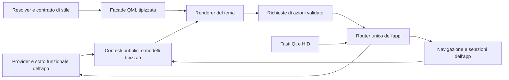

# Theme Engine — analisi operativa A0 / A1

**Revisione 1.1 · 4 ottobre 2026 · Europe/Rome**

**Stato: A0.1/A0.2 implementati; A0.3/A0.4 e A1 aperti.** La prima consegna è nel [resoconto dei contratti](theme-engine-a0-contracts-report.md). I [contratti canonici](../theme-api/README.md) sostituiscono le proposte archiviate come riferimento per superfici, contesti, azioni e ruoli. Il modulo QML pubblico, il broker e gli host nuovi rimangono A1; il bundle autonomo rimane A2. Le sezioni seguenti conservano baseline e sequenza dell'analisi approvata; le prove successive sono nel resoconto.

## 1. Baseline e problemi effettivi

Audit del checkout `16a92649e3f2e2923a3d5fd84babd13c9f6af689`, branch `codex/v0.6.6-theme-engine`. Tutti i **183 file** del manifest B0 salvato, commit di distribuzione `a7fd705ca0078e02c38f1b18c94b3a42ee342955`, hanno ancora lo stesso SHA nel workspace. Questo confronto non è una nuova verifica dei file sulla board. [Inventario e hash](evidence/theme-a0-a1-analysis-2026-10-04/source-audit.json).

Il profilo del destinatario è stato riacquisito con il comando B0 `profile --board`: **Qt 6.8.2, PySide6 6.8.2.1, aarch64, 960×640, 83 famiglie font**. È un probe separato **offscreen**, acquisito il 4 ottobre, non un collaudo EGLFS né una certificazione di memoria/CPU. Percorsi e registri provengono dal contesto del servizio. [Profilo](evidence/theme-a0-a1-analysis-2026-10-04/board-profile.json). Le prove EGLFS pregresse restano nel resoconto B0; non sono state ripetute qui.

| Riscontro nel codice | Conseguenza per A0/A1 |
| --- | --- |
| 69 QML; 17 presentazioni nel registro principale, su 14 content ID: 8 pagine + 6 Avvisi | Conservare questi ID. Le estensioni hanno un registro separato; il numero di presentazioni non misura la copertura dell'app |
| `PresentationContext.qml` espone `controller`, un `model` aggregato e `selection` dinamici; i wrapper pagina assegnano `dashboard: context.controller` | Un autore deve conoscere `Main.qml`. Occorre un vero contratto pagina 2 e un adattatore privato per le viste 1 |
| 30 route overlay, incluse 11 sezioni in `SettingsPanel`; due route sono già Avvisi | I 28 overlay restanti, la shell e la scena vanno censiti. Migrare solo Home non chiude A1 |
| `Main.qml` possiede navigazione, stack, indici, tab, selezioni, preview e scroll Avvisi | Lo stato sopravvive al renderer. Separare proprietà/azioni da grafica senza cambiarne il proprietario durante uno swap |
| `NotificationContext1` non espone Main, ma ha input scrivibili e `actionHandler` | Conservare il contratto visuale 1; il nuovo oggetto pubblico deve nascondere callback e ingressi dell'host |
| `SemanticStyle` ha tre colori fissi; accento notifiche condiviso da guide, badge, bordi e icone | G21 richiede ruoli distinti e controlli sulle superfici realmente usate |
| `weather.normalize_response()` conserva molte misure solo come stringhe arrotondate | Una visualizzazione alternativa non può ottenere i numeri originali dalla sola facade. Estendere lo snapshot senza cambiare chiamate o polling |
| `ViewHost.prepare()` confronta solo il presentation ID; i file sono relativi all'app | Preparare un'identità del renderer che includa revisione e origine. Gli URL del bundle saranno risolti in A2 |
| Il renderer scena riceve `ActorState` con proprietà scrivibili | Pubblicare una vista in sola lettura; l'attore resta dell'app anche quando cambia il suo aspetto |
| Il fingerprint B0 deriva da registri e token | Non identifica ancora il contratto di dati, azioni e superfici. A0 deve aggiungere un fingerprint API distinto |

L'inventario nasce da estrazione di registri, route letterali, confronti e `SettingsPanel.targets`, con revisione delle route dinamiche. Non è un parser QML generale: il gate A0 aggiungerà una verifica che rilevi nuove superfici/route senza una voce di contratto.

## 2. Decisioni tecniche da usare nello sviluppo

1. **Conservare Python/PySide6 + Qt Quick/QML.** Resolver, dati, persistenza e validazione in Python; composizione e tween in Qt Quick. Nessun nuovo aggiornamento Python per frame. Un eventuale pezzo C++ nasce da un profilo che dimostra un limite, non dall'esistenza di dizionari nel bridge.
2. **Modulo pubblico `SmartPC.ThemeApi 2.0`.** Un autore importa questo modulo e riceve un contesto tipizzato, senza import relativi alla dashboard. Il modulo è distribuito dall'app. I temi non lo sostituiscono.
3. **Stato UI e router privati all'app.** Prima adattare Main; poi estrarre `NavigationState.qml` e `UiRouter.qml` privati, conservando comportamenti e proprietà di compatibilità. Non è necessario spostare tutta la navigazione in Python per ottenere API pubbliche.
4. **Contesti Python in sola lettura, style QML tipizzato.** DTO e liste vengono aggiornati dai segnali dei servizi; colori, metriche e font hanno proprietà QML `color/int/real/string/bool`, come la facade già presente. Il resolver non viene interrogato nel disegno di ogni elemento.
5. **Modelli di dominio completi oltre alle righe comuni.** Il tema può costruire quadranti, timeline, schede, tabelle e rappresentazioni animate dei valori disponibili. Non deve ricostruire punteggi o temperature dal testo dell'interfaccia.
6. **Copertura esplicita di 44 superfici logiche.** Sono 43 superfici pagina/shell/overlay/Avvisi e una superficie scena, gestita dal suo registry. Per ciascuna: renderer proprio o fallback Base dichiarato. Questo non significa 44 Loader residenti né 44 renderer obbligatori per ogni tema.
7. **Compatibilità a due livelli.** Le pagine API 1 continuano attraverso adapter privati; i nuovi renderer usano PageContext 2. Il contratto visuale NotificationContext 1 resta compatibile, con metadati opzionali e ingressi privati separati.
8. **Personalizzazione profonda con vincoli funzionali.** L'autore decide geometria, layout, font, palette, immagini, icone e motion. Priorità, lettura degli eventi, timer, azioni dei provider, recovery e nove tasti sono dell'app. Budget fisici e policy Off/Ridotto restano verificabili.

La tipizzazione riduce accessi dinamici e rende più verificabile il codice. Un binding viene rivalutato quando cambiano le dipendenze: non è corretto assumere centinaia di lookup a 60 Hz per colori statici. La facade non garantisce overhead zero o compilazione AOT di ogni binding. Misurare entrambe le situazioni. [Qt 6.8: prestazioni QML](https://doc.qt.io/qt-6.8/qtquick-performance.html).

Questo è il flusso funzionale proposto, non una barriera di sicurezza QML: i renderer ricevono dati e chiedono azioni, mentre l'app possiede gli effetti e lo stato persistente.

## 3. A0 — contratti, copertura e baseline riproducibile

### A0.1 Inventario pubblico e matrice di migrazione

La [proposta leggibile dalle macchine](evidence/theme-a0-a1-analysis-2026-10-04/surface-contract-proposal.json) associa ogni superficie a route, contesto, file attuale e varianti. **È un progetto, non un registry caricabile dal runtime.** I nomi nuovi sono ora censiti nel contratto canonico A0, con controllo di copertura e requisiti di fixture; la loro esecuzione runtime rimane A0.4. La bozza API contiene anche la mappa di responsabilità di tutti i gap G01–G21: il lavoro A0/A1 non chiude automaticamente quelli assegnati a bundle, lifecycle e kit completo.

| Gruppo | Content ID / nuove superfici proposte | Varianti da coprire |
| --- | --- | --- |
| Pagine già ospitate, 8 | `home.now`, `home.day`, `weather.now`, `weather.forecast`, `account.usage`, `sport.overview`, `sport.team`, `racing.overview` | Home con/senza prossimo evento; Sport prossime/live/risultati/classifica/squadra; F1/MotoGP e disponibilità dinamica; account con dati assenti e più finestre |
| Avvisi già ospitati, 6 | `alerts.banner.small`, `alerts.banner.large`, `alerts.urgent`, `alerts.badge`, `alerts.inbox`, `alerts.detail` | Meteo/account/sport/fonte generica; selezione, scadenza, testi lunghi, preview, stato fonte |
| Shell, 1 | `shell.main` | Header, posizione nel carosello, guide, separatori, stato ordinario/overlay/notte; rettangoli host negoziati |
| Overlay generali e Info, 4 | `overlay.menu`, `overlay.commands`, `overlay.summary`, `device.info` | Comandi al primo avvio; riepilogo Oggi/Meteo; Info dispositivo/risorse/rete/fonti |
| SettingsPanel, 11 | `settings.index`, `settings.appearance`, `settings.appearance.notifications`, `settings.display`, `settings.modules`, `settings.notifications`, `settings.notifications.quiet`, `settings.notifications.categories`, `settings.account`, `settings.integrations`, `settings.sources` | Righe disabilitate, bozza/errori/salvataggio, sezioni condizionali, fascia silenzio, refresh con cooldown |
| Sport e impostazioni, 6 | `sport.fixtures`, `sport.standings`, `sport.match.detail`, `sport.team.detail`, `sport.team.picker`, `settings.sport` | Turni, statistiche, formazioni, Fantacalcio, percorso squadra, schede squadra, filtro Serie A, voti provvisori/storici, nessuna preferita |
| Motorsport e impostazioni, 7 | `racing.calendar`, `racing.event.detail`, `racing.session.detail`, `racing.standings`, `racing.live`, `racing.driver.detail`, `settings.racing` | F1/MotoGP; sessioni/circuito/riepilogo; risultati; piloti/costruttori; tempi/pista/direzione; soste/giri/gomme quando disponibili |
| Scena, 1 | `scene.main` | Actor/canvas, nessuna scena, sospensione, ingombri Avvisi, identità persistente |

Le varianti di una superficie condividono il contratto, non necessariamente la stessa composizione. Un renderer può ramificare per `kind`/tab o usare componenti interni; il manifest futuro dichiara le capacità richieste. `racing.overview` non si sdoppia per sport; `device.info` non si sdoppia per tab. La copertura di quei casi viene comunque verificata.

`inputOwner`, recovery, fallback urgente indipendente, diagnostica e devPanel restano superfici protette dell'app. La diagnostica può seguire lo stile sicuro, ma non è una superficie che il tema deve sostituire. Comandi e menu possono cambiare aspetto senza nascondere vie di uscita e recupero.

**Output A0.1:** contratto canonico `theme-api/surfaces.json`, tabella route→content ID, famiglie di contesti, manifest della baseline e controllo di mancata copertura. Una nuova route non censita deve far fallire il controllo, non sparire dietro il fallback generico.

### A0.2 Contratto unico, versione e capacità

Sono implementati in `dashboard/theme-api/` i contratti canonici `surfaces.json`, `contexts.json`, `actions.json`, `semantic-roles.json`; sono input comuni per runtime, documentazione, lint e kit AI. Non copiare quattro schemi diversi da mantenere manualmente. La [bozza API](evidence/theme-a0-a1-analysis-2026-10-04/api-contract-proposal.json) descrive struttura e responsabilità; i DTO sono ora canonici; i requisiti delle fixture sono generati, la prova runtime rimane A0.4.

- Il major **2** del modulo non è `schemaVersion: 2` del pacchetto. Versione manifest, versione contesto, versione modulo e versione del software sono campi separati.
- `PageContext2` indica il contratto pagina; il tipo importato si chiama `PageContext`. Analogamente il modulo 2 può esportare un tipo `NotificationContext` che conserva il contratto visuale 1.
- Aggiunte opzionali e nuove capacità sono compatibili; rimozione, cambiamento di significato o tipo richiedono major/adapter. Il renderer dichiara capacità necessarie, non deduce tutto dal numero di versione.
- Generare `apiFingerprint` dai contratti canonici, ordinati e senza timestamp/percorsi macchina; mantenere `registryFingerprint` B0 separato. `apiFingerprint` attesta il contenuto, mentre compatibilità usa versioni e capacità: non rifiutare un minor compatibile solo perché cambia l'hash.
- Dichiarare fallback per ciascuna superficie e motivi di indisponibilità. Le capacità runtime includono import QML, backend e decoder risorse; il profilo schema 1 attuale non le certifica tutte.
- Conservare i vecchi profili/kit B0. Il profilo API 2 avrà versione propria e lettura esplicita dei campi; nessun riuso silenzioso di un profilo 1 come certificazione del nuovo ABI.

### A0.3 Profilo e tracing del cambio tema

Il residuo pregresso senza nuovi font è **155,921 ms p95 richiesta→frame**, contro l'obiettivo 150 ms; non è stato chiuso dal collaudo B0. [Misura originale](theme-engine-notification-migration-report.md). In `verify_notifications_board.py`, il frame viene associato al tema atteso e all'assenza del candidato; non contiene ancora un acknowledgement esplicito della revisione disegnata da ogni host. Prima di ottimizzare, precisare la misura senza cancellare quella precedente.

Registrare una transazione di cambio con `requestId`, generation, revisione, renderer identity e timestamp monotoni, in un buffer limitato:

| Timestamp / span | Punto da strumentare | Cosa chiarisce |
| --- | --- | --- |
| Richiesta | Router/editor prima di `selectDraft` | Inizio della latenza completa; HID/Qt distinguibile da richiesta programmatica |
| Resolver/cache/validazione | `ThemeService._resolve`, `ThemeCatalog.resolve` | Tempo Python, cache hit/miss, costo contrasto |
| Font e risorse | `FontRegistry.acquire`, preparazione asset | Registrazione distinta da primo glifo/decodifica |
| Prepare di ciascun host | `ViewHost` / `NotificationHost`, futuri shell/overlay | Identity invariata, Loader, errore, timeout o generation scartata |
| Ready e commit | `reportCandidate`, pubblicazione, commit host | Se attese seriali o incoerenze prolungano la transazione |
| Prima revisione mostrata | Host visibili + `frameSwapped` della finestra | Il frame include la revisione attesa; non basta l'ID del tema |
| Fine movimento | Recipe completata/settled | Distingue primo frame coerente da animazione terminata |

L'urgente pre-riscaldato deve risultare pronto prima di Apply; gli slot nascosti non possono promettere un frame visibile. Verificare il loro commit separatamente. Il cambio completo misura primo frame coerente delle superfici effettivamente visibili più commit delle dipendenze obbligatorie; la fine del tween è un'altra metrica. Non chiamare una preparazione sincrona «cambio completo».

Conservare fixture, successione di temi, eventi e intervalli della misura precedente; aggiungere profili cold/warm e registrare count, timeout, frame non osservati, max, p95 e overhead del tracing. Nessun frame mancante viene eliminato per far passare il budget. Niente polling Python veloce o animazioni diagnostiche che producano artificialmente i frame della misura. `frameSwapped` è un riferimento del processo, non una misura ottica o GPU diretta.

Il profilo A0 annoterà hardware, backend EGLFS effettivo, build/Qt, scaling e geometria, import disponibili, font, decoder, theme/API identity e ambiente di prova. CPU idle, RSS/PSS e font/cache dopo warmup restano confronti a carico uguale. Non si sommano PSS e «VRAM» ipotetica.

**Gate A0.3:** baseline riproducibile e trace interpretabile, residuo 150 ms documentato con ipotesi verificabili. La chiusura numerica richiede la prova board successiva; A0 non si blocca inventando un PASS né aumentando automaticamente la soglia.

### A0.4 Fixture e invarianti

Costruire fixture JSON di dominio, separate da QSettings/DB/provider reali, per tutte le varianti censite. Ogni scenario definisce stato iniziale, azioni, stato finale e ciò che lo swap deve conservare: ID selezionato, tab, scroll/anchor, stack, draft, evento/revisione, deadline, righe SQLite e ActorState.

Valori obbligatori: `0`, `false`, `null`, lista vuota, dato mancante, `active/updating/stale/offline/error/unavailable`, fonte assente, refresh parziale o scaduto, ID rimosso. Usare contatori/spie per select/refetch/mark-read/dismiss, non solo screenshot. Gli esempi UX e i cinque concept aiutano lo stress visuale; non diventano un elenco chiuso di layout autorizzati.

## 4. A1 — API pubblica e normalizzazione dei dati

### 4.1 Modulo importabile e tooling

Distribuire `dashboard/qml/SmartPC/ThemeApi/qmldir` e componenti pubblici, con `engine.addImportPath(.../qml)` attraverso un unico bootstrap usato da app, preview e harness. Un modulo identificato richiede URI e percorso corrispondenti nell'import path. [Qt 6.8: moduli identificati](https://doc.qt.io/qt-6.8/qtqml-modules-identifiedmodules.html).

Registrare con PySide i DTO/contesti posseduti dall'app come tipi non costruibili dall'autore. Generare la descrizione `.qmltypes` e verificare che corrisponda alle proprietà/slot del metaobject, oltre al contratto JSON. Esportare i componenti QML riutilizzabili attraverso `qmldir`; non esporre `DashboardState`, `ThemeService` o i provider. Il prototipo iniziale prova esattamente questa combinazione su PySide6 6.8.2.1, prima di migrare 44 superfici. [Qt for Python: registrazione dei tipi](https://doc.qt.io/qtforpython-6/PySide6/QtQml/QtQml_globals.html#PySide6.QtQml.qmlRegisterUncreatableType).

Un renderer di fixture, collocato fuori dall'albero dell'app, deve funzionare usando soltanto `import QtQuick` e `import SmartPC.ThemeApi 2.0`. Il lint viene invocato con import path/typeinfo corretti; una proprietà inesistente deve produrre un errore verificato. Le role di un modello Qt non diventano tutte staticamente inferibili grazie alla sola `.qmltypes`: fixture e controllo del contratto restano necessari. [Qt 6.8: qmllint](https://doc.qt.io/qt-6.8/qtqml-tooling-qmllint.html).

I nomi dei file Python nuovi proposti sono `theme_contexts.py` per QObject pubblici, `theme_models.py` per modelli/diff e `theme_api.py` per registrazione/broker. I normalizzatori specifici di dominio possono essere separati man mano che crescono. Evitare un nuovo file monolitico equivalente a Main.

### 4.2 Oggetti e stato comune

Tutti i contesti pubblici hanno proprietà in sola lettura e notifiche per variazioni effettive. Il framework modifica gli ingressi tramite oggetti privati; non passa un callback scrivibile nel contesto.

| Contratto | Campi comuni / responsabilità |
| --- | --- |
| `SurfaceContext` | `contentId`, `contextVersion`, `surfaceInstanceId`, `appearanceRevision`, `dataRevision`, stile tipizzato, stato lifecycle, viewport/safeArea, comandi e azioni disponibili |
| `PageContext` 2 | DTO pertinenti della pagina, clock/date/localizzazione, selezione/tab/anchor e stato delle fonti; niente `controller` o `model` universale con servizi |
| `ShellContext` 1 | Famiglie e viste disponibili, corrente, posizione, guide, stato UI e layout consentito; nessuna selezione arbitraria di un provider |
| Contesti overlay 1 | Menu/comandi/riepilogo, liste e DTO Sport/Team/Racing, selezione e tab con ID stabili |
| `SettingsContext` 1 | Righe con ID, tipo controllo, valore/tipo/unità/range/opzioni, enabled/reason, azione consentita, draft e risultato salvataggio |
| `InfoContext` 1 | Tab e dati read-only, freshness e fonte; nessuna preferenza mutabile spacciata per Info |
| `NotificationContext` 1 | Campi visuali attuali e `requestAction` compatibile; event/items, source metadata, safeArea e revisioni attraverso adapter pubblico |
| `SceneContext` 1 | Stato attore read-only, scene configuration dichiarata, clock/policy/ingombri/notifica normalizzata; nessun accesso alla consegna degli eventi |

Per NotificationContext1 conservare tipo e significato di `event`, `items`, `actions` e `commandHints`: mappe/liste snapshot legacy, aggiornate a variazioni discrete. Aggiungere `eventData`, `itemModel` e `commands` tipizzati come campi opzionali, senza sostituire una lista su cui un renderer esistente chiama `slice()` con un QAbstractListModel. `sourceMetadata` non disponibile significa fonte sconosciuta/in attesa; non eredita automaticamente lo stato globale del bollettino meteo.

Lifecycle comune: `preparing`, `active`, `suspended`, `exiting`, `disposed`; `interactive` e `preview` sono distinti da `active`. Un candidato può preparare risorse ma non inviare azioni. Ogni callback appartiene a `surfaceInstanceId`/generation; un oggetto distrutto o sostituito perde l'autorizzazione operativa.

L'app conserva gli oggetti di stato e i modelli, mentre il renderer conserva tween, hover e altri dettagli decorativi. Una nuova composizione può misurare il proprio scroll, ma la selezione logica e l'anchor per ID sono dell'app. Un cambio di densità ricalcola offset/indice a partire dall'ID; non riapre il dettaglio e non lo riseleziona nel provider. Lo scroll normalizzato viene adattato allo spazio disponibile, con clamping e segnalazione esplicita di un anchor non più esistente.

### 4.3 Modelli di dominio: evitare una personalizzazione limitata ai testi

Un DTO di fonte espone `status`, `sourceId`, `sourceLabel`, `updatedAt`, `checkedAt`, `hasData`, `isStale`, `errorCode`/testo. `updating` con dati vecchi resta diverso da fresco. Un valore misurabile espone numero, unità, disponibilità e testo già formattato; il valore è significativo solo con `available=true`. Zero e false sono valori validi. Date/timestamp mantengono unità dichiarata; l'epoch non viene trattato come stringa locale da parsare.

| Dominio | Informazioni strutturate minime da esporre |
| --- | --- |
| Home/eventi prossimi | Orologio e data, evento opzionale con ID/inizio/fonte/categoria, meteo, riepiloghi realmente disponibili; assenza evento non riserva una scheda vuota |
| Meteo | Codice WMO, temperatura/percepita, umidità, precipitazione/probabilità, velocità/direzione/raffiche, timestamp; forecast con data/codice/max/min/probabilità |
| Account | Finestre con ID/label, consumo numerico, durata e reset; crediti con disponibilità; soglie e severity calcolate dall'app |
| Sport | ID canonici competizione/partita/team, stato, kickoff, punteggi e loro disponibilità; classifica, eventi, statistiche e formazioni con ID/valori/unità |
| Squadra | Identità, calendario/scope, risultati, dati club/organico; nessuna squadra scelta distinta dall'effettiva preferenza |
| Fantacalcio | Partita/team/player ID, posizione/ruolo, voto e stato provvisorio/storico, bonus/malus e totali disponibili, source revision/notice; niente zero per voto non pubblicato |
| Racing | Kind F1/MotoGP, calendario/evento/sessione/driver, classifiche, tempi/delta/giri/gomme/soste, race control, live validity; ogni campo assente rimane assente |
| Dispositivo | Dati osservabili e loro aggiornamento, unità quando già disponibili; testo fallback per dati OS non normalizzati, senza parsing fragile delle stringhe di sistema |
| Avvisi | ID/revisione/rank, categoria/severity, titolo/corpo, issued/expires, fonte, disponibilità, stato lettura; stato della singola fonte e non lo stato meteo globale |

Per il meteo aggiungere campi numerici **dalla stessa risposta Open-Meteo già acquisita**, conservando gli attuali testi e formato cache compatibile. La cache precedente resta utile offline: testo disponibile, nuovo numero indisponibile fino a una risposta valida. Non ricavare precisione falsa da `"23°"` né scartare la cache per costringere una richiesta. Anche la fixture demo deve distinguere ciò che ha numero da ciò che ha soltanto testo. Questa è una modifica allo snapshot, non a endpoint, budget o frequenza di polling.

Usare DTO tipizzati per valori singoli e `QAbstractListModel` per collezioni lunghe, con role dichiarate nei contratti e delegate con proprietà tipizzate. Aggiornare per ID e campi variati, senza `modelReset` sistematico che perda selezione/scroll. Le strutture opzionali possono essere snapshot JSON limitati per metadati non intensivi; i campi usati di frequente non dipendono da grandi dizionari ricopiati a ogni frame. [Qt 6.8: QAbstractListModel](https://doc.qt.io/qt-6.8/qabstractlistmodel.html).

Prima di congelare ogni DTO confrontare tutti i campi letti dalla vista corrente con il contratto e le fixture. Nessun grafico aggiunge dati che il provider non fornisce: storia, minuti di gara o stime nuove richiederanno una capacità futura. L'estensione del modello non impone uno stile grafico.

### 4.4 Azioni pubbliche e router unico

Nuova forma comune proposta: `requestAction(actionId, targetId, arguments)` con esito strutturato `accepted`, `requestId`, `status`, `errorCode`; completamento separato osservabile per operazioni asincrone. `arguments.requestId` è metadata opzionale: se assente lo genera il broker; se presente resta vincolato alla stessa istanza/generation. L'accettazione di refresh o save non significa dato aggiornato o preferenza salvata. Conservare firma e ritorno booleano NotificationContext1 attraverso il suo adapter; la nuova forma strutturata è una capacità aggiuntiva, non una modifica del metodo legacy.

| Famiglia | Azioni proposte | Controlli del proprietario |
| --- | --- | --- |
| Navigazione | `navigation.home`, `navigation.back`, `navigation.menu`, `navigation.inbox`, `navigation.family.step`, `navigation.view.step` | Priorità urgente/preview e disponibilità famiglie, stesso percorso dei nove tasti |
| Liste/tab/dettagli | `selection.move`, `selection.select`, `tabs.select`, `details.open`, `details.scroll`, `details.refresh` | ID presente, tab disponibile, superficie interattiva, limiti/cooldown; differenza fra evidenziare e aprire |
| Impostazioni | `settings.activate`, `settings.adjust` | Row ID e tipo controllo autorizzati; range/opzioni/disabled derivano dall'app, non dal tema |
| Fonti | `sources.refresh` | Fonte conosciuta, 30 secondi/cooldown e autorizzazione corrente; eventuale stato offline resta esplicito |
| Aspetto | `appearance.preview`, `appearance.apply`, `appearance.cancel`, `appearance.reset`, `appearance.reload`, `appearance.import`, `appearance.export`, `appearance.notificationPreview` | Draft/status/ready; nessun percorso file o script libero. Import/export mantiene selezione gestita dall'app |
| Avvisi | `openInbox`, `selectEvent`, `moveSelection`, `openDetails`, `scrollDetails`, `dismiss`, `back`, `home` | Allowlist per modalità già esistente, event ID/revisione/rank, urgenza, preview senza azioni |

`settings.adjust` usa ID semantici come `display.manualBrightness`, `notifications.quietStart`, `account.warningThreshold`, `sport.favouriteTeam`, `racing.f1.season`. Gli indici `adjust*Setting(row, direction)` sono dettagli dell'adapter privato. In Aspetto, ogni riga corrente ha un proprio ID, incluse le regolazioni Avvisi: A1 non elimina l'editor esistente; la semplificazione dei controlli arriva in A5.

Il broker pubblico verifica istanza/revisione/azione/argomenti e inoltra al router privato. Il router valida nuovamente la situazione corrente e applica gli stessi effetti dei tasti fisici, tramite DashboardState/ThemeService. Le azioni dei renderer e Qt/HID convergono nello stesso dispatch; non creare un secondo percorso che bypassi urgente, cooldown o draft. Richieste duplicate con lo stesso request ID non ripetono effetti.

I comandi/guide sono modelli dell'app con `key`, `actionId`, label e enabled. Il tema ne sceglie presentazione e collocazione; non inventa che il tasto 1 salva o che il 7 legge un evento. `markEventSeen`, `markBannerPresented`, deduplica e timer non sono azioni generiche esposte al tema. L'ack del banner proviene dall'host dopo un frame realmente presentato.

Le proprietà read-only e la validazione proteggono il contratto dalle scritture accidentali. **QML eseguibile resta codice fidato, non una sandbox:** un renderer può tentare introspezione dei parent/import arbitrari. Nessuna promessa di isolamento da aggiungere ad A1; lint, policy bundle e recovery hanno compiti distinti.

## 5. A1 — host, layout, focus e compatibilità

### 5.1 Shell e overlay sostituibili

La shell visuale diventa `ShellHost` persistente, con fallback compilato/distribuito Base. L'app conserva finestra, inputOwner, priorità/z-order, brightness mask, recovery e overlay urgente indipendente. Un unico `OverlayHost` attivo risolve le 28 route non Avvisi; inbox/detail continuano nei loro due host notifiche. Può condividere l'infrastruttura di staging di ViewHost, senza copiare un secondo protocollo generation/ready/commit.

Il nuovo `ShellLayout` dichiara header, content, guide e scene safe regions in coordinate viewport. L'app valida rettangoli finiti, positivi, interni, aree protette e spazio per informazioni obbligatorie. Layout invalido mantiene precedente/Base; non accettare coordinate fuori schermo. Le coordinate 44/90/872×455 diventano **default Base**, non una limitazione di ogni tema.

La compatibilità geometrica appartiene anche al renderer: i visuali legacy hanno molte coordinate assolute. Dichiarare nel descrittore `layoutCapabilities` con viewport fissa o requisiti minimi/adattivi e verificarla prima del commit. Una shell con slot più piccolo non rende automaticamente responsive una pagina legacy: usare una combinazione compatibile oppure rifiutare la bozza con diagnosi e conservare la precedente. Non ridimensionare silenziosamente testi/tasti né ritagliare dati. Durante la migrazione, la shell Base mantiene lo slot legacy; la prova di layout libero usa renderer pubblici che rispondono realmente al viewport.

Per transizioni fra shell diverse preparare geometria e renderer sulle dimensioni candidate, quindi commettere la coppia nella stessa transazione. Il vecchio visuale non riceve anticipatamente la geometria nuova. La validazione di collisioni usa ingombri e livelli consentiti; `occupiedRegions` del renderer è un contributo verificato dall'host, non un modo per disabilitare il fallback urgente.

Un cambiamento di layout coinvolge shell, pagina/overlay visibile, sei slot Avvisi preparati e scena se abilitata. Inattivi: modello vuoto o sospeso, niente animazioni/worker di aggiornamento. Non pre-riscaldare tutti i dettagli e tutte le varianti font. La readiness distingue component loaded, risorse obbligatorie pronte e geometria accettata.

### 5.2 Identity, ciclo di swap e recupero

Definire da A1 `RendererRef` con origine app/bundle, ID, context API, file/reference e revisione. Per le risorse app A1 usa identificatori canonici e fingerprint; A2 aggiunge directory immutabile e digest del bundle. Cache e fast path confrontano l'intera identity, non il solo presentation ID. Preparare interfaccia comune di risoluzione per ViewHost, MotionController, AppIcon e SceneHost; il packaging/storage di ResourceRef resta A2.

Sequenza: snapshot candidato → contesti non interattivi → staging risorse/Loader → ready di tutte le dipendenze → pubblicazione/commit atomico → vecchi contesti invalidati → settle/destroy → frame acknowledgement → rilascio riferimenti. Cancel e failure invalidano generation; una callback tardiva non cambia tema o focus. Con timeout mantenere corrente/Base e diagnosi specifica della superficie. Non usare `clearComponentCache()` globale con oggetti vivi per simulare nuove revisioni. [Qt 6.8: cache dell'engine](https://doc.qt.io/qt-6.8/qqmlengine.html#clearComponentCache).

La scena oggi non partecipa allo stesso preflight completo dei candidati pagina/Avvisi: A1 deve includerla quando abilitata, con ready/error del renderer e adapter read-only di ActorState. L'attore app-owned non viene ricreato dal Loader. Nessuna scelta di sprite, rig, vector animation o cane definitivo è richiesta ora.

### 5.3 Adattatori legacy e focus

`LegacyPageAdapter` conserva `PresentationContext1.controller` soltanto nell'area privata per i wrapper vecchi. Il renderer 2 riceve solo il contesto 2. Non aggiungere un `legacyController` pubblico «temporaneo», che diventerebbe la dipendenza dei temi generati.

Per shell/overlay introdurre renderer Base 1 che avvolgono i componenti esistenti, con adapter privati per `dashboard`; migrare poi i loro corpi a contesti pubblici. L'adapter costruisce righe con ID, traduce index→ID e inoltra gli effetti al router. Le regole `home`/`back`, reset e ri-selezione provider attualmente necessarie restano azioni deliberate dell'utente: lo swap non le esegue.

Il focus resta nel `inputOwner` protetto. Dopo commit/failure/urgent/cancel ripristinare esplicitamente quell'owner se necessario; **non** chiamare indiscriminatamente `loader.item.forceActiveFocus()`, che consegnerebbe la tastiera al renderer. Qt documenta Loader come focus scope: il ripristino va coerentemente testato con la scelta dell'app di centralizzare l'input. [Qt 6.8: Loader e focus](https://doc.qt.io/qt-6.8/qml-qtquick-loader.html#focus-and-key-events).

Conservare objectName degli 8 host pagina e dei 6 Avvisi. Nuovi `shellHost`/`overlayHost` espongono `contentId`, `currentItem`, `readiness`, identity/revision e lastError. Gli harness attendono readiness, poi verificano dati/azioni del contratto; riacquisiscono currentItem dopo ogni cambio. Gli assert sui figli Base restano nelle prove Base/adapter, non sono obblighi imposti ai temi alternativi.

## 6. A1 / G21 — ruoli semantici e palette chiare

### 6.1 Distinguere significato, foreground e decorazione

Conservare significato delle severità, informazioni testuali e priorità. L'app calcola `severity`/source status; il tema sceglie una resa accessibile del ruolo. La tinta del bordo può differire dal colore del testo. Non imporre il medesimo rosso fisso a tutte le superfici.

| Ruolo proposto | Uso e controllo |
| --- | --- |
| `accentDecoration` | Barre e dettagli decorativi; non usato automaticamente come testo |
| `accentText` per canvas/overlay/card/focused | Titoli, valori selezionati, comandi; rapporto ≥4,5 sulla superficie effettiva |
| `focusIndicator` | Contorno della selezione; ≥3 rispetto alle superfici adiacenti pertinenti; distinto dal testo selezionato |
| `warningText`, `criticalText`, `accountCriticalText` per superficie | Stato fonte/soglie/recovery; ≥4,5 sulle superfici usate |
| Indicatori semantic warning/critical | Barre/iconografia che comunicano severità; ≥3 sul fondo effettivo, oltre al testo che ne spiega il significato |
| Avvisi `guideColor`, `badgeTextColor` e foreground su focusedSurface | Guide e badge non ereditano automaticamente l'accento decorativo. Titolo/corpo/fonte selezionati devono restare leggibili |

I nomi esatti dei token vengono generati dal contratto A0. Una `SemanticPalette` tipizzata espone combinazioni per superfici nominate, ad esempio `warningOnCanvas` / `warningOnCard`; NotificationStyle espone quelle della propria modalità. Le viste devono usare lo stile del loro contesto, compreso lo snapshot candidato/congelato, non un singleton globale che segue un altro tema durante l'uscita.

Il contratto colori include un **grafo degli usi foreground→background**, soglia e ruolo testuale/non testuale. Checker B0, resolver runtime, doctor e kit lo condividono. Eliminare gradualmente la mappa manuale `usage` in `theme_authoring.py` dopo equivalenza e prove delle coppie reali. Validare entrambi i variant, superfici focused e tutti i sei modi Avvisi; un contrasto valido solo contro `colors.background` è insufficiente.

### 6.2 Ereditarietà e migrazione senza sorprese

Le palette day/night e l'ereditarietà attuali restano esplicite: l'eredità della palette notte Base può prevalere sui token globali del figlio. Documentare origine di ogni nuovo ruolo e provarla, evitando correzioni che appaiano solo nella variante testata.

Per temi schema 1, l'adapter propone i nuovi foreground a partire dai colori legacy quando superano la coppia richiesta; altrimenti deriva ruoli accessibili secondo la policy di compatibilità e **riporta** derivazione/contrasto/origine. Conserva gli accenti decorativi e gli override originali. Non riscrive il JSON o le preferenze in silenzio. Il salvataggio mantiene gli override legacy; il lifecycle della migrazione permanente sarà A3/A5.

Per il nuovo profilo completo i ruoli definiti dall'autore vengono verificati e, se invalidi, rifiutati con suggerimenti da rivalidare. Una correzione su una sola coppia non prova la validità del tema. Le viste Base scure conservano l'aspetto dove già conforme; se un uso testuale precedente non lo era, la correzione necessaria viene registrata e verificata visivamente.

Generare anche fallback QML e typeinfo dallo stesso contratto. Il generatore attuale aggiorna schema e `FallbackAppearance.js`, **non** tutte le facade: A1 deve estenderlo con metadata `qmlName/type/usage` evitando collisioni. Le estensioni hanno facade tipizzate locali, non proprietà globali iniettate per ogni tema.

I token font vanno selezionati dal descrittore tipo/uso, non soltanto dal suffisso `Family`: oggi il suffisso funziona col contratto presente, ma una futura estensione potrebbe dichiarare un altro tipo con lo stesso suffisso. Non caricare font aggiuntivi per questo blocco; il test contrasto chiaro può usare DejaVu già disponibile.

**Gate T21 per A1:** fixture chiara e scura, Day/Night, Off/Ridotto/Normale, account warning/critical, fonte stale/offline/error, tutti i modi Avvisi, selezione focused e urgente Base indipendente. Test numerici delle coppie + screenshot + leggibilità sul pannello. Non abilitare il profilo chiaro come capacità supportata prima di questo gate.

## 7. File e sequenza di implementazione

| Incremento | Interventi previsti | Consegna verificabile |
| --- | --- | --- |
| A0.1 | Inventario→contratti `theme-api/`, route map e fixture manifest | 44 superfici / 30 route censite; nuovi ID proposti congelati; controllo route non coperta |
| A0.2 | Schemi contesti/azioni/semantic graph e generatore API; estensione profilo distinta da B0 | Versioni/capacità/typeinfo coerenti; nessun campo necessario delle viste correnti dimenticato |
| A0.3 | Trace in ThemeService/host; harness separato o estensione `verify_notifications_board.py` | Misura equivalente precedente + per-host revision ack; cause del residuo dichiarate |
| A0.4 | Fixture isolated e contatori effetti in `theme_test_support.py` / nuovi harness | Invarianti e casi null/zero/false/refresh riproducibili; fine A0 documentata |
| A1.1 | Bootstrap/import path, `theme_api.py`, `theme_contexts.py`, `theme_models.py`, modulo QML pubblico | Prova import/lint fuori app su Qt board; DTO read-only e broker; legacy ancora funzionante |
| A1.2 | Home now + piccola + grande con API pubblica; adapter Notification1 e nuova fonte per evento | Tre renderer diversi senza controller; swap non cambia event flags/deadline, provider, focus o draft |
| A1.3 | ShellHost/OverlayHost, NavigationState/UiRouter privati, menu/comandi/settings/info | Layout alternativo realizzabile; row ID e tasti invariati; tutte le 11 sezioni e tab Info |
| A1.4 | Pagine restanti, Sport/Team/Fantacalcio/Racing, normalizzazione numerica meteo compatibile | Tutti i campi e varianti; selezione per ID; nessun refetch/mark-read causato dal cambio |
| A1.5 | G21, tutti i sei Avvisi e SceneContext, actor read-only, preflight della scena | Coppie semantiche comuni, T21, attore persistente, recovery/fallback immediato |
| A1.6 | Consolidamento identity/lifecycle host, tooling/packaging, regressione e prova board | API 2 e copertura completa consegnate; limiti/prestazioni espliciti; kit schema 1 ancora utilizzabile |

I nomi nuovi sono proposte operative. Riutilizzare il staging esistente e piccoli adapter; evitare la riscrittura contemporanea di Main, eventi e ThemeService. A1.2 è una prova verticale della API, non la dichiarazione di engine completo. La migrazione dei renderer Base può essere per gruppi; gli adapter restano privati e marcati legacy finché necessari.

`scripts/package-dashboard.py` deve includere modulo pubblico, typeinfo e contratti, con hash nel manifest. Aggiornare tutti i launcher/harness al bootstrap comune. Non iniziare ZIP/estrazione/journal/supervisor in A1: sono responsabilità A2/A3, già descritte nella specifica. Import/export schema 1 conserva i propri comandi e validazioni.

Prima di distribuire ogni incremento: controllo repository e hash, regressione locale appropriata, backup del software e stato utente, pacchetto verificato e prova sul runtime Qt della board. Gli incrementi A0 di contratto/tracing non sono un nuovo rilascio di prodotto. Dopo A1.6 aggiornare il resoconto con capacità effettive e residui; la versione finale del percorso bundle verrà decisa nel MasterPlan, non assegnata automaticamente qui.

## 8. Verifiche, rischi e criteri di chiusura

| Verifica | Evidenza richiesta |
| --- | --- |
| Contratto | ID univoci, tutte le route e varianti censite, campi/role/tipi coerenti, nessun API handle privato; generazione ripetibile senza diff |
| API pubblica | Renderer esterno all'app usa solo il modulo; typo intercettato da lint; campo/role errato respinto dalle fixture; assegnazione a proprietà read-only fallisce |
| Dati | Zero/false preservati, numeri meteo senza parsing di testo, cache vecchia offline leggibile, fonti e freshness individuali, refresh parziale non svuota dati completi |
| Router/state | Tracce equivalenti Qt/HID/azioni, stack/tab/ID/anchor/draft conservati; renderer nascosto/candidato/vecchio e argomenti invalidi non producono effetti |
| Host | Ready/error/cancel/timeout/generation, focus protetto, transazione layout+renderer, revision ack e fallback; nessun warning QML |
| Notifiche | Riutilizzare `check_notifications.py`, `check_events.py`, fixture preview/UI B0; tutte le sei modalità, timer/ack/seen/dismiss invariati, urgente durante cambio |
| Domini | `check_dashboard.py`, `check_settings.py`, `check_sport_ui.py`, `check_sport_team_ui.py`, `check_fantacalcio_ui.py`, `check_motorsport_ui.py`; assert Base distinti da contract tests |
| Theme regressioni | `check_theme_core/ui/motion/fonts/icons/persistence/recovery/authoring/authoring_ui.py`; preferenze isolate e compatibilità schema 1 |
| G21 | Grafo contrasto e T21 numerico/visuale sulla board, senza far passare un ruolo testo con la soglia focus |
| Board | Runtime Qt 6.8/EGLFS, 960×640, cold/warm, input, CPU idle/RSS/PSS/plateau, servizio/hash/rollback secondo MasterPlan; PC Qt 6.11 non sostituisce questa prova |

Rischi principali e mitigazioni: ambiguità dei row ID risolta nel contratto prima della migrazione; costo dei DTO controllato con aggiornamenti selettivi e modelli condivisi; doppio dispatch evitato con router unico; ordine commit shell/page verificato nelle fixture; ruoli semantici ereditati controllati in entrambe le varianti; componenti inattivi sospesi; scene e risorse candidate limitate a corrente+nuovo. Non imporre un limite creativo al formato del compagno per risolvere questi costi.

**A0 finito:** inventario e contratti canonici completi, profilo target, fixture, tracing e baseline con residui espliciti. **A1 finito:** tutte le superfici personalizzabili tramite API pubbliche o adapter Base dichiarato, almeno un renderer nuovo per ogni famiglia di contesto, focus/state/provider/eventi invariati, palette chiare abilitate solo dopo T21, risultati PC e board separati. Non basta che il modulo si importi o che Home cambi colore.

La soglia richiesta resta frame ordinario animato p95 ≤20 ms, input→frame p95 ≤100 ms e cambio completo p95 ≤150 ms. Un residuo si riporta con causa e decisione di rilascio; non viene assorbito da un PASS generico. I limiti dei nuovi asset e delle revisioni bundle verranno misurati in A2/A3/A6.

## 9. Preparazione conclusa e confini aperti

**A0.1 → A0.2** sono consegnati; la sequenza prosegue con tracing/fixture A0.3/A0.4 e primo incremento API A1. Le scelte di base, priorità e compatibilità sono definite; non occorre scegliere nuovi font, tutte le palette o le animazioni definitive. La prima prova conserva la grafica attuale e aggiunge renderer fixture alternativi per dimostrare layout e dati pubblici.

[Controlli della preparazione](evidence/theme-a0-a1-analysis-2026-10-04/analysis-review.json): JSON validi, ID/route/contesti e mappa G01–G21 coerenti, file e link relativi presenti, hash del runtime invariati. Sono controlli dell'analisi, distinti dalle prove API/EGLFS/T21 ancora da eseguire.

Restano deliverable di sviluppo, non dubbi estetici demandati all'utente: schemi completi dei DTO e row ID, prova PySide registration/typeinfo su Qt 6.8, trace per-host e misura del residuo, implementazione/migrazione degli host e T21. A2 porterà gli stessi renderer fuori dal codice dell'app dentro un bundle; A3 il recupero delle revisioni; A4 il kit AI completo; A5 i pochi controlli sul dispositivo; A6 la consegna finale. Questo turno prepara il lavoro e non dichiara quei blocchi già chiusi.
