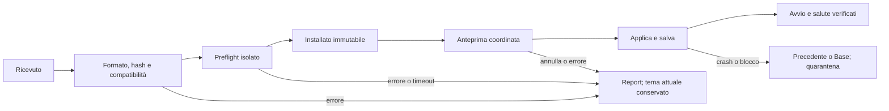

# Theme Engine — creazione tramite AI e temi completi importabili

**Revisione 1.6 · 5 ottobre 2026 · Europe/Rome**

**Stato: A1–A5 implementati; collaudo e consegna A6 in corso.** [Implementazione completa, evidenze e gate residui](theme-engine-a1-a6-implementation-report.md). I capitoli seguenti conservano motivazioni, baseline storica e criteri di accettazione del piano; le descrizioni al futuro non negano le funzioni ora implementate.

Riferimenti: [MasterPlan](release-masterplan.md), [guida del runtime attuale](theme-engine-implementation-guide.md), [contratto notifiche](theme-engine-notification-spec.md), [collaudo notifiche](theme-engine-notification-migration-report.md), [architettura](theme-engine-construction-spec.md), [presentation e compagno](theme-engine-presentation-spec.md), [motion](theme-engine-motion-spec.md), [icone](theme-engine-icon-spec.md), [studio UX](themes-and-ux-analysis.md), [navigazione](ux-navigation-v2.md). [Inventario di questa analisi](evidence/theme-ai-authoring-analysis-2026-10-03/source-audit.json).

**Consegna A0.1/A0.2:** [contratti, tooling e verifiche](theme-engine-a0-contracts-report.md). **A0.3/A0.4:** tracing privato e corpus implementati; [resoconto, collaudo, installazione e gate aperti](theme-engine-a03-a04-implementation-report.md). Il modulo QML pubblico è ora implementato; il vecchio publicApiBinding deferredA1 descrive il solo collaudo storico A0; 108 requisiti presenti non certificano da soli tutti i gate di prodotto.

**Revisione delle integrazioni dell'utente:** tooling ponte, prompt LLM e cinque concept sono inclusi nelle sezioni 11.2–11.4 come attività da implementare. La preparazione concreta, le decisioni di partenza e i confini del primo blocco sono nel [piano esecutivo](theme-engine-ai-execution-plan.md). Il ponte schema 1 anticipa authoring e diagnosi, ma non chiude il requisito del bundle con visuali nuovi.

## 1. Risultato di prodotto e criterio di completamento

Il percorso atteso è **idea → progettazione AI → tema completo verificato → trasferimento → importazione → anteprima → applicazione**. La persona descrive atmosfera e preferenze; l'AI progetta e produce i file. Per aggiungere un tema che usa le capacità pubblicate, non deve essere necessario modificare Main, provider, motore eventi, decoder del tastierino o distribuzione dell'applicazione.

Un nuovo tema deve poter cambiare profondamente impaginazione, gerarchia dei dati, tipografia, palette, superfici, illustrazioni, icone, movimento e visualizzazione delle notifiche. Gli esempi Base/Functional/personale sono prove dei contratti, non un vocabolario estetico chiuso. Un'estetica analogica, editoriale, illustrata o ambientale può richiedere QML proprio; non deve essere simulata solo cambiando il colore delle schede esistenti.

Il dispositivo propone scelta del tema, anteprima, applicazione e pochi adattamenti: palette Auto/Giorno/Notte, dimensione del testo e movimento Normale/Ridotto/Off. Luminosità, fonti dati, moduli e politica delle notifiche mantengono le proprie impostazioni. La progettazione di font, raggi, impaginazioni e ricette avviene durante la creazione del tema. L'interfaccia avanzata attuale non costituisce il modello definitivo del prodotto.

L'AI opera sul computer dell'autore, con strumenti e contratti versionati. La dashboard usa il pacchetto risultante anche offline; non richiede un modello generativo attivo sulla Orange Pi. Modello e servizio AI possono cambiare senza cambiare il formato del tema. Una preferenza estetica può richiedere iterazioni, ma la persona non deve riparare manualmente JSON o QML.

**Prova conclusiva:** un'AI riceve il kit pubblico e un brief, produce un tema con una nuova pagina e nuove notifiche piccola e grande, genera il pacchetto ed esegue le verifiche. Quel pacchetto si importa su una distribuzione pulita compatibile della dashboard, senza copiargli componenti nell'applicazione o aggiornare il software. Viene applicato, persiste al reboot e può essere aggiornato, esportato, ripristinato e rimosso. I dati e lo stato degli eventi restano invariati.

## 2. Baseline: che cosa è disponibile davvero

Questa è un'ispezione locale e documentale. Non sono state ripetute prove sulla board in questa analisi. Le misure e i reboot citati sono quelli del resoconto già acquisito; non attestano capacità dei futuri pacchetti eseguibili.

| Area | Riscontro attuale | Conseguenza |
| --- | --- | --- |
| Catalogo e dati tema | `theme_core.py`, `theme_service.py`: JSON schema 1, eredità, varianti, token, asset, registri, validazione | Base utile per nuovi temi basati sui componenti già disponibili |
| Importazione | `theme_pack.py`: copia `theme.json` e asset dichiarati; risolve contro i registri dell'applicazione | Non installa le nuove composizioni QML contenute in un tema |
| Estensioni | `ThemeCatalog` cerca `root/extensions/*/manifest.json`; i file sono contenuti sotto il root software | I renderer nuovi richiedono oggi componenti nella distribuzione dell'app |
| Export | Risolve giorno/notte e copia risorse; conserva gli ID delle presentazioni e delle ricette | Un export con estensioni può dipendere da codice assente su un altro dispositivo |
| Versioni | Import rifiuta un ID già presente; il menu lo salta. Il campo version ha formato numerico | Non esiste un aggiornamento installabile dello stesso tema con rollback di versione |
| Presentazioni | 14 content ID nel registro: otto di pagina e sei Avvisi; 69 file QML complessivi | Non tutte le superfici dell'app hanno una composizione sostituibile |
| Shell | Intestazione, indici, divisore e guide sono disegnati in Main; contenuto ordinario 872×455 dentro 960×640 | Un tema non può oggi reinventare l'intera cornice della schermata |
| Overlay | Menu, Comandi, Impostazioni, Info e dettagli Sport/Racing sono tipi fissi in Main | Consumo dei token disponibile; sostituibilità completa del layout mancante |
| API pagine | `PresentationContext` espone `controller`; gli adattatori lo passano ai visuali legacy | Contratto pubblico ancora dipendente da proprietà e funzioni interne |
| API Avvisi | Sei host, contesto dedicato, azioni validate, 181 token locali, emergenza immediata | La personalizzazione delle notifiche è già una base concreta da includere nel bundle |
| URL dei renderer | ViewHost/AppIcon/SceneHost/MotionController risolvono file rispetto all'app | Da generalizzare per codice e risorse nelle cartelle utente versionate |
| Preparazione | Commit coordinato della pagina attiva e dei visuali Avvisi cambiati | Scene, icone componenti, ricette e pagine inattive non hanno ancora un preflight completo equivalente |
| Ripristino | Recupero Base su errori gestiti; systemd riavvia il processo | Non basta a recuperare un componente che blocca il thread GUI o causa crash ripetuti |

Il controllo attuale del candidato confronta gli ID delle presentazioni. Due versioni di un tema che riusano lo stesso ID ma cambiano file, ricette o risorse richiedono un'identità di revisione aggiuntiva; una nuova versione non può essere trattata come una semplice modifica dei token.

## 3. Altri buchi da coprire: priorità e prove di chiusura

P0 significa necessario prima di dichiarare completo il percorso dei temi creati tramite AI. P1 significa necessario per il ciclo di vita e per dichiarare un tema completo. P2 riguarda capacità future da predisporre senza fingere che siano già consegnate.

| ID | Priorità | Lacuna concreta | Condizione di chiusura |
| --- | --- | --- | --- |
| G01 | P0 | Tema dati e codice visuale distribuiti separatamente | Un solo pacchetto installa renderer, configurazione, font, icone e motion senza modificare `/opt` |
| G02 | P0 | API di pagina espone il controller | Nuovo tema realizzato esclusivamente con contesti pubblici e azioni dichiarate |
| G03 | P0 | Shell, menu, impostazioni, Info e dettagli ancora fissi | Registro di copertura completo; layout nuovi per tali superfici oppure fallback espliciti dichiarati |
| G04 | P0 | Percorsi QML/asset legati all'app | Tutti i quattro tipi di host risolvono riferimenti per pacchetto/revisione, senza percorsi assoluti creati dall'AI |
| G05 | P0 | Codice importato richiede un modello di fiducia | Policy per codice visuale fidato, preflight separato e nessuna promessa di sandbox QML |
| G06 | P0 | Timeout QML non protegge dal blocco della GUI | Supervisione esterna, avvio Base e quarantena del pacchetto con recupero provato |
| G07 | P0 | Manca un kit AI riproducibile | Kit versionato con contratti, moduli, fixture, prompt, builder e diagnostica utilizzato da un autore esterno |
| G08 | P0 | Applicazione coerente copre solo parte delle dipendenze | Errori in recipe, scena, icona componente o visuale inattivo individuati prima della conferma |
| G09 | P0 | Overrides globali possono trascinarsi fra temi | Adattamenti globali separati da override per ID/revisione; cambio tema conserva la sua direzione originale |
| G10 | P1 | Update, downgrade, rimozione e GC assenti | Aggiornamento dello stesso ID, precedente conservato, rimozione senza file referenziati cancellati |
| G11 | P1 | Export non garantisce portabilità del codice | Import del tema esportato su installazione pulita e offline con stessa API |
| G12 | P1 | Versione API non è una matrice completa di compatibilità | Controlli di engine/API/Qt/capacità e spiegazione delle incompatibilità prima del rendering |
| G13 | P1 | Trasferimento precedente all'import poco visibile | Canale PC→inbox documentato e integrato nel tool; ricevuto, installato e applicato sono stati distinti |
| G14 | P1 | UI Aspetto troppo vicina a un editor di progetto | Catalogo/anteprima/adattamenti essenziali; creazione profonda nel kit AI |
| G15 | P1 | Test attuali in parte legati a figli dei renderer | Identità/azioni/readiness degli host stabili e test universali indipendenti dalla geometria del tema |
| G16 | P1 | Budget misurato non equivale a capacità di qualunque nuovo tema | Profilo board, misure cold/warm/idle, asset reali e gestione esplicita del superamento |
| G17 | P1 | Notifiche generiche e stato sorgente non completamente normalizzati | Metadati per fonte/evento senza usare lo stato del bollettino meteo per altre categorie |
| G18 | P1 | Risorse, licenze e provenienza non accompagnano sempre il progetto | Inventario risorse, attribuzioni, hash e dipendenze inclusi nell'export |
| G19 | P1 | Diagnostica utente non distingue tutti gli esiti | Errori con fase, file e alternativa utile; nessuna falsa conferma di applicazione |
| G20 | P2 | Compagno, rig/atlanti/shader futuri non collaudati | Contratti persistenti e profili capaci di evolvere; collaudo separato degli asset definitivi |
| G21 | P0 per palette chiare | Colori semantici e accenti testuali non validati su tutti gli sfondi reali | Ruoli semantici adattivi, contrasto sulle superfici effettive e test delle condizioni warning/critical anche in giorno chiaro |

Il piccolo superamento del budget di cambio tema già misurato resta un residuo prestazionale reale, non una nuova funzione mancante. Deve essere ripreso nel profilo di accettazione, non cancellato perché il nuovo pacchetto supera il controllo JSON.

## 4. Scelta di architettura e linguaggi

| Alternativa | Beneficio | Limite per questo obiettivo | Valutazione |
| --- | --- | --- | --- |
| Solo JSON e template preinstallati | Validazione semplice, nessun nuovo codice visuale | La fantasia resta entro impaginazioni e ricette già costruite | Mantenere come profilo semplice e compatibilità legacy |
| Bundle JSON + QML/JS visuale + asset | Composizioni nuove e animazioni native sulla base esistente | Richiede contratti pubblici, fiducia nel codice e ciclo di vita dei pacchetti | Direzione raccomandata per la personalizzazione profonda |
| Nuovo DSL universale di layout/animazione | Linguaggio controllabile e generabile | Bisogna creare e mantenere un altro motore; rischia di replicare QML con meno capacità | Non introdurlo come prerequisito |
| HTML/CSS/WebView come engine primario | Strumenti web e familiarità per molti autori | Aggiunge runtime, integrazione input/rendering e memoria da misurare; riscrive la base provata | Nessuna evidenza attuale che giustifichi la migrazione |

**Python/PySide6** continua a gestire catalogo, schema, hashing, import/export, persistenza e orchestrazione. **Qt Quick/QML** continua a gestire visuali e animazioni; JavaScript è locale al renderer, con lavoro limitato e senza servizi di acquisizione. Non si importano Python, plugin nativi, eseguibili o installer dal tema. Un nuovo backend nativo è una capacità della dashboard, distribuibile con il software e selezionabile dal tema quando presente.

Il bundle visuale non va confuso con la precedente estensione dell'applicazione: non ha autorità di registrare servizi, modificare il database o ridefinire azioni. Estende i registri visuali entro namespace e API pubbliche. La necessità di C++ si valuta con un collo di bottiglia misurato e un confronto sulla board; non si riscrive il bridge soltanto perché i file sono generati da un'AI.

Il runtime deve pubblicare un modulo importabile proposto `SmartPC.ThemeApi 2`, con tipi e informazioni per il tooling, anziché richiedere `import "../../components"`. API 2 è un nome di progetto, non una capacità già esistente. La versione 1 degli adattatori distribuiti può continuare internamente durante la migrazione.

## 5. Formato del pacchetto completo

Proposta: archivio ZIP con suffisso `.smartpc-theme`, contenente una sola radice logica. Il suffisso, le versioni del formato e i campi sotto sono una specifica da implementare; l'importatore schema 1 attuale non li accetta.

```text
studio.ambient.smartpc-theme
  bundle.json                 identità, compatibilità, profilo, dipendenze
  theme.json                  definizione schema nuovo + varianti
  visual-registry.json         pagine, Avvisi, shell, icone, ricette, scene
  qml/                        componenti e JS visuale locali
  assets/                     font, immagini, atlanti, dati visuali
  previews/                   immagini prodotte dal renderer reale
  licenses/                   licenze e attribuzioni delle risorse
  integrity.json              hash di tutti i file del payload
  authoring/brief.json         direzione e preferenze senza dati privati
  reports/                    versione tool e risultati riproducibili
```

Il tema conserva un ID stabile e una versione semantica. La revisione installata è identificata anche dal digest del payload: **ID/versione/digest**. Importare lo stesso ID/versione/digest è idempotente; lo stesso ID/versione con digest diverso è un conflitto, non una sovrascrittura. Il builder non include timestamp casuali nel payload riproducibile. I report esterni di collaudo possono essere allegati senza confonderli con la prova dell'identità del codice testato.

Il manifest dichiara: formato, engine API richiesta, API dei contesti, API delle icone/motion/scene, versione Qt minima, moduli Qt richiesti, profilo display/rendering, copertura delle superfici, risorse, namespace dei token estesi, policy delle varianti e adattamenti supportati. Un esempio concettuale:

```json
{
  "bundleFormat": 1,
  "id": "studio.ambient",
  "version": "1.0.0",
  "name": "Ambient",
  "engineApi": 2,
  "contextApis": {"page": 2, "notification": 1, "shell": 1},
  "targetProfile": "a733-960x640-eglfs",
  "qtMinimum": "6.8.2",
  "coverage": {"mode": "complete", "fallbacks": []},
  "adjustments": ["paletteMode", "textScale", "motionMode"]
}
```

Questo frammento non è uno schema completo né una richiesta di accettare campi arbitrari. Il contratto definitivo deve avere schema e validatore semantico allineati, campi sconosciuti respinti, versioni parsate e nessun downgrade implicito di un'API maggiore incompatibile.

### 5.1 Dipendenze, eredità e portabilità

La comodità dell'eredità rimane nel progetto dell'autore. Il builder risolve e blocca le dipendenze: i valori giorno/notte, le risorse e i visuali necessari sono inclusi nel bundle, salvo i tipi del modulo ufficiale richiesto. Evitare una dipendenza accidentale da un altro tema installato o da un percorso del PC. Gli aggiornamenti dei primitivi ufficiali seguono la compatibilità della loro API, non il caso.

La prima versione dei bundle non scarica codice o font in fase di import/avvio. Nessuna URL remota serve per completare un tema installato. Eventuali pacchetti condivisi sono incorporati dal builder con inventario/hash; una rete di dipendenze installate separatamente è rinviata finché non serve davvero.

L'export distingue progetto modificabile, tema portabile e adattamenti personali. Il tema portabile comprende **anche** i registri e i componenti visuali. Non include cache, credenziali, configurazione dei provider, database degli eventi o copie dei dati reali usate nel collaudo. L'export non dichiara compatibile una distribuzione senza le API/moduli necessari.

### 5.2 Namespace e risorse

Ogni registro ha namespace del pacchetto; nessun tema sovrascrive gli ID `builtin.*` o i tipi pubblici. I token estesi appartengono al tema e hanno descriptor tipizzato, default e vincoli. Un tema non cambia il significato dei token semantici del sistema.

Il builder genera anche la facade tipizzata dei ruoli estesi, con alias QML validi e senza collisioni. Il renderer usa un tipo locale al bundle derivato dallo stile pubblico e collegato alla snapshot del contesto; non aggiunge una proprietà globale per ogni token di ogni tema installato. I lookup dei token restano confinati alla facade. Schema, default, alias e type information devono essere generati dalla stessa definizione per evitare che l'AI inventi proprietà che il runtime non espone.

Introdurre un `ResourceResolver` comune: riferimento logico → origine app/bundle → percorso canonico confinato → URL di caricamento. Il descriptor include provenienza e revisione. Il tema usa riferimenti locali e i tipi pubblici; gli host non concatenano più `../` al file del registro. Serve lo stesso resolver per presentazioni, motion, icone, scene e relative risorse.

L'identità usata da Loader e cache comprende revisione e digest del componente/dipendenze. I file installati sono immutabili mentre referenziati. Questo consente due versioni contemporanee durante lo staging senza modificare un QML già in uso. Evitare una pulizia globale della cache con oggetti vivi: Qt descrive vincoli e differenze di tipo per `clearComponentCache()`. [Qt 6.8: cache dei componenti](https://doc.qt.io/qt-6.8/qqmlengine.html#clearComponentCache).

## 6. Copertura grafica: pagine, dettagli, shell e impostazioni

Il registro deve pubblicare la lista delle superfici supportate dalla dashboard, con API, stato, azioni e fallback. La copertura viene verificata contro questa lista, non contro il numero di QML dentro il pacchetto.

| Ambito | Content ID/contratto da mantenere o introdurre | Obblighi visuali |
| --- | --- | --- |
| Home | `home.now`, `home.day` esistenti | Ora/meteo; evento solo se valido; riuso dinamico dello spazio |
| Meteo/Account | `weather.now`, `weather.forecast`, `account.usage` esistenti | Stati, fonte e freshness; assenza distinta da zero |
| Sport | Overview/team esistenti; contratti per liste, classifica, partita, tab, squadra/picker e Fantacalcio | Stato, selezioni per ID, tab/scorrimento e valori SV/provvisori/pubblicati |
| F1/MotoGP | Overview esistente; contratti per evento, sessione, timing, pilota, liste e tabelle | Ordine dei risultati, completezza/fonte e stato live reale |
| Shell | Header, navigazione, indici, guide e decorazione | Nome della vista e orientamento disponibili; guida coerente con le azioni |
| Menu/Comandi | Contesto elenco e guida comandi | Identità delle voci e comandi sotto controllo della shell |
| Impostazioni | Contesto gruppi/righe/valori/azioni, incluse Notifiche e Aspetto | Rendering sostituibile; salvataggio, conferme e flusso restano nel controller |
| Info | Contesto dati di sola lettura | Nessun comando generato dal tema per cambiare il dispositivo |
| Avvisi | Sei content ID attuali, §8 | Copertura completa e semantica degli eventi conservata |
| Scene/compagno | Contratto scena/attore e ingombri, §10 | Stessa identità durante navigazione; contenuti e comandi non coperti |

I nomi dei nuovi content ID sono censiti nei [contratti canonici A0](../theme-api/README.md); il loro hosting runtime e le fixture sono ancora da completare. Questa tabella descrive il perimetro, non nuovi ID già registrati negli host. Per la prima migrazione si possono usare contesti di lista/tab/dettaglio riutilizzabili, con modelli di dominio distinti, invece di un'API diversa per ogni pannello. Resta necessario verificare ciascuna superficie reale, comprese quelle raggiungibili solo da un dettaglio.

Un tema può essere **completo**, **parziale con fallback dichiarati**, oppure **incompatibile**. Un futuro modulo Casa/Rete non rende magicamente completo un vecchio tema: mostra il fallback previsto e la copertura parziale fino a una nuova versione. Nessuna pagina vuota per capacità non disponibili. Il catalogo e la preview comunicano la copertura; non si confonde l'eredità dei colori con una nuova composizione.

### 6.1 Shell e geometria

Il display resta 960×640 nel profilo attuale. Un tema può organizzare header/footer o integrarli nei visuali, chiedendo una content area entro il viewport. `ShellLayout` espone rettangoli, aree protette, ingombri e guide. La shell valida i rettangoli e applica z-order, clipping e instradamento dell'input; la sua struttura funzionale non viene sostituita dal codice del tema.

Il percorso Base di recupero e la protezione dell'urgente rimangono componenti della dashboard. Un tema può disegnare l'urgente ordinario; la possibilità di recupero non dipende da un renderer del pacchetto. Diagnostica tecnica e schermo di recupero sono eccezioni dichiarate alla copertura creativa, non superfici dimenticate.

Rimuovere dal kit degli autori le coordinate dell'architettura attuale come obbligo universale. Layout, ancoraggi e metriche devono usare viewport/safeArea, con profili diversi futuri negoziati. Questo non garantisce automaticamente il rendering su un altro display: la compatibilità richiede verifiche dedicate.

## 7. API pubbliche e conservazione dello stato

`PageContext 2` deve fornire snapshot di dominio normalizzati, stato/fonte/freshness, selezione per ID, tab e scorrimento, orologio, viewport e safeArea, style tipizzato, lifecycle e azioni dichiarate. Non espone Main, DashboardState, provider o `controller` ai nuovi autori. Le viste legacy possono restare dietro un adapter privato distribuito con l'app finché migrate.

Menu, impostazioni e Info ricevono contesti dedicati o specializzazioni del contesto lista. Le righe usano ID stabili e descrittori di controllo/azione; il tema non decide quale metodo invocare. Il router verifica superficie attiva, input owner, overlay, capacità e argomento. Le future azioni Casa passano dalle conferme e dai risultati del sistema, conservando le regole dello studio UX.

Lo stato funzionale appartiene alla dashboard: pagina/famiglia, ID selezionati, tab, offset logici, draft delle impostazioni, eventi e ActorState. Il renderer possiede solo stato decorativo transitorio; può avere una memoria visuale per tema attraverso un contratto separato, senza usarla per salvare preferenze dei provider. Il cambio visuale non chiama refresh/select/mark-read/dismiss e non azzera la navigazione.

I dati per gli autori devono avere campi di valore e disponibilità separati. `0`, `false`, punteggio 0–0, temperatura 0°, pioggia 0% e voto assente non si distinguono con `value || fallback`. Il kit include helper e fixture per questi casi. Le stringhe degli eventi sono PlainText: non diventano markup, espressioni QML o istruzioni per l'AI che crea il tema.

Un bundle non aggiunge nuove fonti o azioni funzionali. Una funzione nuova richiede un'API/modulo della dashboard; una composizione nuova entro le capacità pubblicate deve richiedere soltanto un nuovo bundle. Questo è il confine necessario per mantenere la stessa base.

## 8. Notifiche: personalizzazione completa dentro il tema

Riutilizzare la migrazione implementata, non costruire un secondo engine eventi. Un tema completo include selezione dei sei renderer, stili locali, asset e ricette. Piccolo e grande sono progetti indipendenti e possono avere posizione, gerarchia, icone, tipografia e movimento differenti.

| Superficie esistente | Libertà del tema | Obblighi del sistema |
| --- | --- | --- |
| `alerts.banner.small` | Fascia, chip, composizione laterale, glifo/immagine, testo sintetico e movimento | Identità, apertura Avvisi, tempo di lettura e consegna |
| `alerts.banner.large` | Scheda divisa, poster, illustrazione, disposizione e ruoli propri | Sintesi leggibile, azioni raggiungibili e dettaglio completo |
| `alerts.urgent` | Estetica completa e rappresentazione semantica | Primo contenuto immediato, gravità riconoscibile, input attivo e fallback indipendente |
| `alerts.badge` | Forma, posizione, icona/testo, contatore e comparsa | Non letti veri; non produce un secondo evento o banner |
| `alerts.inbox` | Elenco, schede, densità, focus e paginazione | Ordine dal sistema, selezione per ID, eventi raggiungibili |
| `alerts.detail` | Impaginazione completa, font, fonte, validità e scroll | Testo completo raggiungibile; lettura/azioni decise dal router |

I 181 token Avvisi attuali sono il contratto base, non un tetto al design. I renderer possono dichiarare ulteriori ruoli tipizzati nel namespace del tema. Un tema non è obbligato a usare la stessa famiglia per Home e avvisi, né a riservare permanentemente spazio al prossimo evento.

`NotificationContext 1` può restare compatibile nella prima fase. Estendere con campi opzionali documentati per fonte/stato/freshness relativi all'evento e guide strutturate; una rottura richiede una nuova API. Attualmente `sourceStatus` nell'inbox deriva dal servizio storico del bollettino meteo: non va presentato come stato universale di tutte le fonti. Tipo, gravità, validità, azioni e informazioni necessarie non si ricavano dal testo del titolo.

La severità deve essere comprensibile anche senza il solo colore. L'AI può personalizzare gli accenti rispettando contrasto e significato; non può trasformare un dato offline in corrente, far sparire una fonte necessaria dal dettaglio o cambiare la politica della categoria. Aspetto Avvisi e Impostazioni Notifiche restano distinti: il tema non modifica quiet hours, categorie abilitate, durata, rank, letture o chiusure.

**Ulteriore riscontro della review dei cinque concept:** `SemanticStyle.qml` contiene foreground warning/critical fissi, usati anche nei moduli e nei dettagli. Una superficie Braun chiara `#ecebe4` può essere accettata dopo aver corretto i testi globali, ma questi foreground restano poco leggibili. Il checker deve indicare il limite attuale; il nuovo contratto deve adattare il colore alla superficie preservando ruolo e gravità. Inoltre l'accento è usato anche per testo informativo: il solo gate di 3:1 per il focus non garantisce la policy di 4,5:1 per quel testo. G21 copre questa distinzione; una palette chiara non diventa pronta solo perché passa il JSON.

Conservare il protocollo già provato: gate readiness → candidato visibile → primo frame con contenuto → acknowledgment ID/revisione/rank → unico timer degli otto secondi. Un cambio di tema, font, palette o versione non consuma di nuovo il timer e non ripresenta un avviso consegnato. Una revisione superata non viene consegnata. Urgente preempta subito anteprima/editor/scena senza dipendere da caricamenti o fade-in.

La readiness dichiarata dal nuovo renderer comprende le informazioni obbligatorie e gli asset necessari, non soltanto l'esistenza del root Item. Il kit deve provare anche un root visibile con contenuto interno ancora trasparente o ritardato: la sola opacity del Loader non certifica il testo disegnato. Definire un report visuale di ruoli/aree e una readiness del contenuto, verificati nelle fixture, senza imporre nomi privati o la geometria Base. Questa dichiarazione è un contratto per codice fidato; il frame acknowledgment non diventa una prova ottica universale o una difesa da un renderer intenzionalmente scorretto.

L'uscita conserva evento e stile fino alla fine del movimento; cancellation/preemption finalizza la ricetta. Le scene ricevono ingombri e evento normalizzato, senza acquisire autorità di segnare una notifica come letta. Un badge o un elemento decorativo non prende il focus del tastierino.

**Fixture obbligatorie del bundle:** tre modalità di interruzione, tutte le sei superfici, titolo 100 caratteri e corpo 240, testi senza spazi/Unicode, font grandi, giorno/notte, Normale/Ridotto/Off, evento cancellato durante loading, urgente durante import/preview/swap, cambio font con banner visibile, aggiornamento stesso ID con nuova revisione/rank, fonte sconosciuta, selezione conservata dopo inserimento nell'inbox, scroll fino a fonte/validità nel dettaglio. Preview e render report usano eventi isolati, mai il DB reale.

## 9. Animazioni e lifecycle

L'AI può progettare transizioni, comparsa/uscita, focus, aggiornamenti di dati, ornamentazione e animazioni della scena. Le ricette ricevono target, configurazione, policy e contesto; espongono `play`, `settle`, stato/errori e readiness. Registri, file e dipendenze delle ricette appartengono al bundle e vengono preparati prima di Apply.

Normale/Ridotto/Off è una policy del sistema per **tutto** il codice visuale: ricette, Behavior, Timer, sprite, shader e media. Off mostra subito uno stato statico utile; Ridotto mantiene informazioni con movimenti ridotti e sospende la locomozione decorativa. La durata del banner non è una durata dell'animazione. Gli attuali limiti duration/distance delle ricette restano quelli del profilo legacy; eventuali nuove timeline hanno capacità e budget dichiarati, non un bypass nascosto del validatore.

Un solo proprietario anima le trasformazioni di un target. Renderer e controller non animano entrambi opacity/x/y dello stesso Loader. Il commit aspetta i binding coerenti; callback di generazioni superate sono scartate. `settle()` deve lasciare testo e azioni leggibili, fermare timer/media e rilasciare risorse quando l'host diventa inattivo o viene distrutto.

`active=false`, sospensione, cambio di revisione e uscita devono avere test osservabili. Non basta porre `visible=false`: un renderer nascosto può continuare a lavorare. Il validator statico individua errori evidenti; solo i test runtime e il carico idle misurano il comportamento. L'interpolazione rimane nel renderer Qt, senza aggiornamento del resolver Python per ogni frame.

## 10. Icone, font, asset e futuro compagno

Gli ID semantici di AppIcon restano comuni. Il bundle può includere glifi, geometria, immagini o componenti, con fallback per ID/asset mancanti. Non si limita la creazione a un icon-font e non si impone una raccolta di PNG a tutti gli autori. Font scelti dai token/icone vengono acquisiti per necessità, deduplicati e mantenuti fino al rilascio dei vecchi visuali.

Il kit verifica caratteri italiani, accenti, simboli °/−/%, cifre, timestamp e glifi privati dichiarati. Un font primario non copre necessariamente tutte le scritture; fallback, elisione e misura dipendono dal renderer. File compressi, immagini decodificate, atlanti e cache glifi sono costi differenti. Le misure PSS non costituiscono un contatore completo di memoria grafica.

Scene e compagno mantengono stato e identità fuori dalle pagine. Un tema può fornire skin, scenario o renderer compatible; se non supporta la skin attiva, usa un fallback dichiarato o una pausa conservativa, senza cancellare lo stato del compagno. Pose/azione e locomozione restano distinte. Le aree occupate sono coordinate nello stesso spazio della shell; z-order e aree protette del sistema prevalgono.

Si conserva un percorso per sprite/atlanti/rig/shader attraverso renderer registrati e asset tipizzati. Il formato definitivo del compagno non viene fissato qui. Un renderer nativo o un nuovo formato decodificabile richiede prima una capacità della dashboard; il tema può poi selezionarla. Il profilo semplice non deve diventare il limite permanente degli asset della scena, ma nessun profilo ammette allocazioni senza budget.

Negli studi UX, pixel-shift, scelta finale dei font e riposo ambientale sono proposte da trattare separatamente. Se introdotti, spostano aree consentite senza tagliare testo/guide e senza cambiare coordinate funzionali del tastierino. Non si dichiara protezione del pannello o headroom del compagno reale sulla base della scena geometrica attuale.

## 11. Creazione tramite AI: kit, progetto e strumenti

Il kit viene esportato dalla versione del motore e comprende:

- Brief strutturato: atmosfera, riferimenti descritti, elementi distintivi, gerarchia, palette, tipografia, movimento, ambientazione e preferenze di leggibilità. L'AI propone una direzione coerente per tutte le superfici, non una Home isolata.
- Contratti leggibili dall'AI e schema macchina: API, modelli sanitizzati, azioni, slot, token, geometria, lifecycle, compatibilità e profili. Specificare quali nomi sono reali e quali funzioni non esistono.
- Modulo QML pubblico con tipi, `qmldir`/type information e import path del tooling; primitive utili ma non obbligo di ripetere il design Base.
- Scheletri per pagina, shell, lista, dettaglio, Avvisi, ricetta, icona e scena; un esempio minimo e almeno un esempio radicalmente diverso e validato.
- Fixture deterministiche e matrice di copertura; nessun accesso ai provider o dati personali necessario per creare il tema.
- Builder/validator/preview runner, diagnostica JSON per l'AI e formato dei report; documentazione del trasferimento e del ciclo di vita.
- Regole estetiche e funzionali degli studi UX: priorità al dato dominante sul 960×640, Home dinamica, focus forte, distinzione stati/freshness, niente spazi vuoti e niente blur pesante come requisito implicito.

L'AI genera il progetto, esegue i controlli, legge gli errori con file/linea/codice e itera. Compatta il tema solo dopo le verifiche richieste. Il report dichiara tool, API, Qt, backend, fixture e digest esatti; un report allegato dall'autore non sostituisce il controllo effettuato dal dispositivo.

Proposta di un solo tool `smartpc-theme` con comandi `init`, `validate`, `preview`, `pack`, `transfer`, `inspect` ed `export`. Questi comandi **non esistono ancora**: sono l'interfaccia da realizzare, riusando il validatore Python. La preview deve renderizzare la dashboard vera, non un mockup HTML che ignora font, input e QML della board.

Il kit non fissa un fornitore AI, un prompt nascosto o un modello. Può essere consegnato a un'altra AI come progetto autosufficiente. La creatività non è certificabile da un validator: la preview e la scelta estetica restano parte della creazione, mentre leggibilità, copertura e funzionamento hanno controlli concreti.

### 11.1 Controlli prima della consegna

Quattro livelli distinti: formato/integrità; tooling statico; runtime reale con fixture; compatibilità/prestazioni board. Il primo non certifica i successivi. `qmllint` richiede type information e import path corretti: configurare un kit Qt 6.8 compatibile, non basarsi solo sui controlli PC 6.11. [Qt 6.8: qmllint](https://doc.qt.io/qt-6.8/qtqml-tooling-qmllint.html).

Il preflight usa un processo separato con timeout, rete non necessaria, dataset isolati e quote di risorse. Carica tutte le superfici e i renderer dichiarati, compresi ricette/icone/scene e visuali inattivi; prova giorno/notte e motion mode. Se un tool manca, il report dice **non verificato**, non PASS. Screenshot, geometrie e input vengono controllati; il gusto non viene sostituito da un'asserzione sui pixel.

PC e board possono avere differenze di font, backend o moduli. Il profilo board richiede un controllo sul runtime realmente installato, con single-window EGLFS e senza contendere GPU/CPU con suite parallele. La valutazione di un pacchetto sul dispositivo deve essere isolata dall'acquisizione e dalle preferenze reali; nessuna fixture può consegnare notifiche di prova nel servizio di produzione.

### 11.2 Tooling ponte schema 1: proposta per il primo blocco

L'aggiunta del tool ponte permette all'AI di ottenere errori utilizzabili e di trasferire un progetto senza istruzioni manuali sui percorsi. **`check`, `install`, `profile` e `kit` sono ora implementati** nel blocco B0 del [piano esecutivo](theme-engine-ai-execution-plan.md). I precedenti `list`, `validate`, `import`, `export` conservano `--store` obbligatorio e comportamento compatibile. Il ponte non importa QML o aggiornamenti dello stesso ID. [Uso e prove](theme-engine-authoring-b0-report.md).

Interfacce disponibili:

```text
python3 dashboard/theme_pack.py check <cartella_tema_o_theme.json> [--store <catalogo>] [--profile <profilo.json>] [--format text|json]
python3 dashboard/theme_pack.py install <cartella_tema> [--store <catalogo_locale> | --board <destinazione_ssh>] [--format text|json]
```

**`check`** legge il progetto in sola lettura, rifiuta JSON duplicato/campi sconosciuti/ID invalidi e usa il validatore semantico esistente. La risoluzione avviene in un catalogo temporaneo isolato, senza importare nel catalogo reale. Valida Day e Night, eredità, tipi/range, registry, asset/hash e i vincoli geometrici dichiarati dei sei ambiti Avvisi. La conformità allo schema JSON non sostituisce il resolver. Lo schema generato e il validatore devono essere controllati insieme; non introdurre un secondo elenco di token nel CLI.

I controlli che richiedono Qt — famiglie reali, glifi, immagini e metriche — usano un processo probe isolato e un profilo esplicito. Il PC non certifica automaticamente la board. Se manca il profilo o la verifica di un renderer, il risultato riporta `notVerified`; non può promettere che qualunque QML rientri nel display. I range numerici non misurano sovrapposizione, elisione o focus: questi richiedono le fixture del renderer.

Diagnostica con codice stabile, fase, variante, file/JSON path, ruoli coinvolti, valore e soglia. Calcolare i rapporti tramite la stessa funzione del resolver. L'esempio proposto dall'utente viene corretto con valori calcolati:

```text
[FAIL] day colors.textSecondary (#7a7a7a) su colors.surface (#242424)
       Contrasto: 3.616:1 (policy testo: >= 4.5:1)
       Candidato per questa coppia: #8b8b8b -> 4.556:1
       Verificare nuovamente tutte le superfici e i ruoli ereditati prima dell'uso.
```

`#9c9c9c` sulla stessa superficie dà 5.654:1, non 4.55:1. Un suggerimento di correzione non è un'autorizzazione a cambiare il tema: il checker non modifica i file. Propone candidati verso chiaro/scuro rispettando il ruolo e prova l'intero grafo dei contrasti. Una correzione valida soltanto per una coppia è marcata come tale; se altera altre coppie o l'identità cromatica, l'AI deve risolvere il compromesso. Gli errori indipendenti vengono raccolti senza fermarsi sempre al primo.

Le soglie sono una **policy di leggibilità del prodotto**, ispirata ai criteri WCAG, non una certificazione della dashboard. La policy più prudente di 4,5:1 vale anche per testo informativo grande; il focus usa almeno 3:1. Il punto G21 aggiunge i foreground semantici e gli accenti effettivamente usati come testo. [W3C: contrasto minimo](https://www.w3.org/TR/WCAG21/#contrast-minimum), [W3C: contrasto non testuale](https://www.w3.org/TR/WCAG21/#non-text-contrast).

**`install` nel ponte significa preparare nella inbox**, non importare nel catalogo o applicare il tema. Prima valida, poi copia in staging e pubblica con rename soltanto dopo la verifica dei file. Lo stesso contenuto è idempotente; un nome già ricevuto con contenuto diverso non viene sovrascritto. Per update veri serve A2/A3.

Il percorso deriva da `ThemeService.store.parent / "theme-imports"`, incluso un eventuale `SMARTPC_THEME_STORE`; non si inventa una cartella differente nel tool. Con organizzazione e applicazione entrambe SmartPC, il default Linux attuale è:

- PC: `~/.local/share/SmartPC/SmartPC/theme-imports/<id>/`.
- Kiosk: `/var/lib/smartpc-dashboard/.local/share/SmartPC/SmartPC/theme-imports/<id>/`.

Sono default da verificare nel profilo, non percorsi universali. Il tool remoto deve ottenere il percorso dalla configurazione del destinatario e verificare accesso/spazio/utente; non usare il HOME della shell SSH come se fosse quello del servizio. Il percorso attuale è documentato nella [guida](theme-engine-implementation-guide.md#pacchetti-personali). [Qt: QStandardPaths](https://doc.qt.io/qt-6.8/qstandardpaths.html).

Per `--board`, destinazione SSH da profilo esplicito o SSH config, autenticazione esistente, trasferimento SFTP in staging e verifica sul destinatario prima di pubblicare il pacchetto. Nessuna disabilitazione del controllo host key, password nel manifest o riavvio automatico del servizio. Un profilo solo PC non autorizza a dichiarare compatibilità board; un trasferimento interrotto lascia il tema corrente intatto e produce un esito recuperabile.

Ciclo d'uso attuale dopo il trasferimento riuscito:
`9 Menu → Impostazioni → Aspetto → Importa pacchetti → Tema (4/6) → Applica e salva (5)`.
Gli stati **ricevuto, importato, in anteprima, applicato e salvato** sono distinti. L'utente continua a scegliere l'applicazione dalle impostazioni.

### 11.3 Prompt operativo: due profili di authoring

Il prompt copiabile è utile come avvio, ma un testo statico non impedisce da solo allucinazioni né garantisce un tema valido. Allegare contratto, registry, profilo di capacità/famiglie e risultato del checker. La fonte dei range è il kit generato; la selezione di token sotto è un riepilogo della baseline e non restringe la personalizzazione al suo elenco.

#### 11.3.1 Profilo ponte: tema JSON schema 1 con componenti disponibili

Questo template produce un tema dichiarativo senza nuovi QML. Per la prima prova usa caratteri di sistema (`""`) e `assets: []`; Inter e JetBrains Mono non sono garantiti dalla dashboard e sul PC verificato non risultano installati. Usarli in seguito solo come risorse effettive dichiarate, con famiglia verificata, licenza e profilo compatibile. Nessun TTF è ottenibile scrivendo il suo nome nel JSON.

````markdown
Sei un designer UI/UX per una dashboard embedded. Crea un tema originale,
coerente e leggibile a partire dal brief e dagli allegati tecnici.

PROFILO DI USCITA: pacchetto dichiarativo SmartPC schema 1.
Restituisci un solo blocco JSON valido, senza commenti, ellissi o testo extra.
Questo profilo usa esclusivamente componenti già presenti; non genera QML.

DATI D'USO:
- Display 960×640; leggere a distanza su pannello da 3,5 pollici.
- Tastierino: 1 Home, 7 Back, 4/6 famiglia, 2/8 vista, 5 azione,
  3 Avvisi, 9 Menu. Non cambiare azioni né disponibilità dei dati.
- Day/Night sono varianti della stessa identità; la modalità notte
  preserva informazioni e contrasto. Nessuna affermazione medica sulla palette.

CONTRATTO:
- schemaVersion=1; version in formato x.y.z; extends="base".
- id conforme a ^[a-z][a-z0-9_.-]{0,63}$ e non già installato.
- Usa solo campi/token/ID del contratto e dei registry allegati.
- tokens e palettes.day/night usano chiavi piatte con punto,
  per esempio "colors.surface", "shape.radiusCard", "typography.uiFamily".
  Non creare oggetti annidati colors/shape/typography nel manifest schema 1.
- Non usare percorsi assoluti, font non verificati o capacità immaginate.
- Prima prova: uiFamily/numbersFamily/displayFamily=""; assets=[].
- Range riassuntivi attuali: radiusCard/Row/Pill/Button 0–24;
  typography.textScale 0.85–1.10; metrics.listRows intero 3 o 4.
- I contrasti sono calcolati dal checker, non stimati a vista:
  testo informativo >=4.5:1 sulle superfici effettive;
  indicatori >=3:1. Valgono anche i ruoli locali delle notifiche.
- Non copiare palette chiare senza verificare foreground warning/critical:
  se il profilo attuale non li supporta, dichiara il limite nel progetto
  e usa una variante supportata per questa uscita JSON.

PRESENTAZIONI DISPONIBILI DA VERIFICARE NEL REGISTRY ALLEGATO:
- home.now: builtin.home.left oppure builtin.home.centered.
- alerts.banner.small: builtin.alerts.small oppure builtin.alerts.small-rail.
- alerts.banner.large: builtin.alerts.large oppure builtin.alerts.large-split.
- alerts.urgent: builtin.alerts.urgent; alerts.badge: builtin.alerts.badge;
  alerts.inbox: builtin.alerts.inbox; alerts.detail: builtin.alerts.detail.
- Mantieni i restanti contenuti ereditati da Base.
- Progetta piccolo e grande separatamente, con notifications.<mode>.*
  del contratto. La durata e la consegna degli eventi non sono personalizzabili.

MOTION:
- Usa gli eventi/ricette compatibili del registry allegato.
- Preferisci banner.small.enter/exit e banner.large.enter/exit;
  gli alias banner.enter/exit sono compatibilità legacy.
- Per ogni override specifica recipe, durationMs, distancePx, easing.
- Range del resolver: durationMs 0–600, distancePx 0–80;
  easing linear/outCubic/outQuad/inOutQuad.
- Per questa prova preferisci tempi brevi; non è un limite creativo dell'engine.
- urgent.present resta builtin.cut, durationMs=0, distancePx=0.
- Ricette nuove e scene non disponibili richiedono il profilo bundle completo.

STRUTTURA:
schemaVersion, id, name, version, extends, tokens,
palettes con day/night, presentations, motion, assets.
Niente pseudo-JSON con "...". Usa un accento e una gerarchia coerenti con il brief,
ma mantieni la semantica degli stati e non riservare una scheda evento vuota.

BRIEF: [descrizione dell'utente]
ALLEGATI: [contratto token, registry e profilo della versione destinataria]
DIAGNOSTICA: [se disponibile, risultato check da correggere senza ignorare errori]
````

Lo schema e il prompt non impongono un solo font o una sola ricetta ai futuri temi. Il profilo ponte ha limiti dichiarati; i quattro ulteriori visuali Avvisi hanno già token e host propri, anche quando usano la composizione Base. Un errore del checker richiede nuova generazione/correzione, non una dichiarazione dell'LLM che il rapporto è valido.

#### 11.3.2 Profilo completo: progetto e bundle con visuali nuovi

L'uscita non è un singolo JSON: è un progetto con manifest, registry, QML/JS,
facade dei token estesi, asset, licenze e report. Il relativo prompt comprende:

1. Brief e grammatica visuale per pagine, shell, dettagli e sei superfici Avvisi.
2. Versione del kit, profilo board, API dei contesti, azioni e import pubblici.
3. Libertà di impaginazione e animazione entro lifecycle/aree protette; nessuna
   modifica al core o al DB, nessun accesso al controller e nessun provider nuovo.
4. Generazione dei file, esecuzione di validate/preview, correzione degli errori,
   packaging e trasferimento; risultati non verificati dichiarati come tali.
5. Consegna del bundle con hash identico ai file testati, anteprime reali e copertura.

Il kit completo è un deliverable A4 dopo aver stabilito i contratti A1/A2.
Il blocco B0 produce già prompt/profilo derivati dai registri esistenti;
non deve anticipare nomi di proprietà del modulo API 2 come se fossero implementati.

### 11.4 Suite pilota dei cinque concept

Conservare i cinque riferimenti come **suite candidata di progetto**. Il solo Braun
scuro ha un pilota dichiarativo schema 1 nel blocco B0; gli altri quattro e tutti
i visuali nuovi sono ancora candidati. Non sono un limite al numero di stili. I seed cromatici
seguenti restano spunti da risolvere per tutti i ruoli, stati e varianti, non colori
finali approvati automaticamente. Nessuna affiliazione ai marchi è implicata dai
nomi interni dei riferimenti.

| ID candidato | Livello 1: direzione con componenti attuali | Livello 2: prova del bundle completo |
| --- | --- | --- |
| `apple-standby` | Ora dominante, Home a sinistra, seed notte `#08080c`, ambra `#ff9f0a`, fade. La variante rossa è una scelta estetica da verificare, senza promessa di effetto biologico | Composizione tipografica originale, gerarchia/densità adattiva, Avvisi propri e shell coerente |
| `nothing-te` | Monocromia `#0d0d0d`/`#f0f0f0`, raggi Card 2/Row 0, seed rosso `#e63946`, cut | Tipografia/matrice a punti e icone proprie, mantenendo testo informativo leggibile e cache misurata |
| `cyberdeck-hud` | Ambra `#ffb703`, raggi tecnici Card 4, grande con `builtin.alerts.large-split`; usare soltanto dati reali disponibili | Grafici e strumenti visuali per gli stessi dati, dettagli e scene nel budget; nessuna telemetria inventata |
| `nordic-cozy` | Salvia `#2a3d34`, sabbia/terracotta `#e07a5f`, raggi Card 18/Row 10, fade breve | Illustrazioni/icone locali e movimento discreto; scena/compagno solo nelle capacità disponibili |
| `braun-rams` | Grigio `#232323`, bianco caldo `#f5f5f0`, seed arancio `#ff5500`, piccolo small-rail. La variante chiara `#ecebe4` richiede G21 | Layout razionale originale, ruoli semantici giorno/notte e tutti i pannelli coerenti |

L'arancio `#ff5500` su `#ecebe4` ha contrasto 2.682:1: il valore scelto come
riferimento non basta per focus o testo su quella superficie. Lo stesso colore può
restare decorativo, oppure il tema deve scegliere un foreground/contrasto diverso
per quei ruoli. Le coppie vanno verificate senza snaturare arbitrariamente il brief.

La prima prova verticale usa **un solo concept scelto a livello implementativo**
(`braun-rams` in variante scura come default di lavoro, non palette definitiva),
con nuove Home, piccola e grande nei bundle. Poi si estende la stessa matrice agli
altri quattro. La migrazione completa richiede tutti i contratti e i gate; la prima
prova non viene presentata come copertura totale. Per pubblicare una libreria di
cinque temi, ciascuno deve passare la matrice comune, tutte le sei superfici Avvisi
e le proprie prove di font/asset, Day/Night e motion. Non moltiplicare cinque volte
componenti del core né bloccare le API sul design di un solo concept.

## 12. Importazione, aggiornamento e recupero

### 12.1 Ricezione e filesystem

Primo canale proposto: trasferimento dal PC via SFTP nel percorso inbox del kiosk, integrato nel tool dell'autore. Il menu riceve un elenco di pacchetti disponibili, non chiede di scrivere percorsi o usare un terminale. Trasferire un file non equivale a importarlo né ad applicarlo. USB o upload web locale possono essere aggiunti dopo la verifica dell'infrastruttura reale; non sono funzioni già disponibili.

Storage proposto in AppDataLocation: `theme-inbox/`, `theme-bundles/<id>/<version>-<digest>/`, `theme-staging/`, `theme-quarantine/`, `theme-reports/`, stato del catalogo e journal di attivazione. Installare con l'utente del servizio nelle directory scrivibili; non allargare i permessi di `/opt` e non scrivere da un bundle nei dati dei provider.

L'estrattore verifica prima la directory centrale: percorsi relativi, niente traversal/symlink/hardlink o nomi duplicati normalizzati, niente file speciali/native plugin/script d'installazione, numero/dimensione compressa ed espansa limitati, hash payload e spazio per staging + precedente. Controllare anche il contenuto decodificato delle risorse. L'estrazione ha timeout e non pubblica una directory parziale. Directory utente modificate fuori dal manager invalidano la verifica della revisione prima dell'uso.

Le quote attuali (manifest 128 KiB, 64 asset, file 8 MiB, file complessivi 24 MiB e immagini stimate 24 MiB) restano riferimento per il profilo semplice, non un budget già validato dei bundle. A0/A2 devono includere QML, preview, licenze e report nel calcolo, distinguere quote del payload dalle allocazioni e misurare profili più ricchi prima di abilitarli.

### 12.2 Transazione



La transazione mantiene revisioni separate e un journal atomico della selezione precedente/candidata. File e metadati vengono sincronizzati prima della pubblicazione; l'attivazione usa un record canonico per evitare coppie catalogo/preferenze incoerenti dopo un power cut. Non confondere il commit dei file con il commit visuale o con il successo della scrittura delle preferenze.

Un solo candidato alla volta. Il gestore compara identità/dipendenze effettive, prepara tutti i visuali necessari e le nuove risorse, conserva il corrente e pubblica una revisione coerente. Cambi giorno/notte, navigazione o urgente durante lo staging invalidano/ritargettano la generazione secondo le regole esistenti. La conferma non arriva dal solo `Loader.Ready`: servono risorse obbligatorie, context readiness e frame presentato. Un errore tardivo attiva un ripristino esplicito con messaggio, senza restare nella falsa condizione «tema applicato».

### 12.3 Update, rimozione, cache e override

Una versione nuova dello stesso ID è installata accanto alla precedente; preview/apply non cambiano i file della versione attiva. Versione e digest sono mostrati nelle informazioni del tema. Il downgrade è una scelta esplicita verso una revisione installata compatibile, non un risultato casuale dell'ordine delle directory.

Separare **adattamenti globali dell'utente** (accessibilità, movimento, palette mode) da **override specifici del tema**. Attualmente selectDraft cambia themeId ma mantiene lo stesso dizionario overrides: può imporre al tema successivo font, raggi, composizioni e motion del precedente. La migrazione deve classificare questi valori, conservarli in un archivio legacy recuperabile e non eliminarli silenziosamente. Nel prodotto semplice gli override estetici avanzati non sono più creati dal dispositivo.

All'update, migrare soltanto valori il cui contratto resta valido; campi rimossi o range cambiati producono un riepilogo e conservano la versione precedente. Un tema non esegue uno script arbitrario di migrazione delle preferenze. La selezione e la persistenza degli eventi non entrano in questa migrazione.

GC con lease di host/candidati/font/risorse: nessuna cancellazione di una versione referenziata, del candidato o del precedente necessario al recupero. Il tema attivo si sostituisce prima di rimuoverlo; Base non è rimovibile. Quote del catalogo comprendono revisioni, cache e quarantena, con pulizia controllata. I processi di preflight terminati rilasciano i loro lease; cleanup e power cut hanno prove proprie.

### 12.4 Fiducia nel codice e crash loop

QML/JS è codice eseguibile: Qt descrive un modello di contenuti fidati. Un descriptor, un contesto ristretto o un hash non costituiscono una sandbox. [Qt 6.8: implicazioni di sicurezza](https://doc.qt.io/qt-6.8/qtqml-documents-networktransparency.html#implications-for-application-security).

La prima consegna dei bundle completi assume codice visuale generato nel progetto locale e trattato come codice dell'autore, con policy esplicita. Import consentiti e dipendenze vengono controllati; acquisizione HTTP, storage del dominio, accesso ai provider, nuovi Window e chiamate globali di uscita non appartengono al contratto. Il lint/preflight limita errori e comportamenti evidenti, ma non prova l'innocuità di codice arbitrario. Un catalogo pubblico di codice non fidato richiederebbe isolamento runtime dedicato; non va promesso con questo disegno. Una firma può attestare provenienza, non qualità o assenza di errori.

Un Timer nel thread GUI non può scadere mentre un componente lo blocca. `Restart=always` da solo riavvia anche lo stesso tema difettoso indefinitamente; il servizio attuale non contiene un watchdog dell'attivazione. Serve supervisione fuori dal processo QML: marker della revisione in prova, timeout di avvio/readiness, riscontro di salute GUI a cadenza discreta e contatore guasti per revisione. Non creare animazioni diagnostiche per ottenere frame permanenti.

Su crash ripetuto o mancata salute durante l'attivazione, il supervisore seleziona precedente/Base senza eseguire il bundle, lo mette in quarantena e avvia la dashboard con preferenze funzionali/eventi preservati. Deve funzionare offline e senza una risposta dal tastierino bloccato. Il reset di recupero è posseduto dall'applicazione. Soglie di timeout e tentativi si fissano con le prove A3/A6; non si disattiva il riavvio del kiosk per nascondere il difetto.

## 13. Impostazioni e anteprima sul dispositivo

Percorso principale proposto: **Aspetto → Temi** con catalogo leggibile, miniatura, nome, stato di compatibilità/copertura e tema corrente. Azioni: Anteprima, Applica, Importa, Informazioni; aggiorna/ripristina precedente/rimuovi solo quando pertinenti. I dettagli tecnici e gli errori completi stanno in Informazioni/diagnostica, non nel percorso ordinario di scelta.

Adattamenti essenziali in una schermata breve: Auto/Giorno/Notte, dimensione testo e movimento. Il tema può dichiarare varianti nominate limitate e comprensibili, per esempio «Essenziale» o «Illustrato», con configurazioni già verificate; non genera decine di slider senza contratto. Parametri per padding, famiglia di ogni ruolo, ancoraggio e ricetta dei singoli Avvisi passano nel progetto AI. L'editor avanzato esistente può restare temporaneamente come strumento di sviluppo, separato dall'uso quotidiano e senza perdere le preferenze salvate.

Anteprima di copertura con fixture: Home senza/con evento, meteo e account offline/stale, liste/dettagli, tutte le sei superfici Avvisi, scene e guide. La persona può cambiare scena demo con i tasti indicati. Un urgente reale mantiene precedenza e la preview non invoca azioni funzionali. Back annulla e ripristina la vista precedente; Apply mantiene la scelta soltanto dopo il salvataggio riuscito.

I nove tasti conservano significato e decoder. Focus, etichetta del tasto e azione derivano dal router. Il tema può ridisegnare la guida ma non scambiare 1 Home e 7 Indietro o inventare gesture non supportate. Conferme e ritorno a selezione/scroll seguono lo studio UX. Un tema parziale mostra la copertura mancante; un errore spiega se il pacchetto è ricevuto, installato o attivo, e offre l'alternativa utile.

## 14. Prestazioni: obiettivi e limiti verificabili

Misure acquisite del runtime notifiche: frame p95 ordinario 17,847 ms; input→frame p95 35,025 ms; PSS fixture 110,83 MiB. Stress reali di 100 cambi: cambio→frame p95 155,921 ms senza font aggiuntivi e 143,556 ms con tre TTF; primi usi fino a 232,135 ms. Picchi PSS 120,01/122,54 MiB, crescita nel campione 0,34/0,30 MiB. [Evidenze e limiti](theme-engine-notification-migration-report.md#prestazioni-e-risorse). Questi dati non attestano i bundle futuri.

Conservare gli obiettivi iniziali: frame animato ordinario p95 ≤20 ms, input p95 ≤100 ms e cambio completo p95 ≤150 ms. Il primo profilo ha già uno scostamento dichiarato di 5,9 ms da quest'ultimo obiettivo: A0 deve profilare e decidere come chiuderlo oppure registrare una decisione esplicita sul budget, non aumentare la soglia automaticamente per far passare il test.

Misurare per ogni profilo: cold start; primo glifo/immagine; cambio da/verso Base; primo frame della notifica; durata preparazione e coerenza; cold/warm frame; CPU idle/nascosto; RSS/PSS/cgroup e plateau; lease/font/texture osservabili; spazio storage/staging. Distinguere font registrati, usati e cache grafiche. Variare il contenuto, non solo ripetere tre testi brevi con gli stessi glifi.

Un manifesto di budget non è una misura. Il collaudo conserva tutti i picchi e separa primi usi, senza escludere arbitrariamente i frame lenti. FrameSwapped non è tempo GPU o risposta ottica, e PSS non include tutta la memoria grafica. La scena reale, shader e atlanti richiedono profili dedicati. La libertà creativa riguarda i contratti; l'hardware continua ad avere limiti misurabili.

La pubblicazione deve evitare conversioni ripetute delle stesse snapshot per ogni host quando il fan-out cresce. Facade tipizzate e nessun resolver per frame rimangono; cache/notification granulari o implementazioni native sono ottimizzazioni da motivare con tracce. Loader nascosti preparano solo i renderer scelti necessari all'immediatezza, non tutte le versioni di tutti i temi.

## 15. Mappa degli interventi sul codice

| File/area attuale | Intervento da progettare/realizzare | Invariante |
| --- | --- | --- |
| `theme_pack.py` | Import/export bundle, safe extraction, update immutabili, dipendenze complete | Schema 1 continua a funzionare; nessuna installazione parziale |
| `theme_core.py` | Schemi bundle/registri, namespace, compatibilità, copertura e ResourceRef | Validazione prima della pubblicazione; Base sempre disponibile |
| `SemanticStyle.qml`, contratto token e usi testuali dell'accento | Ruoli semantici adattivi e validazione sulle superfici effettive, G21 | Gravità riconoscibile e leggibile in ogni variante; colori decorativi distinti dai foreground informativi |
| `theme_service.py` | Revision identity, lease, staging di tutte le dipendenze, adattamenti separati | Draft/cancel/apply e font vecchi+candidati preservati |
| Nuovi `theme_bundle.py`, `theme_resources.py`, `theme_lifecycle.py` | Responsabilità separate per storage/transazioni/risorse | Nomi proposti; non nuovi servizi dei provider |
| `app.py`, modulo QML pubblico | Registrazione tipi/import path, contesti pubblici e kit tooling | Una sola istanza dei provider; API compatibile sulla board |
| `PresentationContext.qml` e adattatori | API pagina senza controller; modelli/azioni/selezione normalizzati | Vecchie viste funzionano fino alla migrazione dei renderer |
| `Main.qml`, `DashboardOverlay.qml` | Host shell/overlay, nuovo registro di copertura, protected input/recovery | Routing, stack, focus e disponibilità dei moduli restano dell'app |
| Settings/Info/overlay Sport/Team/Racing | Renderer sostituibili con contesti di lista/tab/dettaglio | Nessun refetch o cambio ID causato dal tema |
| `ViewHost.qml` | ResourceResolver e identity per digest; readiness delle risorse | ObjectName stabile; generation e stale callback scartati |
| `NotificationHost/Context/Style`, renderer Avvisi | Bundle resource refs, API fonte estesa, fixture universali | Sei slot, frame ack, timer unico, emergenza e stato SQLite invariati |
| `MotionController.qml`, `AppIcon.qml`, `SceneHost.qml` | Risoluzione bundle, preflight, error reporting e lease | Lifecycle/Off/Ridotto, ingombri e ActorState persistente |
| `SettingsPanel.qml` | Catalogo, ciclo versioni, preview globale e controlli essenziali | Nessuna personalizzazione funzionale dei provider da un tema |
| Script/servizio di avvio | Journal attivazione, supervisor e safe boot | User-state conservato; nessun crash loop del tema |
| Tooling/fixture | SDK AI, builder, lint, preview, pack/transfer e risultati JSON | Backend reale; dati isolati; hash testato identico al distribuito |
| Packaging software/installazione | Include modulo API, helper e supervisor | Il nuovo tema non richiede un deploy del software |

Gli eventi non vengono riscritti e non richiedono una nuova tabella SQLite per l'estetica. L'eventuale estensione dei metadati fonte è un adapter documentato, senza reset di lettura/consegna. Il ripristino di una revisione del tema non ripristina una copia vecchia del DB degli eventi.

## 16. Piano esecutivo con gate

Per lo sviluppo iniziale usare l'[analisi operativa A0/A1](theme-engine-a0-a1-implementation-analysis.md): inventario verificato di 44 superfici / 30 route, contesti/azioni proposti, DTO di dominio e normalizzazione numerica meteo compatibile, shell/overlay host, adapter Notification1, ruoli semantici e trace della revisione mostrata. È una preparazione documentale; i contratti canonici e il modulo pubblico restano da implementare.

| Fase | Risultato concreto | Verifica per uscire |
| --- | --- | --- |
| A0 · Contratti e baseline | Inventory completo superfici/azioni, compatibilità, profilo Qt/board, tracing del cambio tema | Copertura verificata contro sorgenti; gap G01–G21 tracciati; budget e residuo 150 ms espliciti |
| A1 · API e copertura | Modulo pubblico, nuovi contesti, shell/overlay host, adattatori legacy, ruoli semantici adattivi e fixture | Nuove pagine/overlay implementati senza controller; focus/scroll/provider invariati; T21 prima di abilitare palette chiare |
| A2 · Bundle e risorse | Schemi, builder, import/export, namespace, URL/version identity, contenuti immutabili | Import offline su distribuzione pulita, codice/asset/motion/Avvisi inclusi; archivi invalidi respinti |
| A3 · Lifecycle e recovery | Transazioni, update/GC, lease, override migration, supervisore | Power cut simulato, crash/block e reboot ritornano al precedente/Base, preferenze ed eventi preservati |
| A4 · Authoring AI | Kit, brief, esempi, lint, diagnostica e preview completa | AI crea un tema nuovo usando solo il kit; output corretto dopo errori riportati, senza modificare la base |
| A5 · UX dispositivo | Catalogo/import/preview/apply/versioni, adattamenti brevi | Navigazione solo con tastierino, urgent preemption, cancel/save/error e migrazione override provati |
| A6 · Board e consegna | Tema AI esteticamente diverso, stress/idle/reboot/offline, distribuzione verificata | Tutti i gate sotto chiusi o residui accettati e descritti; tag/versione decisi solo a quel punto |

Questa è una sequenza di dipendenze, non una stima in giorni. A1 può migrare superfici per gruppi, ma il risultato non si chiama «tema completo» finché shell, dettagli, impostazioni e Avvisi non sono coperti. Nessuna fase richiede di scegliere ora tutti i font, palette, animazioni o il compagno definitivo.

Il [piano esecutivo](theme-engine-ai-execution-plan.md) aggiunge B0 come primo blocco di tooling sullo schema attuale, con prove e diagnostica proprie. B0 e la preparazione A0 possono avanzare insieme; il ponte non chiude i gate del bundle completo.

Non assegnare automaticamente una nuova versione a questa analisi. La v0.6.6 installata resta baseline; il completamento dei bundle è un lavoro del Theme Engine prima di riutilizzare il nuovo contratto per Casa/Rete. Numerazione del rilascio, data e budget finali vengono stabiliti con il prototipo e i gate.

## 17. Matrice di accettazione

| ID | Scenario | Esito richiesto |
| --- | --- | --- |
| T01 | Bundle AI con pagine, shell e notifiche inedite | Import/apply su installazione pulita; `/opt` e sorgenti core invariati |
| T02 | Import del precedente JSON schema 1 | Aspetto compatibile, fallback dichiarati, nessun reset preferenze |
| T03 | API/Qt/modulo non disponibile, superficie incompatibile | Incompatibilità prima dell'attivazione; corrente conservato |
| T04 | Archivio traversal, link, duplicato, hash errato, zip bomb/spazio insufficiente | Nessuna scrittura fuori staging, nessuna revisione parziale nel catalogo |
| T05 | Errore QML/JS, icona componente, ricetta o scena, asset lento/mancante | Preflight/ready fallisce, Apply non conferma; diagnostica della fase corretta |
| T06 | Update stesso ID, stessi nomi dei renderer ma nuovi file | Nuova identity, nuovo visuale coerente; vecchia versione ancora ripristinabile |
| T07 | Export/import offline su secondo runtime compatibile | Risorse e codice inclusi; nessuna dipendenza da cartelle dell'autore |
| T08 | Cancellazione/doppio import/cambio variante/navigazione durante staging | Un candidato, generazione corretta, nessun callback superato pubblicato |
| T09 | Crash, blocco GUI e reboot durante install/preview/apply | Recovery esterno, Base/precedente, no crash loop e nessun reset DB |
| T10 | Rimozione attivo/precedente o cleanup durante lease | Sostituzione controllata; nessun asset in uso eliminato |
| T11 | Sei Avvisi, tre modalità, testi massimi e font diversi | Input/readiness/frame ack/timer/ID/rank/letture/chiusure rispettati |
| T12 | Urgente reale durante preview/import/scena | Contenuto e comandi immediati, priorità sopra tutte le decorazioni |
| T13 | Home senza evento; dati zero/null/stale/offline; elenchi vuoti | Nessuno spazio vuoto artificiale o falsa disponibilità; fonte e stato corretti |
| T14 | Liste/dettagli/overlay con refresh e cambio tema | Selezione per ID, tab, scroll e draft conservati; nessun refresh causato dal tema |
| T15 | Normale/Ridotto/Off e renderer nascosti | Stato finale utile, niente lavoro decorativo nascosto, lifecycle e media finalizzati |
| T16 | Adattamenti di A → tema B → update B → ritorno A | Accessibilità conservata; estetica per tema corretta; override legacy recuperabili |
| T17 | Scene con tutti gli overlay/notifiche e cambio skin | Ingombri rispettati, ActorState conservato, no input rubato |
| T18 | 100 cambi, cold fonts/assets, idle/nascosto, soak | Budget/plateau e tutti i picchi registrati sul profilo hardware effettivo |
| T19 | Salvataggio/configuration failure e power cut fra fasi | Nessuna falsa conferma; journal recuperabile; precedente selezionabile |
| T20 | Percorso solo tastierino e ritorno dopo urgente | Mappa 1/7 e input owner coerenti; prova fisica distinta dai QKeyEvent |
| T21 | Palette chiara, notte rossa e stati warning/critical/offline | Colori informativi leggibili su superfici effettive, semantica della gravità riconoscibile e nessuna attribuzione biologica alla palette |

Le suite provider/eventi già esistenti restano regression gate. I test visuali di un tema non cercano nomi privati obbligatori dentro ogni renderer: cercano host/contesti/azioni stabili e readiness, riacquisendo gli oggetti dopo lo swap. Nomi privati e assert geometrici sono permessi nei test specifici di quel tema. Differenze font/backend non si nascondono con confronti pixel perfetti universali.

Il rilascio richiede backup fresco, integrità per file, preferenze conservate, rollback del pacchetto e del software quando necessario, servizio active senza riavvii inattesi, zero warning QML inattesi e prova del recupero dal tema bloccato. Un soak di 24 ore e una misura ottica sono evidenze distinte: non si deducono da 100 cambi o da FrameSwapped.

## 18. Decisioni raccomandate e punti da chiudere nel prototipo

**Direzione raccomandata:** stessa base Python/Qt Quick; bundle completo visuale; API pubblica versionata; autore AI fuori dal dispositivo; import offline con anteprima; notifiche incluse nei sei ambiti; dispositivo con pochi adattamenti; Base e input protetti. Nessun secondo motore eventi, modello AI obbligatorio sul kiosk o riscrittura generale in un altro linguaggio.

Da congelare in A0/A1: schema esatto dei contesti e dei nuovi content ID, compatibilità/nomi del modulo pubblico, regole di fiducia dei bundle, merge degli adattamenti legacy e formato canonico dell'attivazione. Da misurare in A2/A3/A6: quote complete, picco di staging, limiti del supervisor, comportamento cache per revisioni numerose e budget aggiornato della scena. Da valutare visualmente in A4/A5: semplicità del catalogo, leggibilità sul pannello e coerenza della direzione generata dall'AI.

Sono decisioni tecniche/prototipali, non ragioni per chiedere di scegliere preventivamente tutte le palette e i font. L'analisi è pronta come base del piano esecutivo; i gap non sono ancora chiusi dal runtime installato.
