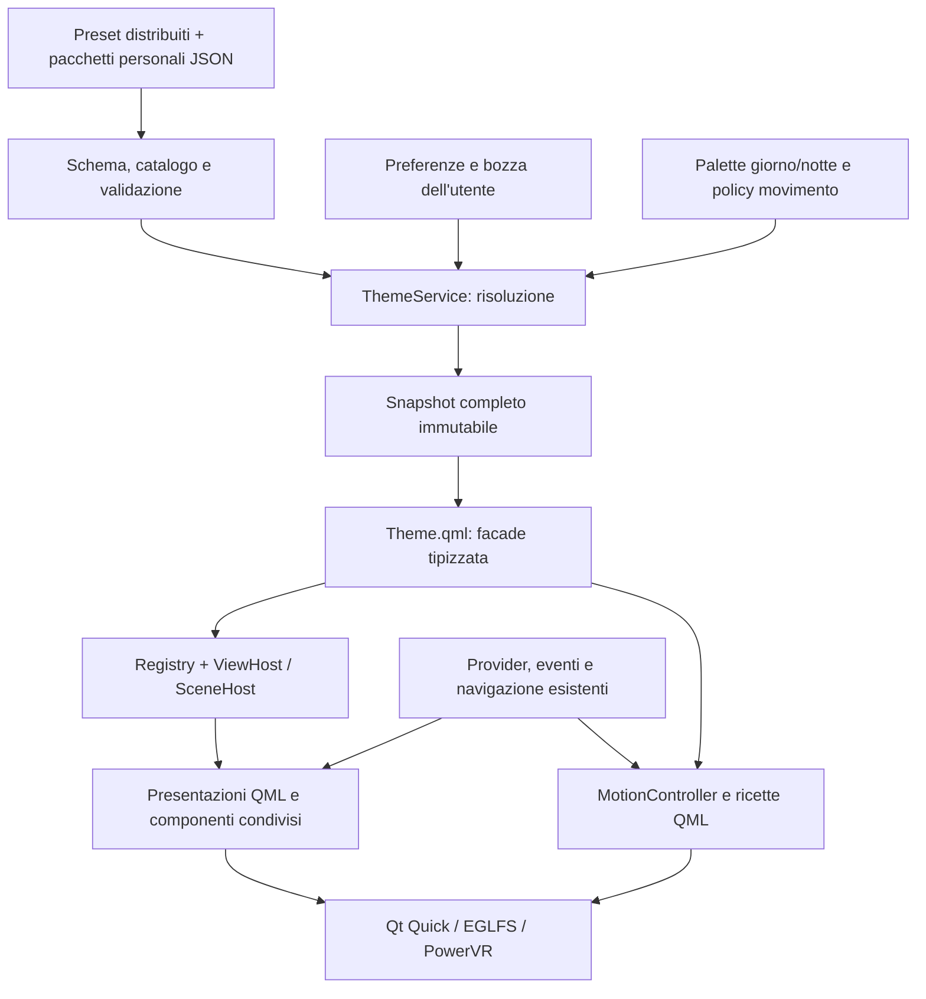

# v0.6.6 — Theme Engine: architettura e personalizzazione

**Aggiornamento attuazione v0.6.6:** il piano è implementato nei sorgenti. Contratti effettivi, uso e limiti sono nella [guida del motore](theme-engine-implementation-guide.md); stato dei gate e prove sulla scheda nel [resoconto di migrazione](v066-migration-report.md). Gli snippet di analisi illustrano alternative; per il formato eseguibile usare schema, registry ed esempi distribuiti.
**Revisione 2.2 · 2 ottobre 2026 · Europe/Rome**
**Stato: analisi e proposta tecnica, da approvare e prototipare. Nessuna implementazione runtime in questa revisione.**

Il Theme Engine comprende **aspetto, tipografia, composizioni e visualizzazioni alternative, asset, animazioni e scene persistenti**. Gli esempi precedenti erano esplorativi: non impongono linguaggi, struttura dei file o palette definitive. Questa revisione li sostituisce con responsabilità, formati, flussi e criteri verificabili.

Riferimenti: [MasterPlan](release-masterplan.md), [inventario verificato](evidence/v066-theme-analysis/README.md), [migrazione sui sorgenti](ux-theme-adaptation-plan.md), [contratto delle animazioni](theme-engine-motion-spec.md), [presentazioni e compagno](theme-engine-presentation-spec.md), [direzione visiva](themes-and-ux-analysis.md).

Revisione dei rischi: [bridge, Loader/focus e memoria dei font](theme-engine-risk-review.md). Precisa obblighi della facade, compatibilità dei harness e gestione delle risorse; non cambia lo stack raccomandato.

Contratto delle risorse visuali: [icone semantiche e renderer sostituibili](theme-engine-icon-spec.md). Icon-font e geometrie QML sono candidati per i simboli semplici; immagini/atlanti restano utilizzabili per identità, illustrazioni e scene.

## 1. Risultato di prodotto

Una persona può scegliere Base o Functional, adattare accento, font, dimensioni, forme, densità e movimento, provare il risultato e conservarlo dopo un riavvio. Uno sviluppatore può aggiungere un tema **entro il contratto disponibile** senza modificare provider, navigazione o tutte le viste.

“Massima personalizzazione” significa distinguere tre livelli:

| Livello | Cosa permette | Intervento necessario |
| --- | --- | --- |
| Preferenze sul dispositivo | Preset, accento, famiglie disponibili, leggibilità, densità, forme, animazioni e decorazione | Nove tasti; valori guidati con anteprima |
| Pacchetto personale | Colori giorno/notte, pesi e misure per ruolo, varianti di componenti, ricette animate, asset locali | JSON, validatore e import/export dal PC |
| Estensione del sistema | Nuove visualizzazioni, decorazioni, animazioni, scene e render adapter | Registry aperto di componenti QML con API versionata; C++ quando utile |

I limiti hanno una funzione concreta: il tema non può nascondere un urgente, cambiare i tasti, inventare dati, attivare un provider o rendere irraggiungibili i comandi. Una personalizzazione invalida viene spiegata e resta correggibile.

**Prima release proposta:** Base e Functional completi, tutte le 21 superfici QML esistenti migrate, personalizzazioni guidate, pacchetti dichiarativi, due composizioni Home realmente diverse, registry delle presentazioni, anteprima/ripristino e motore delle animazioni. Lifecycle delle scene verificato con un attore di prova persistente fra viste. Hardware/Cyberdeck/Cozy restano temi successivi, senza voci finte nel selettore. Il contratto nasce già per sostenerli.

## 2. Partenza verificata e limiti delle evidenze

Il 2 ottobre, alle 00:56 CEST, ispezione SSH in sola lettura:

- Dashboard `active/running`, PID 202220, NRestarts 0; avvio alle 00:04:15.
- Qt **6.8.2**, PySide6 **6.8.2.1** sulla board. Venv di sviluppo PC: PySide6 **6.11.2**.
- I **44 file runtime** installati di primo livello corrispondono ai sorgenti locali. Dei 64 file installati confrontati, quattro script di verifica differiscono: riconciliarli prima dei collaudi.
- Nessuna cartella `themes/` installata. La voce “Tema” regola oggi `nightMode`, non un profilo grafico.
- **21 QML / 1.925 righe**, 61 occorrenze esadecimali, 20 colori distinti, 200 espressioni di dimensione font, 41 raggi, nessuna `font.family` esplicita.
- Due animazioni dichiarate in `Main.qml`: spostamento del contenuto, 160 ms/20 px, e attenuazione software, 180 ms. I banner attuali appaiono tramite `visible`, senza transizione.
- RSS **182,4 MiB**, PSS **165,1 MiB** nel campione: valori puntuali, non un limite o una prova di stabilità.

[Manifest e metodologia](evidence/v066-theme-analysis/board-baseline.json). Gli hash verificano i file su disco, non ogni byte già caricato dal processo. Non sono stati eseguiti restart, input, reboot, nuove catture EGLFS o misure FPS.

La baseline di prodotto resta **v0.6.5 comunicata nel MasterPlan**; Info mostra ancora `DeskPulse v0.6`, il titolo dell'ultimo commit indica v0.6.1. T0 deve produrre un'identità di build unica. Non rietichettare retroattivamente i rilasci.

## 3. Quali linguaggi e stack convengono

La raccomandazione nasce dal codice e dal percorso grafico già funzionante, non dai frammenti delle vecchie analisi.

| Soluzione | Vantaggi per questo prodotto | Impatto e limite | Valutazione |
| --- | --- | --- | --- |
| **QML/Qt Quick + Python/PySide6** | Riusa EGLFS/KMS, viste, input, servizi e verifiche; QML descrive componenti e animazioni, Python risolve configurazione e risorse | Evitare callback Python per frame e lavoro sincrono nei binding; confrontare overhead del bridge | **Scelta raccomandata** |
| QML/Qt Quick + C++ | Stesso renderer; oggetti tipizzati e accesso diretto al scene graph per elementi specializzati | Build ARM, packaging/ABI e manutenzione aggiuntivi; riscrivere i provider non risolve automaticamente i costi GPU/layout | Estensione mirata se il profiling identifica un collo di bottiglia |
| HTML/CSS/TypeScript + browser kiosk | Ecosistema di temi, strumenti web, possibile editor remoto | Riscrittura delle viste e integrazione input; renderer/browser e uso EGLFS da qualificare sulla board | Valutare se l'interfaccia web diventa un requisito; nessun vantaggio prestazionale misurato qui |
| Flutter/Dart | Toolkit alternativo con componenti e animazioni | Nuovo renderer e toolchain, rifacimento UI, integrazione servizi; Linux desktop non certifica il nostro kiosk KMS | Non giustificato per questa milestone |
| QML + backend Rust | Possibile backend nativo mantenendo la UI | Nuovo bridge e toolchain; manca una necessità dimostrata di sostituire il core Python | Riesaminare per un requisito nativo concreto |

Le valutazioni di convenienza e costo di migrazione sono **inferenze progettuali**, non benchmark fra toolkit. La documentazione Flutter descrive il percorso Linux; non prova il funzionamento EGLFS su A733. [Flutter Linux](https://docs.flutter.dev/platform-integration/linux/building).

Qt Quick usa un scene graph e API grafiche native; Python non è il rasterizzatore dell'interfaccia. Il render loop effettivo dipende dalla configurazione: verificarlo con diagnostica Qt, senza presumere un thread separato in ogni ambiente. [Qt Scene Graph 6.8](https://doc.qt.io/qt-6.8/qtquick-visualcanvas-scenegraph.html).

**Divisione proposta:**

- **Python:** catalogo, schema, risoluzione, validazione, preparazione asset, preferenze, import/export; aggiornamenti discreti.
- **QML e JavaScript QML limitato:** componenti, layout, binding, stati e riproduzione delle ricette animate. Niente logica di provider o filesystem nelle viste.
- **JSON:** dati dei temi e parametri di movimento. Non è un linguaggio di esecuzione.
- **C++:** eventuali primitive native isolate, solo dopo misura. Non necessario al primo Theme Engine.
- **Shader Qt/GLSL precompilati:** eventuali effetti autorizzati del renderer; non file arbitrari forniti da un tema. Compatibilità e costo GPU richiedono prove separate.

Criterio per introdurre C++: una traccia riproducibile dimostra che un elemento specifico resta oltre il budget dopo la semplificazione QML; un prototipo nativo migliora quel caso sulla stessa board. Se il limite è fill-rate, texture o overdraw, cambiare il linguaggio del resolver non lo risolve.

## 4. Decisione architetturale: dati + facade + presentazioni + motion + scene

| Alternativa | Personalizzazione | Debito di manutenzione | Esito |
| --- | --- | --- | --- |
| Tutto in un grande Theme.qml | Semplice per due palette | Switch sparsi, catalogo/manualità crescenti | Scartata come fondazione |
| Un Profile*.qml per tema | Buona espressività per temi distribuiti col software | Tema è codice; duplicazione del contratto, difficile importazione e validazione preventiva | Utile come tecnica interna, non formato utente |
| **Pacchetti JSON + resolver Python + facade QML tipizzata** | Stesso formato per preset e temi personali, validazione e override | Richiede resolver, schema e componenti condivisi una volta | **Raccomandata** |
| Estensioni QML registrate con API | Nuove visualizzazioni e renderer senza limite a cinque stili | Codice da qualificare, con lifecycle/fallback e deploy | Supportate come estensioni applicative, separate dai pacchetti di soli dati |

La facade proposta nei vecchi documenti rimane valida; cambia la sorgente dei profili. La strategia è un **pacchetto di dati risolto**, non una classe piena di proprietà copiate per ogni tema.



Le frecce provider→motion indicano eventi semantici, per esempio “banner disponibile”; il tema non interroga la rete. Il controller del movimento non modifica l'engine degli eventi.

## 5. Responsabilità e API

| Oggetto proposto | Responsabilità | Non contiene |
| --- | --- | --- |
| `theme_core.py` | Modelli puri, merge, range, versioni, contrasto, errori strutturati | Qt, segnali, I/O nei getter |
| `theme_service.py::ThemeService` | QObject per una sessione/engine, catalogo, bozza, preparazione, snapshot, esito salvataggio | Animazione per frame o stato delle pagine |
| `themes/Theme.qml` | Singleton per engine con proprietà tipizzate di sola lettura per i consumatori | Cataloghi duplicati, setter di preferenze, switch per nome tema |
| `themes/StyleFacade.qml` | Stessa API tipizzata per stile live, preview e staging; mappa privata al confine | Resolver duplicato o input di prodotto |
| `themes/SemanticStyle.qml` | Presentazione degli stati e simboli di dominio, separata dallo stile identitario | Interpretazione da parole nel titolo |
| IconCatalog / AppIcon | ID semantici, descrittori validati e renderer sostituibili; risorse condivise | Codepoint/URL sparsi nelle viste, download o interpretazione del dato |
| `components/` | Primitive riusabili, ViewHost e PresentationContext | Logica dei provider o navigazione nuova |
| Registry / presentazioni | Catalogo aperto di visualizzazioni, componenti e capacità | Switch per tema o stato applicativo dentro visuali sostituibili |
| SceneHost | Vita degli attori, ancoraggi fra schermate e render adapter | Macchina comportamentale del futuro cane |
| `motion/` | Esecutori QML, interruzione, policy e ripristino delle trasformazioni | Timers Python per aggiornare coordinate |
| `theme_cli.py` | Validare, importare, esportare e ispezionare pacchetti | Secondo processo che modifica di nascosto il tema attivo |

**ThemeService, contratto pubblico proposto:**

- Proprietà: `catalog`, `activeThemeId`, `resolvedAppearance`, `resolvedTokens`, `resolvedMotion`, `resolvedPresentations`, `resolvedScene`, `revision`, `editing`, `dirty`, `status`, `lastError`.
- Input d'ambiente: variante giorno/notte, policy utente del movimento; con setter che non emettono se il valore non cambia.
- Comandi: `beginEdit()`, `selectDraftTheme(id)`, `setDraftOverride(path,value)`, `preview()`, `apply()`, `cancel()`, `resetDraft(scope)`, `reloadCatalog()`.
- `apply()` è asincrono rispetto al salvataggio e restituisce l'avvio dell'operazione; il segnale di completamento fornisce esito e revisione. “Salvato” appare solo a esito positivo.
- Gli errori includono codice, percorso del campo e messaggio utilizzabile: `contrast.textSecondary.surfaceFocused`, `asset.missing`, `format.unsupported`, `storage.writeFailed`.

`app.py` crea il servizio e ne conserva la vita; lo passa a `Main.qml` con `setInitialProperties`, già usato dal launcher. Main collega il servizio alla facade, senza context property implicite. Ogni harness di verifica deve poter iniettare un servizio con storage isolato.

La facade usa `pragma Singleton` e `qmldir`; il singleton è per engine, non un oggetto globale Python condiviso tra tutti i test. [Singleton Qt 6.8](https://doc.qt.io/qt-6.8/qml-singleton.html).

`resolvedAppearance` contiene token, motion, presentazioni, icone, scena e revisione in un solo snapshot notificato. Gli accessor `resolvedTokens`/`resolvedMotion` e gli altri sono derivati da quel contenitore e condividono la revisione; non si pubblicano configurazioni indipendenti. `resolvedTokens` è un dizionario completo esportato con NOTIFY. Ogni modifica pubblica **un nuovo snapshot**, mai una mutazione in-place di sottocampi. In QML una modifica interna a un oggetto `var` non implica la notifica della proprietà esterna. [QML var](https://doc.qt.io/qt-6.8/qml-var.html).

Ogni frame vede la configurazione candidata completa; la sostituzione logica non promette che tutte le operazioni GPU avvengano in 16 ms. Catalogo, preferenze e snapshot sono entità diverse.

### 5.1 Facade tipizzata obbligatoria e frequenza degli aggiornamenti

Le viste standard consumano `Theme.surface`, `Theme.radiusCard` e gli altri alias tipizzati. **Non consumano direttamente il dizionario del bridge.** L'anteprima e i visuali in staging ricevono un'istanza `StyleFacade` con la stessa API tipizzata e la propria snapshot; `Theme` è la facade dello stile attivo. Nei componenti che ricevono lo stile, dichiarare la proprietà col tipo QML esportato `StyleFacade`, anziché `property var style`: altrimenti il controllo statico degli accessi torna debole. La mappa resta un dettaglio del confine resolver/facade. Le estensioni definiscono adapter tipizzati per i propri token con namespace, senza imporre tutti i token futuri al singleton centrale.

I percorsi canonici sono chiavi piatte, per esempio `"colors.surface"` e `"shape.radiusCard"`, anche nella mappa risolta. Non introdurre contemporaneamente il formato annidato `colors.surface`/`shapes.radiusCard`. Schema e facade devono concordare su percorso, tipo e default.

```qml
// Estratto di API proposta; tokens deve essere completo e validato.
readonly property color surface: tokens["colors.surface"]
readonly property int radiusCard: tokens["shape.radiusCard"]
```

Prima della disponibilità del servizio si usa una snapshot Base completa distribuita col software. Un pacchetto invalido viene respinto prima della pubblicazione, mantenendo l'ultimo stile valido. Non coprire errori del contratto con fallback silenziosi per ogni campo. Controllare schema/alias, valori falsy validi come raggio 0, warning QML e refusi nelle viste con tooling configurato per il modulo singleton.

Un binding viene rivalutato al cambiamento delle sue dipendenze, **non automaticamente a ogni frame**. Una transizione di `x` o `opacity` non impone di rileggere i colori dal bridge. Python pubblica solo cambi discreti di configurazione; tween, colori animati e coordinate del compagno restano nel renderer. Il flattening concentra conversioni/lookup negli alias della facade a ogni aggiornamento dello snapshot. Restano il costo di pubblicazione, la rivalutazione degli alias e le notifiche ai consumatori; niente promessa di overhead zero o accesso diretto C++ per ogni binding. [Binding Qt 6.8](https://doc.qt.io/qt-6.8/qtqml-syntax-propertybinding.html), [prestazioni QML](https://doc.qt.io/qt-6.8/qtquick-performance.html).

La build attuale carica QML da file e non ha una pipeline AOT dichiarata: proprietà tipizzate aiutano contratto/tooling, ma non certificano binding compilati nativamente. T1 misura conversioni, fan-out della snapshot e latenza di cambio sulla Qt 6.8.2 della board. Un QObject con proprietà native o packaging dei moduli compilati è un'opzione successiva se il profiler ne dimostra il beneficio. Eventuali notifiche granulari devono conservare la commit della revisione completa e non esporre combinazioni parziali.

## 6. Pacchetto di tema e compatibilità

Struttura proposta, **ancora da creare**:

```text
dashboard/
  theme_core.py
  theme_service.py
  theme_cli.py
  presentation_registry.py
  themes/
    qmldir
    Theme.qml
    StyleFacade.qml
    SemanticStyle.qml
    token-contract.json
    theme-pack.schema.json
    generated/ThemeFallback.js
    packs/base/theme.json
    packs/functional/theme.json
  components/
    AppText.qml
    AppIcon.qml
    Surface.qml
    SelectableRow.qml
    DataStatus.qml
    ViewHeader.qml
    KeyGuide.qml
    TabStrip.qml
    ViewHost.qml
  presentations/
    [template QML e manifest delle estensioni]
  scenes/
    SceneHost.qml
    [adapter e actor contract, cane nella v0.9]
  motion/
    MotionController.qml
    NavigateMotion.qml
    FocusMotion.qml
    PanelMotion.qml
    BannerMotion.qml
  fonts/
    [font locali, manifest e licenze]
  icons/
    [catalogo, descrittori, geometrie QML e asset dei set distribuiti]
```

Percorso personale: tramite `QStandardPaths.AppDataLocation`; sul servizio attuale HOME è `/var/lib/smartpc-dashboard`. Verificare il percorso effettivo con identità dell'app; niente scritture in `/opt`. Pacchetti in `themes/<id>/`, importazione in staging e rinomina solo dopo validazione. Desktop e board usano lo stesso formato.

Campi del manifest:

| Campo | Regola proposta |
| --- | --- |
| `formatVersion` | Versione del contenitore; 1 iniziale |
| `themeApiVersion` | Versione del contratto di token e ricette; 1 iniziale |
| `presentationApiVersion`, `sceneApiVersion` | Versioni dei contratti visuali e scene quando richiesti |
| `presentations`, `scene` | Mappa content ID→presentation ID e configurazione di scena/skin |
| `id`, `name`, `version`, `author`, `license` | ID stabile; nome leggibile, versione del pacchetto e provenienza |
| `extends` | Un solo genitore; risoluzione senza cicli, profondità massima 3 |
| `designViewport` | `[960,640]` nella v0.6.6; non promette altri display |
| `tokens` | Valori comuni alle varianti, ruoli ammessi dal contratto |
| `palettes.day`, `palettes.night` | Override dei colori per ciascuna variante |
| `motion` | Ricette e parametri secondo il contratto motion |
| `assets` | Font/icone/immagini locali dichiarati, licenze, dimensioni e riferimenti |
| `requirements` | Capacità di componenti/motion richieste, verificabili prima della selezione |

Esempio **parziale di pacchetto derivato**, non una palette approvata né un nuovo file runtime:

```json
{
  "formatVersion": 1,
  "themeApiVersion": 1,
  "id": "user.scrivania",
  "name": "Scrivania",
  "version": "1.0.0",
  "author": "utente",
  "license": "private",
  "extends": "builtin.base",
  "designViewport": [960, 640],
  "tokens": {
    "shape.radiusCard": 8,
    "typography.numbersFamily": "bundled.tabular",
    "decoration.variant": "plain"
  },
  "palettes": {
    "day": {"colors.accent": "#6de0be"},
    "night": {"colors.accent": "#69bfa8"}
  },
  "motion": {
    "navigate.family": {"recipe": "builtin.slide", "durationMs": 160, "distancePx": 20, "easing": "outCubic"}
  }
}
```

**Ordine di risoluzione:** default completi del contratto → catena di genitori risolta → token del pacchetto → palette risolta del pacchetto → override utente comuni e della variante → preferenze di leggibilità/densità → policy movimento/accessibilità → validazione completa → preparazione → pubblicazione.

La variante del figlio eredita la variante corrispondente del genitore. Nessun riferimento eseguibile, espressione JS o “eval” nel JSON. I riferimenti a risorse e ricette sono ID, non URL liberi o nomi di classi arbitrarie.

Un nuovo ID si scopre dal manifest: **nessuna whitelist parallela in state.py o switch nuovo nella facade**. ID `builtin.*` riservati al software; conflitti fra pacchetti utente respinti.

Cambio compatibile del contratto: token opzionali con default e migration esplicita. Cambio incompatibile: nuova major; pacchetto vecchio conservato/esportabile, non applicato parzialmente. ID e versione del genitore vengono registrati nell'export risolto per riproducibilità. Aggiungere un nuovo profilo usa dati; aggiungere una capacità richiede una release del renderer.

Limiti iniziali da misurare: 32 pacchetti registrati, manifest 128 KiB e risorse decodificate 24 MiB per tema semplice. Il precedente candidato di 8 font attivi viene ritirato: contare file TTF non definisce un budget di cache. Partire da una famiglia UI con 2–3 pesi e un eventuale font numerico; misurare le risorse realmente usate e il picco di staging secondo §10. Renderer/scene possono dichiarare budget diversi; il registro installabile non è un limite estetico permanente. Sono budget di progetto candidati, non prestazioni osservate; superamento segnala il limite, senza caricamento illimitato. Le cache gestite dall'app hanno limiti espliciti; per quelle Qt/driver verificare la stabilità anziché promettere un controllo non disponibile.

## 7. Contratto dei token: ruoli invece di letterali

`token-contract.json` descrive percorso, alias QML, tipo, unità, default, range, coppie di contrasto, personalizzabilità e capacità richiesta. La facade espone alias stabili; i temi scrivono i percorsi canonici. Un controllo confronta schema/facade per evitare proprietà mancanti. Le estensioni possono registrare token con namespace e descrittori propri, leggibili tramite la sorgente di stile; i componenti standard mantengono alias tipizzati. Questo permette nuove capacità senza aggiungere ogni token locale al singleton centrale.

| Gruppo | Ruoli necessari | Regola |
| --- | --- | --- |
| Superfici | `background`, `backgroundOverlay`, `surface`, `surfaceAlt`, `surfaceFocused`, `surfacePressed`, `surfaceDisabled`, `scrim` | Stato separato dalla gerarchia del contenuto |
| Testi | `textPrimary`, `textSecondary`, `textMuted`, `textDisabled`, `textOnAccent`, `textOnFocus` | Contrasto sullo sfondo effettivo |
| Accenti e confini | `accent`, `accentSubtle`, `border`, `borderFocused`, `divider`, `progressTrack` | Focus distinto da “dato in corso” |
| Geometrie | `radiusCard`, `radiusRow`, `radiusPill`, `radiusButton`, spessori normali/focus | Range candidati 0–20 px per raggi, 1–3 px per bordi |
| Metriche | Margine pagina, inset card/riga, gap, altezze header/footer, righe e tab | QML pixel; vincoli di viewport e contenuto |
| Tipografia | Famiglia UI/numeri/display, misura, peso, lineHeight e letterSpacing per ruolo | Famiglia e peso inoltrati dal profilo, non fissi nella facade |
| Componenti | Varianti `card/row/tab/header/badge`, enfasi del dato, allineamento autorizzato | Enumerazioni finite gestite dai componenti |
| Decorazioni | Variante plain/rule/hardware/dot-grid, tinta, opacità e area | Statiche per default, separate dal testo |
| Motion | Ricetta, durata, curva, ampiezza, ritardo, stop policy per evento | Contratto dedicato, non un solo `motionDuration` |

Nessun `if (themeId === ...)` nelle viste. Nessuna proprietà “showTelemetryBadge” che avvia CPU/FPS e nessun “companionVisible” che crea il cane. Le capacità di prodotto appartengono a moduli e preferenze; il tema definisce come vengono presentate quando esistono.

Valori trasparenti ammessi solo per ruoli che li prevedono. Colori informativi opachi nel primo contratto; composizione con scrim e immagini va validata sul colore effettivo. Non usare l'opacity dell'intera riga per marcare un dato vecchio.

### Scala tipografica

La vecchia scala 18/21/24/35/152 è insufficiente: il software ha punteggi, valori meteo, testi urgenti e tabelle con necessità diverse.

| Ruolo | Intervallo candidato px | Dove serve |
| --- | ---: | --- |
| Hero | 136–156 | Orologio |
| ValueXL / ValueL | 56–68 / 42–54 | Temperatura e punteggio |
| ValueM | 30–40 | Valori e card compatte |
| Title / Heading | 32–38 / 26–32 | Titoli e nomi |
| Body / Label | 24–30 / 21–26 | Descrizione e campi |
| Caption / Dense | 19–23 / 18–22 | Fonte/timestamp e tabelle |
| Command | 23–27 | Azioni da tastierino |
| UrgentTitle / UrgentBody | 46–56 / 28–32 | Avviso prioritario |

Intervalli per prototipo, non standard universali. Il testo essenziale non si riduce automaticamente al minimo per farlo entrare: aumentare righe/paginazione o aprire il dettaglio. `SV`, trattino, zero, percentuali, segni e unità devono rimanere distinguibili.

## 8. Layout personalizzabile con contenuto stabile

La personalizzazione profonda richiede **presentazioni QML registrate**, oltre ai token. Il contratto dettagliato è nella [specifica delle visualizzazioni](theme-engine-presentation-spec.md): palette, layout, motion e scena si possono combinare indipendentemente. Un nuovo template non richiede modifiche al resolver o ai provider.

Le presentazioni ricevono dati, selezione, azioni, viewport e stile attraverso un PresentationContext. ViewHost conserva lo stato; può sostituire il sottoalbero visuale quando cambia composizione. In T1 dimostrare Base con Home attuale e Functional con Home centrata, stessi dati e azioni; poi migrare le altre viste. Il layout della release iniziale non costituisce un tetto ai layout futuri.

Home senza evento usa lo spazio disponibile per ora/meteo; con evento aggiunge il relativo contenuto. Il tema può cambiare allineamento, gerarchia, rendering dei dati e ambiente; i campi obbligatori, gli stati e i comandi rimangono riconoscibili.

Per le liste, la variante di densità deve determinare congiuntamente capacità, altezza, pagina visibile e larghezze. Oggi `Math.floor(index/4)*4` e `slice(...,+4)` sono sparsi; cambiare solo il font taglierebbe testo e focus. L'ID selezionato resta invariato e la nuova pagina lo mantiene visibile.

**Regola pratica:** margini e padding sono stile; ID, ordinamento, campi disponibili e selezione sono stato applicativo. Le colonne semanticamente indispensabili non spariscono per il tema. Tema diverso non significa nuove richieste o schema diverso del provider.

## 9. Colori di significato e leggibilità

Tre categorie:

1. **Identità del tema:** sfondi, accento, forme; personalizzabili.
2. **Stati generici:** aggiornato, in attesa, errore, dato salvato, selezionato; palette di stato personalizzabile con vincoli e simboli/testo.
3. **Codifiche di dominio:** allerta ufficiale gialla/arancione/rossa, colori di bandiere gara, identità squadra; mappa dedicata, non sostituibile indiscriminatamente con l'accento.

Il livello di allerta deve arrivare da un campo strutturato dell'evento. Nel sorgente attuale weather_alerts espone priorità e notificationRank, ma non un campo esplicito del livello ufficiale; EventUrgent cerca “rossa” nel titolo. Aggiungere un campo semantico opzionale, per esempio weatherSeverity, e il relativo adapter minimo; gli eventi Account restano di categoria distinta. Non riutilizzare notificationRank come definizione universale del colore. Non dedurre la gravità dalla tinta del tema. Stato `stale` e warning di utilizzo non sono lo stesso significato anche se possono condividere una tinta.

**Target di progetto:** 4,5:1 per testo informativo, 7:1 preferibile per dati/azioni essenziali, 3:1 per l'indicatore visivo necessario a riconoscere il focus. È un criterio interno ispirato a WCAG; non una certificazione del kiosk. [Contrasto del testo](https://www.w3.org/WAI/WCAG22/Understanding/contrast-minimum.html), [contrasto non testuale](https://www.w3.org/WAI/WCAG22/Understanding/non-text-contrast.html).

Controllare riposo/selezionato/premuto, varianti giorno/notte, scrim e stato disabilitato. Il testo “non disponibile” è informazione, non decorazione esente dal target.

I vecchi esempi falliscono alcune coppie: Functional `#666664` su `#242424` vale **2,70:1**; secondario notte `#8c8c8a` sul focus `#383838` vale **3,48:1**. [Calcoli riproducibili](evidence/v066-theme-analysis/source-inventory.json). Sono colori proposti nei documenti, non un test del runtime.

Luminosità: la maschera nera attuale attenua l'immagine. Il contrasto digitale nominale non prova leggibilità fisica dopo attenuazione; collaudare sul display a 20%, livello notte e 100%. Il tema non varia il minimo di luminosità.

## 10. Font, icone e asset

Prima T1 fotografa la famiglia realmente risolta oggi: nessuna famiglia esplicita nel QML non significa assenza di font. Preservare il font del sistema nella prima tokenizzazione Base; cambiare il carattere è un passaggio visuale successivo con confronto controllato.

Raccomandazione per il prototipo: un font UI con cifre tabulari può bastare; Inter e JetBrains Mono rimangono candidati, non obblighi. Caricare pesi effettivi e licenze; evitare “bold” sintetico per un file solo Regular. Font display/dot-matrix solo in ruoli brevi e numeri dopo prova fisica.

`QFontDatabase.addApplicationFont` prima del primo utilizzo permette di registrare font locali e verificare l'esito; il resolver espone le famiglie effettivamente caricate. Non basta assegnare la stringa “Inter”. [QFontDatabase 6.8](https://doc.qt.io/qt-6.8/qfontdatabase.html).

Alternativa QML: FontLoader con Ready/Error e fallback. Nel root QtObject va dichiarato in una proprietà oggetto esplicita: non assumere una default property per figli anonimi. Gli snippet precedenti non erano un programma validato. [FontLoader 6.8](https://doc.qt.io/qt-6.8/qml-qtquick-fontloader.html).

Il launcher attuale carica file locali, non risorse qrc registrate. Usare percorsi locali risolti rispetto all'installazione; introdurre qrc soltanto con compilazione/import del modulo risorse e inclusione nel deploy. Niente URL `qrc:/fonts/...` inesistenti.

Glyph set di prova: italiano accentato, °, %, €, frecce, trattino lungo, nomi sportivi, `SV`, `00:00`, `11:11`, `23:59`. Icone dal set distribuito o asset locali approvati; significato e dimensione visibile stabili. Niente emoji come unico indicatore critico.

Font mancanti: fallback noto, stato leggibile in Aspetto, metriche nuovamente verificate; il selettore non promette il font assente. Import limitato a file locali, percorsi dentro il pacchetto, dimensioni decodificate controllate. In v0.6.6 i font personali entrano nel catalogo solo dopo la verifica di import, non ad ogni scelta.

### 10.1 Risorse dei font e cache del renderer

Distinguere catalogo su disco, registrazioni QFontDatabase, font effettivamente risolti, shaping/layout e cache dei glifi/texture. Registrare un TTF non equivale a costruire subito tutti i suoi glifi sulla GPU. I TTF outline sono scalabili; "alta risoluzione" non è un costo fisso del file. Con QtRendering il distance field può essere riusato fra dimensioni: non supporre una texture separata per ogni pixelSize. Famiglie/pesi, glifi nuovi, qualità di rendering e backend possono comunque ampliare le cache. DeviceInfo usa già NativeRendering: mantenere il percorso fino al confronto fisico. [Text e renderType](https://doc.qt.io/qt-6.8/qml-qtquick-text.html#renderType-prop), [popolazione dei glifi in Qt 6.8.2](https://github.com/qt/qtdeclarative/blob/v6.8.2/src/quick/scenegraph/qsgadaptationlayer.cpp).

Gestione proposta:

1. Catalogo iniziale di metadati; nessun preload di tutte le famiglie di tutti i temi. L'anteprima del selettore non crea una dashboard completa per ciascuna voce.
2. Registrare/preparare solo le risorse necessarie allo stile corrente o all'unico candidato. Deduplicare per contenuto/versione; verificare famiglia e peso effettivi, inclusi conflitti di nomi e fallback.
3. Conservare riferimenti per visuali, editor/preview, overlay e scene: QFontDatabase è condiviso nel processo, la sola chiusura di un QQmlEngine non autorizza a rimuovere font usati da un altro.
4. Rilasciare risorse applicative non più utilizzate dopo lo swap e la fine dei transitori. `removeApplicationFont()` e distruzione dei Text **non garantiscono** il recupero immediato delle texture Qt/driver. Non usare removeAllApplicationFonts come pulizia di una preview.
5. Ammettere uno staging alla volta e un budget di picco distinto da quello a regime, includendo sprite/scene del futuro compagno. Se il budget non consente due visuali, cambio diretto con fallback operativo, senza perdere selezione o input.

Il motore può supportare altre famiglie e renderer; l'envelope del dispositivo governa il carico attivo. Non fissare un limite estetico di 3–4 font: quel numero è una configurazione iniziale del prototipo.

T1/T5 confrontano cold/warm start, registrazione senza uso, primo utilizzo con glifi controllati, tutti i ruoli/pesi/dimensioni, staging, 100 cambi fra gli stessi temi e un insieme più ampio di font. Registrare memoria a regime/picco/plateau, RSS/PSS e cgroup, oltre a metriche GPU/driver se disponibili; indicare esplicitamente quando queste ultime non sono osservabili. La PSS 165,1 MiB della baseline non è una misura completa della memoria grafica o una prova di headroom. Sull'A733 non assumere VRAM dedicata misurabile sottraendo due PSS. Crescita di warmup e crescita persistente vanno distinte; una cache Qt che supera il budget richiede una decisione di prodotto/renderer, non un riavvio periodico spacciato per soluzione.

Qt 6.8 include CurveRendering, candidato da confrontare per testo grande se memoria/qualità lo richiedono; non sostituire globalmente QtRendering o NativeRendering senza misure di frame e leggibilità. [Qt Text](https://doc.qt.io/qt-6.8/qml-qtquick-text.html#renderType-prop).

### 10.2 Icone: contratto prima del formato

I 21 QML attuali non dichiarano Image o Shape; i simboli presenti sono testuali/geometrici. Preservare questa Base iniziale, come concordato: nessuna scelta definitiva di font, palette o motion è necessaria per avviare T0/T1.

Le presentazioni usano `AppIcon` con ID come `system.home` e `weather.rain`. Un catalogo risolve set/variante/override in descrittori; font-family/codepoint, path e URL restano nel renderer. API tipizzata, box ottico stabile, readiness/fallback, policy di tinta e label accessibile sono definiti nella [specifica icone](theme-engine-icon-spec.md).

Prototipo con poche geometrie QML semplici; icon-font outline come alternativa per simboli monocromatici. Nessun preload di tutto il catalogo, nessun decoder/slot Python nel tween; glifi e geometria hanno comunque costi da misurare. Non vietare SVG/PNG: Image usa cache/condivisione, e identità/multicolore/scene possono richiederli. Preparare sourceSize stabile e asset prima dell'uso; non cambiare URL o dimensioni di decoding a ogni frame.

Weather espone già code corrente/previsioni: mapping di dominio senza parsing di description. La variante sole/luna richiede fase giorno/notte disponibile, distinta da night palette. Stemmi e indicatori gomme non inventano dati o nuove sorgenti. Il compagno resta un renderer nel SceneHost con lifecycle proprio; il suo atlante/rig non viene limitato a un icon-font.

## 11. Esperienza di personalizzazione

Percorso unico: **9 Menu → Impostazioni → Aspetto**.

| Pagina | Voci proposte |
| --- | --- |
| Aspetto | Tema; Personalizza; Palette Auto/Giorno/Notte; Movimento; Ripristina |
| Tema | Base, Functional e pacchetti personali validi; nome, descrizione, stato “Personale” |
| Personalizza → Colori | Accento e tinte disponibili; distinzione giorno/notte; valore originale riconoscibile |
| Personalizza → Testi | Font UI/numeri disponibili; dimensione Normale/Ampia; pesi guidati |
| Personalizza → Forme e spazi | Angoli, bordo, densità Regolare/Ampia |
| Personalizza → Animazioni | Ricette disponibili e intensità/velocità; prova su esempio |
| Personalizza → Decorazione | Varianti implementate, intensità; Nessuna sempre disponibile |
| Anteprima | Home campione, riga/focus, dato salvato, banner; variante giorno/notte |

2/8 selezionano; 4/6 regolano valori discreti; 5 apre o prova; Back torna mantenendo la bozza. Guide generate dallo stesso contratto input del runtime. Il pannello non richiede inserimento di esadecimali con nove tasti: sul dispositivo preset e colori guidati; il PC consente valori esatti nello stesso formato.

**Bozza transazionale:** niente autosalvataggio durante lo scorrimento. L'editor mostra “Modifiche da applicare” con azioni Applica/Annulla. Back dentro le sottopagine mantiene la bozza; uscire dall'editor ripristina il tema confermato. Home e uscita globale annullano. Questa eccezione riguarda soltanto l'editor Aspetto: il resto delle impostazioni conserva il comportamento attuale.

Anteprima limitata all'area campione con una sorgente di stile esplicita nei componenti, senza cambiare la facade globale. Può usare la stessa gerarchia di componenti con dati fissi, non una seconda applicazione viva. Mostrare chiaramente “Anteprima”; nessun evento di prova entra nell'inbox.

Se è utile una prova globale prima di confermare, proporre **Prova 20 secondi** con ritorno automatico alla configurazione confermata. Timer attivo solo in questo stato; la scadenza si sospende per un urgente e riprende dopo. La conferma visibile rimane in una superficie di recupero indipendente dalle tinte sperimentali.

Reset separati: campo → personalizzazioni del tema corrente → intero Aspetto. Non cancellano soglie Account, notifiche, preferiti o luminosità. Override conservati **per themeId**: passare da Base a Functional non trasporta accidentalmente gli stessi colori.

## 12. Risoluzione e cambio a caldo

Sequenza proposta:

1. Selezione della bozza e validazione di formato/capacità/valori.
2. Risoluzione completa di token e ricette per variante e policy correnti.
3. Preparazione degli asset mancanti fuori dal percorso di animazione; font pronti prima dell'uso.
4. Verifica di coppie di contrasto e compatibilità del layout.
5. Pubblicazione di token e motion con una revisione comune, in un unico aggiornamento logico.
6. Applica richiede salvataggio serializzato; mostra “Salvataggio…”.
7. Solo a esito positivo aggiorna lo stato confermato e mostra “Applicato”. Fallimento ripristina lo snapshot confermato nel runtime e conserva la bozza nell'editor, con possibilità di riprovare. Se il candidato è mostrato durante il salvataggio, è esplicitamente una prova non ancora confermata.

L'input resta usabile durante preparazione/salvataggio; nessuna coda infinita di richieste: una preparazione più recente invalida il risultato precedente tramite generation ID. Un Apply già in scrittura viene completato e ordinato prima di una richiesta successiva. Non notificare “salvato” per una generazione superata.

Cambio tema non ricrea Main, controller, provider o engine. Un cambio presentation può sostituire il sottoalbero visuale con staging controllato, senza perdita di stato applicativo; cambio token da solo aggiorna le istanze esistenti. Deve preservare famiglia, vista, stack overlay, ID selezionati, tab, scroll e richieste in corso. Densità diversa può cambiare la pagina visibile, conservando l'elemento selezionato.

Le animazioni in corso seguono il [contratto motion](theme-engine-motion-spec.md): finalizzazione controllata delle trasformazioni, nessun elemento invisibile o bloccato; urgente disponibile immediatamente.

Niente assegnazioni imperative sui token dei consumatori: possono rimuovere i binding. L'editor chiama il servizio, non `Theme.accent = ...`. [Property binding Qt](https://doc.qt.io/qt-6/qtqml-syntax-propertybinding.html).

## 13. Persistenza e recovery

**Scelta proposta:** mantenere QSettings, già usato da state.py. Non aggiungere database o daemon per l'aspetto.

- Una chiave `appearance/config` contiene JSON versionato con tema confermato, versione, override per tema e generazione. Salvataggio solo su Applica o reset confermato, se differente.
- `nightMode`, luminosità, orari e gli altri controlli esistenti conservano chiavi e significato. La migrazione `animationsEnabled`→`motionMode` è descritta nella specifica motion.
- Un adapter di persistenza, accessibile attraverso DashboardState/servizio, evita un secondo catalogo in state.py. Worker serializzato per le scritture Aspetto, con propria istanza QSettings nello stesso namespace; non spostare o condividere fra thread l'istanza usata da DashboardState.
- `sync()` e `status()` determinano l'esito; salvataggio atomico richiesto, niente fallback alla scrittura diretta quando manca lo spazio per il temporaneo. Verificare directory scrivibile e comportamento del formato nativo della board. [QSettings 6.8](https://doc.qt.io/qt-6.8/qsettings.html#sync).
- Nessuna scrittura per frame, preview, minuto o toggle giorno/notte automatico. Getter privi di I/O e segnali. Non fare un reset globale delle preferenze per un problema Theme.

Recovery:

| Condizione | Comportamento |
| --- | --- |
| Tema sconosciuto/rimosso | Base valida + messaggio discreto in Aspetto; preferenza originale conservata per diagnosi |
| Override non più compatibile | Ignorare il gruppo incompatibile, mostrare quali campi; nessun mix silenzioso di valori invalidi |
| Pacchetto nuovo invalido | Non registrato come selezionabile; errore di campo nella validazione/import |
| JSON preferenze corrotto | Base e preferenze aspetto di default; altre preferenze conservate |
| Font/asset assente | Fallback dichiarato, niente crash; impedire conferma se compromette il contratto |
| Scrittura fallita | Tema confermato resta tale; “Non salvato”, bozza disponibile per riprovare |
| Crash durante anteprima | Al riavvio usare la configurazione confermata, non la bozza |
| Downgrade | Vecchia dashboard ignora appearance/config; conserva nightMode e animazioni compatibili |

Al primo avvio ThemeService dispone già di uno snapshot Base completo. `ThemeFallback.js` generato dai default del contratto sostiene bootstrap e percorso QML-only di run.sh; derivazione verificata per non creare una seconda palette mantenuta a mano. Mancanza del controller non deve produrre undefined o una schermata nera. Questo fallback copre guasti ai dati; un file QML sintatticamente rotto richiede rollback della distribuzione.

## 14. Estensione, import/export e uso da parte degli sviluppatori

Workflow previsto: copia il template Base → assegna ID/versione → modifica dati → valida → guarda la tavola di componenti → prova su board → distribuisci.

Il validatore produce errori con posizione e suggerimento, elenca i token effettivi e segnala ruoli non coperti. Formato documentato, esempio minimo e guida “aggiungere un tema” inclusi nella release.

Import/export dal PC con CLI locale e trasferimento nella directory utente; nessun server aggiuntivo necessario. Export offre:

- **Pacchetto derivato:** conserva extends e override; piccolo, richiede genitore compatibile.
- **Pacchetto risolto:** token, motion, presentazioni e scena risolti, versioni delle estensioni richieste e asset consentiti; più riproducibile.
- **Preferenze personali:** sole impostazioni Aspetto; nessun token Account o dato provider.

Ricarica catalogo esplicita; non un watcher che cambia tema mentre si legge. Se il tema attivo viene aggiornato, preparare e validare la nuova versione mantenendo l'attuale snapshot finché pronto. Non rimuovere asset/font usati da un'animazione in corso.

Una nuova ricetta motion si registra una volta nel codice condiviso, con parametri/schema e fallback reduced/off; il tema poi ne seleziona l'ID. Una nuova decorazione segue lo stesso percorso. Il normale import di pacchetti personali trasferisce dati; nuove visualizzazioni/scene si installano come estensioni applicative registrate, con componenti QML, API e diagnostica. Questo percorso consente di ampliare il vocabolario visuale senza cambiare il formato dei temi.

## 15. Prestazioni e costi da controllare

La risoluzione avviene solo su cambiamenti reali; nessun merge/JSON parse per frame. A regime un solo albero visuale per vista, nessuna copia permanente di ogni schermata per ciascun profilo. Lo staging del cambio presentation è temporaneo, limitato e incluso nel budget di memoria. Le viste nascoste non mantengono animazioni decorative attive.

Trasformazioni e opacità locali sono i candidati iniziali; evitare reflow animato di tutte le righe, blur esteso, particles e grandi layer senza profiling. I layer consumano memoria e possono ostacolare batching: non sono un'ottimizzazione automatica. [Qt Quick performance](https://doc.qt.io/qt-6.8/qtquick-performance.html), [Item layer](https://doc.qt.io/qt-6.8/qml-qtquick-item.html#layer.enabled-prop).

La board usa OpenGL nel percorso attuale; nessun cambio Vulkan o driver richiesto dal Theme Engine. Packaging di shader futuri verificato sulla Qt 6.8, non soltanto sul PC 6.11.

Budget **candidati da fissare dopo T0/T1**:

| Grandezza | Proposta iniziale | Limite dell'affermazione |
| --- | --- | --- |
| Budget frame animato | Ideale 16,67 ms; gate ordinario p95 ≤ 20 ms, nessun intervallo >33,34 ms nei campioni di navigazione | Verificato sulla matrice; il primo uso di font diversi ha eccezioni dichiarate |
| Cambio completo di profilo | Obiettivo iniziale 100 ms; budget di rilascio p95 ≤ 150 ms | Misura EGLFS di circa 118 ms; staging conserva il visuale precedente. Font/glifi cold possono superare il budget al singolo cambio: vedere resoconto |
| Latenza input→feedback | p95 ≤ 100 ms | Con carico normale e burst controllato |
| Memory delta motore + due temi | PSS ≤ +20 MiB sullo stesso carico | Candidato a regime; misurare anche picco di staging e risorse grafiche osservabili |
| Cicli cambio tema | 100, con ritorno periodico a Base | Non equivale a durata 24 h |
| Crescita dopo warmup | Nessuna tendenza persistente fra cicli equivalenti | Dichiarare rumore, range e numero campioni |

Non sommare campioni PSS non simultanei come se fossero budget fissi. Il vecchio <90 MB non è applicabile alla dashboard attuale. Il collaudo dettagliato delle animazioni e i limiti del benchmark esistente sono nel documento motion.

## 16. Perimetro e tappe

| Fase | Consegna | Condizione per proseguire |
| --- | --- | --- |
| T0 | Baseline/versione/input riconciliati; fixture e misure prima | Hash, screenshot e build identificabili; harness coerenti |
| T1 | Schema/resolver/facade, registry/ViewHost, due Home, ricetta navigate e SceneHost di prova | Qt board carica; snapshot, sostituzione visuale e attore persistente verificati |
| T2 | Migrazione Base di tutte le viste, componenti e animazioni esistenti | Copertura completa e regressioni passate |
| T3 | Functional completo + composizione e motion distinti + personalizzazione guidata | Due profili, giorno/notte, densità e testi lunghi leggibili |
| T4 | Editor, anteprima, import/export, persistenza, recovery | Nessuna perdita di focus/dati; errori e reboot verificati |
| T5 | Misure EGLFS, matrice visuale/motion, packaging e rollback | Gate chiusi o residui dichiarati e incompatibili col rilascio rimossi |

Le modifiche funzionali come Riepilogo Home, nuovo comportamento verticale o rotazione Sport dopo inattività restano lavori UX separati. La v0.6.6 corregge le guide che mentono sui comandi, senza cambiare la mappa sulla base di un mockup.

Cane, nuove sorgenti, telemetria decorativa e pixel-shift non sono consegne implicite del Theme Engine. Per il cane il sistema costruisce già host/lifecycle e API dei renderer, verificati con attore geometrico di prova; comportamento, sprite e scene di prodotto arriveranno nella v0.9.

## 17. Gate di accettazione

- Base/Functional coprono tutte le viste, impostazioni, Avvisi, banner piccoli/grandi e urgenti; stessi dati e tasti.
- Cambiare colore, font, geometria e ricetta produce un effetto reale tramite il contratto, senza cambiare le viste.
- Alias tipizzati verificati anche in preview; nessuna pubblicazione dei token per frame; refusi e snapshot incomplete respinti.
- Host/readiness e test adattati ai visuali dinamici; menu/urgente mantengono l'input durante load/swap, verificato anche con tasti Qt.
- Font preparati su necessità; picco di staging e plateau dopo cambi ripetuti entro budget misurato, includendo la scena di prova.
- AppIcon risolve ID semantici con fallback, preview isolata e backend sostituibile; glifo/asset ignoto non cancella dati o comandi. Costi cold/warm e motion verificati.
- Due composizioni Home e un attore di prova fra viste dimostrano personalizzazione del layout e continuità delle scene. Una nuova estensione visuale si registra senza modificare il resolver.
- Un terzo tema derivato si importa e seleziona senza aggiungere switch nel runtime: prova di estensibilità, non terzo preset obbligatorio.
- Cambio in detail/stack/lista conserva ID/tab/selezione; il tema non incrementa chiamate provider, mark-read o dismiss.
- Animazioni con Normal/Reduced/Off, interruzioni e urgenze superano i casi del documento motion.
- Contrasto numerico e ispezione fisica completati; fallback font e metriche provati.
- Preview/cancel/apply, errore salvataggio, tema assente e reboot offline verificati con preferenze isolate.
- Zero warning QML inattesi nei percorsi provati; gli errori introdotti deliberatamente nelle prove di recovery sono classificati e verificati; baseline PC e board distinte e registrate.
- Prestazioni confrontate sullo stesso carico; non contare rendering idle come prova di 60 fps.
- Deploy include JSON, qmldir, font/licenze, eventuali asset e fallback; backup e rollback provati preservando dati utente.

## 18. Decisioni proposte e questioni da chiudere nel prototipo

**Raccomandazione da adottare:** QML/Qt Quick per rendering e animazioni; Python per il controllo discreto; pacchetti JSON validati; facade tipizzata; registry aperto di presentazioni e renderer; motion e scene persistenti; stesso formato per preset e personalizzazioni, con estensioni QML per nuove capacità.

**Da verificare in T0/T1:** famiglia font oggi risolta, mappa fisica e guide, costo del bridge a snapshot, confini dell'anteprima, capacità delle righe con densità ampia, versione/manifest della baseline, corrispondenza dei quattro harness installati.

**Da scegliere dopo prova visuale/motion:** famiglia numerica, scala Ampia, ricette e parametri dei due temi, budget definitivo PSS/input/frame. I colori e i tempi dei vecchi esempi non diventano decisioni per inerzia.

La release deve dimostrare un sistema facilmente utilizzabile e ampliabile, non soltanto due palette selezionabili.
