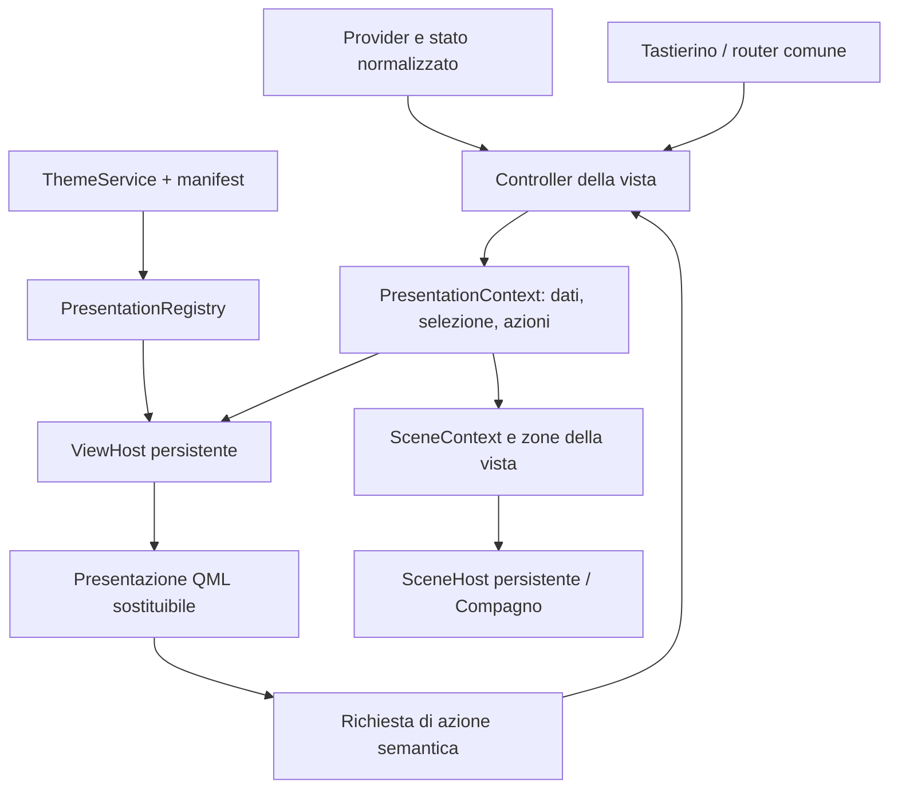

# v0.6.6 — Visualizzazioni, scene e futuro compagno

**Estensione notifiche del 3 ottobre 2026:** sei slot indipendenti sono collegati al registry con NotificationContext API 1, host persistenti e commit coordinato. [Contratto e audit precedente](theme-engine-notification-spec.md); [esecuzione e prove](theme-engine-notification-migration-report.md). Le sezioni di analisi sotto conservano le proposte di progetto; la guida documenta le API effettive.

**Aggiornamento attuazione v0.6.6:** il piano è implementato nei sorgenti. Contratti effettivi, uso e limiti sono nella [guida del motore](theme-engine-implementation-guide.md); stato dei gate e prove sulla scheda nel [resoconto di migrazione](v066-migration-report.md). Gli snippet di analisi illustrano alternative; per il formato eseguibile usare schema, registry ed esempi distribuiti.
**Revisione 1.1 · 2 ottobre 2026 · proposta da prototipare.**

Estende la [specifica dell'engine](theme-engine-construction-spec.md) e il [contratto motion](theme-engine-motion-spec.md). Requisito esplicito: personalizzazione profonda, visualizzazioni diverse e compagno animato anche fra schermate. Il renderer deve essere ampliabile senza rifare la gestione dei temi.

## 1. La distinzione fondamentale

Un tema ha cinque dimensioni indipendenti:

1. **Tokens:** colori, font, misure, forme.
2. **Presentations:** come gli stessi dati vengono composti e visualizzati.
3. **Motion:** come presentazioni e interazioni cambiano nel tempo.
4. **Scene:** ambiente, oggetti e attori animati.
5. **Assets:** font, icone, texture, sprite e risorse dei renderer.

La configurazione combina queste dimensioni. Gli override possono essere globali, per tema e per content ID; la precedenza e il reset sono espliciti, senza trascinare valori incompatibili fra template. Una persona può usare la palette Base con Home centrata, un'altra tipografia e movimento Functional. Un preset è una combinazione pronta, non un blocco indivisibile.

Il resolver non contiene una lista definitiva di cinque stili. La capacità di aggiungere un nuovo renderer o template è un contratto dell'engine. I nove tasti, lo stato dei dati e il recupero restano infrastruttura di prodotto.

## 2. Cosa ricaviamo dagli studi UX esistenti

Sono stati letti [studio navigazione v1](ux-navigation-study-v1.md), [navigazione v2](ux-navigation-v2.md), [alternative Home](theme-alternatives-v2.md), [analisi temi/UX](themes-and-ux-analysis.md), oltre ai sorgenti.

| Studio | Contributo utile | Applicazione all'engine |
| --- | --- | --- |
| V1, poi superato da V2 | Recuperare spazio dal branding, dato dominante, contesto e guida | Shell e header personalizzabili; stato/comandi separati dalla posizione |
| V2 | Home dinamica, due assi, focus solo nel contesto attivo, Compagno come vista di Oggi | View IDs e action IDs stabili; presentazioni alternative non creano un altro router |
| Alternative A/B/C | Ora, moduli e compagno possono avere composizioni diverse | Template diversi per scopo, non un solo layout rigido con tinte diverse |
| Cinque direzioni visive | Personalità in forme, numeri, illustrazione e movimento | Combinare palette/type/presentation/scene/motion |
| UX focus/avvisi | Conservare origine, ID e priorità | Stato fuori dall'albero visuale, urgent layer sopra le scene |

Le vecchie mappature numeriche e i riferimenti al PC negli studi storici non diventano requisiti correnti: il MasterPlan colloca Rete nella v0.8 e il runtime gestisce 1 Home/7 Back. La prova fisica in T0 resta necessaria per confermare decoder e posizioni.

## 3. Presentazioni come estensioni registrate

Aggiungere un **PresentationRegistry**: catalogo di componenti QML che rispettano un'interfaccia, con ID, versione, capacità e fallback. Non hardcodare “se Functional allora layout X” in Main.

Identificatori di contenuto distinti dai nomi visibili:

- `home.now`, `home.day`;
- `weather.now`, `weather.forecast`;
- `account.usage`;
- `sport.overview`, `sport.table`, `sport.match`, `sport.fantasy`, `sport.team`;
- `racing.overview`, `racing.event`, `racing.session`, `racing.driver`, `racing.timing`;
- `settings.page`, `info.page`, `alerts.inbox`, `alerts.detail`, `alerts.banner`, `alerts.urgent`;
- `companion.scene` come capacità futura, senza pagina attivata prima della v0.9.

Un ID di presentazione può servire più content ID, se dichiara il contratto corretto. Le viste Sport/F1/MotoGP continuano ad avere fonti e disponibilità proprie.

Esempi di visualizzazioni possibili tramite componenti diversi:

| Contenuto | Presentazioni possibili | Dati e significati conservati |
| --- | --- | --- |
| Home | Ora a sinistra, ora centrata, strumento a segmenti, scena con dato sovrapposto | Ora/data, meteo e stato, evento opzionale |
| Meteo | Numero e righe, illustrazione, pannello strumento, grafico quando ci sono serie reali | Condizione, unità, fonte/età; nessuna serie inventata |
| Account | Barra, ring, indicatori separati | Usato/rimanente esplicito, finestra/reset, crediti mancanti distinti |
| Partita | Tabellone, confronto tipografico, schede, vista eventi | Squadre, stato, punteggio e dati disponibili |
| Timing | Tabella, schede piloti, visualizzazione comparativa | Posizione/tempo/gap/unità/fonte; collaudo live conservato |
| Compagno | Pixel art, sprite illustrato, rig 2D tramite adapter, scene differenti | Stato del compagno, priorità e preferenze |

Non tutte queste visualizzazioni sono consegne v0.6.6. **La capacità di registrarle e commutarle fa parte dell'engine iniziale.**

## 4. Separare controller e rappresentazione

Oggi Main conserva già molta selezione e navigazione, ma i figli leggono `dashboard.*` e contengono layout e qualche azione. Evoluzione proposta:



- **Controller:** selezione, ID, tab, offset, significato dei tasti, richieste e ritorno.
- **ViewHost:** contesto di vita della vista; collega presentazione, stile e motion; conserva stato.
- **Presentazione:** disegna dati e controlli; chiede un'azione nominata, senza interrogare direttamente il provider.
- **PresentationContext:** modello esplicito/versionato e proprietà notificabili, non l'intero app root.

Migrazione incrementale: in T1/T2 un adapter legge lo stato oggi in Main. Si estraggono prima Home e una lista, senza riscrivere tutti i provider. Tutte le nuove estensioni usano il contesto; durante la transizione gli alias dashboard restano solo nei componenti ancora da migrare e vengono inventariati.

Nessuna nuova pagina deve richiedere modifiche al core del ThemeService: registra un content contract, un fallback e gli eventuali token locali con namespace. Casa/Rete useranno le stesse primitive.

## 5. Interfaccia del componente visuale

Contratto proposto `Presentation API 1`:

| Ingresso/uscita | Contenuto |
| --- | --- |
| `context` | Dati normalizzati della vista, source/status/timestamps, ID e selezione corrente |
| `style` | Facade tipizzata dei token del tema o dell'anteprima; nessun accesso diretto al dizionario nelle viste standard |
| `motion` | Ricette e policy effettiva |
| `viewport` | Area assegnata, insets della shell e limiti |
| `active`, `interactive` | Visibilità effettiva e autorità di input |
| `presentationReady`, `presentationError` | Esito del caricamento e dei prerequisiti |
| `requestAction(actionId, entityId, arguments)` | Richiesta al controller, validata rispetto alle azioni disponibili |
| `sceneAnchors`, `occupiedRegions` | Zone/ancoraggi della vista per attori e decorazioni |
| `ensureSelectionVisible()` | Ripristino della selezione quando cambia geometria/densità |
| `settleMotion()` | Stato visuale finale coerente prima di sostituzione/preemption |

Non serializzare lo stato applicativo in un componente destinato a essere distrutto. Per scroll e posizione usare stato del controller; il componente può avere transitori visuali ricostruibili.

Azioni e selezione sono espresse per ID stabili, mai per coordinate o indice del delegate. La presentazione riceve la mappa dei comandi e la lista delle azioni effettivamente disponibili; il controller valida ogni richiesta. La tabella è un contratto da implementare con proprietà/segnali QML e adapter Python dove serve. Il validatore del manifest controlla la compatibilità dichiarata; il harness deve verificare anche il comportamento reale del componente.

## 6. Commutazione fra layout diversi

Un nuovo layout può richiedere un nuovo sottoalbero QML. Il requisito corretto è **preservare lo stato di prodotto**, non vietare qualunque nuova istanza visuale.

Procedura:

1. Risolvere ID della presentazione dal manifest e dagli override per vista.
2. Preparare componenti/asset fuori dal cambio; errori mantengono il layout corrente.
3. Creare il candidato in un'area di staging con `active=false`, `interactive=false`; stessa snapshot di dati ma nessuna azione al caricamento.
4. Controllare readiness, contratto e dimensioni; stabilire la nuova pagina visibile attorno allo stesso selected ID.
5. Finalizzare i transitori del vecchio visuale; commutare presentazione e token nella stessa revisione logica.
6. Collegare l'input al candidato e rilasciare il vecchio visuale.
7. Conservare provider, controller, stack overlay e scene globali.

Implementazione candidata: registry per QQmlApplicationEngine con componenti preparati/cached, creazione tramite QQmlComponent/QQmlIncubator o Loader asincrono. File e manifest possono essere letti in worker; creazione degli oggetti QML e operazioni di rendering rispettano il thread dell'engine. Fornire proprietà iniziali prima di onCompleted e gestire Ready/Error prima dello swap. La sola compilazione del componente non garantisce texture e glyph già caldi: la preparazione visuale deve essere misurata. [Loader](https://doc.qt.io/qt-6.8/qml-qtquick-loader.html), [QQmlComponent](https://doc.qt.io/qt-6.8/qqmlcomponent.html), [QQmlIncubator](https://doc.qt.io/qt-6.8/qqmlincubator.html).

Lo staging è **temporaneo e limitato a una sostituzione**; non cinque dashboard sempre vive. Un renderer deve dichiarare il costo di staging e offrire un cambio diretto se la memoria non permette due visuali.

Niente refresh in `Component.onCompleted` della presentazione. Entrata/uscita effettiva dal contenuto è decisa dal ViewHost; cambiare tema non simula l'uscita da un match o una sessione. Testare segnali di select/clear e richiesta Fantacalcio, oltre al semplice numero di fetch.

Cambio palette senza cambio presentation ID aggiorna solo i token. La scelta di un layout personale si salva per content ID; un nuovo preset non elimina questi override senza un reset esplicito.

### 6.1 Identità degli host, readiness e compatibilità dei test

Oggi [check_dashboard.py](../check_dashboard.py) memorizza subito `findChild(QObject, "homeNow")` e le altre viste: funziona perché Main le crea tutte. [check_sport_ui.py](../check_sport_ui.py) cerca anche dettagli testuali e proprietà di SportView; un Loader asincrono rende queste assunzioni invalide. `findChild` percorre l'albero QObject, non il scene graph GPU, e non costituisce un contratto per la vita di un visuale sostituibile.

Contratto da realizzare prima della migrazione delle viste:

- Host persistente per content ID, con objectName stabile. Preservare i nomi legacy quando la corrispondenza è univoca, oppure aggiornare esplicitamente il mapping dei test. Solo l'host porta il nome storico; il candidato in staging non lo duplica.
- Host espone `contentId`, `presentationId`, `state` (unloaded/loading/ready/error), `active`, `interactive`, `currentItem` e `revision`. `currentItem` è un handle transitorio, nullo quando unloaded; non conservarlo fra sostituzioni.
- La readiness applicativa comprende contratto e asset necessari: `Loader.Ready` da solo non garantisce font/texture pronti né correttezza dei dati. Rendere osservabili completamento ed errore della revisione richiesta.
- I test di prodotto interrogano controller/contesto e visibilità/autorità degli host; quelli visuali attendono la revisione pronta e cercano i ruoli sotto il solo `currentItem` attivo. Niente ricerca globale che possa selezionare il vecchio visuale o lo staging.
- I ruoli comuni verificabili (fonte, stato offline, selezione) hanno identificatori documentati; dettagli specifici di una presentazione si verificano con test dedicati. Non obbligare ogni visualizzazione futura a ricreare nomi/strutture di una tabella storica.
- Rimpiazzare le attese fisse con attese di segnale/stato a timeout finito. Error/timeout fallisce con content ID, presentation ID, revisione e warning; non saltare l'asserzione.

Preservare un objectName dell'host non rende automaticamente compatibili `panel.rows`, `sportSourceText` e gli altri assert sui vecchi componenti. I harness vanno adattati deliberatamente mantenendo la stessa copertura di dati/azioni. Il caricamento pigro rimane una capacità: non tenere tutti i visuali in RAM per evitare di aggiornare i test. Possono esistere piccoli host inattivi senza istanza QML caricata.

### 6.2 Input e focus durante il cambio

Nel runtime attuale il tastierino emette `keyPressed` verso `app.activateKey`, mentre i tasti Qt entrano nell'Item `focus: true` di Main. Il focus della selezione di prodotto è un ID nel controller e non coincide con `activeFocus` Qt. I test che emettono il segnale del FakeKeypad non provano il percorso tastiera Qt.

La shell conserva router e proprietario dell'input fuori dai Loader. Le presentazioni ordinarie non prendono focus Qt al caricamento e richiedono azioni attraverso il contesto; un editor che necessita focus locale usa un FocusScope e una delega esplicita. Loader è già un focus scope: se l'input deve entrare nel suo item, la catena di focus deve essere configurata correttamente. [Loader e focus](https://doc.qt.io/qt-6.8/qml-qtquick-loader.html#focus-and-key-events).

La shell decide la priorità urgente → overlay/editor attivo → contenuto attivo. Il candidato resta non interattivo e non prende focus. Al commit verificare ancora content ID, revisione e proprietario corrente: se durante il load è arrivato un urgente o si è aperto il menu, la presentazione appena pronta non può sottrargli l'input. Chiamare `forceActiveFocus()` soltanto sull'owner autorizzato quando serve, non indiscriminatamente su `loader.item` in onLoaded. Il normale swap conserva il focus della shell; chiusura/distruzione di un editor ripristina l'owner valido precedente.

Durante loading l'input rimane disponibile nella shell. Comandi globali e annullamento funzionano; un'azione su dati viene inviata una sola volta al controller del contenuto attivo quando valida. La navigazione più recente invalida il candidato obsoleto: nessun replay di OK su una vista caricata in ritardo. Il callback Ready verifica sempre il proprio generation/revision prima di attivarsi. Error, cancel e distruzione hanno la stessa regola di ripristino del focus.

Prove obbligatorie: percorso segnale tastierino e percorso QTest/key events; cold load, burst di navigazione, apertura menu/urgente durante load, errore/cancel, editor, doppio OK e swap con dettaglio aperto. Verificare owner/activeFocusItem, selected ID e numero di azioni, oltre alla vista visibile. [Review dei rischi](theme-engine-risk-review.md).

## 7. Formato dichiarativo ed estensioni QML

Due tipi complementari:

| Tipo | A chi serve | Cosa contiene |
| --- | --- | --- |
| **Theme pack di dati** | Utente e designer | Token, ricette, asset, scelta di presentazioni/scene già registrate; validazione senza esecuzione |
| **Presentation/scene extension** | Autore di visualizzazioni | Componenti QML nuovi, eventuale adapter nativo, manifest e API/capacità; installazione come codice applicativo |

Il pacchetto di dati non carica codice arbitrario da un URL. **Questo non limita l'espressività futura dell'engine:** un autore può sviluppare una nuova estensione QML, installarla con la distribuzione e poi usarla da qualunque tema. Percorso da documentare come una funzione supportata, non come modifica manuale di Main.

Il registry è aperto a nuove registrazioni; una enumerazione finita delle ricette disponibili oggi non è un tetto alle ricette sviluppabili domani. Le estensioni vengono verificate come codice e possono usare primitive QML complete; il tema standard resta semplice da editare.

Campi aggiuntivi del manifest Theme:

```json
{
  "presentationApiVersion": 1,
  "presentations": {
    "home.now": "builtin.home.left",
    "weather.now": "builtin.weather.instrument",
    "account.usage": "builtin.account.bars"
  },
  "scene": {
    "environmentId": "builtin.plain",
    "companionSkinId": "default",
    "anchorPolicy": "viewAnchors"
  }
}
```

Esempio parziale: ID illustrativi, non capacità già distribuite. Richiedere una presentazione assente rende la combinazione non selezionabile o propone il fallback esplicito della vista. Non mostrare due opzioni identiche fingendo che il renderer esista.

Nel primo rilascio raccomando **due Home realmente diverse**: Base conserva la composizione attuale; Functional prova l'orologio centrato con gerarchia e allineamenti differenti, dati e azioni invariati. Questa prova dimostra che l'engine va oltre i colori. Gli altri moduli possono inizialmente condividere una presentazione completa con varianti di stile.

## 8. Compagno persistente fra schermate

Il cane non deve essere un delegate ricreato ad ogni cambio pagina. Prevedere **CompanionRuntime/SceneHost persistenti**:

- Stato comportamentale, memoria e decisioni in un controller di prodotto separato.
- Attore/render adapter QML persistente, con posa, clip, skin, posizione normalizzata e tempo dell'azione.
- La vista comunica ancoraggi/regioni, non possiede la vita del cane.
- Navigazione cambia destinazione/ambiente; il cane può attraversare la transizione o seguire una traiettoria prevista.
- Skin/tema può cambiare renderer e asset con un checkpoint semantico: `resting`, `walking`, `attention`, senza azzerare memoria o eventi.
- Se le skin hanno clip diverse, mapping per azione semantica e fallback; non affidarsi al numero del frame di uno sprite specifico.

Presenza e visibilità sono preferenze di prodotto. Un preset può **suggerire** una scena/skin; non attiva di nascosto il cane o un modulo. Le future scene AI useranno il catalogo di azioni/asset validati, non codice generato.

La v0.6.6 definisce lifecycle e host; T1 usa un **attore geometrico di prova** per dimostrare continuità fra Home e Meteo. Il cane, le sue scene e le sue reazioni restano v0.9. L'attore di prova non viene rilasciato come funzione utente o prova di prestazioni del futuro cane.

## 9. Stratificazione e spazio disponibile

Layer logici proposti, ordinati:

1. Sfondo/ambiente.
2. Decorazioni e attori dietro ai dati.
3. Dati e controlli della vista.
4. Compagno in primo piano nelle **regioni libere dichiarate**, quando abilitato.
5. Banner/overlay di consultazione.
6. Urgenti e superficie di recupero.

“Fra schermate” non significa obbligare il cane a restare sempre nello stesso rettangolo. Le presentazioni esportano ancoraggi e regioni occupate. Una traiettoria può usare aree libere e cambiare ambiente; data, focus, source/status e guide non vengono coperti.

Per la prima API bastano rettangoli e punti in coordinate del viewport con safe insets. Il contratto può evolvere verso percorsi e maschere tramite una nuova capacità del registry. Niente calcolo collisioni Python per frame.

Aggiornamento del layout: ottenere le nuove regioni dopo l'assestamento; finché non pronte, posa sicura/strato dietro il contenuto. Un urgente sospende il percorso ambientale e ha precedenza immediata. Alla chiusura il controller decide ripresa o nuova posa, senza replay di avvisi.

## 10. Render adapter delle scene

Interfaccia comune: `prepare(resources)`, `play(action)`, `pause(reason)`, `resume()`, `settle()`, `release()`; stati ready/playing/paused/error e fallback statico.

| Tecnologia | Uso possibile | Qualificazione richiesta |
| --- | --- | --- |
| QML transforms/paths | Movimento fra zone, ambiente e oggetti semplici | Percorso iniziale, misura sulla board |
| AnimatedSprite/SpriteSequence | Pixel art e clip raster | Atlas, memoria GPU, dimensioni, frame rate e mapping azioni |
| Immagini/SVG + parti animate | Illustrazione 2D e rig semplice | Resa, texture e numero di nodi |
| Renderer vettoriale/Lottie/Rive tramite adapter | Rig e animazioni articolate | Modulo/supporto effettivo, licenza, toolchain, subset e costo; non dichiarato pronto |
| Qt Multimedia/video locale | Scene video dove utili | Nuova dipendenza e prove del percorso di decoding/composizione |
| QQuickItem/C++/shader | Primitive o effetti specifici | Profiling e qualifica del renderer; nessuna riscrittura obbligatoria dell'engine |

Il formato asset non impone la logica di comportamento. Il passaggio da sprite a rig non deve cambiare la navigazione o l'API delle scene. Non promettere che tutti i formati siano supportati nella v0.6.6: promettere un punto di estensione per integrarli.

Qt fornisce AnimatedSprite e SpriteSequence per animazioni raster; disponibilità del tipo non misura il costo dell'atlante del cane. [AnimatedSprite Qt 6.8](https://doc.qt.io/qt-6.8/qml-qtquick-animatedsprite.html).

## 11. Policy condivise

Movimento Normal/Reduced/Off, animazioni ambientali, quietActive, visibilità della vista e priorità delle interruzioni sono ingressi distinti.

- **Normal:** clip e percorsi secondo preferenze.
- **Reduced:** posa/clip calma, niente attraversamenti ampi; feedback funzionale conservato.
- **Off:** posa statica; aggiornamento degli stati resta immediato.
- **quietActive:** controller del cane può scegliere riposo, indipendentemente dalla palette notte.
- **Vista nascosta:** suspend del rendering non utile, senza perdere stato comportamentale.
- **Urgente:** animazione ambientale sospesa; contenuto prioritario visibile.
- **Asset non pronto/errore:** fallback statico senza bloccare dati e comandi.

Il Theme Engine espone questi ingressi e il contratto dei renderer; la macchina comportamentale del cane si implementa nella v0.9.

## 12. Prove necessarie già nella v0.6.6

1. Base/Functional usano due composizioni Home distinguibili con gli stessi dati.
2. Cambio presentation con dettaglio/stack conserva ID, tab, scroll e origine.
3. Una terza estensione locale di prova si registra senza patch a ThemeService/Main.
4. Un visuale malformato o incompatibile lascia disponibile il fallback e i comandi di recupero.
5. Staging non invia richieste provider, non cambia mark-read e rilascia la vecchia istanza.
6. Attore geometrico di prova mantiene identità/azione fra Home e Meteo e cambia ancoraggio.
7. Reduced/Off/urgente fermano la scena senza coprire contenuti o creare replay.
8. Asset/renderer assente e cambio skin restituiscono un fallback dichiarato.
9. Memoria dopo ripetute sostituzioni torna al plateau previsto.
10. I gate del compagno reale, delle scene complesse e dei renderer aggiuntivi restano futuri e nominati.

11. Harness aggiornati al contratto host/readiness, con errori e timeout espliciti; vecchi e nuovi layout mantengono le stesse aspettative di prodotto.
12. Staging e caricamenti obsoleti non rubano il focus; tastierino e tasti Qt conservano owner, selezione e invio singolo anche con urgente/menu.

Questi gate rendono verificabile l'estensibilità prima del cane, senza far dipendere la v0.6.6 dalla produzione di tutti i suoi asset.
