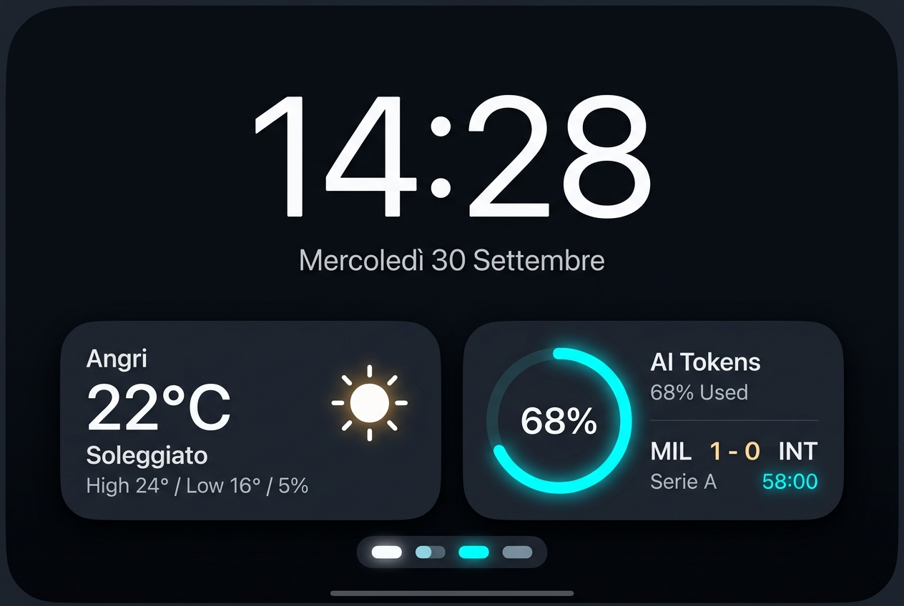
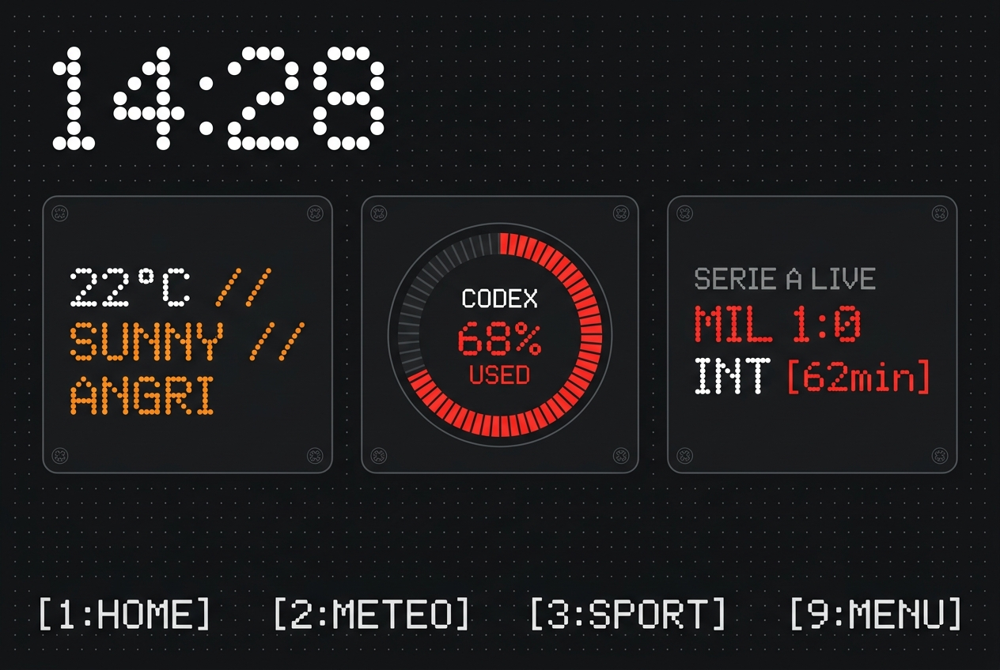
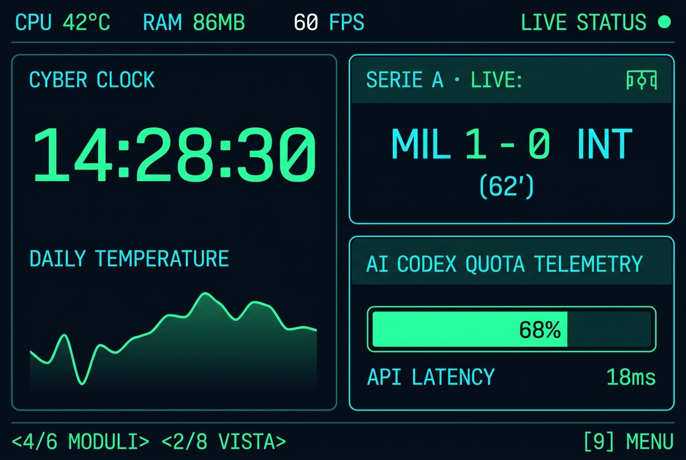
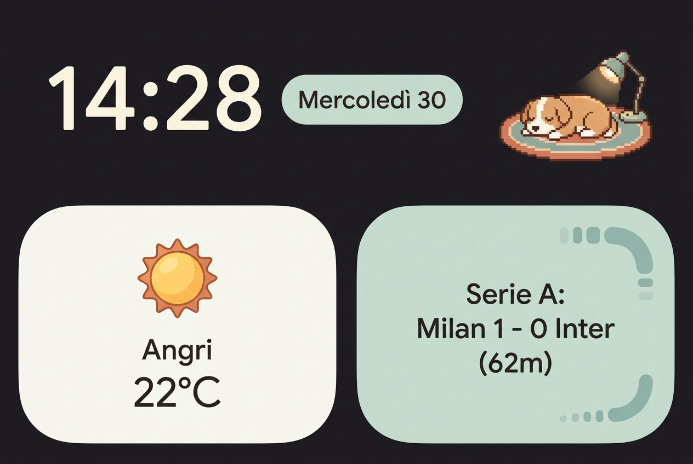
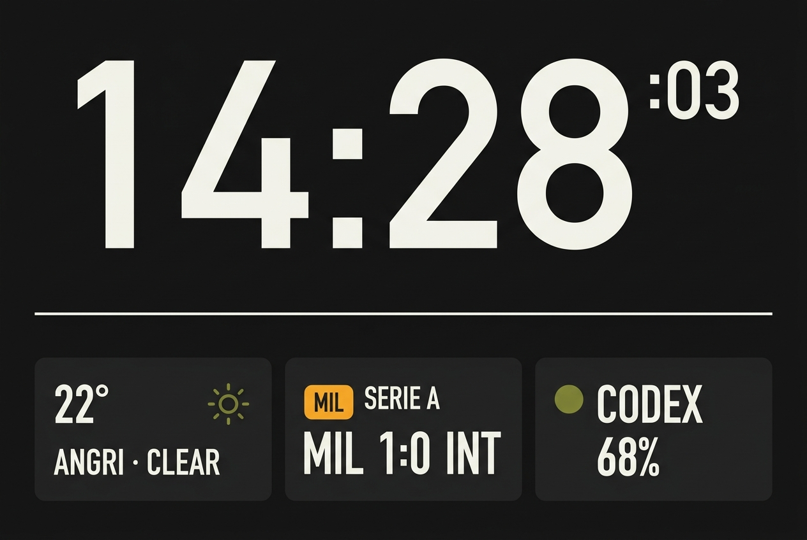
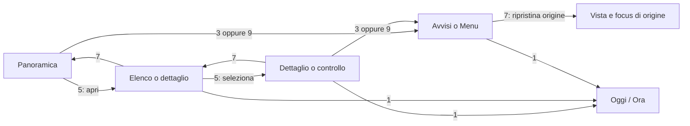

# DeskPulse / SmartPC — temi grafici ed esperienza d’uso

**Revisione 2.3 · 1 ottobre 2026.** Studio operativo per Orange Pi Zero 3W con SoC Allwinner A733, display Hagibis IPS da 3,5″, superficie QML 960×640, controllo fisico 3×3. La revisione conserva i cinque riferimenti visivi e integra l’armonizzazione fra l’azione stabile Home e la vista Giornata, la prevenzione da ritenzione d'immagine IPS (pixel-shift) e la selezione concreta dei font candidati aperti. Le proposte restano da implementare e collaudare; la lettura dei sorgenti e dei resoconti esistenti non costituisce un nuovo collaudo sulla board.

## 1. Decisione progettuale

La dashboard deve essere utile in quattro situazioni: leggere con uno sguardo, consultare un argomento, ricevere un evento, convivere con il compagno animato. È l’ordine di priorità del [Dashboard Orange Pi MasterPlan](codex://threads/01a0ef3d-1468-7d83-b386-fc79c7cc1e31).

**Direzione consigliata:** base neo-retro sobria, con gerarchia del Minimal, griglia del Braun e pochi accenti hardware. I cinque temi diventano variazioni dello stesso sistema: palette, font compatibili, forme e illustrazioni. Mantengono identici contenuti, significato dei tasti, focus, stati dei dati e comportamento degli avvisi.

La Home dà priorità a **ora, data e meteo**. Il prossimo evento occupa spazio soltanto quando esiste ed è rilevante per la persona. Account e Sport hanno pagine proprie; una soglia o un evento importante può produrre un avviso. Il cane ha uno spazio dedicato e non copre informazioni o controlli.

### Stato delle regole

**Decisa** indica un vincolo o una scelta di progetto consolidata nel documento. **Proposta da provare** indica una raccomandazione da valutare nel prototipo. **Implementata** descrive un comportamento riscontrato nei sorgenti, senza attestare un nuovo collaudo sulla board. Le regole possono essere decise ma ancora da implementare. Salvo indicazione diversa, palette, dimensioni, tempi ed esempi software sono proposte da provare.

| Regola | Stato progettuale | Riscontro nel software |
| --- | --- | --- |
| Home con ora/meteo ed evento condizionale | Decisa | Composizione dinamica presente in `HomeNow.qml` |
| Mappa 3×3 e navigazione a due assi | Decisa | Implementata; restano differenze nei dettagli elencate in sezione 9 |
| Carosello orizzontale circolare | Decisa | Implementato per le famiglie visibili |
| Fine corsa verticale, elenchi e sottomenu | Decisa nella v2.1 | Da uniformare; oggi alcune viste e alcuni menu sono circolari |
| Home: `5 · Riepilogo` sempre | Proposta da provare | Da implementare come pannello con contenuti selezionabili |
| Armonizzazione Home: `5 · Riepilogo` e `8 · Giornata` | Proposta da provare | Da valutare: unificare la vista o specializzarla rispetto al pannello |
| Riapertura Avvisi con selezione conservata per ID | Proposta da provare | Da completare e verificare durante aggiornamenti/scadenze |
| Font locali e token condivisi | Proposta da provare | Da implementare; nessuna garanzia di resa o prestazioni già misurata |
| Prevenzione ritenzione IPS (pixel-shift) | Proposta da provare | Spostamento ciclico impercettibile di ±1–2 px per l’orologio statico |
| Quiete del cane distinta dalla palette notte | Proposta da provare | Cane futuro; stato `quietActive` da esporre |
| Cache grafica tramite layer | Ipotesi tecnica da misurare | Nessuna attivazione obbligatoria prima del confronto |

### Vincoli confermati e obiettivi

| Aspetto | Regola |
| --- | --- |
| Display | Progettare direttamente a 960×640 (~330 PPI su 3,5″). Funzionamento continuo da scrivania: valutare salvaguardia da ritenzione d’immagine (pixel-shift) per elementi statici. |
| Input | Tutto il percorso normale deve essere completabile con i nove tasti. Nessuna funzione essenziale richiede touch, mouse, pressione lunga o doppio clic. |
| Navigazione | 4/6 cambiano argomento; 2/8 cambiano vista dello stesso argomento. Nei pannelli aperti i tasti agiscono sul contenuto del pannello. |
| Orientamento | Eliminare la riga fissa «SMARTPC / COMPANION · MODALITÀ NOTTE». Titolo della vista e indicazioni utili restano contestuali. |
| Prestazioni | 60 Hz del display e obiettivo di animazioni a 60 fps sono grandezze diverse. Misurare scene reali sulla board; a riposo il rendering può rallentare. |
| Notte | Palette e attenuazione devono mantenere leggibili dati e focus. L’attenuazione software non dimostra una regolazione fisica della retroilluminazione. |
| Dati | Distinguere assenza, zero reale, cache, aggiornamento, errore e informazione scaduta. |

### Correzioni rispetto alla prima analisi

- Le cinque immagini sono **1264×848**, non 960×640 esatti; il rapporto è vicino a 3:2. Sono riferimenti estetici, non layout approvati o prove di leggibilità.
- Orologio, meteo, quota AI e punteggio non sono quattro schede obbligatorie della Home. Questa impostazione contraddice la Home dinamica e aumenta la densità.
- «Layout Apple 80/20», «leggibilità impeccabile», «zero affaticamento» e «leggibile a un metro» non sono risultati dimostrati. Le proporzioni si scelgono per i nostri contenuti e si verificano sul dispositivo.
- Il pannello è IPS: parlare di «contrasto OLED» o di leggibilità garantita al sole non descrive l’hardware disponibile.
- Una percentuale di utilizzo Codex non è automaticamente una quantità di token. Etichetta, finestra e reset fanno parte del dato.
- Il footer del concept Nothing, con 2 Meteo e 3 Sport, contraddice la mappa direzionale: **2 Su, 3 Avvisi**.
- Il colore `#8ECAE6` del Cozy è azzurro; se si desidera salvia va scelta un’altra tinta. Le palette restano proposte da controllare per contrasto.

## 2. Cosa imparare dai prodotti conosciuti

Separiamo comportamenti documentati e ispirazioni estetiche. Un’immagine piacevole non dimostra un percorso di navigazione funzionante.

| Riferimento | Evidenza o natura del riferimento | Applicazione al nostro prodotto |
| --- | --- | --- |
| **Apple StandBy** | La guida descrive scorrimento orizzontale fra viste e verticale fra le opzioni di ciascuna vista. | Conferma che il modello a due assi è comprensibile. Lo traduciamo nei tasti 4/6 e 2/8, con orientamento visibile e senza richiedere gesti. [Guida Apple](https://support.apple.com/it-it/guide/iphone/iph878d77632/ios). |
| **Apple Watch · Live Activities** | Apple privilegia informazioni essenziali, contenuti rilevanti nel momento e aggiornamenti meno invasivi durante un’attività. | Il prossimo evento è condizionale; un aggiornamento ordinario non deve sostituire il dettaglio che la persona sta leggendo. [Sessione Apple](https://developer.apple.com/videos/play/wwdc2024/10098/). |
| **Android TV** | Il D-pad richiede un focus identificabile, selezione esplicita e ritorno prevedibile. | Nei pannelli esiste un solo elemento con focus; 5 agisce su quello, 7 torna al livello precedente. Ridurre i passaggi e mantenere la selezione. [Navigazione](https://developer.android.com/training/tv/get-started/navigation), [focus](https://developer.android.com/design/ui/tv/guides/styles/focus-system). |
| **Nothing / Teenage Engineering** | Ispirazione visiva nei concept forniti: etichette tecniche, geometria, matrice a punti, accenti hardware. | Usare pochi dettagli distintivi. Il font a punti non diventa il font dei testi lunghi. Non attribuiamo a questi marchi una mappa di tasti o una prestazione di lettura non documentata. |
| **Braun / Dieter Rams** | Ispirazione visiva: pochi elementi, allineamenti chiari, tipografia dominante. | Un dato principale e gerarchia stabile. Evitare tre colonne permanenti solo per ottenere simmetria. |
| **Cozy / Cyberdeck** | Direzioni estetiche, non una singola UX concorrente verificata. | Cozy guida il trattamento del compagno; Cyberdeck guida una vista PC/diagnostica. I comportamenti restano quelli comuni. |

Le fonti supportano i principi indicati. La mappa 3×3, i tempi proposti e i layout seguenti sono decisioni progettuali per questo apparecchio.

## 3. Revisione delle cinque immagini

### A. Minimal · riferimento per la gerarchia



**Da conservare:** ora dominante, data separata, pochi contenitori, buona distinzione fra dato principale e dettagli.

**Da correggere:** la scheda in basso mescola AI e partita; ring, ombre e bagliori consumano spazio. La barra da gesto touch non corrisponde al controllo fisico. Sostituire le schede permanenti con meteo esteso ed eventuale evento; inserire indicazioni dei tasti soltanto utili alla vista.

**Uso consigliato:** struttura principale di Home e viste di riepilogo. Un ring può restare nel dettaglio Account solo se percentuale e finestra sono esplicite e leggibili.

### B. Neo-Retro Hardware · riferimento per l’identità



**Da conservare:** etichette brevi, accento controllato, collegamento visivo con i tasti fisici.

**Da correggere:** sfondo puntinato, viti decorative e dot-matrix esteso competono con i dati. Le tre schede permanenti rendono la Home densa. Correggere il footer alla mappa reale. Il rosso decorativo deve distinguersi dagli avvisi tramite simboli, testo e forma.

**Uso consigliato:** variante di tema sulla stessa griglia Minimal/Braun. Dot-matrix limitato a un titolo breve o a cifre, dopo prova sul pannello. Corpo e comandi in font regolare.

### C. Cyberdeck · riferimento per PC e diagnostica



**Da conservare:** numeri allineati, barre semplici, visualizzazione della provenienza tecnica quando richiesta.

**Da correggere:** testata CPU/RAM/FPS permanente, secondi, grafici privi di unità e diciture «60 FPS» o «LIVE» senza evidenza. Una sparkline richiede grandezza, intervallo temporale e stato di aggiornamento; altrimenti è decorazione ambigua.

**Uso consigliato:** pagina PC e pannello Diagnostica. Come tema globale conserva la densità comune: nessuna telemetria obbligatoria sulla Home e nessuna animazione continua per produrre un numero FPS.

### D. Cozy · riferimento per il compagno



**Da conservare:** palette calda, presenza del cane, forme morbide senza effetti complessi.

**Da correggere:** grandi raggi e mascotte riducono l’area utile; la scheda partita deve essere condizionale. Manca una spiegazione del controllo fisico. Icone illustrate e cane pixel possono convivere soltanto con una scelta coerente di dimensioni, contorni e palette.

**Uso consigliato:** variante calda e vista Compagno prevista dal piano. Il cane non sposta l’ora, non cambia la selezione e riduce il movimento quando si leggono dettagli o avvisi.

### E. Functional · riferimento per griglia e sobrietà



**Da conservare:** allineamenti, separazione delle aree, numeri ampi, pochi effetti.

**Da correggere:** tre colonne troppo strette per squadre, finestre Account e stati dei dati; secondi non necessari nella Home; font condensato e icone scure da verificare. Aggiungere data e orientamento dove servono. Il contrasto visivo dell’immagine non garantisce leggibilità con riflessi sul display.

**Uso consigliato:** base comune insieme al Minimal, con peso tipografico sufficiente e accento verde acqua o ambra.

### Confronto per decidere cosa prototipare

Valutazione progettuale qualitativa, senza punteggi che simulino un test con utenti.

| Direzione | Lettura sul piccolo schermo | Rischio principale | Priorità |
| --- | --- | --- | --- |
| Minimal + Functional | Gerarchia chiara, spazio recuperabile | Font troppo sottile; aspetto poco personale | **Prima base da prototipare** |
| Neo-Retro sobrio | Identità forte con la stessa gerarchia | Decorazioni e dot-matrix eccessivi | Seconda variante, su componenti condivisi |
| Cozy | Buona con testo scuro su superfici chiare o testo chiaro su fondo scuro | Cane e forme sottraggono spazio | Variante e vista Compagno |
| Cyberdeck denso | Richiede lettura ravvicinata | Molti dati simultanei, stato live ambiguo | Vista PC/diagnostica; tema globale solo semplificato |

## 4. Home dinamica: contenuto, spazio e azioni

### Gerarchia comune

1. Ora e data hanno una posizione stabile.
2. Meteo mostra temperatura, condizione e stato del dato.
3. Un solo prossimo evento rilevante appare quando disponibile; il suo dettaglio vive nel modulo o in Avvisi.
4. Un badge di avvisi non letti compare quando il conteggio è maggiore di zero. Non richiede una barra di stato permanente.

Il prossimo evento è diverso da un banner appena arrivato e da un avviso urgente. Nessun aggiornamento ordinario apre automaticamente una nuova famiglia.

| Situazione | Home | Azione e comportamento |
| --- | --- | --- |
| Nessun evento rilevante | Ora, data e meteo largo | `5 · Riepilogo` apre il pannello Oggi con il meteo e il suo stato. Nessuna scheda vuota «Prossimo evento», nessun messaggio «nessun evento» permanente. |
| Evento futuro rilevante | Meteo più compatto, scheda con titolo e orario | `5 · Riepilogo` apre lo stesso pannello Oggi, con meteo ed evento selezionabili. |
| Più eventi | Un riepilogo principale e indicazione «altri N», se utile | `5 · Riepilogo` apre il pannello Oggi con accesso all’elenco eventi. Non inserire tre schede piccole sulla Home. |
| Meteo in aggiornamento | Ultimo dato valido e stato discreto | La temperatura non scompare per ogni richiesta. |
| Meteo salvato/offline | Ultimo dato e ora di aggiornamento | Il dato non è presentato come attuale. Nessun valore inventato. |
| Meteo mai disponibile | Ora/data e messaggio «Meteo non disponibile» | L’eventuale evento può restare visibile. Nessuno spinner infinito. |
| Evento scaduto o annullato | Recupero dello spazio per il meteo | Se il dettaglio è aperto, rimane aperto con «Terminato»/«Annullato»; 7 chiude. |

**Selezione dell’evento:** rispettare preferenze esplicite, disponibilità della fonte, finestra di rilevanza e scadenza. Fra eventi futuri dello stesso livello, scegliere il più vicino; a parità mantenere l’identità già mostrata. Un’urgenza segue il suo percorso di avviso, non compete come normale appuntamento. Il piano Sport richiede la scelta di una squadra prima di popolare la Home: vedere [v0.6 Sport](./v06-sport-plan.md).

**Proposta: azione Home stabile.** `5 · Riepilogo` sostituisce le precedenti azioni variabili «Dettagli meteo», «Apri evento» ed elenco. Il pannello Oggi ha una riga Meteo sempre presente, con il relativo stato, e una o più righe evento soltanto quando esistono. All’apertura il focus parte da Meteo; 2/8 selezionano una riga e 5 apre il dettaglio disponibile. Un dato indisponibile mantiene il messaggio di stato e non simula un’azione funzionante. 7 chiude il pannello e torna alla Home. Il costo è una pressione aggiuntiva per il dettaglio; il vantaggio è che un evento appena arrivato non cambia la destinazione del primo OK.

**Stabilità:** all’apertura del pannello memorizzare l’ID del contenuto selezionato. Gli aggiornamenti modificano quel contenuto senza cambiare destinatario di 5. Se un evento selezionato scade o viene annullato, mantenerne temporaneamente la riga nel pannello con il nuovo stato e le sole azioni ancora valide, finché la persona cambia selezione o chiude. Le nuove righe e il nuovo ordinamento vengono applicati alla riapertura; la Home passiva può aggiornarsi subito. Non trasferire silenziosamente il focus a un altro evento.

**Armonizzazione fra `5 · Riepilogo` e la vista `GIORNATA` (tasto 8):** la famiglia `Oggi` include già la vista verticale `GIORNATA` ([HomeDay.qml](../HomeDay.qml)), raggiungibile con 8 da `ORA`. Introdurre il pannello con 5 richiede di chiarire il rapporto tra i due accessi per evitare ridondanze:
- *Ipotesi A (Unificazione):* `HomeDay` evolve nel pannello operativo aperto da `5`, rendendo `Oggi` una schermata iniziale monolitica senza asse verticale superfluo.
- *Ipotesi B (Specializzazione):* `8 · Giornata` resta la timeline passiva a tutto schermo degli impegni del giorno, mentre `5 · Riepilogo` apre il pannello interattivo focalizzato sulle azioni (meteo e riga evento selezionabile). La scelta definitiva sarà verificata nel prototipo.

### Prima griglia da provare a 960×640

La Home attuale usa già meteo largo 872 px senza evento, oppure 520 px di meteo e 334 px di evento separati da 18 px. È una base concreta da confrontare con i titoli lunghi. Riferimento: [HomeNow.qml](../HomeNow.qml).

| Elemento | Parametro iniziale proposto |
| --- | --- |
| Margini laterali | 40–44 px; preservare spazio per bordo di focus |
| Ora | 140–160 px, cifre tabulari, peso Regular/Medium da confrontare con l’attuale Light |
| Data | 30–34 px, una riga; versione abbreviata quando serve |
| Card meteo/evento | Altezza circa 160–190 px; massimo due righe di titolo evento |
| Dato primario nelle card | 42–56 px, compatibilmente con larghezza e contenuto |
| Testo informativo | 30–36 px; evitare il progressivo restringimento per far entrare ogni dato |
| Indicazioni contestuali | 26–28 px; dettagli tecnici più piccoli soltanto nel pannello dedicato |

Questi numeri sono punti di partenza, non misure di leggibilità approvate. Su un pannello nominale da 330 PPI, 32 px corrispondono a circa 2,46 mm di dimensione em; l’altezza effettiva delle lettere dipende dal font. L’alta risoluzione non elimina il limite fisico dei 3,5″.

## 5. Navigazione: contratto unico per il 3×3

| 1 · HOME | 2 · SU | 3 · AVVISI |
| --- | --- | --- |
| 4 · SINISTRA | **5 · OK** | 6 · DESTRA |
| 7 · INDIETRO | 8 · GIÙ | 9 · MENU |

Usare frecce e simboli sui copritasti quando possibile. I numeri visualizzati sul display corrispondono alle posizioni fisiche. Un’unica pagina Comandi, raggiungibile da 9, spiega la mappa; nessuna istruzione permanente occupa tutta la testata.

### Due livelli leggibili

**Panoramica:** la pagina corrente è il contesto selezionato. 4/6 cambiano famiglia e 2/8 vista. Il titolo indica dove ci si trova. Un’etichetta come `5 · Dettagli` appare solo se esiste un dettaglio.

**Pannello:** titolo, selezione visibile e indicazioni contestuali chiariscono che le frecce agiscono dentro il pannello. Il layout può sostituire la pagina a tutto schermo; non deve per forza essere una piccola finestra sovrapposta.

**Scelta proposta per la scoperta dei comandi:** in panoramica, la prima pressione mostra per circa otto secondi argomento/vista e guida essenziale `4/6 Argomenti · 2/8 Viste · 5 [azione]`; Account indica invece `2/8 Finestre`. Titolo e azioni restano visibili nei pannelli, negli errori e quando serve una scelta. L’aiuto può attenuarsi solo durante la lettura passiva, senza spostare il contenuto. La pagina Comandi rimane sempre raggiungibile con 9.



### Significato dei comandi per stato

| Stato | 2/8 | 4/6 | 5 | 7 |
| --- | --- | --- | --- | --- |
| Home · proposta | Vista precedente/successiva di Oggi | Famiglia precedente/successiva | Riepilogo Oggi | Resta a Oggi/Ora |
| Panoramica | Vista precedente/successiva | Famiglia precedente/successiva | Dettaglio nominato | Oggi/Ora |
| Riepilogo Oggi · proposta | Seleziona Meteo o evento | Nessuna azione | Apre il dettaglio disponibile | Torna alla Home |
| Account · Utilizzo | Scorre le finestre disponibili, con indicatore di posizione | Cambia famiglia | Dettaglio, se previsto | Oggi/Ora |
| Menu o elenco | Sposta la selezione | Nessuna azione, salvo tab esplicite | Apre la voce | Ripristina origine |
| Sport · elenco partite/classifica | Sposta la selezione | Cambia tab; sul selettore Giornata cambia turno | Apre partita o entra nelle righe | Torna alla panoramica |
| Sport · dettaglio | Scorre il contenuto quando eccede lo spazio | Riepilogo / Statistiche / Formazioni | Aggiorna, con etichetta esplicita | Torna alla partita selezionata |
| Impostazione numerica, proposta | Seleziona un altro campo | Diminuisce/aumenta | «Fine» o azione dichiarata, senza incremento implicito | Esce dal controllo |
| Impostazione booleana, proposta | Seleziona un altro campo | 4 disattiva, 6 attiva | Inverte, con stato leggibile | Esce |
| Conferma di un comando futuro | Selezione fra azioni, se verticale | Selezione fra azioni, se orizzontale | Esegue soltanto l’azione selezionata | Annulla prima dell’invio |

1 torna sempre a Oggi/Ora. 3 apre l’inbox Avvisi e 9 il Menu preservando la destinazione di ritorno; una seconda pressione quando quel pannello principale è già aperto lo chiude. Dal dettaglio di un avviso, la proposta è che 3 torni all’inbox esistente senza aggiungere un altro livello alla pila. Nelle future conferme di comandi, 3/9 sospendono la bozza conservandola senza inviare il comando; 7 annulla la bozza prima dell’invio.

Un’azione già inviata non è annullata dal semplice cambio pagina. Mostrare «In attesa», poi l’esito effettivo; il nuovo stato del dispositivo conferma il risultato. Una conferma extra è riservata alle conseguenze importanti, non a ogni consultazione.

### Regole di orientamento e input

- Conservare l’ultima vista di ogni famiglia, l’ID della riga selezionata e lo scorrimento. 1 ripristina solo Oggi/Ora; non azzera tutte le preferenze.
- Mantenere il carosello orizzontale circolare già implementato per i moduli (4/6), saltando quelli nascosti. Un indice e, se c’è spazio, nomi dei vicini rendono il percorso riconoscibile.
- **Decisa · politica dei limiti e fine corsa:** le viste verticali (2/8), gli elenchi e i sottomenu devono **fermarsi a fine corsa**. Raggiunta la prima o l’ultima riga, ulteriori pressioni non devono riavvolgere la lista all’inizio. Freccia attenuata e indicatore di posizione (`1/3`, `3/3`) segnalano il limite senza richiedere un’animazione. Un eventuale feedback elastico resta una proposta accessoria, disattivata con movimento ridotto. La politica è da uniformare nel software.
- Account ha una sola vista con elenco di finestre: non simulare pagine diverse. Un indicatore di scorrimento rende comprensibile l’eccezione 2/8.
- Nuovi dati non riordinano l’elenco sotto il focus. Conservare l’ID; quando necessario aggiornare l’ordinamento al ritorno alla panoramica.
- Il decoder attuale ignora rilascio e auto-repeat: progettare una pressione come un passo. Le pressioni lunghe non sono scorciatoie richieste. [keypad.py](../keypad.py).
- **Input duplicati · verifica condizionale:** il lettore riceve eventi USB; un possibile rimbalzo meccanico non dimostra che arrivino pressioni duplicate all’applicazione. Prima di introdurre un debounce, acquisire sequenze con codice, pressione/rilascio e timestamp monotono, distinguendo duplicati, auto-repeat e due pressioni reali. Non prescrivere un minimo di 80–100 ms senza misure: potrebbe scartare pressioni rapide intenzionali. Se emergono duplicati, applicare una deduplicazione mirata per tasto e conservarne le evidenze. Il percorso delle azioni impedisce separatamente un secondo invio dello stesso comando mentre il primo è pendente; Home e Indietro restano disponibili.
- Accettare subito l’intenzione di navigazione anche durante una transizione; la posizione logica deve corrispondere alle pressioni. 1 e 7 interrompono l’animazione. Nessuna coda esegue un vecchio OK dopo un cambio di contesto.
- All’arrivo di un’urgenza, scartare intenzioni precedenti ancora pendenti: un vecchio 5 non deve confermare il nuovo avviso.
- Se il tastierino si scollega, mostrare uno stato discreto e mantenere la pagina. Alla riconnessione riprendere senza resettare il focus; lo sviluppo può offrire i tasti equivalenti sul PC.

### Famiglie attuali e future

La lettura dei sorgenti al 30 settembre mostra **Oggi → Meteo → Account ChatGPT → Sport**, filtrate dalle preferenze e dalla disponibilità Sport. Casa e PC restano sviluppi del MasterPlan; Compagno è una vista prevista di Oggi. Non aggiungere pagine vuote per questi moduli.

La v0.6 Sport offre Prossime, eventuale In corso, Risultati e Classifica. Il percorso dettagliato e i limiti del live sono nel [resoconto v0.6](./v06-sport-ux-fix.md). Questa analisi non riporta Sport a un vecchio placeholder né sposta Account fuori dal carosello.

Nascondere un modulo rimuove le sue pagine; sincronizzazione e politica degli avvisi sono preferenze distinte. Aggiungere una nuova famiglia non deve alterare improvvisamente il contesto della persona. Con molte famiglie, valutare un elenco rapido dei moduli dal Menu prima di moltiplicare le scorciatoie sui tasti.

## 6. Focus, aggiornamenti e avvisi

Il **focus** indica il prossimo destinatario di 5; la **selezione** può indicare una tab attiva o un’impostazione già scelta. Devono essere distinguibili. Usare bordo più riempimento e testo/icona; il solo colore non basta. Evitare ingrandimenti che tagliano contenuti o spostano righe adiacenti.

| Evento | Presentazione proposta | Effetto sulla navigazione |
| --- | --- | --- |
| Aggiornamento ordinario | Valore aggiornato nella pagina; nessun banner per ogni polling | Nessun cambio di focus |
| Informazione ambientale | Badge o breve banner se abilitato | Non cattura i tasti; approfondimento da 3 |
| Avviso importante | Banner leggibile, durata configurata; nell’inbox fino a scadenza | Conserva pagina, pannello e selezione; durante consultazione ridurre l’invasività |
| Urgenza | Pannello prioritario con messaggio, fonte e azioni esplicite | Sospende il contesto; 5 apre, 7 chiude, 1 va a Home. La condizione della fonte rimane distinta dalla chiusura del pannello |

Non confondere **ricevuto, letto, pannello chiuso, condizione risolta e scaduto**. Nella navigazione attuale l’apertura del dettaglio segna l’avviso come letto; aprire soltanto l’inbox non lo fa. Chiudere una notifica non implica che una presa, una soglia o un’allerta sia tornata normale.

**Proposta · riapertura Avvisi:** 3 apre sempre l’inbox. Ricordare l’ID dell’ultimo avviso consultato e selezionarlo se ancora presente, rendendolo visibile nello scorrimento. Se è scaduto, scegliere la riga valida più vicina alla sua posizione precedente; se l’inbox è vuota, mostrare «Nessun avviso attivo» con 7 Indietro. La selezione automatica non segna l’avviso come letto. Dal dettaglio, 7 torna all’inbox da cui è stato aperto; dall’inbox, 7 ripristina vista, scorrimento e focus di origine. Un dettaglio aperto direttamente da un’urgenza conserva invece la sua origine diretta. Non duplicare l’inbox nello stack quando si preme 3 dentro il suo dettaglio.

Identità stabile e versione del contenuto permettono deduplicazione e correzioni. Una revoca del gol aggiorna l’evento originale e indica la correzione; non conserva due risultati contraddittori. Gli eventi scaduti non ricompaiono dopo un riavvio. I nuovi avvisi possono aumentare il conteggio senza rubare il focus alla riga che si sta leggendo.

**Proposta temporale iniziale:** banner brevi 6–8 secondi, con testo ridotto; messaggi lunghi si leggono nel dettaglio senza scadenza automatica. Urgenze restano fino a chiusura o scadenza prevista dalla fonte. Sono parametri da confrontare con le preferenze esistenti, non nuovi valori già applicati.

**Rotazione automatica: distinguere due comportamenti.** La rotazione fra famiglie è un’opzione ambientale futura. La rotazione dei gruppi di partite dentro una vista Sport è già presente nei sorgenti: `sportOverviewTimer` alterna le pagine ogni otto secondi quando ci sono più gruppi e non è aperto un pannello. [Main.qml](../Main.qml). Non sono la stessa funzione.

**Proposta da applicare a entrambe:** la prima pressione sospende la rotazione; le pressioni successive prolungano la sospensione. Nessuna ripresa mentre sono aperti dettaglio, elenco, conferma, Avvisi o Menu. Per la rotazione interna, riprendere dopo inattività configurata tornando al gruppo che si stava leggendo; per le famiglie, riprendere solo se l’opzione ambientale è abilitata. La durata di inattività resta da scegliere nella prova fisica. Il ritorno automatico alla Home è disattivato come scelta iniziale.

## 7. Dati comprensibili e microtesti

Stato del servizio e stato del contenuto sono separati. Una richiesta riuscita non rende necessariamente recente uno snapshot vecchio; un dettaglio appena scaricato non aggiorna l’intero calendario. Ogni modulo conserva provenienza e timestamp corretti.

| Condizione | Microtesto indicativo | Regola |
| --- | --- | --- |
| Richiesta iniziale | «Caricamento…» | Attesa finita; poi dato o messaggio di errore. 7 e 1 restano utilizzabili. |
| Cache disponibile | «Dati salvati · aggiornati ieri alle 18:40» | Conservare valori e data; evitare il solo orario quando può riferirsi a ieri. |
| Refresh in corso | «Aggiornamento…» | Tenere visibile il dato precedente. |
| Errore senza dati | «Dati non disponibili» + motivo breve utile | Niente traceback; dettagli tecnici nei log. |
| PC/bridge non raggiungibile | «PC non raggiungibile · ultimo dato …» | Non dedurre automaticamente che il PC sia spento. |
| Dato non pubblicato | «Formazioni non ancora pubblicate» | Non presentarlo come errore di rete. |
| Fonte sportiva interrotta | «Dati precedenti · verificati …» | Rimuovere Live; non dedurre fine partita dall’assenza di aggiornamenti. |

Meteo: zero gradi è un valore valido; valori nulli restano assenti. Sport: prima del calcio d’inizio mostrare VS e orario, non 0–0; dopo l’inizio 0–0 è un risultato valido. Rinvio, conclusione e annullamento sono stati distinti. Il prossimo evento sportivo appare sulla Home solo secondo preferenze e rilevanza; «live» e notifiche gol seguono il gate del piano Sport, attualmente ancora da completare.

Account: mostrare l’origine della misura, la finestra, **«utilizzato» oppure «disponibile»** e il reset. Se la fonte offre più finestre, mantenerle separate. Piano, percentuali e saldo eventualmente disponibile non diventano una somma. «68% utilizzato» è incompleto senza la relativa finestra; non chiamarlo «68% token». I dati assenti non valgono zero. La consultazione resta di sola lettura secondo il MasterPlan.

Titoli lunghi: due righe nella Home, nome completo nel dettaglio; abbreviazioni di squadre solo se riconoscibili e coerenti. Evitare marquee automatici e riduzione del font fino a rendere il testo illeggibile. Una riga nascosta richiede scorrimento o indicatore, non taglio silenzioso.

## 8. Sistema grafico condiviso

### Token e componenti

Un’unica definizione di tema espone ruoli come `background`, `surface`, `textPrimary`, `textSecondary`, `accent`, `focus`, `warning`, `critical`, `radiusCard`, `spacingUnit`, `fontBody`, `fontNumbers` e `motionDuration`. Usare questi stessi nomi negli esempi e nei componenti; `motionDuration` è espresso in millisecondi e spazi/raggi in pixel QML. I cinque profili previsti assegnano valori a questi ruoli. I componenti consumano i ruoli, senza conoscere il nome del tema.

Componenti comuni: titolo di vista, dato principale, card informativa, stato del dato, riga selezionabile, tab, guida contestuale dei tasti, banner e dettaglio. La logica di navigazione e i provider rimangono unici. Separare la densità di una pagina PC dal tema Cyberdeck evita che cambiare colore aggiunga nuove informazioni.

| Profilo | Fondo / superficie proposti | Testo / accento proposti | Carattere |
| --- | --- | --- | --- |
| Base | `#101923` / `#192A36` | `#F4F6F7` / `#68D5C6` | Neo-retro sobrio, sans leggibile |
| Functional | `#151515` / `#242424` | `#F0F0EE` / `#F5A623` | Allineamenti rigorosi, angoli contenuti |
| Hardware | `#111215` / `#242528` | `#F4F4F0` / `#E9A15B` | Etichette brevi, dettagli tecnici limitati |
| Cozy | `#18171C` / `#29262C` | `#F2EBDD` / `#B2C5AD` | Toni caldi, salvia, curve moderate |
| Cyberdeck | `#070E17` / `#152431` | `#E7F5EE` / `#73E3AE` | Numeri monospazio, gerarchia invariata |

Le coppie sono candidate; il contrasto va controllato per ogni ruolo e stato, inclusi testo secondario, focus, banner e attenuazione notte. Non attribuiamo un esito di contrasto a palette non ancora implementate.

#### Architettura software: Singleton `Theme.qml`

**Proposta architetturale:** un singleton QML in una directory dedicata `dashboard/themes/`, importato dai componenti. Un oggetto Python esposto come context property sarebbe una soluzione diversa; per questo studio scegliamo il singleton QML. `pragma Singleton` da solo non basta: occorre anche dichiarare il tipo nel `qmldir`. [Singleton QML · Qt](https://doc.qt.io/qt-6.8/qml-singleton.html).

Esempio di struttura da implementare, non file runtime già aggiunti da questa revisione:

```text
dashboard/
  themes/
    qmldir
    Theme.qml
  fonts/
    [file font e relative licenze da scegliere]
```

```text
# dashboard/themes/qmldir
singleton Theme 1.0 Theme.qml
```

Estratto dei token per i soli profili iniziali Base e Functional:

```qml
// dashboard/themes/Theme.qml
pragma Singleton
import QtQuick

QtObject {
    property string activeProfile: "base"
    readonly property var availableProfiles: ["base", "functional"]
    readonly property string resolvedProfile:
        availableProfiles.indexOf(activeProfile) >= 0 ? activeProfile : "base"
    readonly property bool functional: resolvedProfile === "functional"
    readonly property color background:    functional ? "#151515" : "#101923"
    readonly property color surface:       functional ? "#242424" : "#192a36"
    readonly property color accent:        functional ? "#f5a623" : "#68d5c6"
    readonly property color textPrimary:   functional ? "#f0f0ee" : "#f4f6f7"
    readonly property color textSecondary: functional ? "#a0a09e" : "#8ea5ac"
    readonly property int radiusCard:      functional ? 6 : 13
    readonly property int spacingUnit:     8
    readonly property int motionDuration:  180
}
```

Esempio di importazione in un componente nella directory `dashboard/`:

```qml
import QtQuick
import "themes" as Appearance

Rectangle {
    color: Appearance.Theme.surface
    radius: Appearance.Theme.radiusCard
}
```

I componenti esistenti ([InfoCard.qml](../InfoCard.qml), [WeatherNow.qml](../WeatherNow.qml), [Main.qml](../Main.qml)) sostituiscono gradualmente i valori hardcoded con i token. Completare anche font, focus, stati ed effetti della notte prima di considerare il profilo completo. Hardware, Cozy e Cyberdeck rimangono nello studio, ma non appaiono nel selettore finché i loro token non sono implementati. Un nome non supportato usa Base; non presenta un profilo diverso con colori indistinguibili dalla Base.

### Leggibilità e accessibilità

- Obiettivo di progetto: almeno **4,5:1 per tutti i testi informativi**, anche quando grandi, e 3:1 per indicatori essenziali di controllo rispetto allo sfondo adiacente. È una scelta prudente ispirata ai criteri WCAG, non una certificazione della dashboard. [Contrasto testo W3C](https://www.w3.org/WAI/WCAG22/Understanding/contrast-minimum.html), [contrasto non testuale](https://www.w3.org/WAI/WCAG22/Understanding/non-text-contrast.html).
- Il pixel QML sul dispositivo non va equiparato automaticamente al CSS pixel delle soglie WCAG. Misurare la dimensione fisica, il peso del font e la lettura sul pannello.
- Usare cifra tabulare per ora, punteggi e percentuali. Limitare font condensati, pesi Light e monospazio nei testi lunghi. Distribuire un font di cui è verificata la possibilità d’uso e prevedere un fallback con ingombri compatibili.
- **Proposta · font locali:** distribuire in `dashboard/fonts/` i file esatti dei font scelti, con versione, pesi e licenze che ne consentano la redistribuzione (es. licenza SIL Open Font). I candidati primari per la verifica sono **Inter** (`Inter-Regular.ttf`, `Inter-SemiBold.ttf`) per la massima leggibilità dei testi e delle etichette a 330 PPI, e **JetBrains Mono** (`JetBrainsMono-Bold.ttf`) per l’orologio e le cifre tabulari, prevenendo oscillazioni di larghezza al cambio minuto. Caricare con `FontLoader`, usare la famiglia effettivamente caricata e gestire `Ready`/`Error` con un fallback dichiarato. Questo controlla il font utilizzato e riduce la dipendenza dall’installazione di sistema, ma non garantisce una resa identica al pixel: backend, scala, versione Qt e modalità di rendering possono differire. Non attribuire automaticamente a `fontconfig` eventuali caratteri sgranati. Controllare accenti, °, segni, pesi e ritorni a capo su PC e board. [FontLoader · Qt](https://doc.qt.io/qt-6/qml-qtquick-fontloader.html), [rendering del testo · Qt](https://doc.qt.io/qt-6/qml-qtquick-text.html#renderType-prop).
- Errore, stato attivo, focus e avviso si distinguono anche per testo, simbolo o bordo. «Rosso» da solo non significa urgenza, soprattutto nei temi con accenti rossi.
- Nessuna indicazione essenziale dipende da blink, glow o animazione. La modalità con movimento ridotto deve conservare tutte le informazioni.
- L’interfaccia supporta almeno nomi italiani accentati, numeri con segno, simbolo ° e date a cavallo di mezzanotte. Formato 24 ore e fuso Europe/Rome coerenti con il progetto.
- Evitare nomi account e informazioni domestiche personali sulla Home come impostazione iniziale; il dettaglio volontario può mostrarle quando necessarie.

### Movimento e cambio tema

Proposta iniziale: transizioni di 160–220 ms, con direzione coerente all’asse; focus aggiornato immediatamente; modalità ridotta con transizione minima. Non animare tutto il contenuto a ogni polling. Il cane usa asset precaricati e attività limitata durante la consultazione.

- **Rendering PowerVR · ipotesi da misurare:** la board del progetto è Allwinner **A733**, come documentato in [build-info.txt](../../os/kernel-patches/build-info.txt); il resoconto registra il renderer PowerVR B-Series BXM-4-64. [Audit grafico](../../os/board-audit-2026-09-29.md). Spostare `contentLayer.x` non implica che tutto il testo venga ricostruito sulla CPU a ogni frame: il scene graph conserva geometria e può aggiornare la trasformazione. `layer.enabled` aggiunge un rendering fuori schermo e memoria, limita il batching e può peggiorare le prestazioni. Non azzera la CPU e non garantisce 60 fps. Conservare inizialmente il rendering ordinario; valutare un layer temporaneo solo se il confronto sulla stessa scena evidenzia un miglioramento, includendo attivazione, aggiornamenti durante l’animazione e rilascio della texture. [Scene graph · Qt](https://doc.qt.io/qt-6/qtquick-visualcanvas-scenegraph-renderer.html), [memoria e prestazioni dei layer · Qt](https://doc.qt.io/qt-6/qml-qtquick-item.html#memory-and-performance).
- **Proposta · quiete della mascotte:** separare tre preferenze: palette/attenuazione notte, silenzio delle notifiche e movimento ridotto. `quietHoursEnabled` significa che la funzione è abilitata, non che la fascia sia attiva in quel momento. Esporre uno stato derivato `quietActive`, calcolato da abilitazione, ora locale e intervallo, gestendo il passaggio della mezzanotte. [Impostazioni esistenti](../state.py). Durante `quietActive` il cane usa la posa di riposo e sospende salti e fumetti ambientali; con movimento ridotto privilegia pose statiche anche di giorno. La sola palette notte non lo obbliga a dormire. Gli avvisi prioritari conservano la propria politica; nessuna posa del cane ne oscura il contenuto.
- **Proposta · salvaguardia del display IPS (pixel-shift):** la dashboard è un appliance da scrivania *always-on*. Sebbene l’IPS non soffra del degrado chimico permanente tipico dell’OLED, la permanenza continua di cifre fisse ad altissimo contrasto (come l’orologio da 150 px) può causare ritenzione temporanea d’immagine (*image persistence* dei cristalli liquidi). Una proposta da verificare è un micro **pixel-shift** ciclico impercettibile (spostamento di $\pm 1$ o $\pm 2$ pixel ogni 15–20 minuti dell’origine di ora e data), che preserva i sub-pixel senza alterare la lettura.

Cambiare tema deve preservare famiglia, pannello, scorrimento, focus, dati e stato delle richieste. Il tema è salvato nelle preferenze già usate dal progetto. Un profilo non valido torna alla Base. Font e immagini si preparano prima del cambio; non promettere un cambio senza riavvio prima della prova QML. Un’unica pagina `9 → Impostazioni → Aspetto → Tema` è il percorso proposto.

## 9. Differenze fra proposta e codice di oggi

La [mappa UX v2](./ux-navigation-v2.md) è il riferimento dei comandi già sviluppati; [Main.qml](../Main.qml) e i componenti mostrano il comportamento corrente. La tabella seguente evita di scambiare questo studio per funzioni già rilasciate.

| Area | Riscontro nei sorgenti / resoconti | Miglioramento da sviluppare |
| --- | --- | --- |
| Home | Meteo espanso senza evento già presente | Prototipare `5 · Riepilogo` stabile e selezione interna per ID; verificare titoli lunghi |
| Famiglie | Oggi, Meteo, Account, Sport; visibilità configurabile | Orientamento con posizione e vicini, senza testata di branding |
| Verticale | Viste principali e alcuni menu circolari; liste Avvisi e Sport limitate ai bordi | Applicare la scelta decisa: fine corsa verticale anche in viste e sottomenu |
| Impostazioni | In vari controlli 5 incrementa o inverte come 6; nei moduli anche 4/6 invertono | Distinguere regolazione numerica, attivazione esplicita e conferma; etichette coerenti |
| Sport | Elenco giornata, tab, dettaglio e ritorno implementati; gate live non concluso | Verificare manualmente il tastierino e la leggibilità; non ampliare la Home prima delle preferenze |
| Avvisi | Inbox, stato letto, banner e priorità già presenti | Riapertura nell’inbox con ultimo ID valido selezionato; ritorno all’origine e gestione delle scadenze |
| Rotazione Sport | Gruppi di partite alternati ogni otto secondi, con pannelli chiusi | Sospendere anche dopo input manuale; riprendere dopo inattività configurata |
| Input | Decoder filtra rilascio e auto-repeat | Acquisire eventuali duplicati prima di introdurre filtri temporali; evitare doppi invii di comandi pendenti |
| Temi | Colori e parametri ancora distribuiti nei componenti | Introdurre token condivisi; poi due profili iniziali |
| Prestazioni | Esiste una misura breve v0.6, con limiti dichiarati nel resoconto | Misurare le scene del tema scelto sulla board; nessuna etichetta 60 FPS costante nella UI normale |

La roadmap aggiornata del MasterPlan mantiene v0.7 Casa, v0.8 PC, v0.9 Cane e v0.10 Memoria/AI. Il lavoro grafico attraversa queste versioni: il sistema comune viene prima della produzione di molte scene del cane.

## 10. Piano di affinamento e criteri di uscita

Questo è il piano delle prove future; non sono state eseguite nuove prove funzionali, misure sulla board o sessioni di usabilità per questa revisione documentale.

### Fase A · chiudere il comportamento

Produrre una matrice definitiva di tasti per ogni stato e un prototipo QML con tema Base. Riutilizzare il pannello demo esistente per dati controllati. Il tema Functional è la prima alternativa sullo stesso layout.

| Percorso | Criterio osservabile |
| --- | --- |
| Home senza/con evento | Nessun buco o contenuto obbligatorio AI/Sport; ora stabile e meteo leggibile |
| Home → 5, prima/dopo l’arrivo di un evento | Si apre sempre Riepilogo Oggi; stesso focus iniziale, nessun cambio implicito di destinazione |
| Meteo → dettaglio → Avvisi → ritorno | Ritorno alla stessa vista e allo stesso scorrimento |
| Sport → giornata → partita → tab → ritorno | Stessa partita selezionata; azione 5 e selettore giornata riconoscibili |
| Account con 0, 1, 2 e più finestre | Nessun falso zero; scorrimento comprensibile; utilizzo e reset interpretabili |
| Modulo corrente nascosto | Ritorno a Home; nessuna pagina irraggiungibile o vuota |
| Evento nuovo, aggiornato, revocato e scaduto | Nessun furto di focus, duplicato incoerente o conferma accidentale |
| Avviso → chiusura → 3 | Si apre l’inbox con lo stesso ID selezionato se presente; scadenza gestita senza perdita dell’origine |
| Rete persa e recuperata | Stato reale, cache corretta, navigazione disponibile |
| Pressioni rapide e tastierino riconnesso | Un passo per pressione, nessun vecchio OK eseguito nel nuovo contesto |
| Rotazione Sport durante input e pannelli | Sospensione immediata, nessuna ripresa durante la consultazione di un pannello |
| Quiete abilitata fuori/dentro la fascia | Cane attivo o a riposo secondo `quietActive`; palette notte e movimento ridotto indipendenti |
| Tema o font non disponibile | Fallback dichiarato, UI leggibile e contesto conservato |
| Titoli lunghi e dati nulli | Nessun taglio delle azioni; il dato mancante non diventa zero |

### Fase B · verificare la lettura fisica

Confrontare Base e Functional sul display reale, con gli stessi dati. Eseguire le attività con il tastierino fisico, non soltanto con input simulati.

1. A 30–50 cm: leggere valore, stato e azione disponibile, poi raggiungere Meteo, Account, Sport e tornare.
2. A 80–100 cm: identificare ora e dato principale; annotare quali dettagli richiedono avvicinamento. Non pretendere che ogni metadato sia leggibile da questa distanza.
3. In luce diurna, con riflessi e con modalità notte: controllare focus, errori, dati salvati e avvisi.
4. Chiedere a una persona che non conosce la mappa di aprire una partita, leggere il reset Account e tornare al punto iniziale. Annotare pressioni, esitazioni, errori e richieste d’aiuto.

Obiettivi iniziali da verificare: riconoscere ora/condizione in circa due secondi; imparare il modello a due assi dopo una breve spiegazione; completare i percorsi principali senza mouse e senza assistenza; usare 1 per tornare a Home in una pressione e 7 per chiudere un livello. Raccogliere risultati reali prima di chiamare una variante «migliore».

### Fase C · grafica e prestazioni

Confermata la gerarchia, confrontare il Neo-Retro sobrio e il Cozy senza cambiare navigazione o dati. Misurare sulla board transizione orizzontale, verticale, scorrimento elenco, aggiornamento dati, banner e scena del cane. Annotare intervalli frame, latenza input/primo riscontro, picchi, CPU/RAM e temperatura. La misura deve distinguere periodo animato e riposo; il p95 degli intervalli non è il tempo GPU.

Un tema esce dalla fase di studio quando supera i percorsi previsti, mantiene leggibili testi e focus, conserva il contesto negli aggiornamenti ed è misurato nelle scene rappresentative. La preferenza estetica decide fra varianti che rispettano questi requisiti.

## 11. Ordine del prossimo lavoro

1. Prototipare la tabella dei comandi con `5 · Riepilogo` stabile sulla Home (valutando l’armonizzazione con `HomeDay`), ritorno agli Avvisi per ID e fine corsa verticale. Verificare gli input reali prima di introdurre una deduplicazione temporale.
2. Disegnare alla risoluzione esatta Home senza evento, Home con evento, dettaglio Sport, Account e Avvisi usando la Base comune.
3. Implementare `dashboard/themes/Theme.qml` con la dichiarazione `qmldir` e i font locali in `dashboard/fonts/`; migrare i componenti ai token condivisi per Base e Functional. Gestire profili e font non disponibili.
4. Effettuare la prova fisica con tastierino e display: leggibilità, ritorni, pressioni rapide, fine corsa e sospensione della rotazione Sport. Misurare prima il rendering ordinario; valutare layer soltanto con un confronto sulla board.
5. Estendere Neo-Retro e Cozy; produrre gli asset del cane dopo aver fissato palette, movimento ridotto e stato derivato `quietActive`. Cyberdeck entra prima come vista tecnica dedicata.

**Scelta raccomandata oggi:** procedere con la Base neo-retro sobria. Tenere Functional come confronto di leggibilità e ordine, senza mantenere cinque applicazioni o cinque navigazioni diverse.
