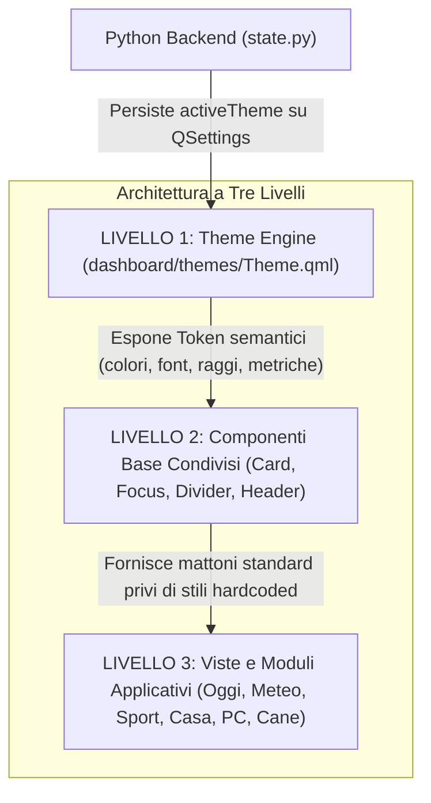
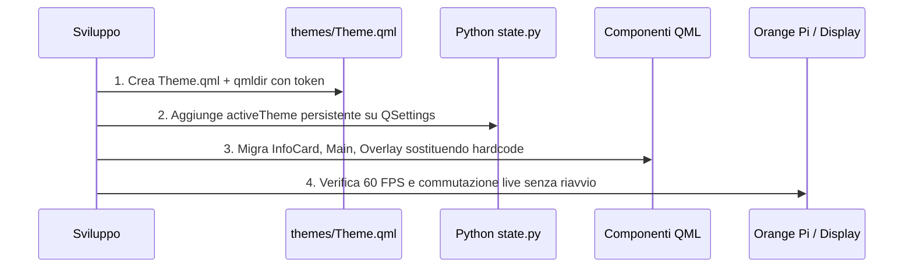

# Piano Operativo: Architettura dei Temi e Adattamento UX

**Revisione 1.0 · 1 ottobre 2026**  
Documento di specifica tecnica ed esecutiva per la trasformazione della dashboard DeskPulse / SmartPC in un sistema **ad alta personalizzabilità e a basso costo di manutenzione**.

---

## 1. Obiettivo e Filosofia del Progetto

Il principio cardine è: **"Personalizzare molto modificando pochissimo"**.

Attualmente, per cambiare lo stile o l'estetica della dashboard (es. passare dallo stile neo-retro attuale a uno stile *Braun Functional* o *Nothing Industrial*) bisognerebbe modificare a mano più di 15 file QML e rincorrere oltre 48 valori esadecimali sparsi.

### I 3 Pilastri dell'Architettura



1. **Separazione Totale tra Logica e Presentazione:** I moduli applicativi (Oggi, Meteo, Sport, Casa, PC) e la gestione dei tasti non devono conoscere colori, font o raggi di curvatura.
2. **Design Tokens Semantici Centralizzati:** Tutte le decisioni visive risiedono in un unico **Singleton QML** (`dashboard/themes/Theme.qml`).
3. **Invarianza della UX a 9 Tasti:** Il cambio di tema modifica radicalmente l'aspetto (palette, densità, tipografia, angoli, accenti grafici), ma **mantiene identici i contratti di navigazione** (4/6 orizzontale, 2/8 verticale, 1 Home, 5 Azione, 7 Back, 3 Avvisi, 9 Menu).

---

## 2. Analisi del Debito Tecnico Esistente (Mappatura dei 48 Hardcode)

La scansione del codice sorgente attuale rivela che l'interfaccia ha un principio di palette in `Main.qml` (`ink`, `muted`, `accent`, `panel`, `edge`), ma soffre di frammentazione nei componenti:

| Valore Esadecimale Attuale | Dove si trova nel codice | Ruolo Semantico Proposto | Token di Destinazione in `Theme.qml` |
| :--- | :--- | :--- | :--- |
| `#28403f` | 12 occorrenze (`SettingsPanel`, `SportOverlay`, `MotorsportOverlay`, `DashboardOverlay`, `SportFantasy`) | Sfondo della riga / card selezionata con focus attivo | `Theme.surfaceFocused` |
| `#0b1219` | 5 occorrenze (`DashboardOverlay`, `SettingsPanel`, `DeviceInfo`, `EventUrgent`, `Main.qml`) | Sfondo a tutto schermo degli overlay modali e notte | `Theme.backgroundOverlay` / `Theme.background` |
| `#efbd75` | 8 occorrenze (`SportView`, `MotorsportView`, `SportTeamView`, `SportTeamOverlay`, `EventUrgent`) | Testo di avviso, dato in cache (*stale*), o warning | `Theme.warning` / `Theme.textMutedStatus` |
| `#31505b` | 3 occorrenze (`Main.qml`, `HomeNow.qml`, `WeatherNow.qml`) | Linea orizzontale di separazione e regola superiore | `Theme.divider` |
| `#14232c` / `#1c2d38` | `InfoCard.qml`, `Main.qml` | Superficie normale delle schede (notte / giorno) | `Theme.surface` |
| `#29424b` / `#35525d` | `InfoCard.qml`, `Main.qml` | Bordo sottile delle card non selezionate | `Theme.border` |
| `#69bfa8` / `#6de0be` | `InfoCard.qml`, `Main.qml` | Accento primario (titoli card, selezione attiva) | `Theme.accent` |
| `#cddbd8` / `#e9f1ef` | `InfoCard.qml`, `Main.qml` | Testo primario ad alto contrasto | `Theme.textPrimary` |
| `#93a9ae` / `#b3c2c7` | `InfoCard.qml`, `Main.qml` | Testo secondario, timestamp e microtesti | `Theme.textSecondary` |
| `radius: 13` / `9` / `6` | Sparsi in `InfoCard`, `SettingsPanel`, `SportFantasy` | Raggio di curvatura delle superfici | `Theme.radiusCard`, `Theme.radiusPill` |

---

## 3. Struttura del Theme Engine (`dashboard/themes/`)

### Struttura delle Directory

```text
dashboard/
  ├── themes/
  │    ├── qmldir              # Registrazione singleton per QtQuick
  │    └── Theme.qml           # Motore dei token e definizione dei profili
  ├── fonts/
  │    ├── Inter-Regular.ttf   # Testo UI universale (SIL Open Font License)
  │    ├── Inter-SemiBold.ttf  # Titoli e bottoni
  │    └── JetBrainsMono-Bold.ttf # Numeri tabulari orologio e statistiche
```

### Registrazione del Singleton: `dashboard/themes/qmldir`

```text
singleton Theme 1.0 Theme.qml
```

### Specifica dei Token: `dashboard/themes/Theme.qml`

Il singleton espone ruoli semantici che reagiscono a due fattori combinati:
1. **`activeProfile`**: Il tema scelto dall'utente (`"base"`, `"functional"`, `"hardware"`, `"cozy"`, `"cyberdeck"`).
2. **`isNight`**: L'attenuazione automatica o manuale ereditata dallo stato giorno/notte della board.

```qml
pragma Singleton
import QtQuick

QtObject {
    id: theme

    // Collegamento con lo stato di sistema (iniettato da Main.qml o Python)
    property string activeProfile: "base"
    property bool isNight: false
    property bool animationsEnabled: true

    readonly property var availableProfiles: [
        { id: "base",       name: "Neo-Retro Base", detail: "Sobrio, verde acqua e navy scuro" },
        { id: "functional", name: "Braun Functional", detail: "Bauhaus, contrasto elevato e giallo ambra" },
        { id: "hardware",   name: "Nothing Industrial", detail: "Dot-matrix, tecnico, accento rosso/arancio" },
        { id: "cozy",       name: "Nordic Companion", detail: "Pastello caldo, salvia e forme morbide" },
        { id: "cyberdeck",  name: "Dev Cyberdeck", detail: "Fosforo verde, terminale e telemetria" }
    ]

    readonly property string resolvedProfile: {
        for (let i = 0; i < availableProfiles.length; ++i) {
            if (availableProfiles[i].id === activeProfile) return activeProfile
        }
        return "base"
    }

    // ==========================================
    // 1. COLORI DI SUPERFICIE E SFONDO
    // ==========================================
    readonly property color background: {
        if (resolvedProfile === "functional") return "#151515"
        if (resolvedProfile === "hardware")   return "#111215"
        if (resolvedProfile === "cozy")       return "#18171c"
        if (resolvedProfile === "cyberdeck")  return "#070e17"
        return isNight ? "#0b1219" : "#101923" // base
    }

    readonly property color surface: {
        if (resolvedProfile === "functional") return "#242424"
        if (resolvedProfile === "hardware")   return "#1c1d22"
        if (resolvedProfile === "cozy")       return "#26232b"
        if (resolvedProfile === "cyberdeck")  return "#101d28"
        return isNight ? "#14232c" : "#1c2d38" // base
    }

    readonly property color surfaceFocused: {
        if (resolvedProfile === "functional") return "#363636"
        if (resolvedProfile === "hardware")   return "#2c2a27"
        if (resolvedProfile === "cozy")       return "#38323f"
        if (resolvedProfile === "cyberdeck")  return "#13312b"
        return "#28403f" // base
    }

    readonly property color border: {
        if (resolvedProfile === "functional") return "#383838"
        if (resolvedProfile === "hardware")   return "#3a3b40"
        if (resolvedProfile === "cozy")       return "#413a4a"
        if (resolvedProfile === "cyberdeck")  return "#1c3c3a"
        return isNight ? "#29424b" : "#35525d" // base
    }

    readonly property color divider: {
        if (resolvedProfile === "functional") return "#404040"
        if (resolvedProfile === "hardware")   return "#2a2b30"
        if (resolvedProfile === "cozy")       return "#3a3442"
        if (resolvedProfile === "cyberdeck")  return "#15332f"
        return "#31505b" // base
    }

    // ==========================================
    // 2. COLORI TIPOGRAFICI E ACCENTI
    // ==========================================
    readonly property color textPrimary: {
        if (resolvedProfile === "functional") return "#f0f0ee"
        if (resolvedProfile === "hardware")   return "#f4f4f0"
        if (resolvedProfile === "cozy")       return "#f2ebdd"
        if (resolvedProfile === "cyberdeck")  return "#e7f5ee"
        return isNight ? "#cddbd8" : "#e9f1ef" // base
    }

    readonly property color textSecondary: {
        if (resolvedProfile === "functional") return "#a0a09e"
        if (resolvedProfile === "hardware")   return "#94969e"
        if (resolvedProfile === "cozy")       return "#a8a1b2"
        if (resolvedProfile === "cyberdeck")  return "#6f9e90"
        return isNight ? "#93a9ae" : "#b3c2c7" // base
    }

    readonly property color accent: {
        if (resolvedProfile === "functional") return "#f5a623" // Giallo ambra Braun
        if (resolvedProfile === "hardware")   return "#ff3b30" // Rosso Nothing / Safety Orange
        if (resolvedProfile === "cozy")       return "#8ecae6" // Salvia / pastello morbido
        if (resolvedProfile === "cyberdeck")  return "#00ffa3" // Fosforo verde CRT
        return isNight ? "#69bfa8" : "#6de0be" // Verde acqua base
    }

    readonly property color warning:  "#efbd75"
    readonly property color critical: "#f08779"

    // ==========================================
    // 3. GEOMETRIE, RAGGI E SPAZIATURE
    // ==========================================
    readonly property int radiusCard: {
        if (resolvedProfile === "functional") return 3  // Angoli quasi retti
        if (resolvedProfile === "hardware")   return 6  // Tecnico
        if (resolvedProfile === "cozy")       return 18 // Molto morbido
        if (resolvedProfile === "cyberdeck")  return 2  // Spigoli vivi
        return 13 // Base neo-retro
    }

    readonly property int radiusButton: {
        if (resolvedProfile === "functional") return 2
        if (resolvedProfile === "cozy")       return 12
        return 6
    }

    readonly property int borderWidthCard: resolvedProfile === "functional" || resolvedProfile === "cyberdeck" ? 1 : 2
    readonly property int borderWidthFocus: 2

    // ==========================================
    // 4. TIPOGRAFIA E FONT FAMILY
    // ==========================================
    property string fontBodyName: "Inter"
    property string fontNumbersName: "JetBrains Mono"

    // Fallback sicuro sui font
    readonly property string fontFamilyBody: fontBodyLoader.status === FontLoader.Ready ? fontBodyLoader.name : "sans-serif"
    readonly property string fontFamilyNumbers: fontNumbersLoader.status === FontLoader.Ready ? fontNumbersLoader.name : "monospace"

    FontLoader { id: fontBodyLoader; source: "qrc:/fonts/Inter-Regular.ttf" }
    FontLoader { id: fontNumbersLoader; source: "qrc:/fonts/JetBrainsMono-Bold.ttf" }

    // ==========================================
    // 5. MOVIMENTO E DINAMICA
    // ==========================================
    readonly property int motionDuration: animationsEnabled ? 180 : 0
}
```

---

## 4. Integrazione con Python (`dashboard/state.py`)

Per consentire la memorizzazione permanente del tema scelto dall'utente:

### Modifiche a `state.py`:
1. **Lettura all'avvio in `__init__`:**
   ```python
   self._active_theme: str = self._settings.value("activeTheme", "base", type=str)
   ```
2. **Proprietà esposta a QML:**
   ```python
   @Property(str, notify=activeThemeChanged)
   def activeTheme(self) -> str:
       return self._active_theme

   @Slot(str)
   def setActiveTheme(self, theme_id: str) -> None:
       if theme_id != self._active_theme:
           self._active_theme = theme_id
           self._settings.setValue("activeTheme", theme_id)
           self._settings.sync()
           self.activeThemeChanged.emit(theme_id)
   ```
3. **Integrazione in `SettingsPanel.qml`:**
   Nel menu `9 → Impostazioni → Aspetto`, trasformare la voce "Tema" in un selettore a carosello tra i profili registrati (`Base`, `Braun Functional`, `Nothing Hardware`, `Cozy`, `Cyberdeck`), lasciando la modalità notte come sottomenu o voce separata ("Modalità scura: Auto / Giorno / Notte").

---

## 5. Piano di Migrazione Step-by-Step (Senza Regressioni)

La migrazione è strutturata in 4 passaggi sequenziali per verificare che ogni componente continui a funzionare senza interrompere la suite di test esistente (`check_dashboard.py`, `check_sport_ui.py`).



### Fase 1: Creazione dell'Infrastruttura (Nessun impatto visivo)
* Creare `dashboard/themes/qmldir` e `dashboard/themes/Theme.qml`.
* Aggiungere `import "themes"` in [`Main.qml`](file:///home/giuseppe/Documenti/Workspace/SmartPC/dashboard/Main.qml).
* Collegare `Theme.activeProfile` a `dashboardState.activeTheme`.
* *Verifica:* Eseguire `./dashboard/run.sh --desktop`; l'app deve avviarsi identica a prima.

### Fase 2: Bonifica dei Componenti Chiave
* **[`InfoCard.qml`](file:///home/giuseppe/Documenti/Workspace/SmartPC/dashboard/InfoCard.qml):** Sostituire i colori hardcoded interni con `Theme.surface`, `Theme.border`, `Theme.textPrimary`, `Theme.radiusCard`.
* **[`HomeNow.qml`](file:///home/giuseppe/Documenti/Workspace/SmartPC/dashboard/HomeNow.qml):** Applicare `Theme.fontFamilyNumbers` all'orologio gigante e `Theme.divider` alla linea divisoria.
* **[`DashboardOverlay.qml`](file:///home/giuseppe/Documenti/Workspace/SmartPC/dashboard/DashboardOverlay.qml):** Sostituire `#0b1219` e `#28403f` con `Theme.background` e `Theme.surfaceFocused`.
* *Verifica:* Eseguire `python3 dashboard/check_dashboard.py` per accertarsi che i contratti di test non siano stati alterati.

### Fase 3: Bonifica dei Moduli Estesi
* **Sport & Motorsport:** Sostituire le occorrenze di `#28403f` e `#efbd75` in [`SportOverlay.qml`](file:///home/giuseppe/Documenti/Workspace/SmartPC/dashboard/SportOverlay.qml), [`MotorsportOverlay.qml`](file:///home/giuseppe/Documenti/Workspace/SmartPC/dashboard/MotorsportOverlay.qml) e [`SettingsPanel.qml`](file:///home/giuseppe/Documenti/Workspace/SmartPC/dashboard/SettingsPanel.qml).
* *Verifica:* Eseguire `python3 dashboard/check_sport_ui.py`.

### Fase 4: Abilitazione del Profilo "Braun Functional"
* Completare i valori del tema `functional` in `Theme.qml`.
* Aggiungere il controllo nel menu `Aspetto`.
* Verificare la commutazione istantanea tra *Base* e *Functional* a runtime.

---

## 6. Cosa Diventa Possibile Dopo Questa Riforma?

Una volta completata l'architettura a token, la dashboard acquisisce capacità avanzate con sforzo minimo:

1. **Creare un nuovo tema richiede solo 20 righe:** Per creare un tema "Cyberpunk", non si toccano file di logica o viste, ma si aggiunge solo una colonna di colori in `Theme.qml`.
2. **Supporto per Font Personalizzati:** Caricando un font dot-matrix in `dashboard/fonts/`, si può abilitare un'estetica stile sintetizzatore Teenage Engineering solo impostando `Theme.fontFamilyBody = "DotMatrix"`.
3. **Adattabilità a Display Diversi:** Se in futuro si vorrà supportare un display 4″ o 7″, basterà scalare i token di spaziatura (`spacingUnit`) e di font (`fontHeroSize`, `fontBodySize`) in un unico file.
4. **Prestazioni Garantite:** Zero duplicazioni di istanze QML, zero logiche pesanti a runtime; i binding delle proprietà QML commutano i colori e i font in un singolo fotogramma del display (~16 ms).
