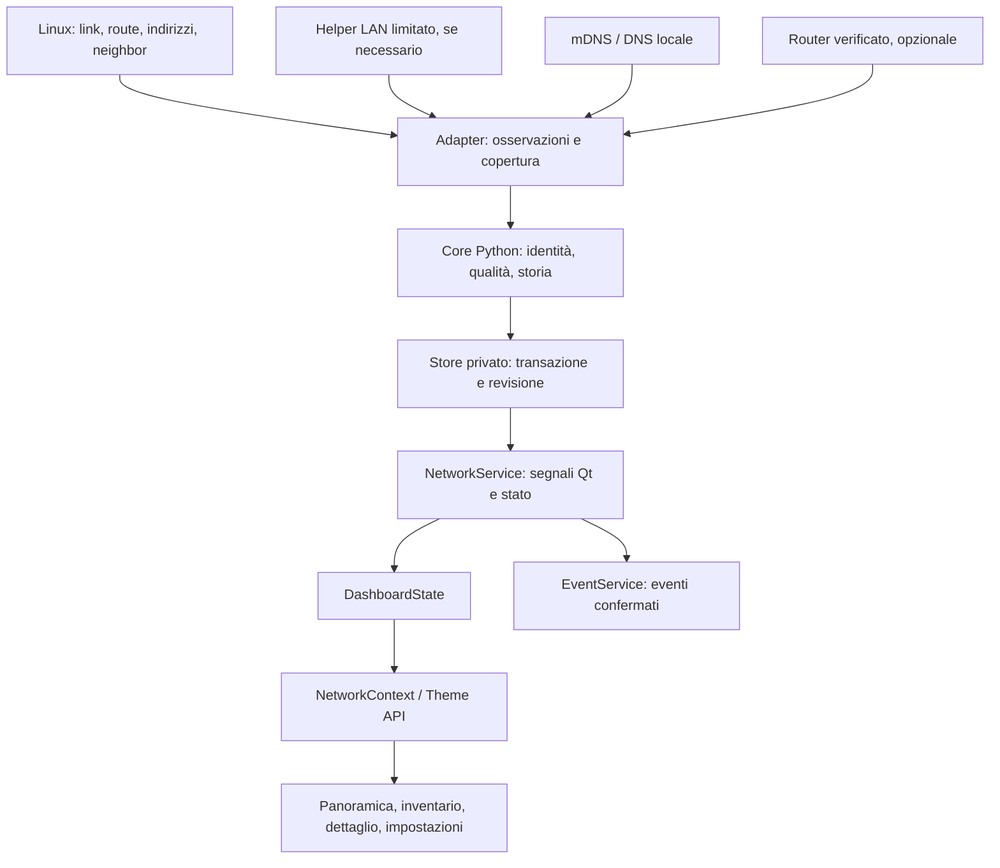

# v0.8 · Rete locale — studio di implementazione e adattamento alla dashboard

**7 ottobre 2026 · Europe/Rome · revisione 1.4 · analisi, nessuna implementazione.**

Riferimento: [MasterPlan](release-masterplan.md), fasi N0–N5. La prima revisione ha usato sorgenti, resoconti Casa e documentazione pubblica senza interrogare la LAN. Su indicazione successiva dell'utente, la revisione 1.3 include [documentazione, token e verifiche API iliadbox](v08-iliadbox-api-study.md) e la [mappa completa capacità/viste/permessi](v08-router-capabilities-and-views.md): catalogo di 44 moduli, token autorizzato, inventario, Wi-Fi, porte, WAN/fibra, sensori, storico e sottoscrizione eventi dal PC di sviluppo. Nessuna discovery dei client, prova dalla Orange Pi, installazione o modifica al runtime. Esempi, intervalli e limiti seguenti sono proposte da validare.

## 1. Decisione di prodotto

La v0.8 deve rispondere a tre domande: **quali dispositivi abbiamo osservato nella rete domestica, quando li abbiamo osservati e quali informazioni possiamo attribuire loro**. Il risultato è una famiglia Rete consultabile dalla board, con panoramica, inventario, preferiti e dettagli.

La raccomandazione aggiornata è provare prima l'inventario iliadbox come fonte primaria della rete di riferimento: la box espone documentazione locale e API 15.0. Se N0 conferma l'inventario autenticato dalla board, riusare nomi/indirizzi/riscontri già raccolti dal router, con osservazioni locali e discovery diretta per le lacune misurate. Conservare un percorso LAN indipendente per router indisponibile o incompatibile; traffico, banda, segnale degli altri client e diagnostica estesa restano v0.8.1.

Non installiamo agent sui computer. CPU/RAM/GPU dei client, processi, velocità Internet per dispositivo, controllo del router e comandi ai dispositivi non appartengono al perimetro. Anche una risposta di rete recente certifica un riscontro, non lo stato operativo completo dell'apparecchio.

## 2. Baseline e punti di integrazione reali

| Elemento letto | Riscontro attuale | Conseguenza per Rete |
| --- | --- | --- |
| [MasterPlan revisione 2.18](release-masterplan.md), [manutenzione Casa](v07-maintenance-report.md) e [consegna Apple Calm](../../theme-projects/apple-calm/CONSEGNA.md) | Theme Engine consegnato; ultimo report di installazione core 0.7.0-rc.3 / Theme API 2.2 / Apple Calm 1.2.0, con reboot verificato il 6 ottobre. | rc.2 è una consegna storica. Conservare gate Casa/Theme fisici e riconciliare la promozione 0.7.0; questo studio non è un nuovo controllo dal vivo. |
| `version.py` nel checkout | `0.7.0`, modificato durante l'aggiornamento del MasterPlan; i report di distribuzione consultati arrivano a rc.3. | In N0 riconciliare manifest/versione installata e modifiche da includere. La stringa locale o il README da soli non provano installazione/chiusura dei gate. |
| `theme-api/contexts.json` | Modulo pubblico major 2, minor 2; renderer Casa importano ancora 2.1. | Progettare l'estensione sul contratto corrente 2.2; assegnare una nuova minor soltanto al momento della modifica effettiva. |
| `app.py`, `casa.py`, `casa_core.py` | Servizi Python, acquisizione asincrona, scheduler, cache e chiusura esplicita. | Riutilizzare il modello architetturale; Rete ha fonti e identità differenti e non deve dipendere dal provider Tuya. |
| `module_state.py` | Envelope `active/updating/stale/offline/error/unavailable`, origine, data e errore. | Conservare l'envelope e aggiungere qualità/copertura per fonte e riscontri per dispositivo. |
| `state.py`, `Main.qml` | Moduli filtrati; Casa usa slot 6, sette indici vista, selezione per ID e modalità di selezione delle schede. | Rete può aggiungere slot 7 senza rinumerare gli esistenti; aggiornare anche indici, routing, selezione e guardie. |
| `SystemInfo`, `DeviceInfo.qml` | Informazioni sulla board; diagnosi IPv4 da route/ioctl e qualità Wi-Fi locale. | Lasciare Info → Rete alla board. Il provider nuovo legge anche prefissi/IPv6/interfacce; la diagnostica esistente non è un inventario LAN. |
| `SettingsPanel.qml`, `PublicSettingsRows.js` | Aggiornamento fonti centrale, impostazioni per funzione, identificatori pubblici. | Aggiungere Rete nei punti comuni, senza pulsanti di refresh duplicati in ogni vista. |
| `theme_bundle.py:effective_manifest` | Compatibilità automatica limitata al caso delle quattro superfici Casa mancanti. | Nuove superfici Rete richiedono una policy esplicita di fallback e prove dei vecchi bundle. |
| [Unità kiosk](../../os/system/smartpc-dashboard.service) | Utente smartpc, `NoNewPrivileges=true`; famiglie socket ammesse senza `AF_PACKET`. | Una discovery ARP raw non è da avviare assumendo privilegi nel kiosk; prevedere helper esterno se necessario. |

Il checkout contiene già numerose modifiche e file nuovi Casa/Theme. Lo studio non li modifica né li attribuisce alla v0.8. L'ambiente di sviluppo corrente ha dipendenze fissate in [requirements-dev.txt](../../requirements-dev.txt), Python 3.12 e PySide6 6.8.2.1; usare il runner esistente per i futuri controlli.

La [cattura Casa EGLFS su cache reale](evidence/v07-maintenance-2026-10-06/board/real-cache-overview.png) conferma una gerarchia riutilizzabile: titolo, origine/ora, poche tessere grandi, focus evidente, comandi in basso. Rete deve conservarne la leggibilità, aggiungendo i propri significati.

## 3. Fonti: cosa possono sostenere

| Fonte candidata | Dato utile | Limite da rendere esplicito | Scelta |
| --- | --- | --- | --- |
| Indirizzi/route/link Linux | IP e prefissi della board, interfaccia, gateway, link, scope IPv6. | Configurazione valida e route non garantiscono risposta del gateway o accesso Internet. | Obbligatoria; lettura strutturata `ip -j` oppure netlink, senza modificare la rete. |
| Tabella neighbor IPv4/IPv6 | Associazioni IP/MAC già conosciute dal kernel e stato NUD. | Copertura limitata agli interlocutori; leggere un'associazione vecchia non rinnova la presenza. | Fonte iniziale e arricchimento, insufficiente come unica discovery. |
| Discovery ARP attiva IPv4 | Risposte sul segmento raggiungibile, indirizzo e MAC. | Sonno, isolamento, proxy ARP e segmenti separati alterano la copertura. | Fallback/completamento; N0 decide tecnica/helper dopo la prova router. |
| mDNS/DNS-SD | Nomi host, istanze e servizi annunciati, endpoint. | Solo apparecchi che annunciano; cache, proxy e servizi non equivalgono a dispositivi fisici. | Arricchimento utile; opzionale per la riuscita del ciclo base. |
| DNS locale / DHCP router | Nomi o assegnazioni e loro provenienza. | Un nome o lease conservato non dimostra attività attuale. | Metadati, non criterio di presenza. |
| Inventario iliadbox | Contratto locale per host, nomi, indirizzi e riscontri secondo router. | API 15.0 e inventario autenticato provati dal PC; discrepanza conteggi, copertura e tempi reali da verificare sulla board. | Prima sorgente da verificare sulla board; candidata primaria per questa LAN. |
| Sonda puntuale ai preferiti | Risposta e RTT dalla board. | ICMP può essere filtrato; timeout non certifica spegnimento. | Opzionale, sugli indirizzi osservati e con protocollo dichiarato. |
| OUI locale | Produttore associato al prefisso MAC universale. | È una stima; non identifica un modello né il produttore finale con certezza. | Arricchimento non bloccante, database/versione/licenza da scegliere. |

Il manuale Linux distingue `REACHABLE`, `STALE`, `FAILED`, `PERMANENT` e altri stati dei neighbor. La proposta applicativa è conservare queste differenze: uno stato statico o stale non diventa «rilevato ora» e l'ora di lettura della tabella non diventa l'ora dell'ultimo pacchetto. [Manuale ip-neighbour](https://man7.org/linux/man-pages/man8/ip-neighbour.8.html).

Nmap `-sn` evita la scansione successiva delle porte, ma le sonde dipendono da privilegi e destinazione. Non va quindi trattato come semplice ping innocuo o automaticamente come ARP: N0 proverà una modalità LAN esplicita, senza script, rilevamento OS o enumerazione delle porte. Considerare anche proxy ARP. [Host Discovery Nmap](https://nmap.org/book/man-host-discovery.html).

mDNS è locale al link e usa cache con durata dei record. DNS-SD descrive servizi mediante PTR/SRV/TXT; il numero delle istanze non è il numero dei dispositivi. Queste proprietà portano a memorizzare origine, endpoint e scadenza, senza trasformare un servizio annunciato in una conferma fisica del client. [RFC 6762](https://datatracker.ietf.org/doc/html/rfc6762), [RFC 6763](https://www.rfc-editor.org/rfc/rfc6763.html).

### Scelta mDNS

Valutare prima Avahi se presente sulla board: daemon e cache già disponibili, accesso D-Bus per eventi e risoluzione. Il prototipo può usare `avahi-browse` con output parsabile e deadline; «all for now» non significa inventario LAN completo. I risultati Avahi possono provenire dalla cache e devono conservare questa qualità. [Flag ed eventi Avahi](https://avahi.org/doxygen/html/defs_8h.html).

Se l'adapter non ricava l'istante del riscontro originale o la validità del record, mostra «servizio annunciato / ora del riscontro non disponibile» e non incrementare il contatore dei dispositivi rilevati recentemente. Un parser di testo non deve scambiare il momento di stampa per il momento di ricezione del pacchetto.

Se Avahi manca, valutare una libreria mDNS Python mantenuta e compatibile con IPv4/IPv6 oppure lasciare inizialmente i servizi non disponibili. La scelta dipende dalle dipendenze reali N0; non installare due stack mDNS per ottenere gli stessi dati. SSDP è rinviato salvo una lacuna misurata che lo giustifichi.

## 4. iliadbox: token e inventario verificati dal PC

Il contesto è **iliadbox Wi-Fi 7, gateway 192.168.1.254, una LAN**. Dal PC è stato verificato `/api_version`: API **15.0**, base `/api/`, modello `ibxgw8-r1`, HTTPS dichiarato disponibile. Il successivo studio capacità registra firmware 4.9.18.2 e maschera DHCP router 255.255.255.0. Prefisso/interfacce della board, isolamento e raggiungibilità dalla Orange Pi restano da verificare. Il gateway non autorizza ad assumere `192.168.1.0/24`.

Menu → Sviluppatore rende la documentazione disponibile anche come ospite. Il login web richiede soltanto la password ed è riuscito; non occorre uno username. L'approfondimento [iliadbox API](v08-iliadbox-api-study.md) registra campi e semantica della documentazione locale, endpoint LAN/DHCP/Wi-Fi, WebSocket, autenticazione e limiti. Gli esempi locali v8/v9 non cambiano la versione scoperta 15.0. [Documentazione locale](http://192.168.1.254/doc/index.html).

`GET /api/v15/login/` ha restituito un challenge valido senza autenticazione; `GET /api/v15/lan/browser/interfaces/` ha restituito HTTP 403 `auth_required`. Questo conferma l'esigenza di un accesso applicativo, non la copertura dell'inventario. Su richiesta successiva dell’utente è stato registrato e autorizzato **SmartPC - Rete locale**: due sessioni con lo stesso app_token e letture LAN riuscite via HTTPS verificato, con logout finali. Credenziale privata fuori repository; nessun token nel tema o nei resoconti. [Evidenza della verifica](evidence/v08-iliadbox-study-2026-10-07/token-verification.json).

Per il provider futuro usare il flusso documentato con app_token, challenge HMAC-SHA1 e sessione; la password amministrativa non è il segreto proposto per il polling. Autorizzazione sulla box e conservazione privata sono completate sul PC; riduzione dei permessi predefiniti, CA attese fissate e HTTPS dalla board restano attività N0. `settings=false`, ma il token include altri servizi: la sola lettura delle chiamate non equivale a una credenziale limitata alla LAN. L'ID del router e il nome dell'interfaccia qualificano i record host. L'elenco `l3connectivities` ha qualità per indirizzo; `persistent`, attività e raggiungibilità sono significati differenti. Nei 39 host acquisiti `l2ident` è un oggetto, coerente con gli esempi; la dichiarazione array del corpus non descrive questa risposta reale.

Lo snapshot `pub` contiene **39 host**, dei quali **13 raggiungibili secondo router**, ma il contatore dell’interfaccia indica **54**. La UI deve contare i record validi e dichiarare la discrepanza/copertura; non dedurre 54 dispositivi presenti. `wifiguest` riporta contatore zero e inventario `result=null`: fonte non disponibile, senza convertirla in assenza confermata. Questi due casi entrano nei requisiti di parsing e nei gate N0/N1.

La [mappa completa capacità e viste](v08-router-capabilities-and-views.md) conferma che lo stesso token `settings=false` legge anche WAN/fibra, AP/stazioni, porte/MAC/statistiche, sensori e RRD net/temp/switch. Il WebSocket ha accettato la registrazione eventi LAN, senza ancora provarne le transizioni fisiche. Associazioni Wi-Fi/porta e riepilogo WAN possono arricchire la base; viste dedicate iliadbox/Wi-Fi/Porte e grafici sono proposte v0.8.1. Un altro token separa autorizzazioni, non aggiunge automaticamente dati o hardware.

**Decisione dopo N0:** se l'inventario autenticato dalla Orange Pi è utile e stabile, adottare il router come fonte primaria e verificare se occorre ancora il helper ARP. Altrimenti usare la modalità LAN con copertura dichiarata. Documentazione e login web non sostituiscono le prove acceso/sonno/scollegato. Lo scraping amministrativo non è il fallback proposto per il provider 24/7.

## 5. Presenza, freschezza e copertura

Servono tre livelli indipendenti: stato del provider, disponibilità delle singole fonti e riscontri del dispositivo. Un ciclo può riuscire per ARP e fallire per mDNS senza perdere le risposte ARP né dichiarare attuali tutti i metadati salvati.

| Etichetta UI proposta | Condizione | Interpretazione |
| --- | --- | --- |
| Rilevato 14:32 | Risposta qualificata attribuibile all'endpoint in un ciclo recente. | Riscontro dalla board; ora esplicita, nessuna promessa di presenza continua. |
| Segnalato dal router 14:32 | Stato router verificato e acquisito recentemente. | Indicazione della box, separata dalla risposta diretta. |
| Ultimo riscontro 14:12 | Evidenza positiva precedente, ormai fuori dalla finestra corrente. | Il dispositivo resta nell'inventario. |
| Non rilevato negli ultimi controlli | Più cicli comparabili senza risposta. | Nessuna conferma di spegnimento. |
| Presenza non verificabile | Fonte guasta, ciclo parziale, link assente o identità ambigua. | Nessuna conclusione negativa sul dispositivo. |
| Dati salvati | Riavvio, polling sospeso o nessuna fonte corrente. | Cache consultabile; nessuna presenza corrente ripristinata dal disco. |

Evitare «connessi» come titolo del contatore globale. Usare **«N rilevati negli ultimi 5 min»** e **«M conosciuti»**, con copertura «LAN IPv4 osservata», «IPv6 parziale» o «inventario router». I contatori possono rappresentare endpoint, non persone/apparecchi unici, quando l'identità è provvisoria. In quel caso usare «N voci rilevate» e dichiararlo nel dettaglio della copertura.

La prima finestra di 5 minuti coincide con la policy candidata; la sua scadenza deve aggiornare lo stato anche senza nuovo ciclo riuscito. Non basta l'età dell'intera snapshot. Un refresh mirato non ringiovanisce le righe non interrogate.

Campi temporali minimi distinti: `collectedAt` della lettura, `observedAt` del riscontro se noto, eventuale `validUntil`, ultimo tentativo e ultima riuscita della fonte. `updatedAt` dell'envelope non sostituisce queste date. Al cold start nessun record persistito diventa attuale finché una fonte lo riconferma; timer e cooldown usano clock monotono. Se l'orologio civile arretra o un timestamp è incoerente, non prolungare la freschezza e sospendere conclusioni/eventi temporali fino a un nuovo riscontro valido.

Stato generale: `active` quando le fonti minime della modalità scelta funzionano; `updating` durante il ciclo; `stale` per dati precedenti senza verifica corrente; `offline` per link LAN verificato assente; `error` per guasto dell'acquisizione con link presente; `unavailable` prima della configurazione utile. Una fonte opzionale guasta produce copertura parziale, non offline globale. Gateway irraggiungibile e WAN assente rimangono indicazioni separate.

## 6. Identità e rapporto con Casa

L'IP è un indirizzo temporaneo, non la chiave del dispositivo. La proposta è un ID interno persistente e un insieme di identificatori con fonte, rete e intervallo di validità.

1. ID host del router, se stabile e provato, qualificato dal suo UID/rete; potrebbe comunque dipendere dal MAC.
2. MAC osservato nella stessa rete: utile per seguire un cambio IP, non certificato permanente di apparecchio fisico.
3. Associazione esplicita dell'utente per interfacce multiple o identità private variate.
4. Nome, produttore e servizi solo come indizi. Non fondere due record per nome uguale o IP riutilizzato.

I MAC privati possono cambiare o ruotare. Pertanto una nuova identità può rappresentare lo stesso telefono; non richiedere di disattivare questa funzione per usare la dashboard. Per indirizzi localmente amministrati, omettere la deduzione OUI e mostrare «MAC locale; produttore non determinabile». [Indirizzi Wi-Fi privati Apple](https://support.apple.com/en-us/102509).

Un computer con cavo e Wi-Fi può produrre due endpoint. Fino all'associazione esplicita, conservare entrambi e non promettere il conteggio degli apparecchi fisici. L'associazione deve mantenere provenienza e storia, essere reversibile e non copiare una conferma recente da un endpoint all'altro.

Lo scope di rete non si ricava dal solo prefisso: due LAN possono usare la stessa subnet. Preferire UID router verificato oppure profilo locale esplicito con gateway/MAC e rete osservata come indizi. Un cambio SSID/AP o di interfaccia non implica automaticamente una LAN diversa; il roaming non deve creare nuovi dispositivi. In caso ambiguo sospendere le fusioni/eventi e richiedere la scelta del profilo nella futura configurazione.

IPv6: conservare famiglia, scope e interfaccia per link-local; raccogliere indirizzi conosciuti da ND/mDNS/router. Non enumerare `/64`, né usare da solo un indirizzo privacy globale per fondere record. I servizi senza associazione verificabile restano metadati non associati; non inventare una riga fisica per ciascuno.

Casa e Rete restano inventari indipendenti. Un sensore Zigbee può essere presente in Casa mentre sulla LAN è visibile solo il suo hub. Un eventuale collegamento Casa↔Rete richiede identità verificata o associazione manuale; nome simile e stato Tuya online non bastano. Il collegamento e le reazioni del compagno possono arrivare dopo la base v0.8.

## 7. Architettura proposta



Nomi candidati: `network_core.py` per validazione/fusione, `network_sources.py` per adapter, `network_store.py` per persistenza, `network.py` per QObject/scheduler. Separare i file quando il contenuto lo giustifica; questa è una responsabilità architetturale, non un obbligo di creare file vuoti.

Il worker produce osservazioni normalizzate: scope, generazione, fonte, stato del ciclo, indirizzi/identificatori, attributi, tempi e validità. Il core prepara una nuova revisione; commit e I/O avvengono fuori dal thread GUI. Un segnale consegna il risultato al QObject sul thread Qt. Le property getter e i renderer non fanno I/O o DNS; niente refresh per frame.

Solo un ciclo acquisitivo alla volta. Un refresh manuale rifiutato per busy/cooldown restituisce il motivo; «aggiornato» arriva dopo acquisizione valida e commit persistente, con indicazione di eventuali fonti parziali. Ogni fonte valida può aggiornare i propri campi; un batch malformato non azzera quella fonte né l'inventario. Un ciclo vuoto valido significa «nessuna risposta nel perimetro», non «nessun dispositivo esiste».

Una `generation` per scope e configurazione impedisce di accettare risultati del worker precedente dopo cambio rete. La revisione pubblicata è monotona; preferenze alias/preferiti sono applicate dalla versione corrente e non sovrascritte dal worker partito prima di una modifica utente. Alla chiusura fermare timer, cancellare richieste, terminare processi figli/helper e concludere entro `TimeoutStopSec=10`; verificare anche il fallimento di caricamento Main.qml.

### Privilegi e helper

Il kiosk corrente non ammette socket `AF_PACKET` e non può acquisire nuovi privilegi con un eseguibile setuid/file capabilities dopo l'avvio. Evitare quindi `sudo nmap` dal provider o capability assegnate all'interprete Python.

Se ARP attivo è necessario, proporre un servizio helper separato, avviato da systemd, con il minimo delle capability effettivamente richieste dalla tecnica scelta. Esporre un socket Unix locale al solo servizio dashboard oppure un risultato atomico revisionato. Un root helper generico che accetta comandi/range arbitrari non è la proposta.

Il helper legge autonomamente interfaccia e prefisso on-link verificati, accetta solo operazioni predefinite, valida scope/richieste, ha cooldown, limiti di indirizzi, output e durata e non esegue shell interpolando nomi LAN. Controllare proxy ARP e risposte con lo stesso MAC per intere fasce; produrre un'anomalia di copertura anziché centinaia di presunti dispositivi. N0 stabilirà se questo componente è necessario o se il percorso router verificato soddisfa il primo obiettivo.

### Persistenza

Raccomandazione: SQLite privato separato dal DB EventService per dispositivi, identificatori/indirizzi, preferiti/alias, riscontri aggregati, salute delle fonti e cursori degli eventi. Transazioni atomiche e schema versionato; le letture UI usano snapshot in memoria. Un JSON piccolo resta appropriato per configurazione/snapshot di scambio del helper, non per riscrivere una storia crescente a ogni ciclo.

Directory candidata: `$XDG_STATE_HOME/smartpc/network`, con il fallback HOME previsto dalla unità. File privati, credenziali separate; WAL/SHM e backup devono essere inclusi nella policy effettiva. Gestire store pieno, non scrivibile o corrotto: preservare l'ultimo snapshot valido; nessuna conferma di salvataggio in caso di errore.

Retenzione iniziale: 30 giorni per aggregati giornalieri delle osservazioni; alias/preferiti e minimo record di identità conosciuta hanno durata distinta. Un preferito non scompare dopo 30 giorni di assenza. Non registrare ogni mancato pacchetto o ogni tick. Per scadenza/rimozione esplicita di identità definire un periodo di soppressione degli eventi prima di riannunciarla; una pulizia della storia non deve generare «nuovo dispositivo». TXT mDNS limitati a metadati utili consentiti; niente payload integrali o credenziali nei DTO pubblici.

## 8. Adattamento al display 960×640

### Panoramica

Una fascia breve: nome rete, link della board, gateway e stato dell'ultima osservazione. Corpo: due contatori con finestre dichiarate e fino a quattro preferiti. Ogni tessera ha nome/alias, riscontro e ora, indirizzo principale se disponibile. Con zero preferiti il corpo propone poche voci osservate utili e l'accesso all'inventario, senza quattro spazi vuoti. Gateway e board sono infrastruttura distinta; esplicitare se esclusi dal conteggio client.

Esempio **sintetico**, non lettura della LAN:

```text
RETE · PANORAMICA
LAN della board collegata · gateway configurato 192.168.1.254
7 rilevati negli ultimi 5 min · 12 conosciuti · IPv6 parziale

PC scrivania                 Stampante
Rilevato 14:32               Ultimo riscontro 13:10
192.168.1.20                 Indirizzo salvato

5 DETTAGLIO · 2 DALLA PRIMA: 4/6 CAMBIA VISTA
```

Gli indirizzi dell'esempio non definiscono la subnet reale. «Gateway configurato» non indica risposta verificata. La Home mantiene orologio/meteo/evento dinamico; nessun widget Rete permanente nella prima versione.

### Dispositivi e filtri

Tre/quattro righe ampie, seguendo il pattern Casa: icona semantica prudente, nome, IP principale, ultimo riscontro e preferito. Filtri iniziali **Tutti / Recenti / Preferiti / Senza nome**; «senza nome» non significa «sconosciuto e pericoloso». Ordinamento stabile, preferiti scelti dall'utente e poi nome/ID; non riordinare a ogni risposta mentre l'utente sta leggendo.

Confermare la selezione per ID al refresh; se una riga esce dal filtro, selezionare la vicina e conservare il ritorno. I record non rilevati rimangono consultabili in Tutti. Nomi lunghi elisi nell'elenco, leggibili nel dettaglio; indirizzi IPv6 e nomi servizio vanno a capo con limiti, senza font microscopici o scorrimento animato continuo.

### Dettaglio

Tre sezioni consultabili: **Riscontri** (origine, tempi, qualità e ultimo tentativo), **Identità e indirizzi** (alias, nomi ottenuti, IPv4/IPv6, MAC e indizi), **Servizi e storia** (annunci selezionati, primo/ultimo riscontro e sintesi). Campi non acquisiti omessi o esplicitamente non disponibili; nessuna pagina di zeri per segnale/traffico non supportati.

Storia iniziale testuale, senza grafico di uptime: «osservato in 8 controlli oggi» non diventa «acceso per 8 ore». Latenza opzionale etichettata «risposta dalla board, protocollo, ora», senza speed test implicito.

### Navigazione

Proposta coerente con Casa, evitando nuove ambiguità:

| Contesto | Comandi |
| --- | --- |
| Panoramica, focus sulla vista | 4/6 cambia famiglia; 8 entra nei dispositivi/preferiti; 5 apre la voce selezionata quando esiste. |
| Elenco/tessere | 2/8 seleziona; 5 dettaglio; 2 dalla prima riga entra nella selezione delle viste. |
| Schede selezionate | 4/6 cambia Panoramica/Dispositivi; 8 torna alle righe; 7 esce dalla modalità. |
| Filtri inventario | Riga Filtra apre un piccolo selettore; 2/8 sceglie, 5 applica, 7 annulla. |
| Dettaglio | 2/8 scorre righe, 4/6 cambia sezione; 7 ritorna a vista/filtro/ID e offset precedenti. |
| Globale | 1 Home; 7 Indietro, come handler e guide correnti Casa. |

Preferiti sono parte della panoramica e filtro dell'inventario, non una terza vista vuota obbligatoria. Comandi nel footer devono riflettere focus e contesto attivi. Nessun cambio famiglia mentre 4/6 sta operando sulle schede; testare la sequenza anche con il tastierino fisico.

### Ingresso nel carosello e impostazioni

Prima configurazione utile: accesso da Impostazioni → Rete locale. Il modulo entra nel carosello quando è abilitato e ha un profilo più un primo risultato utile/inventario; non richiede preferiti. Dopo il primo uso rimane consultabile senza rete e anche quando il ciclo valido non rileva client. Distinguere una rete configurata senza risposte da un modulo mai configurato.

| Punto comune | Aggiunta proposta |
| --- | --- |
| Moduli visibili | Rete, con scelta persistente che cambia solo il carosello. |
| Rete locale | Profilo/interfaccia, fonti attive, alias/preferiti e ordine, sospensione acquisizione, storia/retention; dettagli tecnici secondari. |
| Dati e aggiornamenti | Stato/copertura/ultima riuscita, aggiornamento manuale e motivo del rifiuto. |
| Notifiche → Avvisi sullo schermo | Categoria Rete: interruzioni separate dalla raccolta eventi, inizialmente disabilitate. |
| Informazioni → Rete | Continua a descrivere interfacce della board; nessuna duplicazione dell'inventario. |

Con il solo tastierino, la rinomina libera è poco pratica. Prima versione: preferiti/ordine dalla dashboard; alias anche da configurazione privata o tastiera disponibile. Non inventare un editor a nove tasti solo per soddisfare la persistenza degli alias. Associazione di più identità può seguire la prova N2 tramite configurazione esplicita verificata.

## 9. Theme API e compatibilità

Superfici proposte: `network.overview`, `network.devices`, `network.detail`, `settings.network`; nuovo `NetworkContext` tipizzato con `source`, `coverage`, `network`, `selectedDevice`, `selection`, `rows` e DTO/model per dispositivi, indirizzi, riscontri e servizi. Azioni pubbliche per selezione, dettaglio, filtri, preferiti/ordine e polling; aggiornamento manuale riusa la delega delle fonti. Identificatori e payload validati, nessuna capacità di eseguire sonde da un renderer.

Il dominio `network` va incluso nelle proiezioni pubbliche e nella selezione `dataDomains`; i renderer di altri moduli non devono ricevere l'inventario LAN senza necessità. Aggiornare contratti sorgente e generatori, non soltanto i file generati: superfici/contesti/azioni, bootstrap, adapter, registry, schema manifest, qmltypes/reference, fixture e kit AI autonomo.

Base e Functional devono coprire tutte e quattro le superfici in giorno/notte e rispettare motion Normal/Reduced/Off, readiness, lifecycle, regioni occupate e priorità Avvisi. Lo stato non verificato usa testo e semantica dei dati, non colori che un tema possa trasformare in successo.

**Rischio concreto dei bundle preesistenti:** `effective_manifest` gestisce oggi solo il delta Casa esatto. Aggiungere Rete rischia di invalidare un bundle che prima funzionava. N3 deve definire una lista versionata delle superfici additive con fallback Base, senza modificare zip, hash e manifest immutabili dei pacchetti importati. Provare bundle anteriori a Casa, Casa 2.1 e corrente 2.2; le omissioni non riconosciute restano errori. Conservare lo stile corrente quando il renderer usa fallback: l'eventuale limite visivo va dichiarato e collaudato.

## 10. Cicli e limiti candidati

| Parametro | Proposta iniziale | Come si decide |
| --- | --- | --- |
| Ciclo base | 5 min, piccolo jitter. | Misurare durata/copertura e costo sulla board. |
| Preferiti | 2 min solo se la sonda mirata porta un beneficio misurato. | Nessuna scansione completa ogni minuto per la sola apertura della vista. |
| Refresh manuale | Cooldown 30 s condiviso, un solo ciclo alla volta. | Aggiornamento concluso con esito e copertura reali. |
| Link locale | Eventi netlink o campione leggero 5–10 s. | Nessuna discovery per controllare il solo link. |
| Target IPv4 per ciclo | Al massimo 256 indirizzi candidati, nel prefisso on-link verificato. | Se il prefisso è più ampio, configurare sottoinsieme/completamento o usare router; non troncare silenziosamente. |
| IPv6 | Soli indirizzi osservati/forniti dalle fonti. | Niente enumerazione del prefisso. |
| Sonde puntuali | Concorrenza iniziale 4, timeout per target 1–2 s. | Confronto reale con sonno/firewall. |
| Durata acquisizione | Obiettivo 15 s, deadline iniziale 30 s per ciclo. | Alla deadline pubblicare esito parziale qualificato, senza eventi di assenza. |
| Arricchimento | DNS/mDNS con deadline e tetto output; metadati limitati per riga. | Nomi mancanti non bloccano le risposte base. |
| Errori | Backoff iniziale 5/10/20 min, tetto 30 min; risveglio al ritorno link. | Evitare raffiche di recupero e riavvii simultanei delle fonti. |

Un limite raggiunto va esposto in copertura. I valori non sono SLA o risultati misurati. Sospendere il polling non ferma l'invecchiamento dei riscontri; nascondere il modulo non sospende implicitamente l'acquisizione. Con WAN assente la discovery LAN prosegue se la rete locale funziona; non introdurre dipendenze cloud per OUI o discovery.

## 11. Eventi prudenti

Prima consegnare N0–N3 senza banner Rete; aggiungere N4 quando copertura e identità sono provate. Le notifiche sono facoltative, non il prerequisito dell'inventario.

- Nuova identità osservata: prima acquisizione valida crea una baseline silenziosa; proposta di due cicli positivi completi e comparabili per un evento successivo. Testo «Nuova identità osservata», non «intruso».
- Preferito non rilevato: opzione per singolo preferito, proposta tre cicli base completi comparabili e almeno 15 minuti dall'ultimo riscontro; fonte positiva iniziale nota e copertura idonea. Non applicarla per default a telefoni o dispositivi in sonno.
- Cambio IP: aggiorna il dettaglio senza banner. MAC privato ambiguo non genera allarme di sicurezza.
- Link assente, cambio scope, store guasto o fonte necessaria non funzionante: sospendere contatori negativi; al recupero una finestra silenziosa ricostruisce la baseline. Non annunciare in massa il ritorno dei dispositivi.

Contatori e cursori eventi persistenti, ID deduplicati con scope e identità; publication da thread Qt attraverso `EventService.publish_snapshot`. Una transazione completata non deve diventare una doppia notifica dopo un crash tra store ed EventService: replay con ID stabile. Errori conservano gli eventi precedenti secondo scadenza; un refresh parziale non li annulla come snapshot vuoto. Categoria Rete rispetta Fascia silenzio e controllo delle interruzioni; nessuna urgenza derivata da semplici timeout LAN.

## 12. Percorso N0–N5 ed evidenze richieste

| Fase | Lavoro concreto | Uscita verificabile |
| --- | --- | --- |
| **N0a · Baseline** | Manifest/versione installata e checkout, profilo della rete, interfacce/prefissi/IPv6, unità effettiva e disponibilità di strumenti/Avahi. | Baseline riproducibile; differenze locali/installate attribuite. |
| **N0b · Sorgenti** | Probe separato e limitato sulla board; confronto tra inventario reale, discovery e router; riscontri acceso/sonno/scollegato. | Tabella per dispositivo/fonte, copertura positiva, casi mancanti e scelta router/helper; nessuna UI promessa prima di questi dati. |
| **N1 · Provider** | Adapter, scheduler, single-flight, cancellazione, fonte/campo qualificati, snapshot/cache. | GUI e stop non bloccati; errori parziali gestiti, cold start senza rete consultabile. |
| **N2 · Identità** | ID e scope, cambio IP, MAC privato, endpoint multipli, preferiti/alias, store e retention. | Nessuna fusione ingiustificata; preferenze conservate; IP riutilizzato non eredita presenza/alias. |
| **N3 · Dashboard** | Quattro superfici, navigazione/focus, Settings/Sources, Theme API e fallback bundle. | Base/Functional, elenchi numerosi e nomi lunghi, vecchi temi e renderer nuovi, zero warning inattesi. |
| **N4 · Eventi** | Baseline silenziosa, conferme, controlli per preferito e categoria, deduplicazione/replay. | Nessuna raffica al reboot/recupero o da un guasto di sorgente. |
| **N5 · Candidata e rilascio** | Distribuzione con backup/manifest, runtime EGLFS, reboot, recovery, risorse e manuale. | Campi/copertura ottenuti dichiarati; limiti fisici separati dai test sintetici. |

La finestra di riscontri N0 deve includere apparecchi che non annunciano mDNS, un host senza risposta ICMP, un endpoint IPv6 se realmente presente e un dispositivo dietro hub Casa. Se un caso non è disponibile, registrarlo come non verificato. Confrontare anche liste del router con timestamp: non usare automaticamente tutto l'inventario storico come verità attuale.

### Matrice mirata di verifica

| Caso | Comportamento atteso |
| --- | --- |
| ARP riesce, mDNS o router fallisce | Risposte base pubblicate, metadati precedenti marcati, copertura parziale. |
| Neighbor statico/stale, cache mDNS o lease DHCP | Nessuna promozione a presenza fresca dall'ora della lettura. |
| Zero risposte in ciclo valido | Inventario conservato; stato del ciclo corretto, nessuna falsa assenza certa. |
| IP cambia / IP assegnato ad altro MAC | Identità seguita solo con evidenza; nessun trasferimento indebito di alias/preferiti. |
| MAC varia / due host stesso nome | Record distinti o associazione esplicita; assenza di allarmi inventati. |
| Cambio LAN / roaming nella stessa LAN | Scope distinto solo dove necessario, worker vecchio respinto, recupero silenzioso. |
| Proxy ARP / rete più ampia del limite | Anomalia o copertura limitata dichiarata, non centinaia di client inventati. |
| LAN presente, WAN assente | Inventario LAN utilizzabile; nessun stato Internet dedotto. |
| LAN assente e poi torna | Cache precedente, nessun contatore negativo; nuovo riscontro prima della freschezza. |
| Reboot senza rete / orologio arretrato | Nessuna presenza corrente dal disco e nessun prolungamento improprio della finestra. |
| Store corrotto/pieno/non scrivibile | Recupero qualificato, ultimo dato valido ove disponibile, refresh fallito senza falsa conferma. |
| Refresh rapido / cambio preferiti durante ciclo | Single-flight/cooldown, esito conclusivo e preferenza corrente preservata. |
| SIGTERM / QML non carica / helper bloccato | Chiusura entro timeout, nessun processo figlio o callback residuo. |
| 40–80 voci sintetiche, nomi e IPv6 lunghi | Paginazione/focus stabili, nessun taglio di comandi o testo decisivo. |
| Vecchio bundle / cambio tema durante refresh | Fallback esplicito, selezione e dati coerenti, notifiche prioritarie funzionanti. |

Core locale: fixture isolate e clock controllato, I/O reale temporaneo; UI: runner offscreen con trasporto negato. Prova sorgente reale: report separato con versioni strumenti, tempi, richieste e copertura; non conteggiare fixture come discovery riuscita. Board: EGLFS/KMS 960×640 con catture Base/Functional, input e journal; service active e NRestarts=0 nel periodo verificato. Vero reboot comprovato da boot ID e riscontro successivo; backup/hash/rollback preservano preferenze e storia recenti.

Misurare durata cicli, tick GUI durante I/O, ritardo dei comandi, CPU/RSS/PSS e crescita tra cicli rappresentativi. Evitare ripetizioni degli stress Theme già eseguiti senza una nuova causa. Latenza input ottica e uso continuativo restano prove distinte; non dedurre tempo GPU dagli intervalli passivi dei frame. I test fisici di sospensione/scollegamento si svolgono in una finestra concordata, senza interferire con l'uso normale della rete.

## 13. Decisioni e questioni aperte

**Pronte per guidare lo sviluppo:** inventario LAN autonomo, verità dei riscontri per fonte/campo, assenza di agent, Python asincrono/QML, identità indipendente dall'IP, quattro superfici Theme e punti comuni delle impostazioni, nessun widget Home permanente, eventi prudenti dopo l'inventario.

**Da chiudere con N0:** baseline installata effettiva, prefisso/interfaccia/IPv6 e isolamento, accesso e semantica iliadbox, necessità/helper ARP, dipendenze mDNS e copertura concreta. La prima attività eseguibile è un probe di sorgente separato; non il disegno di un contatore «tutti connessi».

**Da scegliere dopo i riscontri:** finestra di freschezza, limiti e frequenza utili, quattro preferiti reali, presentazione dei casi multi-endpoint, alias/associazioni assistite, presenza del router nella panoramica. Queste scelte non impediscono lo studio o i test core.

**Gate di rilascio:** almeno una modalità acquisitiva utile verificata sulla LAN reale; inventario e dettaglio affidabili anche con campi mancanti; niente falso stato corrente dopo reboot/errori; focus e bundle preesistenti conservati; recovery e distribuzione tracciabili. Se la copertura è parziale ma utile, dichiararla. Se ci sono soltanto vecchi neighbor senza riscontri affidabili, mantenere il modulo come prototipo e non rilasciarlo come panoramica corrente.

Questo studio apre la preparazione v0.8 senza dichiarare completati quota/collaudi Casa o gate residui Theme. Nessun tag o versione runtime viene cambiato.
