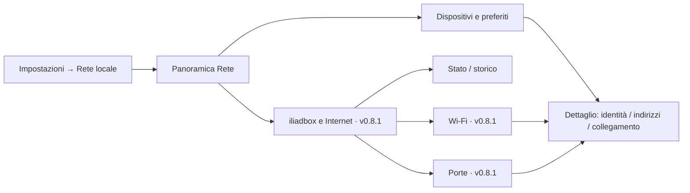

# v0.8 · iliadbox — capacità, viste e permessi

**7 ottobre 2026 · Europe/Rome · analisi completata sul corpus locale e letture dal PC; runtime dashboard non modificato.**

Riferimenti: [MasterPlan](release-masterplan.md), [architettura e adattamento v0.8](v08-local-network-analysis.md), [autorizzazione e contratto LAN](v08-iliadbox-api-study.md). La richiesta corrente amplia lo studio a tutte le famiglie documentate e alle viste possibili; non avvia un nuovo token, cambia permessi o installa software sulla Orange Pi.

## 1. Risultato dello studio

La iliadbox può fornire la base di Rete senza agent sui computer: inventario, indirizzi e riscontri, associazione Wi-Fi, appartenenza alle porte switch, stato WAN/fibra, temperature, ventola e storico aggregato. Queste letture sono riuscite **con il token attuale e `settings=false`**. Anche il WebSocket autenticato ha accettato la sottoscrizione agli eventi LAN.

Non serve un altro token per questi dati. Un nuovo token crea un’altra autorizzazione con permessi propri; non somma privilegi al primo né aggiunge capacità hardware. Per funzioni protette si possono modificare i permessi dell’app esistente dalla gestione applicazioni della box, quindi aprire una nuova sessione e verificarli. Una seconda app ha senso per separare sviluppo e kiosk, o eventuali comandi futuri dalle letture ordinarie.

La v0.8 base resta inventario, preferiti, dettaglio e stato fonte. Collegamento Wi-Fi/cavo verificato e riepilogo WAN possono migliorare queste viste; grafici, dettaglio router/radio/porte e servizi aggiuntivi restano il percorso v0.8.1. La conferma di disponibilità API non equivale a implementazione o accettazione sulla board.

## 2. Fonti e livello dell’evidenza

| Fonte | Cosa dimostra |
| --- | --- |
| [Manuale servito dalla box](http://192.168.1.254/doc/index.html) e `/api_version` | Corpus presente sul router reale, API 15.0, modello `ibxgw8-r1`. Gli esempi v8/v9/v11/v14 non fissano la versione del client. |
| [Catalogo completo delle definizioni HTTP](evidence/v08-iliadbox-study-2026-10-07/api-catalog.json) | 44 moduli, 339 definizioni, 334 coppie metodo/percorso distinte dopo normalizzazione della versione. Include duplicati e 3 route del server notifiche esterno, non solo endpoint router. |
| [Verifica token e riuso](evidence/v08-iliadbox-study-2026-10-07/token-verification.json) | Autorizzazione fisica, sessioni successive con lo stesso app_token e inventario dal PC. |
| [30 letture di capacità Rete](evidence/v08-iliadbox-study-2026-10-07/network-capabilities.json) | Schema effettivo, associazioni tra fonti, successo/errori e dati aggregati, senza credenziali o identificatori dei client. |
| [Metriche, storico e sottoscrizione eventi](evidence/v08-iliadbox-study-2026-10-07/network-extra-capabilities.json) | Sensori/ventola, bande configurate, forma MLO, RRD temp/switch, handshake WebSocket HTTP 101 e registrazione accettata. |
| [Metadati e letture radio passive](evidence/v08-iliadbox-study-2026-10-07/network-passive-metadata.json) | Info host DHCP/mDNS/UPnP, provenienza nomi e GET neighbor/channel usage/survey su entrambi gli AP, senza avviare scansioni. |

Il catalogo conserva firme, metodi e link puntuali al manuale, senza trasformare gli esempi in richieste da eseguire. Gli esempi aggiungono menzioni e talvolta contraddicono firme/ortografia; Slowness ha una sezione senza firma HTTP formale. Quindi 339 è il conteggio delle definizioni di questo corpus, non il numero garantito delle funzioni operative della iliadbox.

Le verifiche usano HTTPS locale con chain/hostname verificati e il profilo di compatibilità già descritto nello studio token. Le sessioni sono state chiuse. Nessuna lettura di rubrica, chiamate, file personali o media; nessuna scansione radio attiva, comando a client o variazione di rete. La compatibilità sulla Orange Pi, i cambi fisici di presenza e gli eventi dopo riconnessione restano da collaudare.

## 3. Tutte le famiglie documentate

**Provata** significa lettura API effettuata qui; **documentata** significa possibilità descritta, senza garantire supporto sul modello. I possibili usi fuori Rete sono opportunità distinte, non nuovi moduli assegnati al MasterPlan.

| Modulo del corpus | Dati e azioni esposti | Esito/uso nella dashboard |
| --- | --- | --- |
| `login` | Registrazione, tracking, challenge, sessione, logout, permessi. | Provata. Provider Python e configurazione privata; nessun segreto nelle viste. |
| `websocket` | Eventi LAN e VM, registrazione canali. | Connessione/sottoscrizione LAN provate; eventi fisici e recupero da provare. |
| `connection` | WAN, IP pubblico, traffico e banda; FTTH/xDSL/LTE, IPv6, DDNS e impostazioni. | WAN/FTTH/config IPv6 provate. Riepilogo Internet e dettaglio fibra; xDSL/LTE non provati. |
| `lan` | Configurazione LAN, inventario/interfacce/tipi/dettaglio, rinomina e Wake on LAN. | Letture principali provate. Base v0.8; rinomina router e WOL non previsti. |
| `dhcp` | Configurazione, lease dinamici/statici e gestione prenotazioni. | Letture provate. Indirizzi/assegnazione nel dettaglio; niente stato presenza derivato dai lease. |
| `dhcpv6` | Stato/configurazione DHCPv6 e DNS. | Provata. Stato tecnico; non confondere DHCPv6 disabilitato con IPv6 assente. |
| `switch` | Porte, link/duplex/velocità, MAC per porta, configurazione e contatori. | Stato e statistiche di tre porte provati. Collegamento host e vista Porte v0.8.1. |
| `wifi` | AP/BSS, stazioni, radio/canali, link e traffico; MLO, planning, WPS, filtri, chiavi, survey e diagnostica. | Stato/AP/BSS/stazioni/MLO read provati. Associazione nei dettagli; radio/grafici v0.8.1. Comandi non eseguiti. |
| `system` | Modello, firmware, uptime, sensori, ventole, capacità e storage; reboot/shutdown. | Provata. Dettaglio router e diagnosi; nessun riavvio o spegnimento. |
| `rrd` | Storico net, temp, switch, DSL; API marcata unstable. | GET net/temp/switch provati senza settings. Grafici v0.8.1; DSL non pertinente al test. |
| `standby` | Stato e programma Wi-Fi/standby. | Stato provato. Spiega una sospensione pianificata; programma non modificato. |
| `update` | Stato aggiornamento firmware e avanzamento. | Lettura provata. Info router; nessun aggiornamento avviato. |
| `sfp` | Modulo **LAN SFP**, stato e configurazione. | Documentata, non provata; distinta dall’ottica WAN FTTH. Solo se disponibile sul modello. |
| `freeplug` | Powerline, membri/link e reset. | GET fallisce `500 internal_error`. Non creare una tessera funzionante; nuovo token non risolve necessariamente l’errore. |
| `slowness` | Diagnostica del throughput verso un host. | Corpus incompleto, nessuna firma formale; non avviata. Eventuale azione diagnostica separata. |
| `nat` | DMZ, port forwarding, porte entranti e gestione regole. | Documentata. Eventuale riepilogo tecnico futuro; scritture settings, fuori v0.8 base. |
| `igd` | UPnP IGD, configurazione e redirezioni dinamiche. | Documentata. Eventuale elenco servizi/regole, senza presentarlo come audit di sicurezza. |
| `ftp` | Configurazione server FTP e accessi. | Documentata. Stato servizio solo se utile; credenziali/config sensibile da escludere dal DTO. |
| `tftp` | Server TFTP e cartella radice, nuovo corpus v15. | Documentata. Nessuna esigenza Rete base; non enumerare file. |
| `network_share` | Condivisioni Samba/AFP, autenticazione e preferenze. | Documentata. Servizi router eventuali; non consegnare password/path privati al tema. |
| `upnpav` | Stato/configurazione media server. | Documentata. Indicazione di servizio, non scoperta dei media personali. |
| `vpn` | Server, utenti, configurazioni, pool e connessioni; unstable. | Documentata. Stato VPN futuro; non leggere/esportare credenziali o configurazioni client per Rete. |
| `vpn_client` | Stato/configurazioni/log client VPN; unstable. | Documentata. Eventuale stato nella scheda Internet; nessuna attivazione o log integrale. |
| `lcd` | Luminosità/orientamento e visualizzazione chiave Wi-Fi sulla box. | Documentata. Opzioni del router, separate dalla luminosità della dashboard. |
| `ledstrip` | Stato e programmazione LED, se supportati. | Documentata. Non promessa su questa box; fuori Rete base. |
| `storage` | Dischi/partizioni, salute, spazio, mount, format/check; unstable. | GET dischi/partizioni `success=true, result=null`. Indisponibile nel test; `disk_status=active` non prova un NAS utilizzabile. |
| `raid` | Array, membri e gestione RAID; unstable. | Documentata. Solo con hardware reale e letture valide; mai formattazione automatica. |
| `fs` | File/task, lettura/download, copie, spostamenti, cancellazioni e altre operazioni. | Documentata, explorer concesso ma contenuti non letti. Modulo file separato eventuale, fuori Rete. |
| `share` | Link pubblici per file, con accesso HTTP remoto richiesto dal manuale. | Documentata. Nessun link creato; non serve all’inventario. |
| `upload` | Upload e relativo WebSocket/task. | Documentata. Nessuna integrazione richiesta per v0.8. |
| `download` | Coda download, progressi, velocità, peer/tracker/file e comandi. | Documentata, downloader concesso; contenuti non letti. Eventuale modulo separato. |
| `download_feeds` | Feed RSS del downloader, elementi e download automatici. | Documentata. Feed del downloader, distinti dal sistema Eventi/Avvisi della dashboard. |
| `download_config` | Cartelle, limiti e throttling del downloader. | Documentata. Configurazione separata, fuori Rete. |
| `airmedia` | Ricevitori media e streaming/configurazione. | Documentata. Eventuale futuro Media; presenza di API non assegna una versione Media. |
| `player` | Dispositivi Player, stato/volume e controlli; unstable/internal use only. | Documentata, player non concesso. Supporto/hardware da provare prima di proporre integrazione. |
| `pvr` | Registrazioni programmate/finite, quota/media; unstable/internal use only. | Documentata, pvr concesso; nessuna lettura dei contenuti. Modulo distinto, se supportato. |
| `call` | Registro, account telefonico, voicemail/audio e gestione record. | Documentata, calls concesso; contenuti non letti. Opzione Telefonia distinta da Rete. |
| `contacts` | Rubrica, numeri, indirizzi, email e modifica record. | Documentata, contacts concesso; contenuti non letti. Nessun dato utile alla presenza LAN. |
| `home` | Adattatori domotici, pairing, nodi, endpoint e tile. | Documentata, home non concesso; hardware non provato. Non implica accesso Smart Life/Tuya o ai sensori dietro hub. |
| `camera` | Camera, riferimento LAN e URL stream. | Documentata, camera non concesso; supporto non provato. Modulo distinto con gestione stream propria. |
| `profile` | Profili e controllo rete/pianificazione per profilo. | Documentata, profile non concesso. Blocchi/parental sono comandi fuori v0.8 base. |
| `notif` | Target notifiche e specifica di server esterno per invio. | Documentata. Non necessaria per Avvisi locali; POST/send è comunicazione esterna, non eseguita. |
| `lang` | Lingua e traduzioni disponibili sul router. | Documentata. Lingua router distinta dalla dashboard; nessuna variazione. |
| `vm` | Info/distribuzioni, VM, dischi, console/VNC e comandi; unstable. | Documentata, vm concesso; capacità hardware non provata. Un permesso non crea supporto VM. |

## 4. Dati reali acquisiti e cosa rendono possibile

Lo snapshot delle 15:39:56 del 7 ottobre (Europe/Rome) registra firmware **4.9.18.2**, WAN `up` su FTTH e 39 record host. Le metriche seguenti sono campioni, non stato persistente o certificazione 24/7.

| Gruppo | Riscontro reale | Regola della vista |
| --- | --- | --- |
| Presenza LAN | 39 host; 14 active e 14 reachable nello snapshot ampliato, rispetto a 13 nel controllo precedente. Contatore interfaccia ancora 54. | Mostrare quantità e ora dello snapshot; 54 non è il conteggio dei record né dei connessi. La variazione 13→14 non certifica un evento fisico. |
| Metadati | `info` contiene DHCP, mDNS e UPnP; nomi con fonti DHCP/mDNS/NetBIOS/UPnP/WSD. Nessun `model` valorizzato nelle connettività lette. | Nome e provenienza; servizi/modello soltanto quando un parser qualificato trova un campo pertinente. Nessun modello hardware inventato e nessuna nuova discovery diretta necessaria per leggere questi metadati. |
| Indirizzi | 222 `l3connectivities` nei 39 record. | Indirizzi non equivalgono a dispositivi; lista scorrevole, indirizzo principale qualificato e IPv6 storici separati. |
| DHCP | Maschera dichiarata `255.255.255.0`, 19 lease dinamici, una prenotazione statica. | /24 è ora un dato della configurazione DHCP router, non una maschera dedotta dal gateway né una prova della configurazione board. Lease ≠ host attivo. |
| IPv6 | Config IPv6 leggibile; DHCPv6 `enabled=false`; host con IPv6 nel precedente inventario. | Distinguere SLAAC/ND e DHCPv6; non mostrare «IPv6 disabilitato» per DHCPv6 false. Nessuna scansione /64. |
| Wi-Fi | Due AP configurati 2,4 GHz e 5 GHz; 11 stazioni (6+5), tutte authenticated. Tutte hanno host ID e MAC corrispondenti all’inventario. | Collegamento Wi-Fi attribuibile con join qualificato. Sommare associazioni non identifica automaticamente dispositivi unici in MLO/roaming. Nessuna radio 6 GHz osservata; i nomi capability 6g non ne provano la presenza. |
| Radio | AP0 canale 6, 20 MHz; AP1 canale 48, 160 MHz. `channel_width` è stringa nella risposta. | Normalizzare valori numerici e enum con allowlist; dettaglio Radio, non quattro nuovi contatori nella Home. |
| Radio passiva | Neighbor già presenti: 3 per AP; channel usage: 13/19 voci; survey richiesta sugli ultimi 5 minuti: 600 punti per AP con busy/tx/rx/rx_bss e timestamp. | Possibile grafico occupazione canale; non lista di dispositivi domestici. I neighbor sono dati raccolti dal router, potenzialmente vecchi: freschezza non provata. Non ripetere o avviare POST scan per aggiornarli automaticamente; il manuale avverte che la radio diventa indisponibile durante la scansione. |
| BSS/MLO | Due BSS; ID stringa in forma BSSID, non int degli esempi. MLO config leggibile, `partners` presente; status mostra un partner per BSS. | Usare ID scoperti e URL-encoding. Questo non prova una stazione attualmente su più link; niente badge MLO derivato dalla sola configurazione. |
| Segnale Wi-Fi | Valori raw negativi: intervalli -82…-52 e -84…-64; manuale descrive attenuazione in dB. | Campo tecnico «Segnale riportato: −… dB», senza percentuale o soglia “ottimo”, fino al confronto UI/semantica. Non fissare dBm sulla sola forma negativa. |
| Link stazione | Presenti last_rx/last_tx, bitrate, flags e contatori byte/rate. | Bitrate /10 → Mbit/s secondo contratto; -1 non disponibile. Rate byte/s → bit/s con ×8 solo dopo verifica direzione. Link radio ≠ velocità Internet. |
| Porte | Tre porte; porta3 up/full 2500, porta2 up/full 100, porta1 down. Quattro MAC riportati, tutti corrispondenti a host LAN; tre sulla stessa porta3. | Un host è «visto dalla porta»; può esserci uno switch/bridge a valle. Tre MAC sulla porta non sono tre porte fisiche del router. Velocità 2500 va ammessa anche se il vecchio enum elenca solo 10/100/1000. |
| Traffico WAN | `rate_up/down` in byte/s; `bandwidth_up=900000000`, `bandwidth_down=5000000000` in bit/s. | Mostrare traffico istantaneo e capacità riportata separatamente. 0,9/5 Gbit/s non sono risultati di uno speed test. Contatori bytes da trattare con baseline/reset. |
| Fibra WAN | Link/presenza/segnale/power buoni; raw TX 287 e RX -1838. | Contratto /100: TX +2,87 dBm, RX -18,38 dBm. Potenza ottica, distinta dal segnale radio; nessuna diagnosi guasto da soglie inventate. Solo con `sfp_has_power_report` e valori validi. |
| Router | Due sensori, 53 °C nel campione supplementare; una ventola 1590 RPM; uptime disponibile. | Dettaglio iliadbox, distinto da CPU/temperatura della Orange Pi. `temp_t1` resta sensore generico, non etichetta hardware inventata. Non è telemetria dei PC client. |
| Storico RRD | In un’ora: net 360 punti; temp/switch 30 ciascuno. Campi temp reali `temp_t1`, `temp_cpub`, `fan0_speed`, diversi dal vecchio elenco cpum/cpub. | Serie e risoluzione reali; `date_start/end` possono essere adattati. Net `bw_*` in byte/s contro connection `bandwidth_*` in bit/s; null è buco, non zero. |
| Eventi | WebSocket HTTP101, registrazione reachable/unreachable accettata. | Backend eventi + riconciliazione; nessun test reale di apparizione/scomparsa, replay o sessione scaduta ancora effettuato. |
| Servizi non utilizzabili nel test | Guest/storage null; Freeplug internal_error. | Sopprimere tessere decorative vuote; fonte parziale/indisponibile nel dettaglio copertura. Nuovo token non rende automaticamente queste fonti valide. |

**Copertura del traffico:** per-client disponibili i contatori delle stazioni Wi-Fi, non un inventario universale di consumi per tutti i 39 host. Per Ethernet sono provati i contatori della porta, condivisi dai suoi MAC. WAN è il totale della connessione Internet. Non sommare questi livelli né attribuire il totale porta a ogni host. Senza storico locale già raccolto, non promettere consumo mensile per dispositivo.

I timestamp DHCP, host, standby e RRD non si possono normalizzare tutti “a intuito”: conservare contratto/forma per endpoint e verificare secondi vs millisecondi; il manuale standby contiene esempi in millisecondi. Zero/sentinel non diventa una data reale.

## 5. Adattamento concreto alle viste 960×640

### v0.8 base: quattro superfici già proposte

| Superficie | Composizione utile | Dati e interazioni |
| --- | --- | --- |
| `network.overview` | Fascia rete/fonte/ora; due valori inventario e reachable; fino a quattro preferiti. Breve indicazione «Internet: FTTH · stato secondo box» se disponibile. | Contare record validi, distinguere provider/WAN/presenza. Se nessun preferito, poche voci utili e accesso all’elenco. Una riga Copertura apre il dettaglio della discrepanza 54/39. |
| `network.devices` | Sei righe leggibili con nome/alias, Wi-Fi/porta/collegamento non verificato, ultimo riscontro; focus e filtri essenziali. | Preferiti, tutti, raggiungibili secondo box, precedenti. ID stabile per selezione; nessuna nuova categoria per ogni API. MAC/IP completi solo nel dettaglio. |
| `network.detail` | Nome e stato; sezioni Identità, Indirizzi, Collegamento, Riscontri. Dettagli scorrevoli con 2/8, ritorno alla stessa riga/elenco. | Alias/preferito appartengono alla dashboard. Sezione Collegamento mostra AP/banda o porta verificati e momento del join; config storica non diventa collegamento attuale. |
| `settings.network` | Fonte iliadbox, stato autorizzazione, raccolta/sospensione, preferiti/alias e retention. Azione di autorizzazione/ripristino solo quando necessaria. | Token gestito da Python fuori dalle property pubbliche. Stato permessi e motivo di errore; refresh nel punto comune Dati e aggiornamenti. Nessun campo password/token nel renderer. |

WAN e associazioni Wi-Fi/Ethernet sono candidati migliorativi della v0.8 base perché verificati e senza nuovi privilegi; l’accettazione resta N0–N3. Non aggiungere traffico continuamente animato o un widget Rete permanente alla Home.

### v0.8.1: tre viste di approfondimento, subordinate alla base

| Vista proposta | Contenuto | Navigazione e condizioni |
| --- | --- | --- |
| **iliadbox / Internet** · `network.router` | Firmware/uptime, stato WAN e fibra, traffico down/up, potenza ottica, sensori/ventola, stato update e pianificazione. | Accesso dalla panoramica su riga iliadbox. Due sezioni Stato/Storico, un grafico alla volta. Non fondere con Informazioni → dispositivo Orange Pi. |
| **Wi-Fi** · `network.wifi` | Due radio con banda/canale/larghezza/stato e associazioni; dettaglio stazione dal record LAN, valori raw e link; MLO soltanto qualificato. | Accesso da approfondimenti, non una nuova famiglia. Configurazione e chiavi assenti. GET radio passive provate; occupazione canale/storico solo con freschezza qualificata. Nessuna scansione/restart/WPS automatica. |
| **Porte** · `network.ports` | Tre righe porta con link/velocità e quantità MAC; host per porta; statistiche/serie aggregate per porta. | Porta selezionata → host/dettaglio. Traffico porta condiviso non attribuito tutto al singolo host. `rrd_id` scoperto guida la serie, non posizione/id presunti. |

Servizi/NAT/VPN possono diventare una sezione tecnica ulteriore solo dopo uso reale e verifica; storage, telefonia, media, download e domotica box sono candidati a moduli separati, senza pagine vuote nella v0.8. Il diagramma seguente è una proposta di navigazione, non una preview installata.

Le tre superfici aggiuntive richiedono estensione tipizzata Theme API, Base/Functional e compatibilità dei bundle come N3; non basta inserire QML ad hoc. Il dominio pubblico network riceve DTO autorizzati, non risposte integrali di configurazione: la risposta BSS reale include anche un campo `key`, benché il manuale lo indichi write-only. Il valore non è stato conservato; campi chiave/password/secret vanno eliminati sempre, anche se apparentemente vuoti.

## 6. Token, permessi e possibilità di altri accessi

### Cosa concede oggi

| Permesso della sessione | Valore | Conseguenza verificata o documentata |
| --- | --- | --- |
| `settings` | false | Le letture Rete provate funzionano. Non abilitare per leggere inventario, Wi-Fi, fibra, sensori o **GET RRD**. Il manuale distingue GET RRD da POST RRD, che richiede settings pur essendo una lettura. |
| `explorer`, `contacts`, `calls`, `downloader`, `pvr` | true | Ambiti personali/servizi concessi; non esercitati nello studio. Restringere quelli inutili per il provider Rete stabile. |
| `tv`, `vm` | true | Flag restituiti dal firmware; non tutti spiegati nella tabella login. Il valore non dimostra Player/VM presenti o funzionanti. |
| `parental`, `wdo`, `camera`, `profile`, `player`, `home` | false | Ambiti non concessi. Non inferire semantica di `wdo` non descritta dalla tabella login. Parentale legacy non equivale al controllo profili moderno. |

Nella documentazione login una permission mancante equivale a false; nei capability hardware un flag assente resta “non dichiarato” finché una prova specifica non chiarisce il supporto. La sessione comunica i permessi attuali: conservarli nel backend, non assumere quelli salvati oggi per sempre. Il reset della password amministrativa può azzerare i permessi applicativi secondo il manuale.

### Un secondo token serve?

| Esigenza | Soluzione studiata |
| --- | --- |
| Altre letture LAN/router appena verificate | **Stesso token**. Non c’è un incremento automatico di dati con un secondo. |
| Accesso a home/camera/profile o altro servizio protetto | L’utente può concedere il permesso all’app esistente, poi nuova sessione/prova del servizio. Serve anche supporto hardware/configurazione; non basta la casella del permesso. |
| Scrivere impostazioni, WOL, Wi-Fi, reboot o parental | Perimetro prodotto e contratto della singola azione prima, poi autorizzazione appropriata. Un token distinto per comandi può separare revoca/privilegi, ma non sostituisce il consenso. Nessun comando previsto nella base. |
| Separare PC di sviluppo e Orange Pi 24/7 | Due registrazioni riconoscibili, app_id distinti e conferma LCD per ciascuna, file privati per ciascun dispositivo. La revoca della credenziale di studio non interrompe il kiosk. È una scelta di gestione, non un requisito delle letture. |
| Più sessioni/riavvio/app aggiornato | L’app_token apre nuove sessioni; le due sessioni sequenziali sono già provate. Le sessioni simultanee su due client non sono state provate. Non rifare la registrazione a ogni avvio/versione. |
| Router diverso, factory reset o token revocato | Validare UID/rete e richiedere autorizzazione pertinente. Non trasferire silenziosamente la credenziale a una box diversa. |
| Storage null, Freeplug errore, hardware non presente | Nuovo token non garantisce alcun miglioramento. Distinguere `insufficient_rights` da errore interno, dato nullo o capacità non supportata. |

Nel corpus pubblico locale non è documentato un endpoint per auto-concedere permessi o gestire l’elenco delle app autorizzate: usare la gestione applicazioni di iliadbox OS. Non è documentato un limite numerico affidabile di token/sessioni da promettere. Non aggregare permessi di due token o riprovare automaticamente una lettura con una credenziale più potente.

**Scelta proposta:** per completare l’analisi resta il token attuale. Per il kiosk stabile preferire una registrazione dedicata riconoscibile sulla board e ridurre i permessi non utilizzati. Il token dello studio rimane separato, revocabile quando non serve. Se si preferisce una sola app, il riuso è una possibilità da verificare dalla board; `device_name` documentato è un’etichetta, non prova di un vincolo hardware o della sua assenza.

## 7. Contratto di acquisizione e condizioni prima dello sviluppo

1. **Capability e schema:** discovery API/UID, sessione e letture per capacità. Record normalizzati con tipi reali, enum estensibili e versione sorgente. Un errore su Freeplug/storage/guest non distrugge l’inventario LAN valido.
2. **Identità e join:** UID + interfaccia + host ID; associazione stazione-host provata. Conservare evidenza/ora del join e trattare cambi MAC, roaming, MLO e switch a valle; non unire per nome o IP soltanto. AP e BSS sono oggetti distinti, ID stringa/MAC ammessi soltanto nel backend.
3. **Freschezza:** differenziare tempo snapshot, ultimo activity/reachable, lease, associazione Wi-Fi e campione traffico. Nessuno zero sintetico. La raggiungibilità dichiarata dal router rimane distinta da una risposta diretta dalla board.
4. **Scheduler:** inventario con riconciliazione candidata 5 min; eventi LAN per accelerare dopo collaudo. AP/porte/config più lenti; stazioni/traffico solo mentre il relativo dettaglio è visibile, candidato 5–10 s con una richiesta per fonte e budget misurato. Non chiamare tutti i 339 endpoint o tutta la configurazione a ogni ciclo.
5. **Grafici:** GET RRD con finestra limitata e campi selezionati; usare risoluzione effettiva, ridurre punti prima di QML e mantenere buchi. Counter reset/riavvio o cambio sessione/scope produce baseline, non delta negativo; byte WAN/porta/client non sono sommabili senza significato comune.
6. **Errori:** scadenza sessione → rinnovo con lo stesso app_token una volta e retry controllato; token revocato/permission denied → stato esplicito e nessuna raffica di login. WebSocket disconnesso → backoff e snapshot completo al recupero, non scomparsa di tutti gli host.
7. **Segreti:** app_token fuori repo e in file privato; session_token solo in memoria, logout/chiusura. Trust CA circoscritto e atteso, verifica hostname/chain, UID atteso. Allowlist DTO prima di log/cache/facade/tema; scartare chiavi Wi-Fi, password, stream URL con credenziali e configurazioni VPN anche dalle risposte GET.
8. **UI e Theme:** visuali 960×640 sparse; le opzioni assenti non creano schede vuote. Bundle preesistenti con fallback additive versionato; Base/Functional e kit AI aggiornati insieme. Focus e comandi del tastierino conservati, nessun I/O nei binding QML.

## 8. Analisi conclusa e prove ancora necessarie

Sono chiusi lo studio delle famiglie del corpus, il catalogo dei contratti, il primo accesso applicativo, le capacità Rete reali dal PC e la mappa delle viste/versioni. L’analisi non certifica tutte le famiglie come utilizzabili: per quelle esterne a Rete esiste una mappa documentale e un limite dichiarato, non una lettura dei contenuti.

Prima del provider N1 restano N0 sulla Orange Pi, credenziale/CA definitive, riduzione dei permessi e decisione token kiosk; copertura inventario e differenza 54/39; interpretazione raw Wi-Fi/direzione rate; collegamenti dopo roaming/MLO; eventi fisici e ricostruzione dopo errore/reboot. La prova deve confrontare pochi dispositivi noti acceso/sonno/scollegato, in una finestra concordata. Nessun dispositivo è stato scollegato per questo studio.

N1–N3 possono essere sviluppati sul contratto base già studiato mantenendo i campi incerti tecnici/indisponibili; non vanno trasformati in percentuali, allarmi o presenza assoluta. La base deve funzionare anche se metriche avanzate, storico o WebSocket sono indisponibili. N4 notifiche e N5 rilascio mantengono i gate del MasterPlan.
