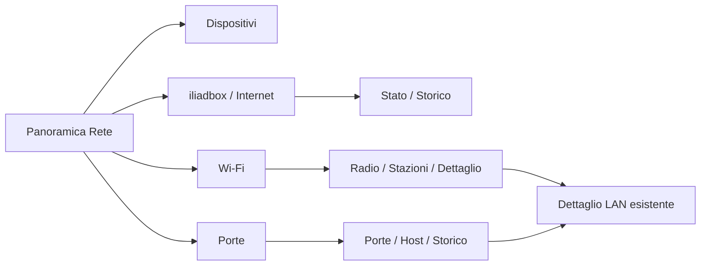

# v0.8.1 · iliadbox / Internet, Wi-Fi e Porte — piano eseguibile

**Piano storico del 7 ottobre 2026 · Europe/Rome. Attuato il 7–8 ottobre: E0–E4 implementate nella candidata 0.8.1-rc.1. [Consegna e prove](v081-implementation-report.md), [uso](v081-network-operations.md). Le sezioni seguenti conservano baseline e decisioni della preparazione; non descrivono lo stato attuale del runtime.**

Il checkout corrente è **0.8.0**, tag **v0.8.0**, commit `99f97f5`; Theme API **2.3**. L’ultima consegna fisica attestata dalle evidenze consultate è **0.8.0-rc.1**. La promozione Git/documentale non è una nuova prova del manifest installato. Possiamo iniziare la v0.8.1 riusando autenticazione, inventario, preferiti e infrastruttura Theme. Il primo passo è E0: verificare dalla board le fonti avanzate e la semantica delle metriche. Non serve riscrivere la v0.8 o ottenere un secondo token per le letture già riuscite.

Questo piano confronta sorgenti attuali, [MasterPlan](release-masterplan.md), [consegna v0.8](v08-implementation-report.md), [studio capacità](v08-router-capabilities-and-views.md) ed evidenze API salvate. Non esegue nuove chiamate al router, modifica permessi, cambia runtime, installa o riavvia la board. Le misure riportate sono quelle delle prove del 7 ottobre, non una nuova osservazione dal vivo.

## 1. Baseline e ciò che manca

La consegna documentata comprende 475 file verificati, 67 controlli PC, EGLFS Base/Functional/Apple Calm e reboot con preferenze conservate. Lo snapshot successivo al reboot contieneva 39 record e 14 raggiungibili secondo box; discrepanza 54/39 e guest nullo sono dichiarati. [Prova del reboot](evidence/v08-implementation-2026-10-07/post-reboot-health-final.json), [verifica sorgente/pacchetto](evidence/v08-implementation-2026-10-07/delivery-verification.json).

| Area | Già presente nella v0.8 | Lavoro v0.8.1 |
| --- | --- | --- |
| Accesso | HTTPS con CA circoscritte, UID/hostname verificati, HMAC, sessione e logout; credenziale privata. | Riutilizzare il client con un coordinatore comune; distinguere errori di sessione, revoca e singola capacità. |
| Inventario | Identità per scope, IPv4/IPv6, nomi, cache, quattro preferiti/alias, qualità e copertura. | Conservare contratto e frequenza. Collegare le nuove viste agli ID LAN esistenti. |
| WAN | `/connection/` produce una stringa stato/FTTH. | DTO di stato, traffico e capacità distinti; ottica FTTH, router/sensori e storico. |
| Wi-Fi | AP/stazioni utilizzati per un testo di associazione host. | Radio, associazioni, metriche per stazione e selezione; valori/tempi strutturati. |
| Switch | Stato porte/MAC usato per «visto da porta». | Elenco porte, link, host corrispondenti, statistiche e serie aggregate. |
| Archivio | SQLite inventario/preferenze e tabella `history` con cicli/max reachable giornalieri. | **Questa tabella non è uno storico di traffico.** Aggiungere cache metriche e finestre RRD separate. |
| Scheduling | Un worker, polling 300 s, cooldown manuale 30 s, pausa/backoff e shutdown. `setVisible()` non ha effetto. | Interesse per vista/entità/finestra; campioni aggiuntivi solo quando utili e stop alla chiusura. |
| Errori/freschezza | Un envelope principale per l'inventario. | Stato indipendente per WAN, radio, stazioni, porte, sensori e ogni finestra storica. Un guasto RRD non invalida gli host. |
| UI | Panoramica, Dispositivi, Dettaglio, Impostazioni. | Tre approfondimenti e grafico condiviso; navigazione e ritorno senza perdere selezioni. |
| Theme | API 2.3, quattro superfici Network e fallback additivi Casa/Rete. | Estensione proposta 2.4, tre superfici nuove e compatibilità dei bundle precedenti; fixture/generatori/kit aggiornati insieme. |

Il confronto locale con il manifest della consegna rc.1 trova **474 file corrispondenti e la sola differenza `version.py`**, ora 0.8.0. README/tag dichiarano la promozione stabile; non sono un nuovo riscontro fisico. La fase E0 deve fotografare nuovamente manifest/runtime e diff prima dell’implementazione. Le modifiche meccaniche/3D e altri lavori estranei non entrano nel pacchetto dashboard.

## 2. Perimetro della v0.8.1

Tre viste nella famiglia Rete: **iliadbox / Internet**, **Wi-Fi**, **Porte**. Storico WAN, temperature/ventola e traffico delle porte tramite RRD. Dettaglio di una stazione Wi-Fi con segnale riportato, link e contatori qualificati; piccoli campioni recenti mentre la vista è aperta.

Una capacità assente rende indisponibile quel dato, mantenendo le altre sezioni. Non promettere grafici storici per ogni client: nello studio sono state provate serie RRD net/temp/switch, non serie per stazione. Capacità configurata non è speed test; traffico Wi-Fi, porta e WAN non è sommabile e non costituisce consumo Internet di ogni host.

N4 notifiche di presenza, WebSocket, discovery ARP/mDNS, comandi router/client e consumo mensile per dispositivo rimangono lavori separati. Le prove fisiche residue della v0.8 non impediscono adapter e viste in consultazione; impediscono invece di promettere presenza assoluta e allarmi affidabili.

## 3. Matrice sorgenti e qualifica E0

I percorsi sono relativi alla base/versione scoperta. Solo GET per i dati; POST sessione/logout come nella v0.8. ID AP/BSS/porta e `rrd_id` vengono scoperti e codificati, mai fissati ai valori del campione.

| Fonte | Evidenza disponibile | Cosa verificare dalla board prima della pubblicazione |
| --- | --- | --- |
| `/connection/` | PC: schema completo; board v0.8: stato/media letti, resto scartato. | `rate_up/down` byte/s → bit/s ×8; `bandwidth_up/down` già bit/s. Contatori totali distinti da capacità. |
| `/connection/ftth/` | PC: link/ottica, TX 287 e RX −1838 nel campione. | Presenza/power-report e validità; conversione /100 in dBm. Nessuna potenza corrente se report assente. |
| `/system/` | PC: firmware, uptime, due sensori e ventola. | ID, tipi, unità, timestamp raccolta. `temp_t1` resta sensore generico; non attribuirlo alla CPU della board. |
| `/update/`, `/standby/status` | PC: stato leggibile. | Stato update, forma/scala di `next_change` e planning. Inserire tempi soltanto dopo qualifica; nessun aggiornamento o cambio programma. |
| `/wifi/state/`, `/wifi/ap/` | PC: due radio 2,4/5 GHz; board v0.8: AP per join. | Config/stato/canale/larghezza reali; larghezza nel campione stringa. I nomi capability `6g` non provano una radio presente. |
| `/wifi/ap/{id}/stations/` | PC: 11 associazioni; board: join host ID+MAC. | Tipi/sentinel; RX/TX, contatori, bitrate e segnale. Non confondere associazioni con host unici o uptime stazione con uptime dispositivo. |
| `/wifi/bss/`, MLO GET | PC: BSSID stringa, partner configurati, campo `key` presente. | Whitelist prima di cache/log/Theme. MLO configurato distinto da link simultanei osservati. Non serve nel polling rapido ordinario. |
| `/switch/status/` | Board v0.8: join MAC; campione PC: tre porte, una a 2500 Mbit/s. | Stato/link/speed/duplex e mapping `rrd_id`. Speed della porta down non è un link negoziato attuale. |
| `/switch/port/{id}/stats` | PC: contatori e rate per tre porte. | Unità e direzione dalla prospettiva switch, reset e campo `rx_good_bytes` distinto da altri contatori RX. Più MAC condividono la stessa porta. |
| `/rrd/?db=net…`, `temp`, `switch` | PC: un'ora, rispettivamente 360/30/30 punti. | Finestre 1 h e 24 h, risoluzione/limiti restituiti, null, campi/unità e mapping porte. GET con `settings=false`; non sostituire con POST RRD. |
| Survey/usage radio passive | PC: GET riusciti, survey con 600 punti; freschezza neighbor non provata. | Timestamp e finestra/radio effettivi. Occupazione è opzionale finché non qualificata; niente scansione radio attiva. |

Fonti strutturate: [schema/letture](evidence/v08-iliadbox-study-2026-10-07/network-capabilities.json), [sensori e RRD](evidence/v08-iliadbox-study-2026-10-07/network-extra-capabilities.json), [radio passive](evidence/v08-iliadbox-study-2026-10-07/network-passive-metadata.json), [catalogo dei percorsi](evidence/v08-iliadbox-study-2026-10-07/api-catalog.json).

### Regole per metriche ancora ambigue

- Wi-Fi: il manuale descrive `signal` in dB. Prima della qualifica mostrare **«Segnale riportato … dB»**, senza dBm, percentuali, barre qualitative o soglie inventate.
- Contatori stazione: ricevuti dalla box = inviati dal client; inviati dalla box = ricevuti dal client. I rate riportati hanno descrizioni da verificare: usare **RX/TX lato box** soltanto quando quella prospettiva è confermata. Un trasferimento di direzione nota qualifica upload/download del client; non avviarlo come effetto dell'apertura della pagina.
- Bitrate `last_rx/last_tx`: contratto in decimi di Mbit/s, −1 assente; è link radio. Verificare il campo effettivo prima di convertirlo. Né 0 né −1 si sostituiscono con un valore plausibile.
- RRD net `bw_*` e connection `bandwidth_*` usano scale diverse nello studio; normalizzazione per endpoint, non per somiglianza del nome. Serie temperature e ventola hanno assi/unità separati.
- Timestamp: distinguere ora della lettura, ora del campione e finestra restituita. Non correggere secondi/millisecondi in modo euristico universale.
- MAC privati, roaming e MLO non fondono identità per nome/IP. Un'associazione non corrispondente all'inventario rimane «non associata a un record LAN» e non viene eliminata per rendere i conteggi uguali.

E0 produce un resoconto filtrato per capacità, con tipi, unità, direzione, tempi, permessi, richieste e limiti. Nessun segreto o dump di BSS. I campi qualificati procedono; gli altri rimangono tecnici/indisponibili senza bloccare tutte le viste.

## 4. Backend, persistenza e grafici

### Adapter e stati

Mantenere `IliadboxClient` e `NetworkService` come proprietari dell'I/O. Aggiungere moduli proposti `network_metrics.py` (normalizzazione, snapshot per capacità, cache) e `network_history.py` (RRD, serie e riduzione). Nessun secondo servizio che interroga gli stessi AP o apre sessioni concorrenti sullo stesso oggetto client.

Ogni capacità espone stato, `collectedAt`, eventuale `sampleAt`, validità, errore filtrato e dati precedenti. Distinguere elenco vuoto valido, `null`, campo mancante, fonte non supportata ed errore. Uptime discontinuo invalida le baseline dei delta; una nuova sessione da sola non prova che il contatore si sia azzerato.

In `iliadbox.py` il client attuale raggruppa `auth_required` e `insufficient_rights` come auth: l'estensione deve conservare internamente un codice allowlist per distinguere sessione scaduta da permesso negato. Solo per scadenza compatibile: nuova sessione una volta e retry del GET fallito, entro budget. Revoca/UID/TLS fermano il provider; permesso negato di una capacità non cancella l'inventario sano né avvia un ciclo di login.

### Archivio

Conservare il DB inventario/versione 1 e preferenze. Proposta: archivio complementare privato `.local/state/smartpc/network-metrics/<scope>.sqlite3`, versione propria, sole strutture normalizzate. Le finestre RRD sono cache identificate da scope, database, entità e intervallo; salvare anche intervallo/risoluzione effettivi e qualifica. Nessuna risposta BSS grezza.

Limiti iniziali da applicare: otto radio, sedici porte, massimo 256 record stazione per batch; risposta già limitata a 4 MiB dal client. Massimo 10.000 punti raw per finestra RRD, 180 punti per serie pubblica e due serie per grafico. Se la fonte eccede il limite, la finestra non viene dichiarata completa e il precedente valido rimane disponibile. Cache storiche massimo 24 finestre e 8 MiB di payload normalizzato complessivo, eviction LRU; non promettere storico locale continuo quando la pagina era chiusa.

Le finestre sono 1 h e, dopo prova E0, 24 h. «Ultima ora» deve essere mostrata come finestra salvata con le sue date se la box è offline, senza spostare l'asse al presente. Campioni live recenti Wi-Fi possono restare in un buffer memoria limitato, con inizio esplicito: la chiusura non raccoglie un consumo giornaliero occulto.

Il downgrade può ripristinare solo il runtime conservando DB inventario/preferenze e archivio metriche separato: il vecchio codice non deve leggere nuove strutture come snapshot v1. Prima della candidata verificare questo percorso su copie isolate, con backup privato e manifest.

### Serie

Serie ordinate e validate in Python: timestamp finiti e qualificati, duplicati gestiti in modo deterministico, valori null/sentinel/mancanti come buchi. Non interpolare e non collegare segmenti separati da assenze. Riduzione prima della facade conservando picchi e discontinuità; asse X basato su tempo reale, non sull'indice del record.

Contatori grandi rimangono interi Python/archivio: non passarli come `int` QML né perdere precisione oltre 2^53. Per i temi pubblicare rate normalizzati finiti e totali formattati. Delta solo tra campioni comparabili nella stessa epoca/entità; reset, roaming con nuova baseline, clock invertito o gap eccessivo producono **indisponibile**, non traffico negativo o zero. Non sommare rate WAN con porte/stazioni.

Proposta grafico condiviso `NetworkHistoryChart.qml` con primitive Qt Quick/Shapes già ammesse dal runtime/bundle. Nessuna dipendenza QtCharts aggiunta come prerequisito. Un grafico per volta, due serie al massimo, legenda/unità/periodo, focus e descrizione testuale dei valori e dei buchi. Nessuna animazione permanente o timer nel renderer che esegua I/O.

## 5. Scheduling senza regressioni dell'inventario

Il booleano attuale `setVisible()` è insufficiente. Aggiungere un interesse esplicito **vista + entità + sezione + finestra**, con una generazione di richiesta. L'interesse viene dal controller Main e dalla visibilità effettiva, non dal tema. Menu, Home, overlay sovrapposto, avviso urgente, sospensione app o chiusura eliminano l'interesse rapido.

| Raccolta | Policy iniziale proposta | Arresto / freschezza |
| --- | --- | --- |
| Inventario/join base | Conservare 300 s e cooldown 30 s. | Continua con modulo nascosto; pausa Rete globale disabilita l'automatico. |
| Metadati router/AP/porte | Primo ingresso se assenti/scaduti; cache candidata 600 s. Stato lento e dati aggiornati separati. | Niente richieste dedicate in background per pagine mai consultate. |
| WAN live | Un GET connection per batch mentre Stato/traffico è visibile. | E0 inizia a 30 s; candidato finale 10 s solo dopo misura. |
| Stazioni Wi-Fi | GET stazioni per **una radio selezionata**, non tutte a ogni tick. Catalogo/stato AP condiviso con base. | Come WAN; niente frequenza rapida per solo filtro elenco LAN. |
| Porta live | Stato switch quando scaduto + stats della sola porta selezionata. | Come WAN; cambio porta cambia interesse. |
| RRD | All'apertura di Storico/cambio finestra se cache scaduta; cooldown per chiave 60 s. | Nessun refill rapido nascosto; riaprire non deve creare richieste duplicate. |
| Survey radio opzionale | GET mirato solo nella relativa sezione, dopo qualifica. | Niente POST scan; senza timestamp utile fonte precedente/indisponibile. |

Una sola operazione di rete alla volta. Priorità a preferenze/refresh manuale e inventario in scadenza; poi batch visibile, storico e metadati. Nessuna coda illimitata: coalescing dell'ultimo interesse; un batch rapido ancora in corso fa saltare il tick successivo. Riutilizzare le risposte AP/stazioni/switch nello stesso batch quando soddisfano la richiesta base, senza mutare lo stato inventario con un refresh parziale.

Budget iniziale: massimo due GET dati per batch rapido, timeout/deadline e cancellazione del client conservati. Discovery, challenge, sessione e logout valgono altre quattro richieste: sei richieste ogni 10 s sono **36/minuto**, più inventario/metadati/storico. Quindi 5 s non è un default gratuito. E0 misura durata, richieste/minuto e impatto GUI; se il budget non è adeguato si mantiene 30 s. Il coordinatore deve ridurre campioni visibili prima di affamare l'inventario.

Le risposte tardive possono aggiornare una cache della propria chiave, ma non diventano il risultato della nuova selezione. Preferenze confermate solo dopo persistenza, nessun `settingsChanged` da campioni metriche, invalidazione limitata alla vista interessata. La pausa automatica vale anche per le nuove metriche; il refresh manuale rimane esplicito e completato dal broker delle azioni, non confermato alla semplice accodatura.

## 6. Viste, tastierino e Theme

Manteniamo le due pagine di famiglia Panoramica/Dispositivi. In Panoramica una sezione **Approfondimenti** porta a tre overlay pubblici. Occupa alternativamente l’area dei preferiti, senza aggiungere tre righe sotto le quattro tessere o ridurne il testo. Con focus sulle schede, 5 alterna Riepilogo/Approfondimenti nella Panoramica; i filtri rimangono in Dispositivi. Gli stessi tre ingressi sono disponibili in Impostazioni → Rete locale tramite righe canoniche, anche per renderer precedenti che non espongono la nuova sezione. Sono accessibili indipendentemente dalla presenza di preferiti; una capacità non verificata dà un motivo leggibile, non una pagina decorativa vuota.

| Superficie nuova | Layout 960×640 | Contenuto e interazioni |
| --- | --- | --- |
| `network.router` | Header fonte/ora, due valori down/up, elenco stato breve. In Storico un grafico ampio. | WAN/FTTH, capacità riportata, firmware/uptime; sensori/ventola, update/planning qualificati nelle righe. Serie traffico, temperatura o ventola selezionabile senza assi misti. |
| `network.wifi` | Radio selezionata e stato/canale; elenco fino a sei righe o dettaglio di una stazione. | Distinguere radio, associazioni e host unici. Segnale tecnico/link, RX/TX qualificati e durata associazione. 5 può aprire il record LAN se il join esiste; MLO/survey soltanto quando disponibili. |
| `network.ports` | Tre porte nel campione, elenco dinamico; dettaglio link e host oppure grafico della porta scelta. | Speed solo con link attuale, MAC/host visti, statistiche aggregate e RRD da `rrd_id`. 5 apre host LAN associato, senza distribuire il totale porta a ogni host. |

Comandi: **2/8** selezionano righe; dalla prima riga 2 porta alle schede; **4/6** sulle schede cambia sezione, nel selettore entità cambia radio/porta, nel grafico cambia metrica/finestra con etichetta del focus; **5** apre/conferma; **7** torna allo stesso punto; **1/9** mantengono Home/menu. Nessuna funzione di un tasto dipende soltanto dal colore. Alla scomparsa dell'entità mostrare stato precedente/non disponibile, senza saltare silenziosamente su un'altra porta o stazione.

Contratto proposto **Theme API 2.4**, assegnato solo quando implementato: contesti `NetworkRouterContext`, `NetworkWifiContext`, `NetworkPortsContext`, DTO/model per metriche, radio/stazioni, porte e serie con punto nullable. `NetworkContext` e `PageContext.network` 2.3 restano compatibili; non riversare tutte le serie nel payload della Home o delle quattro viste base.

Riusare azioni di navigazione selezione/dettaglio, estendere la selezione della sezione Panoramica e aggiungere soltanto quelle necessarie alla finestra/metrica; ID opachi, allowlist di superfici/entità/finestre, esito asincrono del refresh. Stato sorgente per capacità, unità e qualifica sono parte del DTO, non deduzioni del tema.

Tre superfici additive complete portano il catalogo da 53 a **56** (numero previsto). Base/Functional vengono implementati entrambi con stessi dati e comandi. `effective_manifest()` va esteso con il gruppo completo router/wifi/ports, conservando Casa e Network v0.8: Apple Calm e bundle precedenti ricevono fallback con il proprio stile senza riscrivere i pacchetti immutabili; coperture incomplete arbitrarie rimangono errori.

Aggiornare contratti canonicali, registri, metadata/qmltypes, normalize/projection, fixture/catalogo, scene coverage, generatori e kit AI insieme. Nessuna implementazione Python duplicata per tema. Una nuova impaginazione Apple Calm dedicata è un lavoro tema successivo, non necessaria al fallback funzionante.

## 7. Fasi, deliverable e verifica

| Fase | Lavoro concreto | Criterio di completamento |
| --- | --- | --- |
| **E0 · Fonte e semantica** | Baseline sorgente/installato; probe limitato dalla board, campi/unità/tempi, RRD 1 h/24 h, direzioni, token e budget. Preparare fixture sintetiche equivalenti. | Report per capacità con verificato/tecnico/assente; nessuna credenziale o chiave Wi-Fi nell'evidenza. Frequenza rapida motivata. |
| **E1 · Adapter e storico** | Moduli metriche/RRD, whitelist, stati indipendenti, archivio complementare, punti/null/reset/limiti. | Test reali su SQLite temporaneo; cache invalida/salvataggio fallito senza conferma, scope isolati e migrazione senza perdita preferenze v0.8. |
| **E2 · Acquisizione visibile** | Coordinatore single-flight, interesse generazionale, priorità/cooldown/cancellazione, errore sessione distinto. | Fuori vista nessun batch aggiuntivo, inventario ogni cinque minuti conservato, nessun risultato assegnato alla selezione sbagliata o callback dopo close. |
| **E3 · UI e Theme** | Tre overlay, grafico condiviso, DTO/API/generatori, Base/Functional e fallback/kit. | Tastierino programmato, lunghi nomi, fonti parziali, grafici senza dati e cambi rapidi; nessun warning QML. Kit autonomo e vecchio bundle validi. |
| **E4 · Board e consegna** | Letture reali, EGLFS, carico mirato, backup/hash/preferenze, reboot con verifier persistente. | Nessuna regressione v0.8; servizio attivo senza restart, tema/preferenze e cache conservati. Report della candidata e residui fisici espliciti. |

La candidata, al momento della distribuzione, avrà versione proposta **0.8.1-rc.1**; il piano non cambia oggi `version.py`, Theme API o tag Git.

### Casi di accettazione mirati

- Rate zero **valido** distinto da null/assente; −1, booleano al posto di numero, NaN/inf, unità e stringhe speed. Totali >2^53 non troncati prima del delta.
- RRD vuoto/null, fuori ordine/duplicato, risoluzione diversa, finestra adattata, buchi e picchi dopo riduzione; cache di una finestra non confermata come un'altra.
- Riavvio router, counter reset, scope cambiato e clock invertito; nessun consumo negativo o baseline falsa dal semplice rinnovo di sessione.
- Stazione con MAC locale, roaming/AP cambiato, MLO configurato ma non attivo, join ambiguo/mancante; porta con più MAC, down con speed residua, porta scomparsa.
- Campo BSS `key` valorizzato in fixture: nessuna chiave in DTO, cache, log, artefatti o snapshot Theme. UID/token privati fuori facade.
- Guasto di FTTH/RRD/survey con inventario sano; sessione scaduta con un solo rinnovo; revoca senza login ripetuto; pausa persistente e refresh manuale corretto.
- Apri/chiudi/cambia entità mentre una richiesta è in corso; Home/menu/urgente sospendono extra polling; preferiti e inventario non affamati. Nessun nuovo reload tema da metriche.
- Base giorno, Functional notte, Apple Calm precedente e bundle senza Casa/Rete; ritorno alla stessa riga LAN, grafico vuoto/salvato e testi lunghi.
- Board: requests/minuto, durata batch e RSS tra cicli rappresentativi, responsività GUI senza dedurre GPU/input ottico dai tick; vero reboot ordinato con manifesto e preferenze.

Non ripetere stress storici Theme privi di un rischio nuovo. Interruzione fisica LAN, trasferimenti controllati di direzione nota, roaming fisico, tastierino reale, power-cut e uso prolungato hanno evidenze separate dai test sintetici. Nessuno scollegamento di dispositivi è stato eseguito in questa preparazione.

## 8. Decisione di partenza

**Pronti a iniziare E0 e l'implementazione progressiva E1–E3.** Esistono un provider consegnato e letture PC utili delle fonti avanzate. Non siamo ancora pronti a dichiarare qualificati i grafici/direzioni e distribuita la v0.8.1: mancano il probe board delle metriche, gli adapter/scheduler, tre superfici e i relativi controlli.

Riutilizzare il token attuale per E0; un token nuovo è facoltativo per separare sviluppo/kiosk, non una dipendenza funzionale. Riduzione dei permessi estranei resta un gate di gestione già documentato nella v0.8. La mancanza di MLO fisico, survey fresco o un endpoint opzionale non blocca WAN/Wi-Fi/Porte con campi qualificati; quei dati rimangono indisponibili.

Ordine consigliato: **qualifica → dati/storico → scheduler → iliadbox/Internet → Wi-Fi → Porte → temi/SDK e qualifica integrata → candidata sulla board**. Le tre viste vengono costruite sul contratto comune; il rilascio resta unico v0.8.1, senza cambiare implicitamente priorità o ambito di notifiche/comandi.
