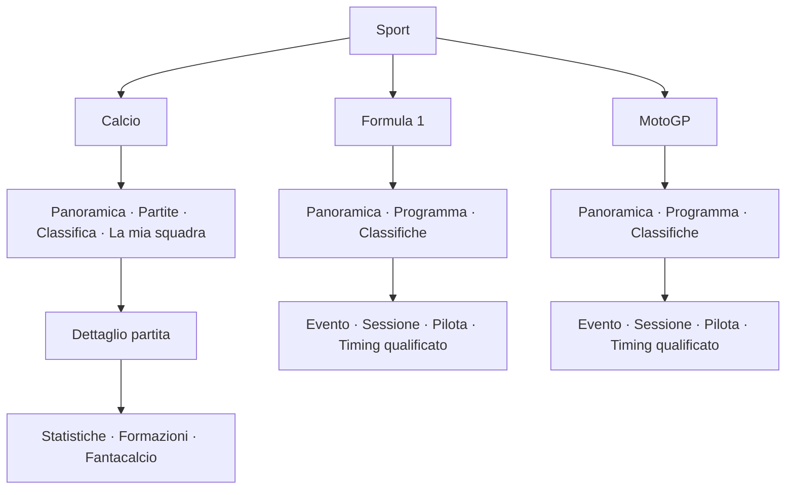

# v0.8.2 / v0.8.3 — Consolidamento, Sport e uso sul display da 3,5″

**8 ottobre 2026 · Europe/Rome · Piano, senza modifiche al runtime o alla board.**

**Integrazione dell'8 ottobre:** coerenza visiva dell'intera UX, fix/riorganizzazione delle impostazioni e completamento delle icone sono requisiti espliciti. Il [dossier approfondito](ux-research-consolidation-2026-10-08.md) confronta 32 riferimenti, inclusi nove lavori scientifici, e aggiorna le decisioni alla distanza confermata dall'utente di **50–60 cm**. L'[inventario statico](ux-consolidation-static-inventory.md) registra superfici, righe dichiarate e copertura Apple Calm; il completamento runtime resta parte di U0.

Obiettivo: rendere ciò che SmartPC offre già più affidabile, comprensibile e comodo sul pannello IPS 960×640. Due revisioni prima della v0.9: **0.8.2 — Affidabilità e risposta**, poi **0.8.3 — Navigazione e leggibilità**. La prima comprende anche correzioni UX urgenti; la seconda include il backend strettamente necessario alla nuova navigazione. I gate live e fisici si chiudono soltanto con prove pertinenti.

## 1. Baseline e attendibilità dell'analisi

- Checkout pulito all'inizio dell'analisi, HEAD e tag locale `v0.8.1` al commit `d761d7a`; `dashboard/version.py` dichiara `0.8.1`.
- L'ultima ricevuta di installazione e il report di consegna attestano **0.8.1-rc.1**, Theme API **2.4**, **56 superfici**, Apple Calm **1.2.0**. La promozione Git non dimostra una nuova installazione stabile: confrontare il runtime prima della prossima consegna.
- Consultati sorgenti locali, MasterPlan, report v0.8.1 e catture già salvate. **Nessuna nuova misura prestazionale, chiamata ai provider, scansione LAN, prova fisica o ispezione SSH in questa analisi.**
- Rete dispone già di worker/coordinatore, cache privata, cancellazione, backoff e polling visibile. Conservare queste garanzie; ottimizzare sulla base delle misure.
- Report v0.8.1: metriche visibili 30 s, inventario 300 s, metadati 600 s, stessa finestra RRD almeno 60 s. Misure storiche del loop GUI e RSS sono baseline documentali, da ripetere con carico comparabile prima di dichiarare un miglioramento.

Fonti: [MasterPlan](release-masterplan.md), [consegna v0.8.1](v081-implementation-report.md), [uso Rete](v081-network-operations.md), [Main](../Main.qml), [stato e aggiornamenti](../state.py), [Meteo](../weather.py), [impostazioni](../SettingsPanel.qml), [pannello metriche](../presentations/NetworkMetricsPanel.qml), [Panel Apple Calm](../../theme-projects/apple-calm/bundle/qml/Panel.qml).

## 2. Riscontri e priorità

**P0:** perdita dati, falsi stati attuali, blocchi, errori di recovery. **P1:** difficoltà d'uso ricorrenti e lavoro necessario alle due release. **P2:** rifiniture da includere se dimostrano valore senza allargare il perimetro. Un rischio da verificare non è un bug riprodotto.

| ID | Evidenza o ipotesi esplicita | Intervento e risultato atteso | Priorità / release |
| --- | --- | --- | --- |
| B01 | Codice/tag 0.8.1, ricevuta installata rc.1; MasterPlan ancora precedente alla promozione. | Riconciliare versione, manifest, Info, runtime e documenti; attribuire le differenze. | P1 · 0.8.2 |
| B02 | Meteo: `_on_finished` chiama `_save_cache` nella GUI; gli `OSError` sono ignorati. | Persistenza nel worker, errore di salvataggio visibile e distinto dalla riuscita del fetch. Dato valido in memoria utilizzabile, durata offline non falsamente confermata. | P1; P0 se emerge perdita/falsa conferma · 0.8.2 |
| B03 | WeatherService non espone `close`; app.py chiude esplicitamente altri provider. È un rischio di lifecycle da riprodurre. | Guardie di chiusura/callback tardivi e conclusione controllata del worker; nessuna reentrancy QML al teardown. | P1 · 0.8.2 |
| B04 | `refreshSource` delle fonti legacy restituisce true dopo il dispatch; Casa/Rete dispongono di completion dedicate. | Distinguere richiesta accettata, in corso, accodata, rifiutata e completata; esito finale legato a validazione e persistenza dove previste. | P1 · 0.8.2 |
| B05 | Stati comuni esistono; scadenza, messaggi e granularità dipendono dal provider. Uniformità da verificare. | Audit dei TTL, ultimo dato valido, timestamp, aggiornamento in corso e errori parziali; un refresh non rende fresche capacità non aggiornate. | P1; P0 per difetti riprodotti · 0.8.2 |
| B06 | Account legge la cache locale con watcher e timer 60 s; non acquisisce direttamente l'account online. | Verificare replace atomico, assenza/corruzione cache e scadenza; «Rileggi dati dal PC» non deve promettere una nuova sincronizzazione cloud. | P1 · 0.8.2 |
| B07 | Numerosi servizi, timer e contesti; Rete è già selettiva. Non è dimostrato uno spreco globale. | Profilare invalidazioni, copie/modelli, letture disco e timer a vista aperta/chiusa; intervenire solo sui costi misurati. | P1 · 0.8.2 |
| B08 | Pool globali e worker di più famiglie; condizioni contemporanee da verificare. | Provare rete lenta + refresh manuali + cambi rapidi; evitare accodamenti inutili e risultati applicati a entità/season sbagliate. | P1 · 0.8.2 |
| U01 | Main espone famiglie distinte `sport`, `f1`, `motogp`. | Un ingresso Sport, tre sezioni; evitare di attraversare tre argomenti sportivi per arrivare a Casa/Rete. | P1 · 0.8.3 |
| U02 | Percorsi e selezioni sono mantenuti in Main con slot/ID legacy. | Stato esplicito macroarea → disciplina → vista → dettaglio; ritorno alla stessa entità, scheda e pagina. | P1 · 0.8.3 |
| U03 | Timer Sport ruota ogni 8 s nella panoramica; è già fermo negli overlay. | Fermare la rotazione anche al primo input della panoramica; ripresa solo dopo uscita/rientro o scelta esplicita, senza spostare il focus. | P1 · 0.8.2 |
| U04 | Guide contestuali diverse e alcune azioni Rete cambiano funzione nello storico. | Guide generate dalle azioni effettive; distinguere cambio vista, scheda, riga e finestra temporale. | P1 · 0.8.3 |
| U05 | Pannello Rete: 5/6 righe e secondari da 18 px; testi esplicativi ripetuti. | 3/4 righe leggibili, valore prioritario, dettagli tecnici in un approfondimento; paginazione completa. | P1 · 0.8.3 |
| U06 | Cattura storica Apple Calm `settings.index--default.png`: titolo e sottotitolo si accostano/sovrappongono. | Riprodurre con build corrente, testi lunghi e scale supportate; correggere geometria comune se confermato. | P1 · 0.8.2 |
| U07 | Il confronto statico rileva sette superfici Rete senza presentazione esplicita Apple Calm, compresi i tre approfondimenti; fallback/ereditarietà da verificare. | Copertura Rete nativa nella nuova revisione del tema, con gerarchia/righe coerenti; assenza di mapping esplicito non equivale a vista rotta. | P1 · 0.8.3 |
| U08 | Impostazioni comuni, impostazioni modulo e aggiornamenti sono già separati. | Semplificare etichette e raggruppamenti mantenendo un unico luogo per le azioni globali e accessi contestuali ai moduli. | P1 · 0.8.3 |
| U09 | Otto famiglie possibili e indicatori soprattutto a pallini in Apple Calm. | Ridurre a sei macroaree; titolo locale comprensibile e posizione indicata, senza affidare l'orientamento solo ai pallini. | P1 · 0.8.3 |
| U10 | Numerosi dati tecnici: link/rate, router/board, cache/live, quota/reset. | Vocabolario comune e unità omogenee; spiegazione estesa accessibile quando serve. | P1 · 0.8.3 |
| U11 | Font scalabili e densità esistono già; valori utili potrebbero essere troncati. | Audit valori/unità, nomi lunghi, focus e overflow a tutte le scale dichiarate; preservare il valore essenziale. | P1 · 0.8.3 |
| U12 | Home ha già Ora, Orologio e Giornata. | Ridurre duplicazioni e ordinare contenuti pertinenti; nessuna nuova Home parallela o tessera vuota permanente. | P1 · 0.8.3 |
| U13 | Apple Calm `Format.js`: `familyIcon` non associa `network`, pur avendo il simbolo network nell'icon-source; `settingTitle`/`settingIcon` non coprono esplicitamente Rete e usano nomi diversi dal pannello standard. | Correggere associazioni e titoli, poi verificare tutte le famiglie/righe nei tre temi. Una lacuna di mapping non richiede ridisegnare un'icona già disponibile. | P1 · fix 0.8.2, copertura 0.8.3 |
| U14 | Nove voci potenziali nell'indice Impostazioni; Aspetto rapido contiene anche trasferimenti/revisioni e l'editor avanzato molte opzioni. | Confrontare sei gruppi per compito e otto gruppi diretti; controlli frequenti in primo piano, specialistici secondari, nuova destinazione di ogni opzione e azione invariata. | P1 · 0.8.3 |
| U15 | Icone semantiche e renderer esistono, ma la copertura per nuove aree/azioni non è ancora inventariata. | Atlante di copertura; nuove icone soltanto per significati mancanti, geometria/peso coerenti e fallback verificati. | P1 · 0.8.3 |
| U16 | NetworkHistoryChart usa `16px sans-serif` nel Canvas, esterno ai ruoli Theme; distinzione delle serie da rafforzare. | Font/assi/legenda/periodo coerenti, serie distinguibili oltre al colore, buchi e timestamp reali conservati. | P1 · 0.8.3 |
| U17 | Registro dichiarativo: 13 sezioni, 97 righe incluse condizionali/template; mancano le sezioni di righe Casa/Rete, pur presenti nel contratto delle superfici. | Completare la mappa dai controlli/adapter reali, non usare il conteggio come numero di preferenze; verificare copertura prima della migrazione. | P1 · 0.8.3 U0 |
| Q01 | Casa: quota/comandi/rete fisica aperti; Sport: eventi live non tutti qualificati; Rete: contatore 54 contro 39 record e guest indisponibile. | Conservare limiti espliciti; collaudi mirati quando le fonti sono disponibili. Non mascherare l'assenza con zero o «nessun dispositivo». | P1 · entrambe |
| Q02 | Tastierino reale, assenza/ripresa fisica della rete e uso prolungato ancora distinti dai check software. | Percorso fisico rappresentativo e sessione d'uso prolungata, con evidenze persistenti e residui dichiarati. | P1 · entrambe |
| D01 | Possibili ridondanze/diagnostica verbosa, non inventariate completamente. | Pulizia solo dopo ricerca dei riferimenti; conservare fixture, cache utili, harness e documenti di prova. | P2 · 0.8.2 |
| D02 | Nomi, ordinamento preferiti e formati possono essere più uniformi. | Alias leggibili, preferiti prima degli altri, durate/date italiane e messaggi brevi coerenti. | P2 · 0.8.3 |

Durante l'esecuzione ogni voce riceve: riproduzione, file interessati, prima/dopo, verifica, rischio e stato. Nessuna voce è «risolta» grazie a questa analisi.

## 3. v0.8.2 — Affidabilità e risposta

**Risultato per l'utente:** aggiornamenti comprensibili, dati salvati affidabili, navigazione che resta pronta anche con fonti lente, correzioni visive urgenti.

### Fasi, nell'ordine

1. **C0 — Baseline.** Manifest corrente/board, preferenze, tema attivo, versioni, screenshot e carico rappresentativo. Registro dei bug con riproduzione; distinguere catture storiche dalla build corrente. Nessuna promozione automatica dei gate aperti.
2. **C1 — Correttezza.** B02–B06: Meteo, lifecycle, refresh e freschezza. Fault injection mirata: disco non scrivibile, cache corrotta, timeout, risultato parziale e callback tardivo. Ogni provider conserva l'ultimo dato completo confermato; i dati validi soltanto in memoria dichiarano il problema di persistenza.
3. **C2 — Costi reali.** B07–B08: misure dello stesso carico prima/dopo; ridurre emissioni duplicate, ricostruzioni/copie e lavoro invisibile. Il cambio vista e l'apertura delle impostazioni non provocano nuove richieste senza una ragione prevista dalla policy. Non fermare indiscriminatamente i provider nascosti: avvisi e freschezza possono richiedere lavoro di fondo.
4. **C3 — Correzioni UX immediate.** U03, U06, mapping/titoli U13 e difetti di focus/overflow riprodotti. Nessuna riorganizzazione delle famiglie in questa fase.
5. **C4 — Qualifica e consegna.** Check pertinenti Qt 6.8.2, suite richiesta dal progetto, EGLFS e provider con workload controllato; backup, manifest, reboot e istruzioni di rollback. Tag/etichette aggiornati solo per la build realmente consegnata.

### Criteri di uscita

- Nessun P0 aperto nel perimetro toccato; ogni bug chiuso ha una riproduzione precedente e un controllo significativo.
- «Richiesta inviata» non equivale a «Dati aggiornati». Cooldown, operazione già in corso, fallimento e accodamento sono distinguibili. La rilettura Account resta una lettura dei dati dal PC.
- Scrittura Meteo fuori dalla GUI; errore di persistenza osservabile; chiusura durante un fetch senza aggiornamenti tardivi dell'interfaccia.
- Cold start con cache valida, assente e corrotta; perdita/ripresa della fonte e invecchiamento verificati. Cache salvata mantiene data reale e stato precedente.
- Confronto di CPU idle, RSS/PSS o memoria del servizio, loop GUI, richieste e tempi di acquisizione con medesimo tema/carico. Pubblicare numeri e metodo, anche se il guadagno è piccolo. Budget e soglie fissati in C0; nessuna promessa di 60 fps o di RAM assoluta prima delle misure.
- Nessun nuovo warning QML; preferenze/eventi/tema conservati; servizio attivo e `NRestarts=0` nella finestra osservata, heartbeat fresco dopo reboot.

## 4. v0.8.3 — Navigazione e leggibilità

**Risultato per l'utente:** sei argomenti chiari, un unico Sport, viste più leggibili e azioni prevedibili in Base, Functional e Apple Calm.

### Macroaree

Carosello proposto: **Oggi → Meteo → Account ChatGPT → Sport → Casa → Rete**, filtrato dalle preferenze e disponibilità. Oggi resta sempre raggiungibile. Avvisi, Impostazioni, Comandi e Informazioni sono utilità accessibili dal menu/tasti dedicati.

**Sport apre un indice di tre righe grandi**, una per disciplina abilitata, con il prossimo appuntamento o l'ultimo risultato valido. Il contenuto «In corso» compare solo con gate e freschezza qualificati. L'indice usa dati già acquisiti e non introduce un quarto provider. Una sola disciplina abilitata mantiene comunque l'indice e il medesimo comportamento di ritorno.

Calcio comprende La mia squadra e Serie A; Fantacalcio rimane collegato alla partita/giocatori, senza una macroarea priva di contesto. Formula 1 e MotoGP condividono la gerarchia, mantenendo le differenze reali di sessioni, classifiche e feed.

### Contratto di navigazione

| Contesto | 4 / 6 | 2 / 8 | 5 | 7 |
| --- | --- | --- | --- | --- |
| Carosello, indice Sport incluso | Macroarea precedente/successiva | Viste della macroarea; nell'indice Sport selezione disciplina | Apri selezione/approfondimento | Ritorno previsto, senza perdere la posizione |
| Disciplina Sport aperta | Schede della disciplina | Righe della scheda | Dettaglio della riga | Indice Sport |
| Dettaglio o lista estesa | Schede locali quando esistono | Righe o scorrimento, dichiarato nella guida | Azione della selezione | Livello precedente e stessa selezione |
| Grafico Rete | Schede locali | Finestra temporale, con indicazione 1 h / 24 h | Metrica disponibile, con etichetta | Elenco/entità precedente |

**1 = Home, 3 = Avvisi, 9 = Menu** rimangono globali, salvo la gestione già prevista degli urgenti. L'ingresso nella disciplina è un livello esplicito: 4/6 cambiano schede soltanto dopo 5; 7 torna all'indice, dove 4/6 riprendono il carosello. Evitare un terzo asse implicito.

Ricordare disciplina, scheda, entità e pagina per ogni ramo durante la sessione, inclusi avvisi/menu e cambio tema. Se un record sparisce, selezionare il vicino valido senza aprire il dettaglio di un altro record. La persistenza fra reboot riguarda le preferenze; il ripristino di dettagli transitori non è obbligatorio.

### Migrazione e compatibilità

- Separare la macroarea Sport dagli ID provider `sport`, `f1`, `motogp` e dai `contentId` esistenti; non rinominare provider/cache/superfici per ragioni grafiche.
- Migrazione versionata delle preferenze: visibilità legacy di Calcio/F1/MotoGP → sezioni della macroarea; Sport visibile se almeno una sezione era visibile. Nessun modulo nascosto torna visibile; possibilità di nascondere l'intera macroarea senza perdere le scelte interne. Conservare le chiavi legacy necessarie al rollback.
- Rimuovere l'assunzione «posizione nel carosello = slot del provider» nei punti interessati, con refactor mirato della navigazione. Non riscrivere tutto Main insieme ai servizi.
- Nuovo indice Sport esposto attraverso il contratto Theme, con contesto/azioni limitati e fallback completo. Eventuale estensione API additiva, con generator, SDK e kit aggiornati nello stesso rilascio.
- Base/Functional e una **nuova revisione Apple Calm** coprono indice Sport, shell e Rete estesa. Apple Calm 1.2.0 resta recuperabile e i bundle precedenti usano fallback; non modificare un bundle installato immutabile.

### Display: regole iniziali da provare sul pannello

| Elemento | Proposta iniziale | Verifica richiesta |
| --- | --- | --- |
| Riepiloghi | Una informazione dominante, 2–3 elementi secondari | Comprensione rapida a distanza abituale, giorno/notte |
| Liste | 3–4 righe; paginazione e posizione evidenti | Ultima riga accessibile, nessuna perdita di selezione |
| Etichette informative principali | Confrontare 36/42/48/54 px e layout attuale; titoli proporzionati al ruolo | Prova a 50 e 60 cm, glifi/scala effettivi, non default già approvati |
| Testo secondario utile | Taglia derivata dalla calibrazione fisica; meno contenuto per schermata | Stato/unità essenziali leggibili alla distanza abituale |
| Testo accessorio | Nessun minimo fissato prima della prova | Spostare in dettaglio se illeggibile; non contiene l'unico indizio di stato |
| Numeri principali | Taglie maggiori secondo contesto; orologio dedicato più ampio | Segno, decimali e unità sempre leggibili a 50–60 cm |
| Focus | Bordo/forma e testo, oltre al colore | Tastierino fisico, temi giorno/notte, Reduced/Off |
| Dettagli | Una gerarchia chiara, scorrimento soltanto per contenuti lunghi | Scale testo supportate e nomi lunghi |

Le precedenti ipotesi di 26–30 px principali e 22–24 px secondari sono superate come punto di partenza del confronto a distanza. Con diagonale attiva nominale 3,5″ e mapping 1:1, 26 px di corpo sono circa 2 mm: l'altezza del glifo è ancora inferiore. I nuovi candidati non sono valori qualificati; calcoli e limiti sono nel dossier. Un'immagine 960×640 vista sul monitor non certifica la leggibilità fisica. Usare ruoli/token dell'engine, evitando nuove dimensioni isolate e font ridotti automaticamente per far entrare più dati. Scala/densità cambiano anche righe, altezze e spazio per header/footer.

### Coerenza visiva come requisito di uscita

La coerenza deve riguardare Home, liste, dettagli, grafici, avvisi, menu, impostazioni, Informazioni e stati vuoti/errore/caricamento. Base, Functional e Apple Calm possono avere identità diverse; all'interno di ciascun tema la stessa funzione conserva linguaggio visivo e comportamento, e fra temi conserva significato e capacità.

- **Griglia comune:** aree di titolo, schede, contenuto, stato e guida con allineamenti/spaziature definiti dal tema; niente eccezioni casuali per singolo modulo. Raggi, bordi e padding derivano dai token.
- **Gerarchia tipografica:** pochi ruoli coerenti per titolo, etichetta, valore e nota; niente sottotitoli sovrapposti, auto-riduzione dei valori o schermate tecniche molto più dense delle altre.
- **Controlli riconoscibili:** una grammatica comune per riga apribile, interruttore, valore regolabile, tab, refresh e pulsante; selezione, disabilitato, in corso, errore e successo visivamente distinti.
- **Lessico comune:** stessa azione → stessa etichetta, icona e feedback nei punti equivalenti. Uniformare anche titolo della pagina, voce del menu e guida; parole come «Integrazioni», «Quiete» o «Fonti» non cambiano casualmente fra i renderer.
- **Colore semantico:** accento/focus separati da gravità/availability; stato comunicato anche con testo o forma. Come obiettivi di progetto, contrasto almeno 4,5:1 per il testo informativo e 3:1 per indicatori essenziali di controllo/focus; misura sulle combinazioni reali giorno/notte, seguita da prova sul pannello. [W3C: testo](https://www.w3.org/WAI/WCAG22/Understanding/contrast-minimum.html), [W3C: controlli e focus](https://www.w3.org/WAI/WCAG22/Understanding/non-text-contrast.html).
- **Movimento coerente:** uguale tipo di passaggio → uguale ricetta; focus e azione pronti senza attese decorative; Reduced/Off conservano la comprensione del cambiamento.
- **Revisione complessiva:** confrontare tavole di tutte le superfici per tema, oltre ai singoli screenshot. Registrare differenze intenzionali e difetti; una nuova vista non può restare esclusa dal controllo di coerenza.

La riconoscibilità delle funzioni ricorrenti segue il principio di [identificazione coerente W3C](https://www.w3.org/WAI/WCAG22/Understanding/consistent-identification.html). Questi sono riferimenti applicati alla dashboard QML, non una dichiarazione di conformità WCAG dell'intero dispositivo.

### Impostazioni: nuova struttura per compito

Confrontare **A: sei gruppi per compito** e **B: otto gruppi diretti**, paginati senza comprimere le righe. A comprende Schermo, Aspetto, Moduli e Home, Avvisi, Servizi collegati, Dati e aggiornamenti; B sostituisce Servizi collegati con Account ChatGPT, Casa e Rete. A quattro righe/pagina entrambi richiedono due pagine: decidere mediante compiti, comprensione e passaggi. La mappa seguente descrive A; i controlli non vengono eliminati per ridurre le voci.

| Gruppo | Controlli in primo piano | Secondo livello e confini |
| --- | --- | --- |
| **Schermo** | Luminosità manuale/automatica, fasce giorno/notte, dimensione testo | Valori giorno/notte; scala testo applicata tramite Theme e disponibilità dichiarata dal tema, senza forzare renderer che non la supportano |
| **Aspetto** | Tema, palette, movimento, anteprima e salvataggio | Personalizzazione avanzata; gestione temi separata per import/export/revisioni. Dimensione testo ha un'unica sede in Schermo |
| **Moduli e Home** | Macroaree visibili, Sport e discipline, contenuti di Oggi | Squadra/stagioni e inclusione in Home; confrontare la sede dei preferiti Casa/Rete vicino al loro modulo. Riutilizzare le azioni esistenti dove disponibili |
| **Avvisi** | Categorie che possono interrompere, fascia silenzio | Orari e soglie Account. La grafica dei banner resta in Aspetto avanzato; gli eventi restano nella casella |
| **Servizi collegati** | Account dal PC, Casa/Smart Life, Rete/iliadbox: stato della configurazione e accesso alle opzioni | Policy di raccolta/rilettura configurazione già supportate; preferiti/alias contestuali da confrontare. Credenziali private; nessun nuovo login o wizard promesso |
| **Dati e aggiornamenti** | Ultima acquisizione, freschezza e refresh di ogni fonte | Esito, cooldown e problema di persistenza; Account indica rilettura dal PC. Una singola fonte non nasconde i propri errori dietro un successo globale |

Informazioni rimane una pagina autonoma di consultazione. Le viste Casa/Rete mostrano dati e dettagli; le impostazioni modificano preferenze/configurazione. Un collegamento contestuale può portare alla stessa opzione canonica senza crearne una copia.

**Regole per immediatezza:**

1. Catalogare ogni controllo attuale con ID semantico, valore, sede, frequenza d'uso, feedback e nuova destinazione. Garantire che tutte le funzioni restino raggiungibili e compatibili con le preferenze salvate.
2. Interruttori con «Attivo/Disattivo» e riscontro immediato; valori regolabili mostrano unità e limiti. Una riga che apre una pagina ha un indicatore di apertura, non un valore apparentemente modificabile.
3. «Salvato» appare solo dopo persistenza riuscita. Le regolazioni immediate dichiarano il loro modello; Aspetto usa «Anteprima», «Salva» e «Annulla anteprima». Uscire da una bozza non la salva implicitamente e offre un esito comprensibile.
4. Opzione non utilizzabile: stato disabilitato e motivo vicino. Non farla sembrare funzionante; distinguere tema incompatibile, sorgente non configurata e operazione in corso.
5. Nessun rinnovo API provocato dall'apertura delle impostazioni; accesso alle informazioni esistenti distinto da «Aggiorna».
6. Obiettivo iniziale: luminosità, cambio tema, moduli visibili, fascia silenzio e refresh raggiungibili entro due aperture dall'indice. Contare i passaggi prima/dopo; aggiungere livelli soltanto quando riducono davvero la complessità.

La separazione fra opzioni frequenti e specialistiche si basa sulla [progressive disclosure di Nielsen Norman Group](https://www.nngroup.com/articles/progressive-disclosure/): le funzioni frequenti devono restare subito accessibili e l'accesso alle avanzate evidente. Il raggruppamento concreto sopra è una proposta specifica per SmartPC, non una struttura prescritta dalla fonte.

### Icone: completare un sistema unico

Il progetto dispone già di catalogo semantico, AppIcon/renderer e sorgenti vettoriali Apple Calm con generatore dell'atlante. **Prima correggere associazioni e riusare simboli validi; poi disegnare ciò che manca.** Il simbolo network già esistente ma non associato alla famiglia è un caso concreto.

1. **Inventario:** matrice significato → ID → renderer nei tre temi → schermate/azioni. Cercare simboli generici impropri, icone mancanti, doppioni e significati ambigui.
2. **Candidati da verificare:** Sport generale distinto dal solo pallone; router/Internet, Wi-Fi, Ethernet/porta, dispositivo, storico/grafico; salvataggio, anteprima, import/export e disponibilità. Nessun candidato è dichiarato mancante prima della matrice.
3. **Disegno:** estendere le sorgenti vettoriali/geometrie dell'ecosistema attuale, con griglia, spessore, terminazioni, proporzioni e peso ottico coerenti. Generare gli asset per ciascun renderer dalle sorgenti mantenibili; non inserire bitmap AI isolate nel set di sistema.
4. **Verifica ottica:** tavola a 24/32/40 px come taglie iniziali di confronto, giorno/notte, focus/disabilitato e tutte le scale offerte. La guida [Google Material Symbols](https://developers.google.com/fonts/docs/material_symbols) conferma l'importanza dell'adattamento ottico al variare della taglia; le sue unità dp non sono trasferite automaticamente ai pixel del pannello SmartPC.
5. **Significato:** stessa icona per stessa azione ricorrente, simboli distinti quando cambia lo scopo; testo accanto a funzioni non ovvie. La nuova macroarea Sport non viene identificata soltanto come Calcio. Lo stato importante non dipende dal colore del simbolo.
6. **Consegna:** catalogo/alias/renderer e fallback aggiornati insieme, nessun unknown nei percorsi normali, atlante senza ritagli errati o crescita ingiustificata. Nuova revisione del tema, senza mutare i bundle installati immutabili.

**Artefatti richiesti per U0/U1:** inventario delle schermate e controlli, regole visive per tema, mappa prima/dopo delle impostazioni e tavola delle icone con copertura. Una review finale confronta questi quattro artefatti con le viste effettive sul dispositivo.

### Interventi per area

| Area | Miglioramento applicabile | Dettagli e limiti da conservare |
| --- | --- | --- |
| Oggi | Ora/meteo prioritari, prossimo evento solo quando utile; Giornata riepiloga senza duplicare | Priorità deterministicamente fondata su urgenza, orario e preferenze; evento senza dati nuovi etichettato |
| Meteo | Temperatura/condizione dominanti, tre giorni leggibili, luogo/orario sintetici | Allerta ufficiale distinta dalla previsione; assenza ≠ zero; ultimo aggiornamento disponibile |
| Account | Uso residuo/consumato etichettato chiaramente; reset leggibile; finestre paginate | Dati provenienti dal PC, età sincronizzazione, credito assente omesso; nessuna nuova integrazione cloud |
| Calcio | Prossime/risultati/classifica coerenti, squadra preferita facilmente raggiungibile | Ora locale, stagione, competizione, rinvio; voto mancante/SV/provvisorio/pubblicato distinti |
| F1 / MotoGP | Gerarchia comune evento → programma → sessione; classifiche più leggere | DNF/DNS, penalità, tipo sessione e fonte; timing visibile solo quando qualificato |
| Casa | Preferiti prima, stato più importante del modello; device nominati in modo leggibile | Offline/ultimo stato/nodo-hub distinti; nessun comando aggiunto o stato dedotto |
| Rete | Inventario, Internet, Wi-Fi e Porte comprensibili; traffico nel contesto giusto | «Verso Internet»/«Da Internet» dove verificato; LAN/porta separati; presenza secondo router qualificata |
| Grafici | Unità e finestra sempre presenti, legenda corta, massimo due serie leggibili | Buchi/reset/precedenti conservati; periodo salvato non spostato al presente; nessuno speed test implicito |
| Avvisi | Titolo/gravità/ora chiari; sorgente e testo esteso nel dettaglio | Non letto, scaduto e precedente distinti; urgente conserva priorità; fascia silenzio non svuota la casella |
| Impostazioni | Etichette pratiche, Sport con tre sezioni, opzioni avanzate separate | Azioni immediate e anteprima/salvataggio espliciti; unico Dati e aggiornamenti |
| Informazioni | Versione software/tema/API, dispositivo e rete ordinati e consultabili | Temperature board/router distinte; pagina di lettura, senza lanciare acquisizioni |

Le etichette indispensabili alla veridicità rimangono visibili: «Precedente», data, unità e livello del traffico. Le spiegazioni ripetitive su algoritmi, baseline e deduzioni passano nel dettaglio. Esempio: «Durata associazione 3600 s» → «Connesso da 1 h» soltanto se il significato della fonte è quello dell'associazione corrente; la spiegazione completa resta consultabile.

### Fasi e criteri di uscita

1. **U0 — Inventario UX.** Completare il registro statico delle 56 superfici con percorsi/catture dei tre temi, controlli effettivi e icone. Verificare Casa/Rete nell'adapter, copertura dei fallback, area attiva/scala/glifi; regole visive e mappa prima/dopo dei controlli.
2. **U1 — Prototipo.** Indice Sport, confronto Impostazioni A6/B8, ritorno, lista comune e dettaglio Rete sul 960×640; tavola icone, candidati tipografici e prova a 50–60 cm prima della migrazione di tutte le viste.
3. **U2 — Navigazione.** Macroarea Sport, stato/ID, migrazione preferenze e compatibilità Theme. Casi: tutto visibile, solo F1, Calcio nascosto, nessuna disciplina, record rimosso, cambio tema con dettaglio aperto.
4. **U3 — Coerenza.** Componenti condivisi, poi viste per area; riorganizzazione delle impostazioni e completamento delle icone; nuova revisione Apple Calm per Sport/Rete; testi, unità, guide, stati vuoti e paginazione. Review delle tavole complete per tema.
5. **U4 — Percorsi reali e consegna.** Aprire la partita della squadra preferita e tornare; passare F1/MotoGP; raggiungere Wi-Fi/porta dalla Rete; comprendere un dato precedente; rileggere Account; leggere un avviso e riprendere; cambiare tema; reboot. Annotare numero di tasti/passaggi, errori e leggibilità prima/dopo.

Uscita: ogni superficie inventariata ha esito o residuo motivato; gli stessi dati e comandi sono disponibili nei tre temi; nessun valore essenziale troncato/overlap alla scala offerta; comportamento tastierino/touch/tastiera coerente. Ogni impostazione ha sede canonica e feedback veritiero, le azioni frequenti rispettano il budget di passaggi verificato; icone/titoli delle famiglie e dei controlli coperti senza fallback generici impropri. Sport occupa una sola posizione nel carosello; le scelte nascoste restano nascoste. Richieste/cache/provider conservano le garanzie della 0.8.2. Backup, manifest, preferenze, recovery e reboot verificati come nella prima release.

## 5. Strategia di verifica e confini

- Qt 6.8.2 compatibile con la board; controlli core/UI/Theme/input e suite richiesta dal progetto. Nuovi test solo per bug, race o migrazioni significative; non duplicare l'implementazione con test cosmetici.
- Matrice mirata: Base/Functional/Apple Calm, giorno/notte, movimento Normal/Reduced/Off, scale dichiarate; dati attuali/precedenti/assenti/parziali, nomi lunghi e record rimossi. Test automatici per routing/layout; tastierino fisico e leggibilità sul pannello per i percorsi rappresentativi.
- Piano di uso prolungato definito in baseline: sessione iniziale di circa 24 h, con richieste, CPU/memoria, warning e restart registrati; durata eventualmente estesa solo se emergono anomalie. Non presentarla come certificazione 24/7.
- Prove reboot persistenti sotto `/var/lib/smartpc-dashboard/…`; backup e ricevuta con hash. Preferenze, eventi e vecchie revisioni dei temi recuperabili. Nessuna credenziale o inventario privato nei pacchetti/evidenze pubbliche.
- Prove live/quote dipendono dalle occasioni reali: non bloccano una correzione UX estranea, ma impediscono claim/badge/comandi che richiedono dati non qualificati. Anche un residuo escluso deve avere motivo, rischio e passo successivo.

**Fuori da queste due release:** nuovi sport/provider, companion, AI, notifiche Rete/WebSocket, comandi Casa, survey/MLO non qualificati, speed test, agent PC, telemetria o scansioni aggiuntive. Sono ampliamenti funzionali da valutare separatamente. Le due release possono aggiungere dettagli usando dati già disponibili, senza aumentare automaticamente la frequenza delle API.

## 6. Decisione di avanzamento

**Ordine:** C0–C4 → consegna 0.8.2 con residui espliciti → U0–U4 → consegna 0.8.3 → v0.9. Se una miglioria richiede più rischio del previsto, si riduce il perimetro della singola voce e si registra il seguito; non si fonde tutto in un grande refactor.

Ogni consegna distingue **pianificato, implementato, verificato localmente, installato, verificato sulla board e collaudato fisicamente/live**. Questo documento assegna soltanto il primo stato. Le stime di durata seguono C0 e U0: senza inventario dei difetti e prove fisiche sarebbe prematuro dare una data affidabile.

## 7. Avanzamento implementativo · 8 ottobre 2026

**0.8.2-rc.1 consegnata:** C0–C4 implementate e qualificate nel perimetro della candidata. Persistenza Meteo, lifecycle, cache Account, refresh/completamento e pausa Sport; Apple Calm 1.2.1 corregge mapping/titoli. U06 non riprodotto nella build/catture verificate. 70 casi locali con ricontrolli mirati, Qt 6.8.2/EGLFS, manifest, preferenze, ledger Casa e reboot verificati. [Resoconto con misure e limiti](v082-implementation-report.md). Le sezioni iniziali conservano lo stato dell'analisi al momento della redazione.

**0.8.3-rc.1 consegnata:** U0–U4 implementate per il perimetro software, Sport unico, sei gruppi Impostazioni, icone e Rete coerenti nei tre temi. Theme API 2.5, Apple Calm 1.3.0, 71 controlli locali, qualifica EGLFS, 498 file integri, preferenze/ledger conservati e reboot provato. Restano confronto umano dei percorsi e leggibilità sul 3,5″ a 50–60 cm. [Implementazione ed evidenze](v083-implementation-report.md), [guida](v083-ux-operations.md). Le sezioni iniziali conservano proposte e criteri dell’analisi.
