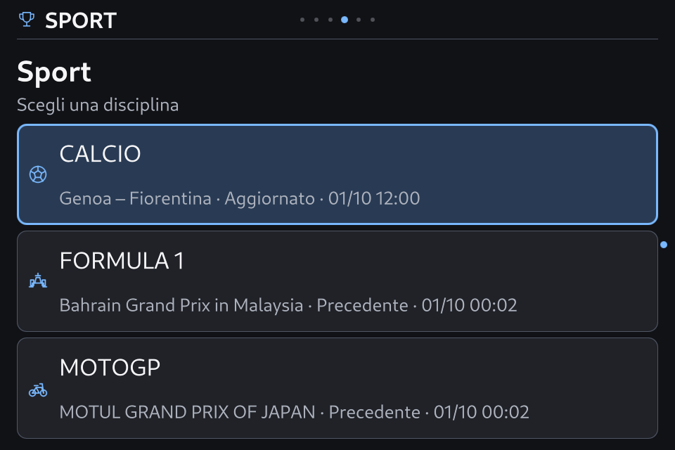
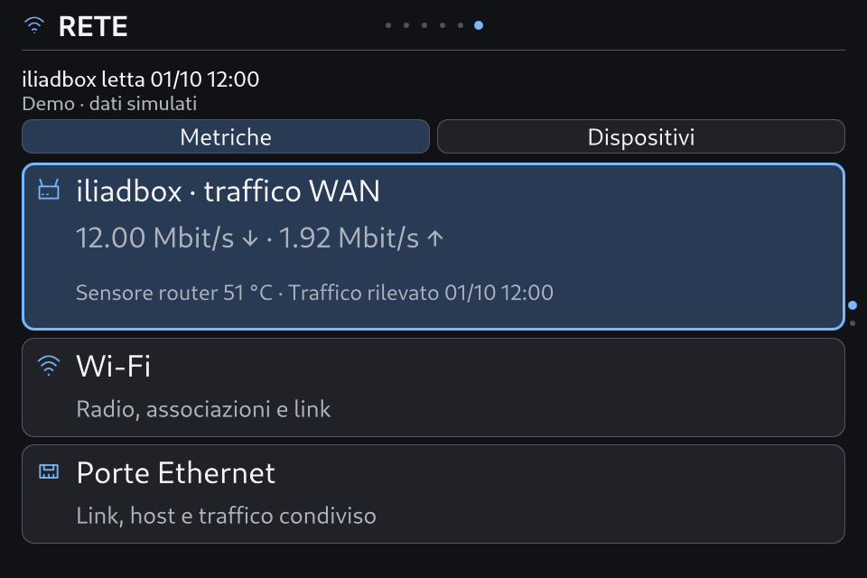

# SmartPC 0.8.3 rc.2 — ottimizzazione conservativa di Apple Calm

8 ottobre 2026. Implementazione della correzione di scope richiesta dall’utente: **adattare il tema agli spazi conservandone la grafica**. La revisione del tema è Apple Calm **1.3.1**, con Theme API 2.5 invariata. Installazione e verifiche finali sono riportate sotto soltanto quando confermate.

## Cosa cambia

- Barra superiore da 64 a 56 px; contenuto x24/y72, 912×552, margine inferiore 16 px. Le pagine e i pannelli Rete condividono gli allineamenti. I pallini e le icone della shell rimangono; il nome diventa contestuale in Informazioni e Impostazioni.
- Le 36 superfici che usano `Panel` condividono footer condizionali e liste realmente scorrevoli. I contatori di pagina scompaiono; la selezione viene portata completamente in vista. Fonte, ora, dati precedenti e messaggi operativi rimangono.
- Sport mostra tutte le tre discipline e adatta l’altezza delle card al corpo disponibile; le descrizioni possono usare due righe. Mantiene glifi, colori, raggio, testo e azioni delle card esistenti.
- Casa usa le card esistenti lungo un unico elenco verticale; i preferiti e gli altri dispositivi restano raggiungibili. Nessun nuovo comando ai dispositivi IoT.
- Rete apre sulle metriche, con traffico WAN e sensori iliadbox nel primo riepilogo; le sezioni Metriche/Dispositivi sono visibili. Gli approfondimenti e le liste dei dispositivi scorrono, senza guide sul fondo. Si usano i DTO e i provider esistenti; l’interesse alla vista abilita il riepilogo del router soltanto mentre la panoramica è consultata. Non è uno speed test e non è una misura della presenza fisica nella LAN.
- Informazioni/Risorse cambia effettivamente contenuto rispetto a Dispositivo. Le proprietà dei contesti notificano il cambiamento del valore annidato pur mantenendo la stessa identità Qt; non viene falsificato `countChanged` e non si forza il reload del renderer. La data del rilevamento è passata correttamente. Dati comprende anche Rete/iliadbox.
- Guide permanenti e contatori rimossi dalle viste ordinarie del tema interessate; Comandi/Aiuto, conteggi informativi e avvisi rimangono. Il significato dei tasti esistenti è conservato: questo intervento non applica il nuovo contratto generale di navigazione proposto nell’analisi.

## Grafica conservata

Il confronto automatico conferma **identici** tutti i campi del pack eccetto la versione: token, palette giorno/notte, font, asset, motion, scene, icon override e mapping delle presentazioni. Sono identici anche i quattro asset/sorgenti verificati delle icone. Le modifiche sono nelle geometrie QML e nel comportamento delle liste, senza nuovi colori, raster o sistema di card. Le schede Informazioni usano testo leggermente più leggibile, con gli stessi font e colori.

[Prova di conservazione](evidence/v083-space-optimization-2026-10-08/style-preservation.json). Il margine della scena è confinato a una regione laterale che non invade il contenuto; le regioni degli avvisi rimangono governate dal contratto esistente.

## Verifiche

La regressione del modello copre sostituzione a pari cardinalità, riordino, identità QObject e aggiornamento senza cambiamenti: 32 test runtime passati. Il test mirato della UI confronta controller/DTO/righe effettivamente renderizzate e la card visibile; prova entrambe le modalità di cambio scheda, timestamp, scorrimento e selezione alle scale 1.0/1.1. Fixture e trasporti sono isolati; non certificano le fonti live.

Il riepilogo finale locale registra **72 verifiche passate**, con la ripetizione del nuovo test dopo la correzione della CLI. [Riepilogo verifiche](evidence/v083-space-optimization-2026-10-08/local-final-checks.json). Il preflight nativo della revisione finale copre **1.062 combinazioni**: [risultato](evidence/v083-space-optimization-2026-10-08/native-theme-preflight.json). Le prove mirate PC coprono entrambe le palette: [giorno](evidence/v083-space-optimization-2026-10-08/final-focused-day/report.json), [notte](evidence/v083-space-optimization-2026-10-08/final-focused-night/report.json).

Le prove sul primo assetto hanno permesso la rifinitura finale delle card Sport. I report `apple-final-day`/`apple-final-night` sotto l’evidence locale riguardano quell’assetto intermedio, con digest `9646326a…`; **non sono la certificazione del digest consegnato**. I report finali mirati e nativi, con digest completo, sono la prova della revisione installata.

Il runner generale ha inizialmente chiamato il nuovo test senza l’argomento di destinazione delle catture. Il test ora supporta una directory temporanea isolata quando il parametro manca; la ripetizione è registrata separatamente. Non cancelliamo l’esito iniziale del runner: il riepilogo finale indica quale ripetizione lo risolve.

## Installazione

**Installata e verificata sulla Orange Pi:** SmartPC **0.8.3-rc.2**, Apple Calm **1.3.1**, digest `484b983f1622fbaccbfc09047d4c39641e5e1646bba04a2fd5cbc88f5aeb9a84`. I **499 file** del manifest coincidono con i byte installati. La qualifica EGLFS/KMS 960×640 comprende prove mirate giorno/notte e **19 superfici con 92 passi di navigazione**, senza warning QML. [Giorno](evidence/v083-space-optimization-2026-10-08/board/focused-eglfs-day/report.json), [notte](evidence/v083-space-optimization-2026-10-08/board/focused-eglfs-night/report.json), [Main EGLFS](evidence/v083-space-optimization-2026-10-08/board/apple-eglfs/report.json).

Il reboot ordinato è confermato dal cambio di boot ID; servizio `active/running`, `NRestarts=0`, heartbeat GUI pronto e fresco, identità esatta e nessuna attivazione pendente. Le 40 chiavi estranee all’aspetto coincidono con la baseline rc.1 e tutti gli hash delle preferenze coincidono con quelli prima del reboot. Palette notte, movimento normale e regolazioni sono conservati; soltanto i metadati della revisione/profilo vengono aggiornati durante l’attivazione. Nessuna nuova chiave di navigazione in questa patch. [Ricevuta](evidence/v083-space-optimization-2026-10-08/board/install-receipt.json), [prova reboot](evidence/v083-space-optimization-2026-10-08/board/reboot-verification.json).

Backup completo: `/var/backups/smartpc-before-v083-space-20261008T130632Z`. Prove persistenti: `/var/lib/smartpc-dashboard/v083-space-proof/`, copiate anche nell’evidence locale. Il pacchetto `.smartpc-theme` è prodotto dal builder ufficiale e verificato con un import completo: [round-trip](evidence/v083-space-optimization-2026-10-08/archive-roundtrip.json).

Sono conservati anche i due tentativi risolti, entrambi con rollback alla rc.1: il primo archivio non aveva il manifest di integrità richiesto; il secondo confronto delle preferenze includeva i metadati che necessariamente cambiano con la nuova revisione. Il controllo finale confronta tutti i valori utente, consente soltanto i due metadati attesi e verifica il nuovo profilo contro le regolazioni precedenti. [Primo rollback](evidence/v083-space-optimization-2026-10-08/board/first-attempt/), [secondo tentativo](evidence/v083-space-optimization-2026-10-08/board/second-attempt/). Il ledger Casa più recente è conservato nei rollback.

## Limiti di accettazione

La lettura umana del pannello IPS a 50–60 cm resta da valutare. Le catture 960×640 e EGLFS verificano rendering, geometrie e azioni, non un giudizio di comodità dell’utente né una misura ottica/GPU. Non sono aggiunti stress test prolungati, power-cut o nuove qualifiche live dei provider. Non viene pubblicato un nuovo tag stabile.

[Analisi precedente](ux-layout-dashboard-audit-2026-10-08.md): le proposte più ampie di riorganizzazione restano analisi. Il presente intervento segue il vincolo successivo di conservare la grafica del tema.
