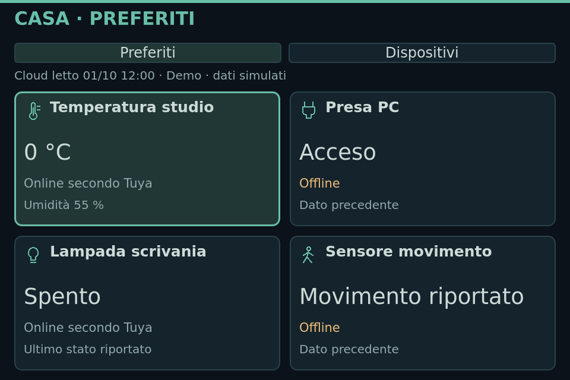
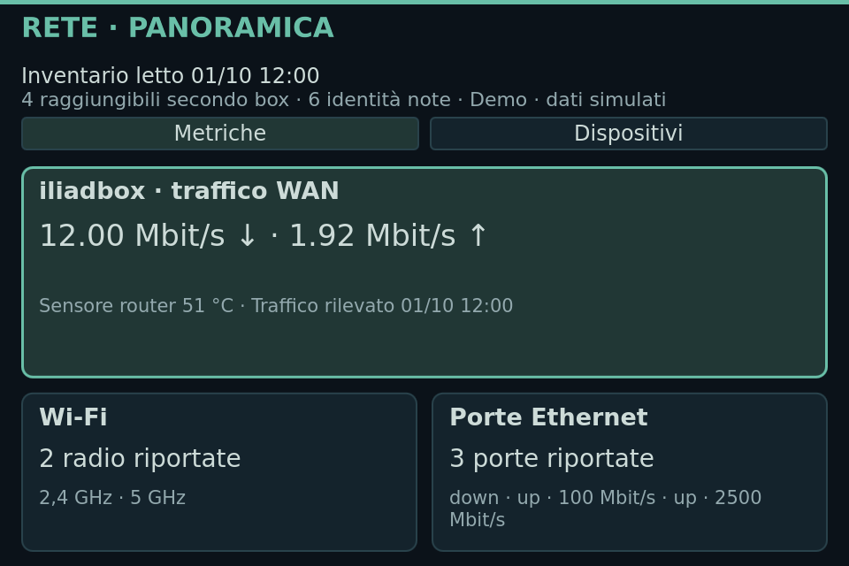
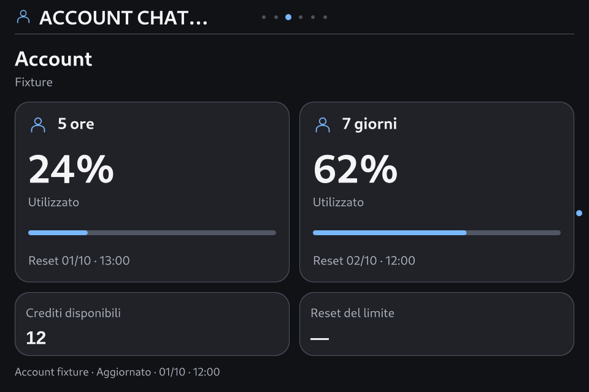

# SmartPC 0.8.4 — ottimizzazione mirata delle dashboard

9 ottobre 2026 · candidata **0.8.4-rc.1**, **Theme API 2.6**, Apple Calm **1.4.0**.

## Risultato e perimetro

Attuazione D1 e D2 dell'[analisi dell'esperienza e dei temi](ux-dashboard-themes-analysis-2026-10-08.md), dopo l'autorizzazione all'implementazione. Neo-Retro/Base è il riferimento: icone, colori, font e carattere del tema sono conservati. Functional e Apple Calm ricevono correzioni coerenti agli stessi contenuti. La nuova organizzazione completa di Informazioni, Impostazioni e dei percorsi D3/D4 resta assegnata alla 0.8.5.

| Intervento | Comportamento risultante |
| --- | --- |
| Geometria Base e Functional | Barra 56 px; area principale a x24/y72 di 912×552; fondo a y624 con margine 16 px. Prima: x44/y90, 872×455. Area disponibile aumentata del 26,9%. |
| Guide permanenti | Eliminati i contatori e le legende dei tasti dal fondo delle pagine principali; i comandi esistenti rimangono operativi. |
| Oggi, Meteo e Sport | Altezze delle schede e righe proporzionate al corpo disponibile; dati e didascalie seguono i margini. |
| Casa | Quattro preferiti completi in una griglia 2×2 per Base/Apple; quattro righe complete per Functional. Dispositivi segue la stessa composizione, con pagine di quattro elementi e focus riconoscibile. |
| Rete / iliadbox | Traffico WAN e sensori della box immediatamente visibili; due schede per radio Wi-Fi e porte Ethernet, seguite dai dettagli già disponibili. Inventario e freschezza delle metriche restano distinti. |
| Account | Schede adattive per una/due finestre, crediti e reset; titoli senza durata duplicata. Saldo zero, assente e illimitato sono distinti anche nei temi esterni. |
| Apple Calm | Schede Oggi/Meteo/Previsioni/Account adattate all'altezza, quattro preferiti completi, icona umidità corretta usando il glifo esistente. Palette e risorse grafiche conservate. |

I temi esterni mantengono le geometrie negoziate e la propria area di fallback. Il messaggio di recovery conserva lo spazio necessario. L'attore opzionale di Base viene confinato a una regione libera della barra; le notifiche urgenti continuano a sospenderlo. I margini di respiro, gli stati vuoti e le righe di provenienza rimangono intenzionali: nessun dato aggiunto per riempire uno spazio.

## Contratto e acquisizione

Theme API 2.6 aggiunge `AccountCredits` e il campo opzionale nullable `AccountData.credits`; gli snapshot precedenti restano validi. L'adapter riconosce `windowDurationMins` del backend. Runtime, typeinfo, schemi, fixture fingerprint e kit SDK sono aggiornati insieme. L'import 2.6 della pagina Account esprime la dipendenza della nuova revisione Apple.

Wi-Fi ed Ethernet usano solo proiezioni delle metriche già in cache. Il loro catalogo può essere precedente o assente e viene dichiarato come tale. Il solo ingresso nella panoramica conserva l'interesse di acquisizione router: nessun polling aggiuntivo di radio/porte, nessuna modifica ai provider o alle quote Casa. Il traffico WAN resta una misura della box, non uno speed test; radio, associazioni, MAC e record LAN non attestano presenza fisica o copertura totale.

## Verifica locale

Qt **6.8.2**, Main reale, processi e preferenze isolati, provider offline:

- Sei profili Base/Functional/Apple × Giorno/Notte; nove superfici principali per profilo. Controlli dei margini, quattro preferiti a scala testo 1,0/1,1, navigazione e ritorno dai dettagli, cache precedente/assente e crediti zero/assenti/illimitati. Nessun warning QML o chiamata di trasporto.
- Apple: **1.062 combinazioni** di preflight, **146 scenari canonici su 59 superfici proprie**, 92 passi di navigazione, Normale/Ridotto/Disattivo e 14 verifiche aggiuntive. Zero warning QML, rete negata.
- **73 controlli di regressione superati**, includendo i riesami dei tre controlli inizialmente falliti; tentativi iniziali conservati nelle prove. Il test della scena è stato adattato alla regione libera della nuova barra e conserva la verifica della sospensione per gli urgenti. Il test precedente degli spazi è stato rieseguito dopo il preflight della revisione finale, evitando una cache con digest precedente. Il riferimento al fingerprint delle fixture strutturali è stato riallineato dopo averle validate sul nuovo contratto.
- Ruff e controllo whitespace superati. Distribuzione runtime di **500 file**, renderer diagnostici esclusi; distribuzione diagnostica separata.

[Riepilogo delle prove locali](evidence/v084-dashboard-optimization-2026-10-09/local-validation.json), [Main Apple completo](evidence/v084-dashboard-optimization-2026-10-09/apple-final-main/report.json), [manifest](evidence/v084-dashboard-optimization-2026-10-09/release-manifest.json), [kit SDK 2.6](evidence/v084-dashboard-optimization-2026-10-09/smartpc-theme-sdk-v084.zip), [Apple Calm 1.4.0](evidence/v084-dashboard-optimization-2026-10-09/smartpc-apple-calm-1.4.0.smartpc-theme).

## Installazione e recupero

**Installata sull'Orange Pi e verificata dopo un vero riavvio del sistema.** I 500 file del manifest coincidono; servizio `active/running`, `NRestarts=0`, GUI pronta con heartbeat fresco, nessuna attivazione pendente e nessun warning QML rilevato. Base resta il tema selezionato; tutte le preferenze, comprese quelle dell'aspetto, coincidono con la baseline della transazione. Apple Calm 1.4.0 è importato come revisione disponibile, senza attivarlo al posto della scelta utente.

La baseline era **0.8.3-rc.2**, 499 file coerenti, Base e 40 preferenze estranee all'aspetto; il contatore `NRestarts=1` era preesistente. Lo stop/start intenzionale della consegna e il successivo boot hanno contatori nuovi: questo non costituisce una diagnosi del riavvio precedente.

Qualifica nativa Qt 6.8.2: **1.062 combinazioni** offscreen della revisione esatta; **sei profili EGLFS** con controlli di geometria, dati limite e ritorni; Apple Main EGLFS su **20 superfici**, 92 passi di navigazione e tre modalità di movimento. Nessun warning QML o trasporto dei provider nelle prove con fixture.

Backup completo: `/var/backups/smartpc-before-v084-dashboard-20261009T100942Z`. Prove persistenti: `/var/lib/smartpc-dashboard/v084-dashboard-proof/`. L'installatore ripristina la transazione in caso di errore conservando il consumo Casa già registrato; in questa consegna non è stato necessario un rollback. Il recupero manuale rimane un'operazione amministrativa che richiede lo stop del servizio e il ripristino coordinato di runtime/config/local/cache dal backup, mantenendo il ledger più recente.

Digest Apple: `3353fc9e0951efb0ef8e5d52cb92f7b64e50d15a5994fa2ff2dd372e3dc856ef`. Fingerprint API: `f633bb27248201826233588001dfa9433c1e418e9aa14689c9872e6dbb1f8313`. Distribuzione con `dirty=true`, identità dei byte attestata dal manifest: nessuna creazione di tag o promozione stabile in questa consegna.

[Qualifica nativa](evidence/v084-dashboard-optimization-2026-10-09/board/v084-dashboard-proof/native-theme-preflight.json), [sei profili EGLFS](evidence/v084-dashboard-optimization-2026-10-09/board/v084-dashboard-proof/qualification.json), [Main EGLFS](evidence/v084-dashboard-optimization-2026-10-09/board/v084-dashboard-proof/apple-eglfs/report.json), [ricevuta d'installazione](evidence/v084-dashboard-optimization-2026-10-09/board/v084-dashboard-proof/install-receipt.json), [reboot reale](evidence/v084-dashboard-optimization-2026-10-09/board/v084-dashboard-proof/reboot-verification.json), [risorse visuali conservate](evidence/v084-dashboard-optimization-2026-10-09/visual-resources-preserved.json), [font e immagini delle revisioni immutabili](evidence/v084-dashboard-optimization-2026-10-09/board/v084-dashboard-proof/theme-assets-preserved.json), [provider invariati](evidence/v084-dashboard-optimization-2026-10-09/board/v084-dashboard-proof/providers-unchanged.json).

## Catture del runtime

Queste catture provengono dal renderer nativo EGLFS sulla Orange Pi, con fixture dichiarate. Non sono foto del pannello o letture attuali dei dispositivi.

## Limiti e prossimo passo

Il rendering EGLFS non sostituisce il giudizio umano di leggibilità, uso del tastierino fisico e comodità a **50–60 cm**. Non sono dichiarate nuove misure ottiche, GPU o di latenza input/pixel. Restano gli stati vuoti reali quando non ci sono informazioni e i gate dei provider già documentati. Il journal del primo avvio ha segnalato iliadbox, F1 e MotoGP non raggiungibili o con risposta non valida: questa consegna non attesta letture live fresche di tali fonti; i dati precedenti vengono conservati. Le prove con fixture non sostituiscono l’esito delle fonti reali. La 0.8.5 completa D3/D4 dopo questo intervento mirato, senza promozione stabile automatica della candidata.
