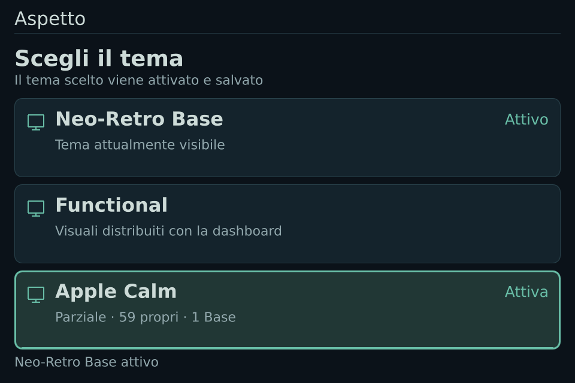
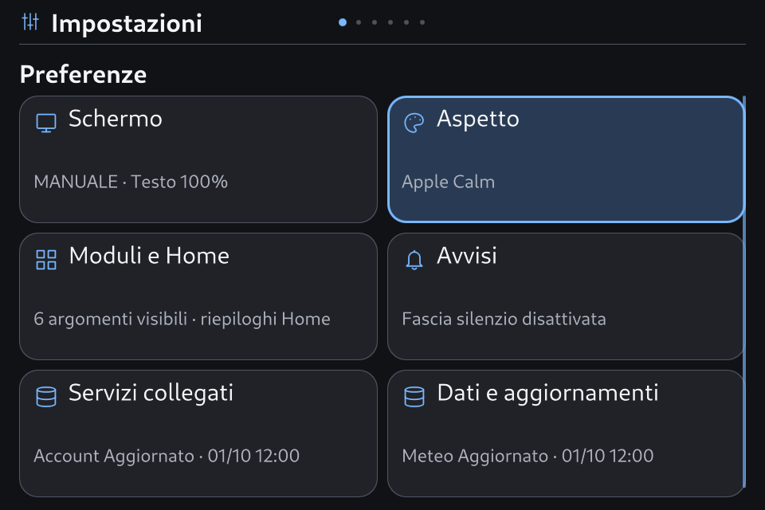
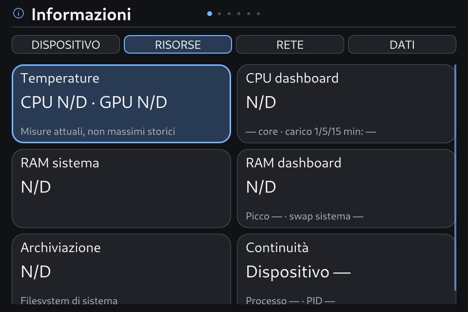

# SmartPC 0.8.5 — temi, impostazioni e informazioni

9 ottobre 2026 · candidata **0.8.5-rc.1**, Theme API **2.6**, Apple Calm **1.5.0**.

**Implementazione S0–S4 verificata sul PC e sul renderer EGLFS; candidata installata e verificata dopo un riavvio reale.** [Analisi e ricerca](v085-settings-theme-analysis.md).

## Comportamento

- **Aspetto → Tema:** lista diretta, aperta sul tema corrente. 2/8 spostano il focus senza caricare temi intermedi; 5 attiva e salva quello scelto; 7 torna indietro. Tema già salvato e bozza pulita: nessuna pubblicazione o scrittura superflua. Le regolazioni compatibili della bozza sono conservate; la lista lo dichiara.
- **Attivazione:** preparazione, verifica del frame, salvataggio e verifica finale. Colori validati dello stile precedente, nome del destinatario e fasi reali; nessuna percentuale inventata. Indicatore fermo con Movimento ridotto/disattivo e quando nascosto. Gli urgenti hanno precedenza.
- **Uscita e guasti:** annullamento prima della scrittura; Home/Menu differiti durante una scrittura avviata. Conferme tardive e doppie pressioni non cambiano l'esito. Una scrittura lenta ritira la readiness senza avviare un secondo writer; il supervisore mantiene un limite esterno.
- **Impostazioni:** sei schede con sintesi, comandi rapidi separati dall'editor avanzato, Salva/Annulla disponibili per modifiche effettive, focus conservato per identità. Luminosità e preferenze dei provider mantengono il salvataggio automatico; dimensione testo e regolazioni del tema dichiarano l'anteprima.
- **Informazioni:** Dispositivo, Risorse, Rete e Dati conservano contenuti distinti, con schede su due colonne e scorrimento che contiene il focus. Nessuna modifica da questa vista. Valori mancanti restano N/D, senza inventare misure.
- **Grafica:** margini x24/fondo16, barra 56 px, corpo sfruttato fino a y624. Guide permanenti e contatori rimossi dalle nuove viste; comandi invariati e guida nel Menu. Palette, font, icone e carattere dei temi conservati.

## Correzioni della transazione

Il ritorno Apple → Base non tenta più di preparare una shell assente come renderer `undefined`. Le conferme QML sono differite e riferite alla generazione catturata, evitando la rientranza nella binding del candidato. Il set delle superfici preparate è idempotente. Una vecchia shell rimasta disponibile non può soddisfare implicitamente una nuova preparazione senza la sua conferma: questo corregge anche il ritorno Functional → Apple a caldo. Le superfici opzionali omesse vengono ritirate.

Le operazioni ricevono un budget locale di 18 s. Preparazione non conclusa: rollback. Writer già in corso o verifica finale dopo commit: readiness ritirata e verifica esterna, evitando corse fra salvataggi. Il watchdog distingue impulsi GUI freschi e readiness; transizione responsiva limitata a 20 s di readiness persa, heartbeat assente a 15 s, avvio a 30 s. Cambiare generazione non rinnova il periodo di tolleranza. Il caso di writer lento può richiedere il budget locale più la finestra esterna; non è dichiarato un limite unico di 18 s per ogni guasto.

La cronologia privata `theme-activation-history.json` conserva fino a 64 eventi con generazione, candidato/precedente, fase ed esito. Il suo mancato salvataggio non annulla un commit già riuscito. I vecchi record del recupero del 9 ottobre rimangono nella diagnosi: i bug riprodotti e corretti non provano da soli la causa completa di quell'incidente.

I valori QVariant provenienti da QML vengono normalizzati prima di entrare nelle configurazioni Python. Il chooser è UI di sicurezza dell'app: resta fuori dalle 60 superfici pubbliche. Il controllo dei sorgenti inventaria esplicitamente questa route interna; Theme API, fingerprint, provider e modello dei dati restano quelli della 0.8.4.

## Verifica locale

**75 esiti finali positivi**, includendo riesami mirati dopo i difetti trovati; tentativi iniziali conservati. Qt 6.8.2, Main reale, preferenze e provider isolati. Nessuna chiamata di rete nelle nuove prove. Le pulizie di selezione Sport sono quelle previste dal comando Home, senza refresh aggiuntivi.

Lista, otto transizioni ripetute fra i tre temi in entrambe le direzioni, no-op, bozze compatibili, scale 1,0/1,1 e quattro schede Info. Contenimento del focus e colonne a x24/x486. Annullamento/Home/Menu, pressione doppia, urgente, timeout del renderer, conferma tardiva, uscita differita durante il worker e readiness ritirata per writer lento. Supervisore provato sia con processi Main/QML reali sia con impulsi di protocollo a timeout accelerati.

Apple Calm: **1.062 combinazioni** del payload esatto. Le catture sono rendering di fixture, non dati live o foto del display.

[Esiti locali](evidence/v085-implementation-2026-10-09/local-final-results.json), [prove del chooser e geometria](evidence/v085-implementation-2026-10-09/settings-night/report.json), [preflight PC](evidence/v085-implementation-2026-10-09/apple-preflight.json), [manifest](evidence/v085-implementation-2026-10-09/release-manifest.json), [kit SDK rigenerato](evidence/v085-implementation-2026-10-09/smartpc-theme-sdk-v085.zip), [pacchetto Apple Calm](evidence/v085-implementation-2026-10-09/smartpc-apple-calm-1.5.0.smartpc-theme).

## Installazione e recupero

Installata **0.8.5-rc.1**, **503 file** coerenti con il manifest; Base resta selezionato e **tutte le preferenze coincidono** con la baseline, comprese quelle dell'aspetto. Apple Calm **1.5.0** è importato come revisione disponibile. Qualifica nativa Qt 6.8.2: **1.062 combinazioni offscreen**, sei profili EGLFS delle dashboard e due profili giorno/notte del selettore con otto transizioni ciascuno, scale massime e quattro schede Info. Aggiunte le prove EGLFS del caricamento/guasti e delle 14 superfici impostazioni del broker pubblico; nessun warning QML o trasporto nelle fixture.

Backup completo: `/var/backups/smartpc-before-v085-dashboard-20261009T114340Z`. Prove persistenti: `/var/lib/smartpc-dashboard/v085-dashboard-proof/`. L'installatore verifica il preflight nativo, qualifica prima dello scambio atomico e ripristina runtime/config/local/cache in caso di errore, conservando il ledger Casa più recente. Non è stato necessario rollback. La baseline registra il recupero precedente con `NRestarts=1`; il contatore della qualifica è stato reimpostato dopo l'installazione. Questo non cancella l'evidenza dell'incidente. Il riavvio reale cambia il boot ID e conferma servizio `active/running`, `NRestarts=0`, GUI pronta con heartbeat fresco, `pending=null`, manifest coerente e tutte le preferenze conservate. Il primo campione era ancora non pronto: la verifica ha atteso entro un limite un nuovo heartbeat, senza usare il solo stato del servizio.

Digest Apple: `eafc17dfd36a7b6757504201c18275b856ec90389f9f1038c1666fc16928fbfa`. Fingerprint API invariato: `f633bb27248201826233588001dfa9433c1e418e9aa14689c9872e6dbb1f8313`. Il confronto con la 1.4.0 installata cambia solo la versione di `theme.json` e mantiene identici i tre asset; 24 file dei provider/backend sono identici alla 0.8.4. Distribuzione `dirty=true`: il manifest identifica i byte consegnati.

[Preflight nativo](evidence/v085-implementation-2026-10-09/board/native-theme-preflight.json), [otto profili EGLFS](evidence/v085-implementation-2026-10-09/board/qualification.json), [transizioni native](evidence/v085-implementation-2026-10-09/board/settings-night/report.json), [guasti/caricamento](evidence/v085-implementation-2026-10-09/board/loading-faults.json), [ricevuta](evidence/v085-implementation-2026-10-09/board/install-receipt.json), [reboot](evidence/v085-implementation-2026-10-09/board/reboot-verification.json), [risorse grafiche](evidence/v085-implementation-2026-10-09/board/visual-assets-preserved.json), [provider invariati](evidence/v085-implementation-2026-10-09/board/providers-unchanged.json).

La candidata non viene promossa a stabile e non vengono creati commit o tag.

Restano il giudizio umano sul display a **50–60 cm**, il tastierino USB fisico e l'uso prolungato. Rendering, QKeyEvent e callback dei frame attestano percorsi software; non sono misure ottiche, GPU o input/pixel. Le fonti reali e i gate Casa/Sport/Rete già documentati restano separati dalla manutenzione UX.

## Catture EGLFS

Fixture private renderizzate sulla Orange Pi; non sono letture live o fotografie del pannello.

