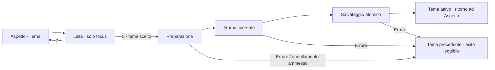

# SmartPC 0.8.5 — Cambio tema e impostazioni

**Analisi del 9 ottobre 2026 · baseline 0.8.4-rc.1 / Theme API 2.6 / Apple Calm 1.4.0.**

**Seguito autorizzato:** S0–S5 implementati e candidata 0.8.5-rc.1 installata con reboot verificato. La diagnosi seguente conserva la baseline precedente; [risultato e prove finali](v085-settings-implementation-report.md).

La 0.8.5 completa D3/D4 e aggiunge una priorità di affidabilità: rendere il cambio tema diretto, comprensibile e recuperabile. La grafica acquisita resta il riferimento: icone, colori, font, schede e barra di 56 px. Si correggono flusso, occupazione dello spazio, allineamenti e feedback. Questo documento contiene diagnosi, ricerca e piano; **non attesta fix implementati o una nuova installazione**.

## 1. Riscontri attuali

La lettura della board è stata eseguita senza selezionare temi, cancellare quarantene, scrivere preferenze, riavviare il servizio o il dispositivo. Le prove Main sul PC usano dati sintetici offline, cartelle XDG private e connessioni negate.

| Riscontro | Evidenza | Interpretazione e limite |
| --- | --- | --- |
| Recupero recente della GUI | Il journal systemd registra `GUI heartbeat scaduto/readiness persa` il 9 ottobre alle **12:27:28 CEST**; servizio ripartito alle 12:27:31, `NRestarts=1` | Il problema segnalato ha un riscontro reale. Le prove di consegna 0.8.4 restano storiche; il recupero successivo riapre il gate di affidabilità. |
| Il record del recupero identifica Base | `failed=base`, `selected=base`, `pending=null` | Non consente di attribuire quel recupero con certezza al bundle Apple Calm 1.4.0. Servono generazione e sequenza della transizione, assenti nel record corrente. |
| Apple Calm 1.3.1 in quarantena | File datato **8 ottobre, 16:17 CEST**, con digest della 1.3.1 | È un fatto precedente alla consegna corrente. Non va presentato come causa del recupero del 9 ottobre. |
| Apple Calm 1.4.0 installato | Revisione presente, digest `3353fc9e0951efb0ef8e5d52cb92f7b64e50d15a5994fa2ff2dd372e3dc856ef`, nessuna quarantena rilevata | La preflight isolata non certifica il cambio interattivo della GUI in esercizio. |
| Selezione attuale ciclica | In Main, `appearance.theme` richiama `selectDraft(choice(...))`; due pressioni di 6 attraversano Base → Functional → Apple Calm | Ogni passo prepara realmente un tema. La lista richiesta elimina le attivazioni intermedie. |
| Caricamento statico | `ThemeLoading.qml`: sfondo fisso, tre testi, ritardo di 120 ms, nessun indicatore dinamico; visibilità legata soltanto al candidato | Mancano nome del destinatario, fase ed esito. Primo frame e salvataggio non sono coperti dall'intero feedback. |
| Preparazione e watchdog si sovrappongono | Main restituisce coerenza falsa quando esiste un candidato; il heartbeat ritira `ready`; il supervisore richiede heartbeat pronto entro 15 s | Una preparazione lunga ma responsiva può ricadere nel percorso di recupero. È un rischio dimostrabile dal codice, non ancora la causa completa dell'incidente sulla board. |
| Errore riprodotto nel ritorno a Base | Nel Main isolato, dopo Apple Calm salvato, `selectDraft('base')` accetta l'azione ma resta Apple visibile; dopo 6 s: `Presentazione non registrata: undefined`, coerenza falsa, candidato assente | Bug riprodotto sul PC, in direzione opposta a quella descritta dall'utente. Va correlato alla transazione completa prima di considerarlo la spiegazione del guasto reale. |
| Binding QML riprodotto | `Binding loop detected for property "themeCandidate"` in Main, durante lo stesso percorso | Priorità alta: candidato, notifiche di cambiamento e callback dei renderer richiedono controllo della rientranza. |
| Fine salvataggio e stabilizzazione sono distinti | Subito dopo il salvataggio isolato la coerenza era falsa; dopo ulteriori 1,2 s era vera | Questo campione transitorio non è un secondo blocco permanente. Il feedback e le verifiche devono aspettare l'esito corretto, senza dedurlo soltanto da `status=ready`. |

Evidenze: [stato temi sulla board](evidence/v085-settings-analysis-2026-10-09/board-theme-state.json), [journal e data della quarantena](evidence/v085-settings-analysis-2026-10-09/board-theme-followup.json), [Main isolato](evidence/v085-settings-analysis-2026-10-09/isolated-settings-diagnostic.json), [script riproducibile](evidence/v085-settings-analysis-2026-10-09/diagnose_settings.py).

I tempi PC di circa 0,7 s per Functional → Apple e 0,1 s per la successiva riselezione sono osservazioni locali con cache calda e backend software. Non sono tempi promessi per Orange Pi, GPU o risposta ottica del display.

## 2. Percorso consigliato per scegliere il tema

**Impostazioni → Aspetto → Tema apre la lista.** Muovere il focus non carica altri temi. Il tasto 5 attiva soltanto quello scelto, con una transazione che termina dopo presentazione coerente e salvataggio verificato.

1. La lista mostra **Neo-Retro Base, Functional, Apple Calm** e gli eventuali altri temi installati eleggibili. Nome leggibile, piccola descrizione, indicazione testuale **Attivo** e focus visibile distinto dalla selezione salvata.
2. La lista si apre sul tema attivo. **2/8** spostano il focus, **5** avvia l'attivazione, **7** chiude senza modifiche. Se il tema è già attivo e non ci sono modifiche, nessuna preparazione o scrittura superflua.
3. Una riga per tema. Le revisioni del medesimo pacchetto restano in Gestione temi; la policy `latest` continua a scegliere la revisione eleggibile prevista. Un pacchetto in quarantena non viene riabilitato implicitamente.
4. La scelta avvia preparazione, primo frame coerente e commit; il risultato riporta ad Aspetto con **Apple Calm attivo** oppure con un errore utile e il tema precedente conservato. Nessun messaggio di successo prima del commit.
5. Miniature facoltative già disponibili nel pacchetto o in cache. Aprire la lista non istanzia tutte le UI dei temi e non registra i loro font. Prima implementazione valida anche senza miniature.

Il chooser è una nuova interazione locale, non un nuovo significato globale dei tasti. **1 Home / 7 Indietro / 9 Menu** restano i comandi acquisiti. Il comportamento di Home/Menu durante la transazione deve essere esplicito e verificato: prima del commit annullamento sicuro; durante una scrittura già avviata, uscita rinviata al suo esito. Gli urgenti mantengono la precedenza.

**Bozze già aperte:** non sovrascriverle silenziosamente. Il prototipo deve mostrare quali regolazioni vengono applicate insieme al tema e conservare quelle compatibili; le personalizzazioni per revisione restano separate. In caso di abbandono si ripristina l'ultima configurazione salvata. L'editor avanzato mantiene Applica/Annulla; il cambio tema rapido non deve richiedere una seconda ricerca del comando Salva dopo la scelta.

Questa scelta applica al tastierino la distinzione tra focus e selezione del [pattern Listbox W3C](https://www.w3.org/WAI/ARIA/apg/patterns/listbox/). Le [indicazioni Apple sui picker](https://developer.apple.com/design/human-interface-guidelines/pickers) aiutano a scegliere un controllo proporzionato al numero di alternative. Per tre temi su 3,5″ proponiamo una lista compatta in contesto; la preferenza per questo layout è una decisione SmartPC da verificare nel prototipo.

## 3. Caricamento coerente, veritiero e leggero

Un componente comune dell'app rimane disponibile durante il cambio. Usa colori validati dello stile precedente e una base di sicurezza, con font già disponibili. La sua leggibilità non dipende dal caricamento del bundle destinatario.

| Fase reale | Testo proposto | Condizione di avanzamento |
| --- | --- | --- |
| Preparazione | **Attivazione di Apple Calm** · Preparazione delle schermate… | Risoluzione, asset e conferme dei renderer necessari alla generazione corrente |
| Presentazione | Verifica della nuova schermata… | Frame realmente presentato e coerente, non semplice creazione del componente |
| Persistenza | Salvataggio delle preferenze… | Esito della scrittura e del journal di attivazione |
| Successo | **Apple Calm attivo** | Tema visibile e configurazione salvata; eventuale nuova stabilizzazione completa |
| Fallimento | Cambio non completato · Tema precedente ripristinato | Rollback concluso; dettaglio breve e azione pertinente |

Indicatore di attività discreto, posizione e ingombro stabili. **Nessuna percentuale o durata inventata.** Un conteggio dei renderer può descrivere soltanto quella fase, se il denominatore è stabile; non equivale alla percentuale complessiva. `Loader.progress` misura il caricamento QML da rete, non compilazione, frame e commit dell'app: non è un progresso globale utilizzabile qui. [Qt Loader 6.8](https://doc.qt.io/qt-6.8/qml-qtquick-loader.html).

Il ritardo esistente di 120 ms è una baseline da provare; niente attesa artificiale per rendere visibile l'animazione. Per operazioni rapide basta l'esito; per quelle più lunghe il pannello accompagna tutta la transazione. La policy Movimento ridotto/disattivo si applica anche al caricamento: stato e aggiornamenti testuali restano visibili senza imporre un'animazione continua. Nessuna animazione nascosta lasciata attiva.

Le [HIG Apple per il progresso](https://developer.apple.com/design/human-interface-guidelines/progress-indicators) e le [linee guida Microsoft](https://learn.microsoft.com/en-us/windows/apps/develop/ui/controls/progress-controls) distinguono avanzamento misurabile e attività di durata incerta. Da queste ricaviamo il feedback per fasi; il disegno e la durata effettiva verranno misurati sul dispositivo.

## 4. Correzione del recupero: ordine tecnico

**P0: non promuovere la 0.8.5 finché il percorso di cambio non è qualificato.** Non basta abbellire la schermata o aumentare indiscriminatamente il timeout del supervisore.

1. Riprodurre Base → Apple e Apple → Base dall'editor aperto, con la revisione corrente, a freddo e a caldo. Raccogliere generazione, fase, superficie attesa, conferme ricevute, revisioni caricate e frame; correlare al heartbeat con identità del processo. Partire dagli errori PC già riprodotti.
2. Controllare le notifiche sincrone di `candidateChanged`, il binding `themeCandidate`, il riavvio del candidato da `setPreparedContents` e i callback tardivi. Rendere idempotenti gli aggiornamenti equivalenti; accettare soltanto conferme della generazione corrente. Non eseguire mutazioni rientranti durante il calcolo dello stesso binding.
3. Separare **GUI viva**, **vecchia vista ancora utilizzabile**, **candidato pronto** e **nuovo frame presentato**. La preparazione autorizzata non deve fingere readiness del nuovo tema; deve avere un limite proprio e progressi reali. Il watchdog deve continuare a recuperare sia un event loop bloccato sia una UI che resta incoerente dopo la transizione.
4. Eliminare il caso `Presentazione non registrata: undefined` e l'esito incoerente `azione accettata / nessun candidato / tema vecchio / status ready`. Un fallimento termina l'operazione con stato, errore e rollback chiari.
5. Registrare un esito durevole per ogni attivazione: provenienza/destinazione, digest, generazione, fase fallita e recupero. L'ultimo recupero generico non deve cancellare l'evidenza dell'errore originario. Dettagli tecnici in diagnostica, messaggio comprensibile nell'interfaccia.
6. Mostrare il recupero come evento con stato attuale: **È stato ripristinato Neo-Retro Base** e un accesso ad Aspetto. Dopo una successiva attivazione riuscita, togliere l'avviso corrente conservando lo storico. Non cancellare il segnale prima di aver verificato l'esito.

La compilazione/caricamento asincroni sono strumenti da valutare nei punti realmente bloccanti, non una modifica automatica di tutti i Loader. Qt documenta l'istanziazione distribuita su più frame; occorre preservare proprietà iniziali, focus e readiness sul runtime **6.8.2**. La documentazione online della famiglia 6.8 oggi indica 6.8.9. [Qt Loader](https://doc.qt.io/qt-6.8/qml-qtquick-loader.html).

Responsabilità previste: `theme_service.py` e `theme_lifecycle.py` possiedono transazione, persistenza ed esiti; `theme_supervisor.py` controlla la salute del processo; Main gestisce routing e conferme di presentazione; `ThemeLoading.qml` visualizza lo stato ricevuto. Il QML non deve stimare da solo il completamento o scrivere la preferenza prima della verifica.

Il selettore e gli eventuali nuovi campi di stato devono avere un modello condiviso e azioni validate, utilizzabili anche da Apple Calm. Riutilizzare le opzioni e gli ID pubblici esistenti quando sufficienti; estendere Theme API in modo additivo soltanto per i dati realmente mancanti, aggiornando contratto, adapter, fixture e kit. I bundle precedenti devono continuare a funzionare con fallback esplicito per una nuova superficie, senza cambiamenti impliciti delle loro geometrie. La necessità di una nuova versione API sarà decisa sull'implementazione concreta, non sul mockup.

## 5. Revisione mirata delle impostazioni

Le sei macroaree già presenti restano comprensibili e compatibili con la configurazione acquisita. La schermata iniziale diventa una panoramica di schede con **valore/stato sintetico**, non soltanto un elenco di destinazioni. All'interno: controlli frequenti subito accessibili, approfondimenti secondari e gestione tecnica separata.

| Area | Contenuto immediato | Approfondimento |
| --- | --- | --- |
| Schermo | Modalità, luminosità effettiva, dimensione testo | Livelli giorno/notte e orari, chiaramente dipendenti da Automatico |
| Aspetto | Tema attivo, palette, movimento | Gestione temi e personalizzazione avanzata |
| Moduli e Home | Argomenti visibili e riepiloghi attivi | Discipline Sport, squadra e stagioni |
| Avvisi | Interruzioni consentite e fascia silenzio | Categorie e soglie Account, con effetti descritti correttamente |
| Servizi collegati | Stato sintetico Account, Casa, iliadbox | Collegamento, preferiti e raccolta; telemetria nelle dashboard degli argomenti |
| Dati e aggiornamenti | Ultima lettura/esito per fonte | Rilettura manuale con stato e cooldown; dettagli diagnostici in Informazioni |

I valori sintetici devono provenire dalle stesse sorgenti delle viste attuali: niente conteggi o stati ricavati per approssimazione. Lo stato Account dal PC rimane sincronizzazione esterna; non diventa telemetria hardware.

| Difetto / opportunità | Intervento 0.8.5 | Verifica richiesta |
| --- | --- | --- |
| Tema come scelta ciclica costosa | Lista con attivazione esplicita | Muovere il focus non avvia alcun caricamento |
| Editor rapido e avanzato ripetono Tema/Palette/Movimento | Un percorso principale; avanzate per regolazioni meno frequenti | Nessuna opzione utile persa, stessi ID e azioni dove compatibili |
| Schermo mescola luminosità salvata subito e testo in bozza | Separare i blocchi e rendere visibile lo stato di salvataggio; ridurre le bozze implicite nel percorso rapido | Uscita/ritorno/reboot conservano i valori attesi |
| Aspetto ha Salva/Annulla anche senza modifiche | Azioni pertinenti allo stato, area di esito vicino al controllo | Nessun successo fittizio, nessun comando apparentemente bloccato senza motivo |
| La descrizione Anteprima/Applica rimane anche dopo il salvataggio | Didascalia derivata dallo stato effettivo: salvato, modificato, in corso o errore | Titolo, esito e azioni non si contraddicono; nessuna bozza implicita indicata come modifica reale |
| Focus memorizzato come indice | Conservare la selezione per ID stabile quando cambiano disponibilità o righe | Ritorno, cambio tema, filtri e rimozione di una riga non spostano il focus su un'altra azione |
| Settings/Info conservano geometrie x44 e guide inferiori | Allineamento alla griglia x24–936; usare il corpo disponibile e scorrimento controllato | Righe, valori e focus contenuti anche alla scala massima |
| La cattura Base lascia intravedere contenuti Home sotto l'overlay | Garantire una superficie di lettura uniforme con i colori già esistenti | Assenza di testo di fondo sovrapposto in giorno/notte; non cambiare la palette |
| Comandi 2/8, 4/6, 5 e contatori ripetuti sul fondo | Rimuovere guide permanenti; stato di scorrimento discreto e aiuto contestuale su richiesta | Il focus resta evidente, nessuna riga tagliata per recuperare spazio |
| Azioni non disponibili poco interpretabili | Motivo vicino al controllo: gestito dal tema, collegamento assente, automatico disattivo, collaudo richiesto | Disponibilità invariata tra temi, testo comprensibile |
| Alcune righe di Aspetto usano la stessa icona di categoria | Verificare le icone semantiche già disponibili per Tema, Palette e Movimento | Correggere l'associazione per ID quando aiuta la lettura, conservando lo stile del set |
| Gestione temi espone dettagli di versione nel flusso quotidiano | Importa, esporta e revisioni nel secondo livello | Policy latest e quarantena rispettate; nessuna cancellazione automatica per nascondere un problema |
| Informazioni Dispositivo/Risorse sembrano uguali | Dispositivo: identità/software/display; Risorse: temperature/carico/RAM/archiviazione/continuità | Il codice attuale già distingue i dati: migliorare gerarchia, non dichiarare una duplicazione funzionale ancora presente |
| Refresh manuale può essere ripetuto senza capire l'esito | Feedback locale sull'azione e motivo del cooldown | Nessuna chiamata aggiuntiva causata dalla navigazione o dal tema |

La distinzione fra configurazione rara e attività quotidiana è sostenuta dalle [linee guida Microsoft sulle impostazioni](https://learn.microsoft.com/en-us/windows/apps/design/app-settings/guidelines-for-app-settings). La struttura a schede e le sei categorie sono una scelta per SmartPC: non copiamo il layout desktop o il numero di opzioni raccomandato come vincolo universale.

## 6. Geometria e leggibilità

Riferimento: **960×640 IPS, 3,5″, osservazione a 50–60 cm**. Area dashboard acquisita **x24, y72, 912×552**, fondo a y624. Le nuove pagine devono usare questo spazio con un budget esplicito per titolo, controlli, scorrimento ed eventuale esito, evitando regioni riservate a guide sempre presenti.

- Panoramica impostazioni: proposta 2×3 schede, con icona, nome e sintesi. Focus e ordine di lettura vanno verificati con il tastierino prima di adottare la griglia.
- Selettore: i tre temi attuali devono essere leggibili insieme. Se il catalogo cresce, scorre la lista; non si riduce il carattere per far entrare tutto.
- Regolazioni: righe confrontabili, titoli a sinistra, valori allineati; testi lunghi su seconda riga o dettaglio, senza tagliare nomi che distinguono due opzioni.
- Risorse: metriche in schede e dettagli ordinati, con unità e disponibilità esplicite. Dispositivo usa una composizione differente coerente con i dati di identità.
- Font e dimensioni partono dai ruoli esistenti; si provano le scale ammesse, entrambi i colori e Movimento normale/ridotto/disattivo. Nessun nuovo font o set di icone richiesto per risolvere questi difetti.

La completezza dello spazio non significa riempire ogni pixel: il margine basso di 16 px resta intenzionale. Si recuperano i vuoti strutturali e le guide, senza comprimere il testo o aggiungere dati decorativi. Le catture PC sono controlli geometrici; la lettura a 50–60 cm resta un giudizio sul display fisico.

## 7. Ricerca consultata e applicazione

**14 riferimenti mirati consultati il 9 ottobre**, comprendenti documentazione ufficiale, guide degli autori e due lavori sperimentali. Non sono 14 prove sul dispositivo. Le pagine HIG, dipendenti da JavaScript, sono state lette anche tramite i rispettivi JSON DocC ufficiali: [progresso](https://developer.apple.com/tutorials/data/design/human-interface-guidelines/progress-indicators.json), [picker](https://developer.apple.com/tutorials/data/design/human-interface-guidelines/pickers.json).

| Fonte primaria | Contributo allo studio | Applicazione / limite |
| --- | --- | --- |
| [Apple HIG — Progress indicators](https://developer.apple.com/design/human-interface-guidelines/progress-indicators) | Accuratezza, attività e progresso misurabile, stabilità del controllo | Un solo indicatore coerente; stato reale, niente 90% simulato |
| [Apple HIG — Pickers](https://developer.apple.com/design/human-interface-guidelines/pickers) | Controllo proporzionato alle alternative, ordine prevedibile e contesto | Lista breve in Aspetto; non copiare una ruota touch su tastierino |
| [Microsoft — Progress controls](https://learn.microsoft.com/en-us/windows/apps/develop/ui/controls/progress-controls) | Indicatori per attese note/incerte, eventuale testo di contesto | Fasi esplicite e attività discreta senza stima inventata |
| [Microsoft — App settings](https://learn.microsoft.com/en-us/windows/apps/design/app-settings/guidelines-for-app-settings) | Raggruppamento, semplicità, approfondimenti e motivi di indisponibilità | Sei gruppi esistenti con sintesi; comandi quotidiani nelle dashboard |
| [W3C APG — Listbox](https://www.w3.org/WAI/ARIA/apg/patterns/listbox/) | Focus distinto da scelta; ordine e interazione prevedibili | Navigare le alternative non attiva temi intermedi |
| [W3C — Focus order](https://www.w3.org/WAI/WCAG22/Understanding/focus-order.html) | Ordine che conserva significato e operabilità | Focus per ID e ritorno al controllo d'origine |
| [W3C — Status messages](https://www.w3.org/WAI/WCAG22/Understanding/status-messages.html) | Esiti comunicabili senza spostamento superfluo del focus | Stato dell'operazione vicino all'azione; accessibilità nativa da verificare |
| [W3C — Consistent navigation](https://www.w3.org/WAI/WCAG22/Understanding/consistent-navigation.html) | Ordine relativo stabile delle navigazioni ripetute | Percorsi e controlli uguali in Base, Functional e Apple Calm |
| [NN/g — Progress indicators, 2014](https://www.nngroup.com/articles/progress-indicators/) | Feedback riduce l'incertezza; attese lunghe richiedono controllo ed esito | L'animazione accompagna il lavoro, non sostituisce la correzione del blocco |
| [NN/g — Response times, 1993 / integrazione 2014](https://www.nngroup.com/articles/response-times-3-important-limits/) | Riferimenti percettivi 0,1 / 1 / 10 s | Orientano il feedback; non diventano SLA o misure Orange Pi |
| [Qt 6.8 — Loader](https://doc.qt.io/qt-6.8/qml-qtquick-loader.html) | Istanziazione asincrona, focus e significato di progress | Profilare il lavoro sincrono; non usare progress per l'intera attivazione |
| [Qt 6.8 — BusyIndicator](https://doc.qt.io/qt-6.8/qml-qtquick-controls-busyindicator.html) | Indicazione di attività e condizione running | Fermare il controllo quando nascosto o concluso; verificare lo stile QML adottato |
| [Harrison et al. — Rethinking the Progress Bar, UIST 2007](https://chrisharrison.net/projects/progressbars/ProgBarHarrison.pdf) | Esperimento con 22 partecipanti; comportamento delle barre modifica la durata percepita | Ridurre pause e finali ambigui. Campione di laboratori e compito sintetico; non prova leggibilità o stabilità SmartPC |
| [Wang et al. — Time Perception of Progress Bars, 2022](https://arxiv.org/abs/2211.13909) | Abstract/metodi consultati: confronti psicofisici di barre di 5 s ed eye tracking | Ulteriore indizio sulla percezione dell'attesa. Preprint arXiv: non assumere peer review o validazione sul nostro hardware |

Le indicazioni W3C per il web vengono adattate come principi di interazione; non equivalgono a certificazione WCAG del kiosk QML. I risultati percettivi non autorizzano percentuali false o animazioni artificialmente rallentate. La scelta finale combina queste fonti con i difetti riprodotti e la prova fisica.

## 8. Piano di lavoro e criteri di uscita

| Blocco | Priorità | Risultato | Criterio verificabile |
| --- | --- | --- | --- |
| **S0 — Transazione e recupero** | P0 | Cambio stabile, errori e rollback conclusivi | Base ↔ Apple e Functional ↔ Apple dall'editor; niente binding loop, riferimenti undefined o stato ready incoerente persistente; guasto reale recuperato |
| **S1 — Lista temi** | P1 | Scegliere direttamente quello da attivare | Apertura sul tema attivo; focus senza caricamenti; una sola transazione sul tasto 5; 7 invariato |
| **S2 — Caricamento ed esiti** | P1 | Operazione visibile fino al suo termine reale | Nome del destinatario, fase, salvataggio ed errore; nessuna percentuale inventata; urgenti e policy movimento corretti |
| **S3 — Impostazioni rapide** | P1 | Panoramica chiara e controlli coerenti | Stato sintetico veritiero; comportamento di salvataggio esplicito; selezione preservata; avanzate accessibili |
| **S4 — Informazioni e spazi** | P1 | Dispositivo/Risorse distinguibili e corpo sfruttato | Geometria, testi lunghi e focus contenuti nei tre temi; guide permanenti rimosse |
| **S5 — Qualifica e consegna** | P0 per rilascio | Installazione riproducibile, preferenze preservate | Prove mirate PC/EGLFS, percorso reale tastierino, journal coerente, servizio stabile, backup/manifest/rollback e reboot |

### Prove mirate necessarie

1. **Percorso reale**, non soltanto import e preview da Home: aprire Impostazioni/Aspetto, scegliere il tema, attendere, salvare, ritornare e riaprire. Ripetere in entrambe le direzioni, a freddo e a caldo, nei tre temi.
2. **Transazione:** annullamento in preparazione; doppia pressione; Home/Menu; urgente durante il cambio; errore QML, conferma tardiva, scrittura fallita e navigazione che modifica le superfici richieste. Ogni esito termina o recupera entro il limite progettato.
3. **Watchdog:** preparazione responsiva oltre la soglia attuale, stallo dell'event loop, readiness persa dopo un commit e generazione che non avanza. Distinguere liveness da readiness senza nascondere guasti reali.
4. **Catalogo:** revisioni correnti/precedenti, quarantena, policy latest, nomi lunghi e catalogo ampliato. Il percorso quotidiano sceglie il tema; Gestione temi conserva il controllo delle revisioni.
5. **UX:** scala massima, giorno/notte, movimento normale/ridotto/disattivo, focus visibile e ritorni prevedibili. Gli stessi controlli hanno uguale disponibilità e significato nei tre temi.
6. **Persistenza e board:** conservare tutte le preferenze non coinvolte, leggere valori salvati dopo riavvio, journal senza pending residuo e heartbeat fresco. `NRestarts=0` nel nuovo intervallo di qualifica dopo installazione; il riavvio dell'incidente corrente resta nella sua evidenza storica.

La matrice usa casi scelti per i rischi nuovi, senza rifare automaticamente tutti gli stress storici. Le catture e i tempi software non attestano da soli tastierino fisico, latenza ottica o uso prolungato.

**Stato al termine dell'analisi:** dossier e MasterPlan aggiornati; board letta soltanto; difetti PC documentati; causa completa dell'incidente reale ancora da isolare. Versione, runtime e preferenze di produzione non modificati da questa analisi. L'implementazione partirà da S0, mantenendo la grafica attuale.
