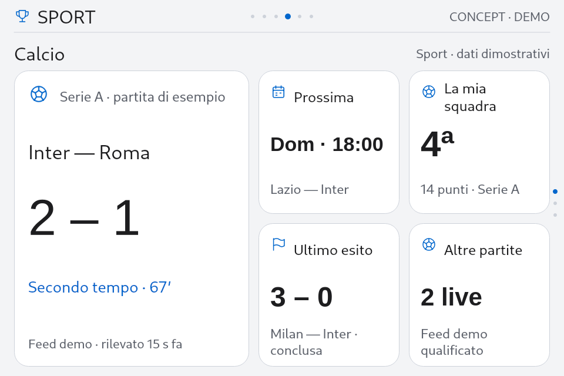
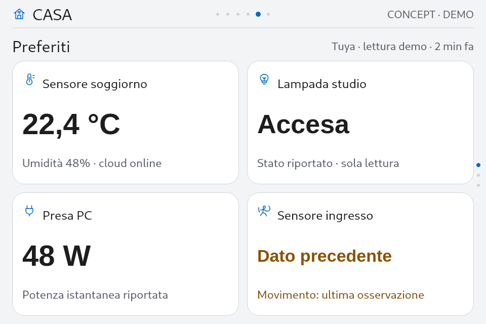
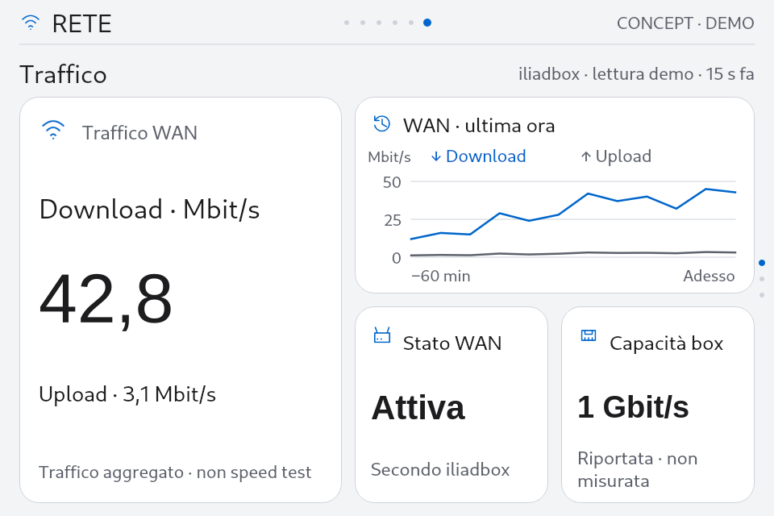

# SmartPC — Studio grafico orizzontale Apple Calm

**9 ottobre 2026 · analisi e tavole, prima dell'implementazione · display 960×640 / 3,5″ / distanza 50–60 cm.**

**Approfondimento successivo:** [organizzazione delle 15 viste per tutti gli argomenti](v086-view-organization-study.md), con contenuti, posizione, grandezze e destinazione dei dettagli. Affina la gerarchia WAN/iliadbox ed estende il confronto a Ora/Orologio/Giornata, Meteo e Account; la griglia e il linguaggio Apple restano quelli definiti qui.

La direzione proposta prende come riferimento le dashboard attuali di Ora, Meteo e Account: un dato riconoscibile subito, schede ordinate, icone leggere, pochi colori. Sport, Casa e Rete avranno composizioni orizzontali adatte alle informazioni che mostrano, mantenendo la stessa grammatica visiva. Non diventano portali con grandi elenchi di nomi da aprire.

**Correzione del concept precedente.** L'impaginazione verticale descritta nel §8 della [prima analisi](v086-dashboard-first-analysis.md) e il suo prototipo adattivo sono superati da questo studio grafico. Il dispositivo resta sempre in rapporto **3:2**: una preview più stretta riduce l'intera tavola, senza trasformare la UI in una colonna da telefono. Il primo concept aveva privilegiato la struttura dei dati e non rappresentava correttamente il prodotto fisico.

**Perimetro:** studio grafico, documentazione, renderer offline e immagini dimostrative. Nessuna modifica a QML, controller, provider, font, icone o palette distribuiti; nessuna installazione/accesso alla board. La baseline documentata è 0.8.5-rc.1 / Apple Calm 1.5.0. I dati nelle nuove tavole sono simulati e non attestano disponibilità reale di eventi, sensori o metriche.

## 1. Riferimenti nel prodotto

Sono state esaminate sei catture native della [consegna 0.8.5](v085-settings-implementation-report.md). Sono prove storiche del layout precedente, non catture live di questa sessione.

| Schermata | Qualità da conservare | Intervento grafico mirato |
| --- | --- | --- |
| [Ora](evidence/v085-implementation-2026-10-09/board/eglfs-apple-day/home.now.png) | Ora come elemento dominante e meteo affiancato; lettura immediata. | Conservare la composizione. Non inserire quattro schede obbligatorie dove la funzione è guardare l'ora. |
| [Meteo](evidence/v085-implementation-2026-10-09/board/eglfs-apple-day/weather.now.png) | Contenuto principale a sinistra e misure raggruppate a destra. | È il riferimento più vicino alla nuova famiglia Sport; eventuale recupero dello spazio riguarda intestazioni/metadati. |
| [Account](evidence/v085-implementation-2026-10-09/board/eglfs-apple-day/account.usage.png) | Numero dominante, barra con significato quantitativo, schede secondarie. | Conservare le barre quando rappresentano limiti veri. Non sostituirle con grafici decorativi. |
| [Sport](evidence/v085-implementation-2026-10-09/board/eglfs-apple-day/sport.hub.png) | Icone e superficie del tema. | Eliminare la prima pagina costituita dalle tre righe delle discipline: mostrare già partita/sessione. |
| [Casa](evidence/v085-implementation-2026-10-09/board/eglfs-apple-day/casa.overview.png) | Quattro preferiti in 2×2: buona organizzazione già acquisita. | Consolidare questa famiglia e introdurre Ambiente senza trasformare tutti i dispositivi in un solo listone. |
| [Rete](evidence/v085-implementation-2026-10-09/board/eglfs-apple-day/network.overview.png) | Metriche disponibili e distinzione dalle impostazioni. | Ridurre gli strati di intestazione/tab; affiancare traffico e andamento; separare box e inventario. |

L'aria dentro una scheda può aiutare a riconoscere il dato. La fascia inferiore inutilizzata e le intestazioni ripetute, invece, sottraggono spazio senza organizzare l'informazione. Recuperiamo questi ultimi, conservando respiro e dimensione del testo.

## 2. Ricerca grafica e applicazione critica

Questo approfondimento integra i 13 riferimenti della prima analisi con due articoli specifici di NN/g e una rilettura della proposta grafica di Home Assistant. Le misure SmartPC sono scelte progettuali nostre, non prescrizioni o risultati sperimentali trasferiti da queste fonti. Consultazione: 9 ottobre 2026.

| Fonte primaria | Principio utile | Decisione per SmartPC |
| --- | --- | --- |
| [Kelley Gordon, Visual Hierarchy in UX, NN/g, 2021](https://www.nngroup.com/articles/visual-hierarchy-ux-definition/) | Scala, contrasto e raggruppamento orientano l'attenzione. Troppi elementi dominanti indeboliscono la gerarchia. | Una partita, una sessione o una misura guida la vista; dati di contesto più piccoli. Non aumentare insieme tutte le dimensioni o colorare ogni scheda. |
| [Page Laubheimer, Cards: UI-Component Definition, NN/g, 2016](https://www.nngroup.com/articles/cards-component/) | Una scheda raggruppa informazioni correlate e può anticipare un approfondimento. La disposizione modulare non risolve ogni tipo di contenuto. | Ogni scheda ha un soggetto, uno stato/valore e contesto pertinente. Calendari e inventari completi possono mantenere righe nei dettagli. |
| [Home Assistant, Project Grace / Dashboard chapter 1, 2024](https://www.home-assistant.io/blog/2024/03/04/dashboard-chapter-1/) | Griglia strutturata e dimensioni prevedibili aiutano a ritrovare i contenuti; la masonry può spostarli. | Posizioni stabili e tre composizioni condivise. Un dato nuovo aggiorna la scheda, senza rimescolare la dashboard. Non importiamo il reflow mobile sul nostro display fisso. |

Una review della gerarchia a colpo d'occhio aiuta a individuare incoerenze, ma non certifica leggibilità a 50–60 cm. La valutazione fisica rimane un passaggio distinto. L'Apple HIG è stato cercato come riferimento, ma la pagina richiedeva JavaScript: non viene conteggiato tra i testi integralmente consultati per questo approfondimento.

## 3. Tre famiglie, un solo linguaggio

### A. Principale e contesto — Sport, Ambiente, riepilogo box

Una scheda dominante a sinistra e fino a quattro schede di contesto a destra. La lettura inizia dall'evento o dalla misura, poi passa al contesto. Il contenuto principale ha nome, valore/stato, tempo o fase e qualificazione della fonte. Le secondarie hanno tre livelli: identità, valore, contesto.

Il risultato non è un elenco di pulsanti Calcio/F1/MotoGP. È già una dashboard Calcio; scorrendo nell'argomento si passa a Formula 1 e MotoGP, mantenendo posizione dell'evento e dimensioni delle schede. Non serve leggere cinque titoli di menu per trovare il prossimo appuntamento.

### B. Mosaico 2×2 — Casa Preferiti e contenuti di pari importanza

Quattro schede equivalenti, senza inventare un dispositivo più importante degli altri. Temperatura, lampada, presa e movimento condividono geometria e struttura. Stato precedente esplicito, anche attraverso testo; nessun falso interruttore in una vista di sola lettura.

È la composizione raccomandata per Preferiti. È anche una variante comparativa per gli altri argomenti, ma non la scelta universale: nel [confronto Calcio](evidence/v086-graphic-study-2026-10-09/sport-calcio-mosaic-day.png) la partita perde priorità e una scheda secondaria viene omessa. Se il contenuto guida deve essere riconosciuto subito, scegliamo A.

### C. Misura e andamento — Rete Traffico

Download e upload leggibili a sinistra; andamento WAN a destra, con unità, asse temporale e due serie nominate. Sotto il grafico, stato WAN e capacità riportata dalla box. Le grandezze non sono intercambiabili: traffico misurato, capacità dichiarata e speed test rispondono a domande diverse.

Il grafico integra i numeri e non li sostituisce. Se non esiste storico qualificato, il suo spazio ospita uno stato sintetico utile o una composizione alternativa; non si disegna una linea inventata. Le linee dimostrative qui servono solo a studiare la composizione.

## 4. Griglia nativa e allineamenti

| Elemento | Dimensione / posizione proposta |
| --- | --- |
| Schermo | 960×640, rapporto 3:2 fisso |
| Barra superiore | 56 px, conservando la misura della baseline |
| Margini | 24 px laterali; 16 px inferiori |
| Identità locale | y=70, altezza 42 px; nome vista a sinistra e fonte sintetica a destra |
| Area delle schede | x=24, y=120, larghezza 912, altezza 504 px |
| Intervalli fra schede | 16 px sia in orizzontale sia in verticale |
| Famiglia A | Principale 400×504; destra 496 px, suddivisa in schede 240×244 |
| Famiglia B | Quattro schede 448×244 |
| Famiglia C | Principale 400×504; grafico 496×244; due schede 240×244 |
| Angoli e bordo | Raggio 24 px, bordo sottile nella palette esistente |
| Padding | 20 px schede piccole, 24 px principale |
| Orientamento | Pallini discreti nell'inset esterno; nessun contatore 1–2/3 o guida tasti al fondo |

Le schede terminano tutte a y=624. La fascia inferiore residua di 16 px è un margine intenzionale; non c'è un footer nascosto di 40–80 px. Icone, titoli, numeri e note usano allineamenti ripetuti. Non si centra verticalmente l'intera pagina lasciando una grande fascia inutilizzata.

Questa griglia vale per le tavole native con testo predefinito. In produzione va negoziata con gli inset della shell e la scala configurata, senza sommare nuovamente toolbar/header/footer. Scala massima e nomi lunghi richiedono una variante **orizzontale meno densa**, ad esempio principale e due secondarie più larghe; niente trasformazione automatica dell'intera dashboard in una pagina verticale. Lo scorrimento resta disponibile nei dettagli.

## 5. Tipografia, colore e icone

**Riutilizzo effettivo:** tavole renderizzate con i font inclusi nel bundle Apple Calm e ritagli dell'atlante icone esistente. Palette giorno/notte lette dal tema. Non è stata introdotta una nuova famiglia grafica o sostituita un'icona gradita all'utente.

I numeri principali hanno dimensioni orientative di 68–86 px; i valori delle schede 29–62 px secondo formato e lunghezza; i nomi delle viste 32 px, le etichette 24–25 px, il contesto 22–27 px. Questi valori definiscono tre ruoli percettivi, non un obbligo di usare una sola dimensione per qualunque stringa. Evitare riduzioni automatiche illimitate: meglio una formulazione breve, una scheda più larga o meno schede. I casi dimostrativi controllano stringhe complete, non abbreviazioni oscure obbligatorie.

Il blu esistente lega iconografia e accenti; testo e superfici conservano i toni del tema. L'ambra indica dato precedente/avvertimento, accompagnato dalle parole. Verde/rosso non devono diventare decorazione o una valutazione della temperatura priva di soglie documentate. Il focus nei dettagli riusa bordo/superficie già acquisiti: nessuno zoom che spinge le schede fuori dai margini.

Non aggiungere un'icona per ogni frase. Identità della scheda con icona semantica, valore con unità, nota breve. Le icone attuali coprono le nove tavole; eventuali lacune emerse durante l'implementazione saranno risolte nello stesso sistema, prima di generare nuove bitmap.

La diagonale di 3,5″ non rende automaticamente leggibile il testo a 50–60 cm. Il rendering 960×640 è una base per la verifica sul pannello, non una certificazione ottenuta guardando un monitor desktop.

## 6. Gerarchia delle nove dashboard

| Vista | Primo dato da riconoscere | Contesto immediato | Tavola giorno |
| --- | --- | --- | --- |
| Calcio | Partita live verificata; altrimenti prossimo appuntamento/ultimo esito | Prossima, squadra/campionato, ultimo esito, altre partite se utile | [Calcio](evidence/v086-graphic-study-2026-10-09/sport-calcio-focus-day.png) |
| Formula 1 | Sessione prioritaria e orario locale, con GP/circuito reale quando disponibile | Gara/sessione successiva, prossimo GP, ultimo risultato, campionato | [F1](evidence/v086-graphic-study-2026-10-09/sport-f1-focus-day.png) |
| MotoGP | Sessione/gara qualificata e fase | Leader, distacco solo se verificato, ultimo esito, mondiale pertinente | [MotoGP](evidence/v086-graphic-study-2026-10-09/sport-motogp-focus-day.png) |
| Casa Preferiti | Stato/misura di ciascun dispositivo scelto | Attributo utile e freschezza locale; equivalenza dei quattro soggetti | [Preferiti](evidence/v086-graphic-study-2026-10-09/casa-preferiti-focus-day.png) |
| Casa Ambiente | Misura di un sensore nominato | Umidità, altro sensore, movimento supportato, copertura delle letture | [Ambiente](evidence/v086-graphic-study-2026-10-09/casa-ambiente-focus-day.png) |
| Casa Dispositivi | Catalogo e disponibilità secondo cloud | Preferiti e categorie realmente normalizzate; senza inferire presenza LAN | [Dispositivi](evidence/v086-graphic-study-2026-10-09/casa-dispositivi-focus-day.png) |
| Rete Traffico | Download/upload WAN con unità | Andamento, stato WAN, capacità riportata distinta dalla misura | [Traffico](evidence/v086-graphic-study-2026-10-09/rete-traffico-focus-day.png) |
| Rete iliadbox | Stato WAN e uptime router | Sensori nominati, radio, porte, firmware; niente temperature in Impostazioni | [iliadbox](evidence/v086-graphic-study-2026-10-09/rete-iliadbox-focus-day.png) |
| Rete Dispositivi | Record dell'inventario e conteggio qualificato della raggiungibilità | Dispositivi di interesse, fonte e copertura parziale | [Inventario](evidence/v086-graphic-study-2026-10-09/rete-dispositivi-focus-day.png) |

La quarta scheda secondaria è facoltativa: non giustifica polling aggiuntivo né un riempitivo. Quattro riquadri non obbligano ad avere quattro dati. Per pochi soggetti utili si scelgono due schede più larghe o un riepilogo; le posizioni restano stabili durante l'interazione. La presenza della vista Ambiente dipende dai sensori effettivamente supportati.

Il rendering usa un modello sintetico comune per confrontare impaginazioni, non i DTO finali. Etichette come GP di esempio, Demo e Pilota A indicano esplicitamente questa distinzione. Nel prodotto si useranno circuito, identità e dati veri quando disponibili; altrimenti uno stato dichiarato.

## 7. Dopo il tasto 5: approfondimento grafico

La dashboard iniziale deve già rispondere alla domanda principale. Il primo approfondimento aggiunge contenuto utile conservando il contesto, evitando un'altra pagina di soli nomi di menu.

| Apertura | Composizione raccomandata | Quando sono ammesse righe |
| --- | --- | --- |
| Sport | Evento compatto in alto; pannelli affiancati su stato/sessione e risultato o programma. Tab coerenti per calendario, risultati, classifica. | Classifica completa, calendario o timing con molte entità, perché righe allineate facilitano il confronto. |
| Casa Preferiti/Ambiente | Schede più complete con misure e stato per dispositivo; nome e freschezza nello stesso gruppo. | Inventario completo e metadati del dispositivo, dopo il riepilogo. |
| Rete Traffico | Valori correnti compatti e grafico più ampio; periodo e buchi dello storico espliciti. | Campioni o metadati tecnici solo se utili; non sostituiscono l'andamento. |
| Rete iliadbox | Stato router, sensori e link raggruppati; Wi-Fi e Porte come sezioni accessibili. | Stazioni/porte oltre lo spazio disponibile, con unità e qualificazioni. |
| Rete Dispositivi | Conteggio/copertura compatti e inventario selezionabile; dettaglio identità e osservazioni al passo seguente. | Qui un elenco è funzionale: deve restare un approfondimento, non l'intera prima dashboard. |

Nessuna falsa azione su lampade/prese, nessuna velocità per dispositivo dedotta dal traffico WAN, nessuna diretta sportiva dedotta dal calendario. La semantica proposta 2/8 viste, 4/6 argomenti, 5 dettaglio, 7 ritorno resta da implementare nel core e qualificare in tutti i temi.

## 8. Stati che il progetto definitivo deve coprire

La qualità grafica deve sopravvivere anche a offline, dati incompleti e pochi dispositivi. Le 36 tavole attuali confrontano layout/palette e includono alcune etichette di dato precedente; **non coprono ancora tutte le fixture di stato o scala**.

- Dato precedente: valore conservato con provenienza e tempo espliciti; niente stato live corrente.
- Mai disponibile: messaggio breve e accesso utile alla configurazione/dettaglio; nessuno zero di fantasia.
- Una sola misura disponibile: riquadro più largo o riepilogo pertinente, senza quattro card vuote.
- Freschezze miste: nota locale nella scheda interessata; nessun Aggiornato globale che assorbe cataloghi vecchi.
- Nomi lunghi/scalatura: layout orizzontale meno denso, e verifica sul pannello; non comprimere testo essenziale per mantenere cinque schede.
- Modalità notte: superfici, testo, bordi e stato precedente derivati dai token notturni del tema, senza un secondo stile.
- Caricamento: dimensioni della griglia mantenute, fase comprensibile; nessun cambio continuo di altezza/focus.

## 9. Confronto e verifiche

Sono prodotte **36 tavole native**: nove viste × due impaginazioni × giorno/notte. Le tavole Preferiti coincidono nelle due impaginazioni perché il 2×2 è già la scelta corretta. Il mosaico sugli altri argomenti è un confronto semplificato: in Sport conserva tre secondarie; in Traffico mantiene anche il grafico, ma assegna lo stesso spazio a tutte le informazioni. La gerarchia più chiara dell'evento e delle misure è un motivo per preferire le composizioni specifiche.

Il [renderer offline](evidence/v086-graphic-study-2026-10-09/render_graphic_study.py) verifica i rettangoli del testo con i font effettivi. Il [report](evidence/v086-graphic-study-2026-10-09/render-review.json) registra dimensioni, schede e problemi di ingombro. Sono state corrette altezze insufficienti delle etichette su due righe e la distanza fra unità e legenda del grafico. Controllo visivo diretto su sei tavole rappresentative, incluse notte, testo lungo, griglia e variante mosaico.

Il [baseline](evidence/v086-graphic-study-2026-10-09/baseline.json) conserva hash di 24 sorgenti/asset e sei catture di riferimento. Il [rapporto finale di integrità](evidence/v086-graphic-study-2026-10-09/analysis-integrity.json) accompagna lo studio. I controlli della preview riguardano selezione delle tavole e rapporto 3:2; non misurano GPU, QML, leggibilità fisica, provider o performance del dispositivo.

Esempi notturni: [Formula 1](evidence/v086-graphic-study-2026-10-09/sport-f1-focus-night.png), [Casa](evidence/v086-graphic-study-2026-10-09/casa-preferiti-focus-night.png), [Traffico](evidence/v086-graphic-study-2026-10-09/rete-traffico-focus-night.png).

## 10. Gate grafico prima del codice applicativo

La fase A0 del MasterPlan acquisisce prima questa griglia e le tre famiglie. Poi si realizzano fixture complete e layout QML con dati qualificati. Il confronto grafico deve precedere un'implementazione estesa di nove schermate.

1. Confermare gerarchia evento/misura, allineamenti, uso del fondo e coerenza con Ora/Meteo/Account.
2. Prototipare i casi live/prossimo/precedente/assente, pochi dati, nomi lunghi e scala massima in formato orizzontale.
3. Verificare lettura sul pannello a 50–60 cm e uso dei tasti, comprese le destinazioni di 5 e il ritorno con 7.
4. Implementare in modo mirato, preservando scheduler, provider, lifecycle tema e fallback.
5. Qualificare runtime e rilascio separatamente: un concept bello non è una build installata.

**Scelta raccomandata:** A per Sport/Ambiente/box, B per Casa Preferiti, C per Rete Traffico. Per gli altri riepiloghi il formato principale può essere affinato senza introdurre una quarta famiglia gratuita. Ora, Meteo e Account restano riferimenti da conservare, con soli interventi sugli allineamenti quando il confronto reale li richiede.
