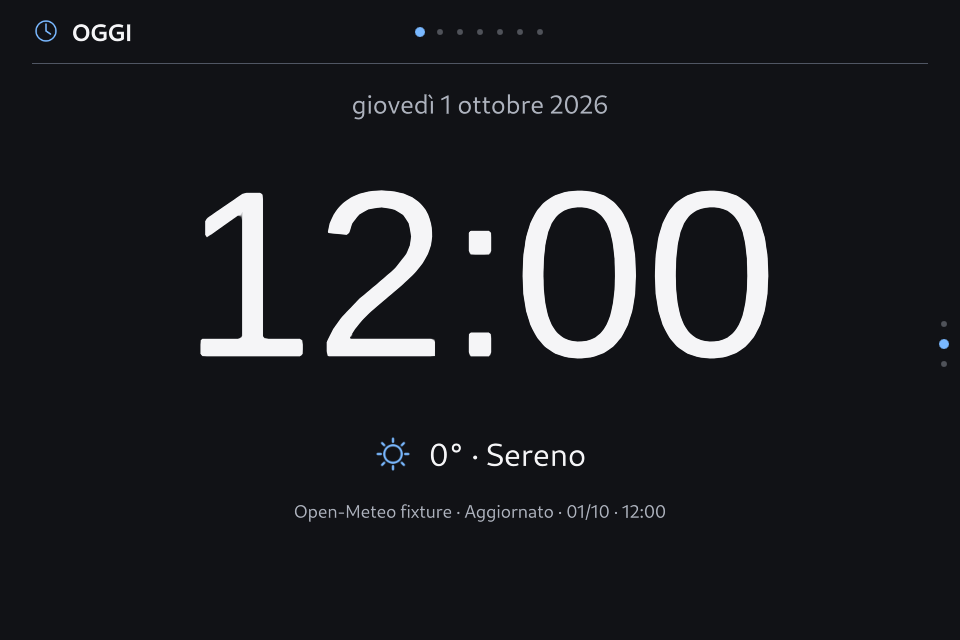
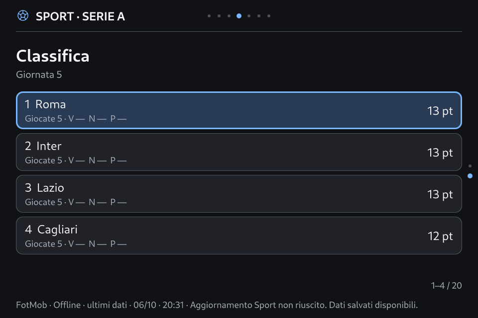

# Apple Calm — consegne

## Revisione 1.3.1 · 8 ottobre 2026

Installata con **SmartPC 0.8.3-rc.2 / Theme API 2.5**. Adatta gli spazi conservando palette, font, icone e stile delle card: barra 56 px, contenuto 912×552 a x24/y72, liste scorrevoli, Sport senza legenda permanente, traffico WAN e sensori iliadbox in panoramica. Corretto il cambio delle schede Informazioni a pari numero di righe. Digest `484b983f1622fbaccbfc09047d4c39641e5e1646bba04a2fd5cbc88f5aeb9a84`; 499 file verificati, 72 controlli locali, 1.062 combinazioni native, prove mirate EGLFS giorno/notte e 19 superfici/92 passi su Main. Reboot reale verificato, servizio `active/running`, `NRestarts=0`, GUI pronta e preferenze conservate. Backup `/var/backups/smartpc-before-v083-space-20261008T130632Z`; prove `/var/lib/smartpc-dashboard/v083-space-proof/`. I due tentativi precedenti e i rollback sono documentati. Resta il giudizio di leggibilità fisica a 50–60 cm. [Resoconto e catture](../../dashboard/design/v083-space-optimization-report.md), [uso e recupero](../../dashboard/design/v083-ux-operations.md).

## Revisione 1.3.0 · 8 ottobre 2026

Installata con **SmartPC 0.8.3-rc.1 / Theme API 2.5**, con manifest di 498 file e reboot verificati, GUI pronta, servizio attivo e `NRestarts=0`. Sport unico, sei gruppi Impostazioni, Rete nativa, righe grandi e sette nuovi glifi. **59 superfici proprie più scena Base**, 57 glifi; digest `10bd33af67b331a2e2993ef83b7c5724800edeb078bd029a8ce08059e8ae0c86`. Preflight PC/nativo di 1.062 combinazioni, Main locale giorno/notte e 15 superfici EGLFS notte, con 90 passi di navigazione per prova e zero warning QML. Le 38 preferenze originali sono conservate, con due sole chiavi di migrazione; ledger Casa invariato. La prima qualifica EGLFS ha rilevato un alias font Canvas non valido: rollback verificato e correzione QML degli assi prima della consegna. Il collaudo ottico/tastierino a 50–60 cm resta aperto. [Resoconto completo](../../dashboard/design/v083-implementation-report.md), [uso](../../dashboard/design/v083-ux-operations.md). Le consegne storiche rimangono sotto.

## Revisione 1.2.1 · 8 ottobre 2026

Installata con SmartPC **0.8.2-rc.1**, Theme API 2.4 e reboot verificato. Nuovi mapping Rete, titoli coerenti e feedback senza duplicazione; digest `575fd88f93592423d53eba0ba7deedcd3fab25398baddb768a8d224768fa0b21`. Preflight nativo, tre superfici EGLFS notte, palette giorno locale e 138 passi di navigazione con Normale/Ridotto/Disattivo, senza warning. Le 38 preferenze sono conservate. [Resoconto e limiti](../../dashboard/design/v082-implementation-report.md). La consegna storica e le sue misure rimangono sotto.

## Apple Calm 1.2.0 — consegna del 6 ottobre 2026

**Installato e verificato sull’Orange Pi dopo un riavvio del sistema.** SmartPC esegue il core 0.7.0-rc.3 e Apple Calm 1.2.0. Il servizio è `active/running`, `NRestarts=0`; heartbeat GUI fresco, identità esatta, nessuna attivazione pendente, quarantena o recovery. Le 38 preferenze estranee all’aspetto coincidono con il backup originale. Palette `auto` e movimento `normal` sono conservati.

## Risultato e fluidità

Il problema principale era il trasferimento e la normalizzazione ripetuta di dati inutilizzati: la classifica ricostruiva l’intera stagione, il riepilogo Motorsport riceveva risultati, giri e soste delle sessioni, e i contesti delle pagine nascoste continuavano ad aggiornarsi. Ora i DTO seguono la pagina e la vista effettive. Gli overlay riusano fino a sei renderer; un cambio di stile o revisione invalida la cache e libera le lease. I loader mantengono la pagina precedente finché la destinazione e la sua navigazione sono coerenti.

Le pagine pronte vengono presentate subito; l’animazione accompagna i pallini. Sono eliminati i passaggi di dissolvenza su selezione, dati e schede e la costruzione di ricette di movimento inutili. Non sono stati ridotti i controlli di salute né introdotte animazioni continue.

Il confronto usa Main reale, Qt 6.8.2, EGLFS/KMS 960×640, le stesse 380 partite e 20 squadre della cache del dispositivo, 16 percorsi per tre cicli. Il primo ciclo distingue il primo ingresso; i due successivi forniscono 32 osservazioni a caldo. I provider sono isolati e la rete negata.

| Misura software | Apple Calm 1.1.0 | Apple Calm 1.2.0 |
|---|---:|---:|
| Azione → frame coerente, p95 a caldo | 1138.5 ms | 105.6 ms |
| Normalizzazione classifica, p95 a caldo | 231.01 ms | 3.32 ms |
| Peggiore cambio a caldo osservato | 1790.4 ms | 141.9 ms |
| Peggiore primo ingresso osservato | 1837.8 ms | 325.2 ms |

Riduzione del p95 dei cambi: **90.7%**. L’intervallo `frameSwapped` nelle quattro brevi prove dedicate ai pallini ha p95 **18.1 ms**, includendo tutti gli intervalli interni alle prove. Il target di 100 ms per i cambi a caldo è mancato di circa 6 ms; il massimo a caldo rimane 142 ms e il primo ingresso può arrivare a 325 ms. Questi limiti restano espliciti.

| Percorso | Massimo a caldo prima, ms | Massimo a caldo ora, ms | Primo ingresso ora, ms |
|---|---:|---:|---:|
| home | 256.9 | 95.1 | 70.6 |
| weather | 167.4 | 60.0 | 314.4 |
| forecast | 181.7 | 64.6 | 179.6 |
| account | 246.2 | 68.1 | 194.7 |
| sport | 197.4 | 88.2 | 200.3 |
| standing-overview | 219.5 | 117.8 | 88.3 |
| standing-detail | 1138.5 | 72.6 | 220.8 |
| menu | 308.8 | 58.8 | 209.1 |
| standing-return | 1790.4 | 65.3 | 55.5 |
| back-to-sport | 160.3 | 86.9 | 68.6 |
| f1 | 680.8 | 141.9 | 260.2 |
| f1-second-view | 209.0 | 97.3 | 44.0 |
| motogp | 448.7 | 82.7 | 129.2 |
| casa | 180.9 | 83.6 | 325.2 |
| casa-devices | 187.7 | 77.8 | 147.0 |
| home-return | 206.1 | 79.7 | 85.2 |

Le misure sono **azione software → callback `frameSwapped` con stato GUI coerente**. Il tempo del contenuto esclude il completamento decorativo dei pallini, verificato separatamente. Non sono latenza ottica, GPU time o garanzia di 60 FPS. I vecchi intervalli filtrati sotto 100 ms rimangono dati diagnostici nei rapporti e non vengono usati per attestare fluidità. Tastierino fisico, interruzione di alimentazione e soak di 24 ore non sono stati ripetuti.

## Interfaccia e correzioni

- Classifica Serie A: `team` diventa il nome pubblico, `teamId` conserva l’identità della squadra. Tutti i 20 nomi reali sono verificati; i campi canonici hanno precedenza e i valori mancanti restano mancanti. Selezione e apertura della classifica seguono la riga corretta. Anche i riepiloghi F1/MotoGP aprono il relativo dettaglio della classifica o del timing.
- Pallini: argomenti al centro dell’intestazione; viste o schede sul margine destro, con un ambito esplicito per menu, impostazioni, dettagli e Casa. Restano visibili negli overlay ordinari; gli avvisi urgenti hanno priorità. La pubblicazione segue il contenuto effettivamente pronto anche fra F1 e MotoGP che condividono l’host.
- Movimento: 140 ms Normale, 80 ms Ridotto, istantaneo Disattivo. Cambio di gruppo senza attraversare posizioni inesistenti; settlement immediato verificato. Le leggende permanenti del tastierino restano rimosse; la guida è nel menu Comandi.
- Oggi ha tre viste: Ora, **Orologio**, Giornata. Orologio usa cifre da 238 px, data e meteo compatto; il prossimo evento appare solo quando esiste. Area utile delle pagine 896×528, pannelli sotto l’intestazione alta 64 px.
- Icone: 50 glifi semantici, con simboli distinti per Casa, F1, MotoGP e metriche. Un solo sorgente modificabile `design/icon-source.json` e un atlante PNG generato condiviso, compatibile con il Qt nativo che non dispone del decoder SVG. QtSvg serve solo al generatore sul PC. Eliminata la vecchia raccolta SVG duplicata.
- Casa ha quattro superfici dedicate, oltre alle altre superfici del tema. In totale 48 renderer propri; soltanto `scene.main` conserva il fallback esplicito a Base.

## Versione unica e recupero

Il manifest dichiara `retention: latest`. Dopo tre heartbeat coerenti e l’attivazione confermata, il lifecycle conserva la revisione attiva, protegge le lease vive, elimina le revisioni precedenti di Apple Calm e i relativi override. La selezione Revisione è nascosta per questo tema e gli indici delle azioni delle impostazioni restano corretti. **Base** è il recupero permanente.

Sono stati rimossi i pacchetti/sorgenti 1.0.0 e 1.1.0, la preparazione v1, i vecchi payload Apple nel negozio di recupero fallito e i backup obsoleti della consegna Apple. L’SDK originale, gli altri temi e i dati dei provider sono conservati. Rimane un backup di recupero con la sola versione corrente: `/var/backups/smartpc-apple-calm-current/current.tar.gz`. Il manifest e gli hash sono in `evidence/optimization-cleanup.json`. La baseline di confronto sopravvive come rapporto, senza distribuire il vecchio tema.

## Verifiche

| Verifica | Esito / evidenza |
|---|---|
| Manifest, integrità, qmllint | Validi, nessun errore; `optimization-lint.json` |
| Renderer isolati su PC e Qt nativo | 864 rendering ciascuno, digest esatto; `optimization-preflight-qt6112.json`, `optimization-preflight-qt682.json` |
| Main completo sul PC | 135 scenari notte; `optimization-main-pc-release/` |
| Main sul display | 135 scenari notte e 48 giorno; `optimization-board-eglfs-night/`, `optimization-board-eglfs-day/` |
| Navigazione e movimento | 124 passi per esecuzione, due assi, wrap, famiglie dinamiche, tre modalità, settlement e visibilità negli overlay |
| Classifica / cache / Orologio | 20 nomi e identità, 380 partite, renderer riusato, ordine tastierino, clock e meteo; `optimized-eglfs/` |
| Readiness | Il renderer vecchio non può confermare quello nuovo; recupero con frame reale; `optimization-heartbeat-eglfs.json` |
| Regressioni core | Contratti API, adapter, persistenza, layout, loading, impostazioni, Sport/Casa, bundle, provider, icone, lifecycle; `optimization-core-*/` e log `optimization-*` |
| Supervisore | Crash, blocco iniziale, thread GUI fermo, readiness persa, uscita inattesa; `optimization-supervisor.txt` |
| Installazione e reboot | Hash di 457 file runtime, integrità bundle, preferenze originali, servizio e heartbeat freschi; `optimization-installation/post-reboot-state.json` |

Le prove Main terminano senza warning QML né effetti sui provider. Le immagini sono acquisizioni Qt reali con fixture sintetiche o cache isolate, non conferme nuove dei provider live. L’avvio del processo di produzione e il reboot sono verificati separatamente dalle fixture.

## Identità e consegna

| Campo | Valore |
|---|---|
| Tema | `studio.applecalm` / `1.2.0` |
| Core / contratto | `0.7.0-rc.3` / `SmartPC.ThemeApi 2.2`; 2.0 e 2.1 restano registrate |
| Digest bundle | `0f30f79c9ed959368df85cc498acb5698a687cdde60448a909136759d1116553` |
| SHA-256 pacchetto | `a85d58bec8e0b2928ddb26d0967dd308e17da9d865072aa842c9265373584c13` |
| Fingerprint API | `14f139f20d19c3b093f579741eb0bb7653cbff956a8cc34987df5365b7675448` |
| Qt minimo / verificato sul dispositivo | `6.8.2` / `6.8.2` |
| Reboot | Boot ID cambiato, `fc587cb2-d238-4d7d-a396-6ec5f3392b86` |

In `SmartPC-artifacts` rimangono `apple-calm-1.2.0.smartpc-theme`, `apple-calm-1.2.0-sorgenti-e-verifiche.zip` e `apple-calm-1.2.0-SHA256SUMS.txt`. Il tema richiede il core aggiornato incluso nei sorgenti. La patch runtime è relativa alla baseline Casa preservata, con 42 file modificati o aggiunti; non va applicata ciecamente all’SDK 0.6.6. `runtime-changes.json` e il manifest della distribuzione consentono il controllo esatto.

L’installazione è stata protetta da un backup fresco della transazione e da un guard su tutti i 455 file precedentemente installati. Import, attivazione tramite Main, riapertura a freddo, processo EGLFS reale e reboot sono distinti. Solo dopo la prova del reboot il backup della transazione è stato sostituito dal backup corrente e sono state rimosse le revisioni obsolete. Le prove permanenti sono in `/var/lib/smartpc-dashboard/apple-calm-proof`. Dopo il reboot, che svuota `/tmp`, il collaudo completo è stato ripetuto da uno stage persistente; questi sono i rapporti distribuiti. I confronti di prestazioni e i preflight erano già stati acquisiti sul PC prima del reboot.

